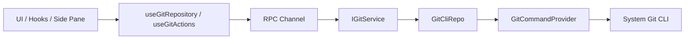

# Git 架构设计

## 相关文档

- [Git 分支切换与创建底层能力设计](./branch-switching-service-design.md)

## 背景

当前项目已经具备一套比较清晰的分层和跨端通信骨架：

- UI 通过 hooks 消费服务，不直接访问底层实现
- Desktop / Web / Remote 都通过 `IServiceAccessor` + RPC 服务链路访问业务能力
- `IPlatformService` 只承载必须经过宿主环境的动作，不承载常规业务逻辑

Git 功能如果要长期可维护，应该复用现有服务架构，而不是走新的直连路径。

## 设计目标

- Git 能力在本地、远程、Web 三种运行方式下保持统一抽象
- Git 相关逻辑严格落在 `Types -> Config -> Repo -> Service -> Runtime -> UI` 依赖方向内
- Git 能读取用户环境里的真实 Git 配置，而不是维护一套项目自己的伪 Git 配置
- UI 能复用现有右侧 side pane、diff 渲染、文件树组件，避免再造一套壳

## 非目标

- v1 不做完整 Git 客户端
- v1 不做 rebase / cherry-pick / stash / submodule 管理
- v1 不接管用户的全局 Git 安装、SSH、GPG 或 credential helper 生命周期
- 会话级回滚与基于 Git 的撤销能力不在本文讨论范围内

## 核心判断

### 1. Git 应该是标准业务服务，不应放进 `IPlatformService`

推荐新增 `IGitService`，走现有 RPC 服务链路。

原因：

- Git 不是只在 Electron main 才能做的宿主动作，而是常规业务能力
- Remote 模式下 Git 必须在远端工作区所在环境执行，不能绑定到本机平台层
- Web 模式本质上也是通过服务端工作区提供 Git 能力，仍然适合放在 service 层

这也符合当前 `IPlatformService` 的职责边界：它只放 native dialog、窗口控制、外链打开之类“必须穿越宿主边界”的操作。

## 推荐方案

### 方案 A：新增独立 `GitService`，本地 / 远程都走同一服务协议

这是推荐方案。

#### 高层结构

#### 为什么推荐

- 完全贴合现有项目的服务化架构
- 本地与远程只是在服务实现来源上不同，不会把 UI 设计绑死在某个平台
- Git 命令、解析、容错、日志都能在服务层统一收口
- 后续要扩展 staged/unstaged、branch、commit、discard 等能力时不会散到 UI

## 分层设计

### Types

建议新增 Git 领域 DTO，放到 `packages/shared/src/git.ts`，并在 `packages/shared/src/index.ts` 导出。

建议至少包含：

- `GitRepositorySummary`
  - `workspacePath`
  - `repoRoot`
  - `workspaceInRepoPath`
  - `branchName`
  - `headRefType`
  - `ahead`
  - `behind`
  - `isDirty`
  - `isGitAvailable`
  - `isRepository`
- `GitFileChange`
  - `path`
  - `repoRelativePath`
  - `workspaceRelativePath`
  - `x`
  - `y`
  - `kind`
  - `isStaged`
  - `isUntracked`
  - `isConflicted`
- `GitDiffRequest`
- `GitDiffResult`
- `GitIdentity`
  - `userName`
  - `userEmail`
  - `nameSource`
  - `emailSource`

### Config

建议新增 Git 领域配置层，负责：

- Git binary 解析策略
- 命令默认参数
- 超时、输出大小、日志脱敏规则
- repo root 与 workspace 子路径关系的判定策略

建议文件：

- `packages/services/src/git/config.ts`

### Providers

为了符合项目里“横切关注点通过 Providers 进入”的原则，Git 域内部建议显式引入 Provider 层。

建议至少拆成两个 provider：

- `GitCommandProvider`
  - 负责统一执行 `git` 命令
  - 负责 cwd、env、timeout、stderr、exit code、日志
- `GitEnvironmentProvider`
  - 负责发现 Git binary
  - 负责补齐安全环境变量
  - 负责平台差异适配

Provider 层只做“如何执行”和“如何适配环境”，不做 Git 业务语义。

### Repo

Repo 层是对 Git CLI 的薄封装，不承载 UI 语义。

建议文件：

- `packages/services/src/git/repo/gitCliRepo.ts`

建议职责：

- `resolveRepository(workspacePath)`
- `getStatus(workspacePath)`
- `getDiff(workspacePath, path, staged)`
- `stage(workspacePath, paths)`
- `unstage(workspacePath, paths)`
- `discard(workspacePath, paths, stagedScope)`
- `commit(workspacePath, message)`
- `getIdentity(workspacePath)`

### Service

Service 层对 UI 暴露稳定语义，并隐藏 Git CLI 细节。

建议文件：

- `packages/services/src/git/git.ts`
- `packages/services/src/git/gitService.ts`

建议对外接口：

- `getRepositorySummary`
- `getChanges`
- `getDiff`
- `getBranchComparison`
- `stagePaths`
- `unstagePaths`
- `discardPaths`
- `commit`
- `getIdentity`
- `refresh`

如果后续需要订阅式刷新，再补动态事件：

- `onDynamicRepositoryEvent(workspacePath)`

### Runtime / UI

UI 层只通过 hooks 消费 `IGitService`。

当前 hooks：

- `packages/ui/src/hooks/useGitRepository.ts`
- `packages/ui/src/hooks/useGitActions.ts`
- `packages/ui/src/hooks/useGitAutoRefresh.ts`

UI 组件建议：

- `GitPane`
- `GitRepositoryHeader`
- `GitChangeSourceSelect`
- `GitChangesTree`
- `GitDiffPanel`
- `GitCommitPanel`

### Git pane 内部的数据来源切换

Git pane 左侧建议有一个变更来源下拉，不同模式切换不同的数据来源。

建议支持四种模式：

- `未暂存`
  - 数据来源：Git worktree 相对 index 的改动
  - 主要接口：`getChanges` / `getDiff`
- `已暂存`
  - 数据来源：Git index 相对 `HEAD` 的改动
  - 主要接口：`getChanges` / `getDiff`
- `全部分支更改`
  - 数据来源：当前分支相对远端跟踪分支的差异
  - 主要接口：`getBranchComparison`
- `上一轮更改`
  - 数据来源：当前 active task 最近一轮的文件变更快照
  - 主要接口：优先复用现有 task/per-turn 变更数据，不强行塞进 `IGitService`

这里建议把“Git pane”理解为“统一的改动审阅面板”，而不是把每一种视图都硬塞成 Git service 的职责。

其中：

- 前三种模式属于 Git 领域，走 `IGitService`
- `上一轮更改` 属于会话级改动审阅，只在 Git pane 里共用一套树和 diff 展示壳，保持只读

这样做的好处是：

- 保持 Git service 的边界清晰
- `上一轮更改` 不需要为了 UI 入口位置而伪装成 Git 数据
- 变更树、diff 面板、右侧审阅体验仍然可以复用一套组件

## 本地、远程、Web 的执行位置

### 本地 Desktop

- `createLocalServices()` 注册本地 `GitService`
- Git 命令在本机工作区执行

### Remote Desktop

- Git 必须像 `file/system/terminal` 一样，来自远端服务
- 不能在本机 host 里替远端 workspace 执行 Git
- 远端窗口只保留本地的 setting / credential / broadcast；Git 应归入远端服务集合

### Web

- Web 端不单独做 Git 实现
- 仍通过 websocket 后端服务提供 Git 能力

结论：

- Git 的执行位置必须和 workspace 的真实落点一致
- Git 服务的归属应该和 `file/system/terminal` 对齐，而不是和 `setting` 对齐

## 命令策略

推荐坚持使用系统 Git CLI，而不是引入 JS Git 实现。

原因：

- 能自然复用用户现有的 Git 安装与配置
- 兼容 `includeIf`、平台默认路径、Git for Windows 等真实环境
- 后续遇到 SSH、credential helper、换行符策略时更不容易偏离用户认知

建议命令：

- 仓库检测
  - `git rev-parse --show-toplevel`
- 状态
  - `git status --porcelain=v2 --branch -z`
- 读取身份
  - `git config --get user.name`
  - `git config --get user.email`
  - 需要来源时再用 `git config --list --show-origin --null`
- diff
  - `git diff --no-ext-diff -- <path>`
  - `git diff --cached --no-ext-diff -- <path>`
- 分支比较
  - `git diff @{upstream}...HEAD --`
- stage
  - `git add -- <path...>`
- unstage
  - `git restore --staged -- <path...>`
- 丢弃工作树改动
  - `git restore --worktree -- <path...>`
- 提交
  - `git commit -m <message>`

## 仓库根目录与 workspace 路径

`workspacePath` 不一定等于 `repoRoot`。

例如：

- 用户打开的是 monorepo 根目录
- 用户打开的是 monorepo 下某个 package 子目录

因此 Git 域必须同时保留三类路径：

- `workspacePath`
- `repoRoot`
- `workspaceInRepoPath`

推荐行为：

- 服务层始终基于 `repoRoot` 执行 Git
- UI 默认展示“当前 workspace 作用域内”的文件
- 后续如果需要，再增加“显示整个仓库”开关

这样能避免 workspace 打开的是子目录时，直接看到整仓库其它区域变更而产生困惑。

## 日志与可观测性

根据项目约束，涉及交互和复杂状态切换的能力需要补日志。

建议：

- UI 层统一使用 `packages/ui/src/logger.ts`
- `GitCommandProvider` 不默认打印每条 Git 命令；Git 探测和状态查询属于高频内部细节，
  需要排查时优先在上层一次性生命周期、失败分支或专门调试入口补充有边界的日志。

不要记录：

- 完整环境变量
- 敏感 token
- credential helper 的敏感输出

## 与现有 side pane 的结合

当前右侧共享 pane 已经统一承载 `browser` 和 `code-viewer`。

推荐扩展为：

- `browser`
- `code-viewer`
- `git`

而不是在左侧 `WorkspaceSidebar` 再新增一个与 task 并列的大导航区。

原因：

- 当前左侧栏已经明确承担 workspace / task 导航
- Git 更像“当前工作区的操作上下文”，适合在右侧展开
- 可以直接复用现有可调宽度、面板切换、关闭逻辑

## 实施顺序建议

### Phase 1

- 新增 `IGitService`
- 本地 / 远程链路打通
- 仓库检测、状态、diff、stage/unstage、discard、commit
- UI 右侧 Git pane

### Phase 2

- 支持按 hunk 操作
- 支持更精细的 repo/workspace 范围切换
- 支持动态刷新与文件变化订阅

## 风险与待讨论项

- workspace 打开子目录时，Git 默认展示范围是“当前子树”还是“整个仓库”
- remote 模式下 Git 用户身份是展示远端有效配置，还是同时展示本地与远端来源
- Web 端是否需要完整提交能力，还是先只读
- v1 是否允许直接提交，还是先只做查看和暂存

## TODO

- 会话级回滚能力的边界与交互，后续单独设计
- 是否需要“基于 Git 的撤销”能力，后续单独评估
- 如果未来引入 Git checkpoint，再补独立设计文档
- Git pane 中 `上一轮更改` 的数据复用方式，后续结合现有 task store 再细化

## 当前推荐结论

- 架构上新增独立 `GitService`
- 执行位置跟随 workspace 所在环境
- Git UI 优先挂在右侧共享 pane
- 先做 Git pane 的仓库级基础能力，再逐步扩展更细粒度 Git 功能
