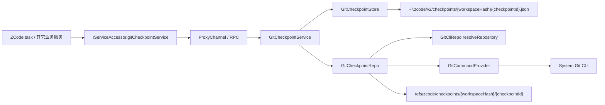

# Git Checkpoint 底层能力实现总结

更新日期：2026-04-13

## 本次目标

本次只实现 Git checkpoint 的底层能力与服务接线，不接入上层 ZCode task turn 编排，也不接入 UI 交互。

完成范围：

- 在 Git 域新增独立的 `IGitCheckpointService`
- 新增 checkpoint 相关 shared DTO 与 RPC 频道
- 在 `packages/services/src/git/` 下落地 `service -> repo -> store` 实现
- 打通 local / remote / web 统一服务访问链路
- 补充基于真实 Git 仓库的服务测试

这次实现重点解决的是：

- 如何创建不可变的 workspace 文件快照
- 如何比较两个 checkpoint 的文件差异
- 如何在不引入 worktree 的前提下，把当前 live workspace 从一个 checkpoint 安全恢复到另一个 checkpoint

## 当前落地状态

已完成的能力范围：

- `createCheckpoint`
- `diffCheckpoints`
- `restoreBetweenCheckpoints`
- `deleteCheckpoint`

已完成的工程接线：

- `ServiceChannels.GitCheckpoint`
- `IGitCheckpointService`
- `createLocalServices()` 注册
- `IServiceAccessor` / `RemoteServiceAccess` 暴露
- 远程 workspace renderer 会切到远端 `gitCheckpointService`

当前实现可以定义为：

- Git 域的通用文件 checkpoint 底座已可用
- 能在真实 Git 仓库中完成 create / diff / restore / delete 的完整闭环
- 还未进入 ZCode task turn 级 checkpoint 编排，也未暴露给 UI 直接操作

## 关键文件

### Shared

- [packages/shared/src/channels.ts](../../packages/shared/src/channels.ts)
  - 新增 `ServiceChannels.GitCheckpoint`
- [packages/shared/src/git.ts](../../packages/shared/src/git.ts)
  - 新增 checkpoint DTO：
    - `GitCheckpointMeta`
    - `GitCheckpointDiff`
    - `GitCheckpointFileDiff`
    - `GitCheckpointConflict`
    - `GitCheckpointRestoreResult`

### Services

- [packages/services/src/git/gitCheckpoint.ts](../../packages/services/src/git/gitCheckpoint.ts)
  - 定义 `IGitCheckpointService`
- [packages/services/src/git/gitCheckpointService.ts](../../packages/services/src/git/gitCheckpointService.ts)
  - service 层编排
- [packages/services/src/git/repo/gitCheckpointRepo.ts](../../packages/services/src/git/repo/gitCheckpointRepo.ts)
  - repo 层核心实现
- [packages/services/src/git/repo/gitCheckpointHelpers.ts](../../packages/services/src/git/repo/gitCheckpointHelpers.ts)
  - diff/path/tree 相关纯工具逻辑
- [packages/services/src/git/repo/gitCheckpointStore.ts](../../packages/services/src/git/repo/gitCheckpointStore.ts)
  - manifest 持久化

### 接线

- [packages/services/src/node.ts](../../packages/services/src/node.ts)
- [packages/services/src/accessor.ts](../../packages/services/src/accessor.ts)
- [packages/services/src/index.ts](../../packages/services/src/index.ts)
- [packages/client/src/remoteServiceAccess.ts](../../packages/client/src/remoteServiceAccess.ts)
- [packages/desktop/src/renderer/src/main.tsx](../../packages/desktop/src/renderer/src/main.tsx)

### 测试

- [packages/services/test/gitCheckpointService.test.ts](../../packages/services/test/gitCheckpointService.test.ts)

## 实现关系图



这张图对应当前实现的两条关键原则：

- 执行位置始终跟随 workspace 所在环境，不区分 local / remote / web 的业务语义
- 真实文件内容交给 Git object database，业务层只持久化轻量 manifest

## 分层职责

### Service

`GitCheckpointService` 负责：

- 生成 `checkpointId`
- 读取 / 校验 manifest
- 校验两个 checkpoint 是否属于同一 `repoRoot`、同一 `scope`
- 调用 repo 执行真正的 create / diff / restore / delete
- 调用 store 落盘或删除 manifest

### Repo

`GitCheckpointRepo` 负责：

- 解析 `workspacePath` 对应的 Git 仓库
- 用 Git plumbing 创建隐藏 checkpoint commit
- 对两个 checkpoint 做结构化 diff
- 对当前 worktree 做冲突检测
- 把当前磁盘从 `fromCheckpoint` 恢复到 `toCheckpoint`
- 删除隐藏 ref

### Store

`GitCheckpointStore` 负责：

- 按 `workspaceHash` 写入 checkpoint manifest
- 读取 manifest
- 删除 manifest

## 当前接口

当前对外接口就是 [gitCheckpoint.ts](../../packages/services/src/git/gitCheckpoint.ts) 里的：

```ts
export interface IGitCheckpointService {
  createCheckpoint(params: GitRepositoryRequest): Promise<GitCheckpointMeta>;
  diffCheckpoints(params: GitCheckpointDiffQuery): Promise<GitCheckpointDiff>;
  restoreBetweenCheckpoints(params: GitCheckpointRestoreQuery): Promise<GitCheckpointRestoreResult>;
  deleteCheckpoint(params: GitCheckpointRequest): Promise<void>;
}
```

当前没有加入：

- checkpoint 列表接口
- checkpoint GC 接口
- checkpoint rename / annotate 能力
- 上层 task/turn 语义字段

## 存储与引用

### Manifest

默认 manifest 目录：

```text
~/.zcode/v2/checkpoints/{workspaceHash}/{checkpointId}.json
```

manifest 当前只保存：

- `checkpointId`
- `workspacePath`
- `repoRoot`
- `workspaceInRepoPath`
- `createdAt`
- `refName`
- `commitOid`
- `scope`

### Hidden Ref

每个 checkpoint 都会创建一个 hidden ref：

```text
refs/zcode/checkpoints/{workspaceHash}/{checkpointId}
```

当前实现里，hidden ref 的作用是：

- 让 Git 对象有稳定锚点，不会被 GC 提前清掉
- 让后续 diff / restore / delete 能稳定定位到该 checkpoint

## 关键实现流程

### 1. `createCheckpoint`

入口位置：

- [gitCheckpointService.ts](../../packages/services/src/git/gitCheckpointService.ts)
- [gitCheckpointRepo.ts](../../packages/services/src/git/repo/gitCheckpointRepo.ts)

当前流程：

1. `GitCheckpointService.createCheckpoint()` 生成新的 `checkpointId`
2. `GitCheckpointRepo.createCheckpoint()` 调 `resolveRepository()` 解析 Git 仓库
3. 创建临时目录与临时 `GIT_INDEX_FILE`
4. 执行 `git add -A -- <workspace pathspec>`，把当前 workspace scope 的 live 状态写入临时 index
5. 执行 `git write-tree`
6. 执行 `git commit-tree`
7. 执行 `git update-ref refs/zcode/checkpoints/...`
8. 返回 `GitCheckpointMeta`
9. `GitCheckpointStore.save()` 写入 manifest

当前实现里最重要的约束是：

- 只使用临时 index，不碰真实 `.git/index`
- 不创建用户可见 branch
- 不切换 HEAD

### 2. `diffCheckpoints`

入口位置：

- [gitCheckpointService.ts](../../packages/services/src/git/gitCheckpointService.ts)
- [gitCheckpointRepo.ts](../../packages/services/src/git/repo/gitCheckpointRepo.ts)

当前流程：

1. service 层先加载 `from/to` 两个 manifest
2. 校验两者：
   - `workspacePath` 一致
   - `repoRoot` 一致
   - `scope` 一致
   - `workspaceInRepoPath` 一致
3. repo 层执行：
   - `git diff --name-status --find-renames -z <from> <to> -- <workspace pathspec>`
   - `git diff --numstat --find-renames -z <from> <to> -- <workspace pathspec>`
4. 用 helper 合并成结构化 `GitCheckpointDiff`

当前实现里：

- `name-status` 决定文件和改动类型
- `numstat` 提供 added / removed 统计
- 最终 diff 只面向当前 workspace scope，而不是整仓输出

### 3. `restoreBetweenCheckpoints`

入口位置：

- [gitCheckpointService.ts](../../packages/services/src/git/gitCheckpointService.ts)
- [gitCheckpointRepo.ts](../../packages/services/src/git/repo/gitCheckpointRepo.ts)

这是当前底座里最核心的方法。

当前语义不是“直接恢复到某个 checkpoint”，而是：

- 调用方声明：当前磁盘应当还处于 `fromCheckpoint`
- 实际目标：希望恢复到 `toCheckpoint`

当前流程：

1. service 层加载并校验 `from/to` manifest
2. repo 层先计算 `from -> to` 的结构化 diff
3. 从 diff 中折叠出受影响 path 集
4. 调 `collectWorkspaceConflicts()` 做冲突检测
5. 如果存在冲突且 `force !== true`，直接返回 `{ success: false, conflicts }`
6. 无冲突或 `force === true` 时：
   - 对非删除路径执行
     - `git restore --source=<toCommit> --worktree -- <paths>`
   - 对删除路径和 rename 原路径执行本地删除
7. 再次用 `collectWorkspaceConflicts()` 对 `toCheckpoint` 做恢复后校验
8. 校验通过后返回 `{ success: true, restoredPaths }`

### 4. 当前冲突检测策略

`collectWorkspaceConflicts()` 的核心不是看整个 repo 是否 dirty，而是只检查 restore 将触达的路径。

当前做法：

1. 先用 `git ls-tree -r -z <fromCommit> -- <affected paths>` 取出 `fromCheckpoint` 里这些路径的 tree entry
2. 对每个受影响路径逐个判断：
   - 如果 `fromCheckpoint` 里不存在，但磁盘上存在
     - `unexpected-file-in-worktree`
   - 如果 `fromCheckpoint` 里存在，但磁盘上不存在
     - `missing-in-worktree`
   - 如果类型不匹配
     - `type-mismatch`
   - 如果类型匹配但 `hash-object` 后内容 hash 不等
     - `content-mismatch`

当前实现里，不比较 mtime、size 这些弱信号，而是直接比较 blob hash。

### 5. `deleteCheckpoint`

当前删除分成两层：

- repo 层删除 hidden ref
- store 层删除 manifest

执行顺序：

1. `GitCheckpointService.deleteCheckpoint()` 先加载 manifest
2. `GitCheckpointRepo.deleteCheckpoint()` 执行：
   - `git update-ref -d <refName>`
3. `GitCheckpointStore.delete()` 删除对应 manifest 文件

Git object 本身不做业务侧显式清理，交给 Git GC。

## 多端接线

当前 checkpoint 服务已经和其它业务服务一样走统一 RPC：

### Local Desktop

- `createLocalServices()` 注册 `IGitCheckpointService`

### Remote Desktop

- `RemoteServiceAccess` 会创建 `gitCheckpointService` 代理
- remote workspace session 注册时，会把远端的 `gitCheckpointService` 带进 renderer 侧服务对象

### Web

- 通过现有 `IServiceAccessor` / RPC / websocket 链路自然透传

因此当前结论是：

- 协议统一
- 执行位置跟随 workspace
- 上层不需要区分 local / remote / web

## 当前测试覆盖

测试文件：

- [gitCheckpointService.test.ts](../../packages/services/test/gitCheckpointService.test.ts)

已覆盖的关键场景：

- 创建 workspace-scoped checkpoint
- checkpoint diff 正确识别：
  - 修改
  - 新增
  - 删除
  - 重命名
- diff 只作用于当前 workspace scope，不误伤 monorepo 其它目录
- `restoreBetweenCheckpoints()` 能把文件从 changed 恢复到 base
- restore 后不改变真实 staged 状态
- 路径发生漂移时，默认返回 conflict
- `force=true` 时允许覆盖恢复
- `deleteCheckpoint()` 后再访问已删除 checkpoint 会报错

## 当前验证结果

已验证：

- `pnpm vitest run packages/services/test/gitCheckpointService.test.ts packages/services/test/gitService.test.ts packages/services/test/gitCliRepo.test.ts`
  - 结果：通过
- `pnpm typecheck`
  - 结果：通过

未完全通过：

- `pnpm lint`
  - 结果：未通过
  - 说明：当前失败项仍然是仓库里已有的全局 `max-lines` / `no-unused-vars` 等问题，不是本次 checkpoint 能力新增的问题

## 当前边界与限制

当前实现明确只承诺下面这些边界：

- 只支持 Git 仓库 workspace
- 只支持 `scope = "workspace"`
- 只处理 repo 内文件
- 不处理 repo 外副作用
- 默认不保证 ignored 文件
- 不处理 ZCode session / task / turn 语义
- 不提供 worktree 隔离

当前尚未实现：

- checkpoint 列表 / GC
- ignored 文件策略
- submodule / nested repo / sparse checkout 的专项支持
- ZCode turn 级 `baseFileCheckpoint/resultFileCheckpoint` 编排
- UI 层直接使用 checkpoint 能力

## 当前推荐结论

- Git checkpoint 底层能力已经形成可复用的 service/repo/store 闭环
- `restoreBetweenCheckpoints(from, to)` 已经可以作为通用文件回滚底座使用
- 后续 ZCode task 若要支持真正的文件撤销、re-edit、fork 后文件恢复，应直接复用这套能力，而不是继续扩展 `beforeContent/afterContent` 方案
