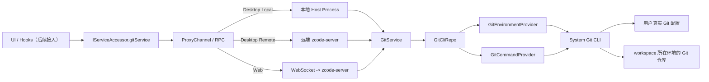

# Git 底层服务实现总结

更新日期：2026-04-09

## 本次目标

本次只实现 Git 的底层服务与通信架构，不接入上层 Git pane 的真实交互。

完成范围：

- 在 `packages/shared/src/git.ts` 补齐 Git RPC 所需 DTO
- 在 `packages/shared/src/channels.ts` 注册 `git` 服务频道
- 在 `packages/services/src/git/` 落地 `config -> providers -> repo -> service` 结构
- 在本地、远端、Web 三条服务链路中接入 `IGitService`
- 补充服务层测试，验证真实 Git CLI 执行

## 实现关系图



这张图对应两条核心原则：

- 上层永远只通过统一的 `IGitService` 协议访问 Git 能力，不感知执行位置
- 真正执行 Git 命令的一定是 workspace 所在那一侧的服务实例，而不是固定绑在本机平台层

## 目录结构

```text
packages/services/src/git/
  config.ts
  git.ts
  gitService.ts
  providers/
    gitEnvironmentProvider.ts
    gitCommandProvider.ts
  repo/
    gitCliTypes.ts
    gitCliHelpers.ts
    gitCliRepo.ts
```

## 分层职责

### Config

负责 Git 域的静态规则与工具方法：

- Git binary 候选路径
- 默认 timeout / 输出大小限制
- 命令执行环境变量
- 跨平台路径规范化
- repo 路径与 workspace 作用域判断

### Providers

`Providers` 层只负责“怎么执行”，不负责 Git 业务语义。

#### GitEnvironmentProvider

负责：

- 解析当前环境里可用的 Git binary
- 缓存探测结果，避免重复执行 `git --version`
- 生成统一的 Git 执行环境变量

#### GitCommandProvider

负责：

- 统一执行 Git CLI
- 控制 `cwd`、`env`、timeout、输出大小
- 记录命令、耗时、exit code、stdoutBytes、stderrSummary

### Repo

`GitCliRepo` 是对系统 Git CLI 的薄封装，职责是“把 Git 原始输出变成结构化数据”。

当前已覆盖：

- 仓库解析
- status
- diff
- branch comparison
- stage / unstage / discard / commit
- identity

其中纯解析逻辑被拆到 `gitCliHelpers.ts`，包括：

- `git status --porcelain=v2 -z` 解析
- `git diff --numstat -z` 解析
- diff 结果可用性判断
- 路径归一化与 repo 边界检查

### Service

`GitService` 对上层暴露稳定 RPC 语义，不让 UI 直接感知 Git CLI 细节。

关键职责：

- 按当前 `workspacePath` 做作用域过滤
- 将 repo 层原始状态映射成 `GitFileChange`
- 把 branch comparison、identity、refresh 等高层语义统一收口

## 关键实现流程

### 1. 仓库解析

`GitCliRepo.resolveRepository()` 的流程：

1. 通过 `GitEnvironmentProvider` 找可用的 Git binary
2. 在 `workspacePath` 下执行 `git rev-parse --show-toplevel --show-prefix`
3. 得到：
   - `repoRoot`
   - `workspaceInRepoPath`
4. 如果 Git 不存在或当前目录不在仓库内，返回结构化空结果，而不是把异常直接暴露给上层

这样做的目的是让上层可以稳定拿到：

- 是否安装了 Git
- 当前 workspace 是否处于 Git 仓库中
- workspace 是 repo 根目录还是子目录

### 2. 状态获取

`GitCliRepo.getStatus()` 的流程：

1. 执行 `git status --porcelain=v2 --branch -z`
2. 执行 staged / unstaged 两个 `git diff --numstat -z`
3. 解析 branch、ahead/behind、文件状态、行数统计
4. 对 untracked 文件额外读取文件内容，补出 added 行数
5. 返回 `GitStatusSnapshot`

这里的关键点是：

- `status --porcelain=v2` 保证格式稳定，不受系统语言影响
- staged / unstaged 的行数统计统一在 repo 层完成
- 上层不需要再猜测某个文件到底属于 staged、unstaged、untracked 还是 conflicted

### 3. workspace 子目录过滤

`GitService.getChanges()` 不会直接把整个 repo 的变化原样抛给 UI，而是根据：

- `repoRoot`
- `workspacePath`
- `workspaceInRepoPath`

只保留当前 workspace 作用域内的变更。

这样当用户打开的是 monorepo 子目录时，默认看到的是“当前 workspace 相关的改动”，不会被整个仓库的其他目录干扰。

### 4. 单文件 diff

`GitCliRepo.getDiff()` 的策略：

- `staged`：走 `git diff --cached`
- `unstaged`：走 `git diff`
- `branch`：走 `git diff <upstream>...HEAD`

对未跟踪文件做了额外兜底：

- 普通 `git diff` 不会返回 untracked 文件
- 所以对这类场景再执行一次 `git diff --no-index`

这样上层在拿 diff 时不需要额外特判“这是 untracked 文件”。

### 5. 写操作

当前 repo 层已经实现以下真实 Git 写操作：

- `stage` -> `git add -- <paths>`
- `unstage` -> `git restore --staged -- <paths>`
- `discard` -> `git restore ...`
- `commit` -> `git commit -m <message>`

这些能力已经通过 `IGitService` 暴露，但上层 UI 还没有正式接入。

## 通信接线

Git 服务现在和 `file/system/terminal` 一样走统一 RPC 链路。

### Local Desktop

- `createLocalServices()` 直接注册本地 `GitService`

### Remote Desktop

- renderer 侧看到的仍然是 `IServiceAccessor.gitService`
- 当前窗口对应的 Remote Host service collection 暴露远端 `gitService`，renderer 再按 remote session /
  workspace scope 选择该服务；窗口 Local Host 不负责替远端 workspace 建立 Git 代理
- 这保证 Git 执行位置始终跟随远端 workspace，而不是错误地落到本机

### Web

- 浏览器通过 websocket 接远端服务
- server 侧 remote bridge 透传 `gitService`

结论：

- 协议统一
- 执行位置跟随 workspace
- UI 不需要区分 local / remote / web

## 问题解答

### 1. GitService 如何获取用户本地 Git 命令和 Git 配置

#### Git 命令

`GitEnvironmentProvider` 会按顺序探测：

1. `ZCODE_GIT_BINARY`
2. `git`
3. Windows 下的常见 Git 安装路径

探测方式是执行一次 `git --version`，成功后缓存结果，后续复用。

#### Git 配置

不直接自己解析 `~/.gitconfig`，而是统一通过 Git CLI 读取。

例如身份信息读取方式：

- `git config --show-scope --show-origin --get user.name`
- `git config --show-scope --show-origin --get user.email`

这样拿到的是 Git 自己最终判定的有效配置，天然兼容：

- global / local / worktree scope
- includeIf
- 平台默认配置加载逻辑

### 2. GitService 怎么做多端兼容

多端兼容的核心不是“每端单独写一套 Git 实现”，而是：

- 统一协议：`IGitService`
- 统一分层：`Service -> Repo -> Providers -> System Git CLI`
- 统一原则：Git 执行位置跟随 workspace 所在环境

#### 本地 / 远端 / Web 兼容

- 本地：本机 host process 注册本地实现
- 远端：远端 server 提供 Git 服务，本地只做 RPC 代理
- Web：浏览器通过 websocket 消费同一套远端服务

#### 多操作系统兼容

当前已经处理：

- Windows Git binary 候选路径
- `/dev/null` 与 `NUL` 差异
- `\` 与 `/` 路径分隔符差异
- `realpath` 归一化，避免 macOS `/var` 与 `/private/var` 导致路径误判

### 3. GitService 现在提供哪些服务接口，分别是做什么的

#### `getRepositorySummary`

返回仓库摘要信息：

- `repoRoot`
- `workspaceInRepoPath`
- 分支名
- ahead / behind
- 是否 dirty
- 是否安装 Git
- 是否在仓库中

#### `getChanges`

返回当前 workspace 作用域内的改动列表。

当前支持：

- `unstaged`
- `staged`

返回值已经归一化成 `GitFileChange[]`。

#### `getDiff`

返回单文件 diff。

支持：

- unstaged diff
- staged diff
- branch comparison diff
- untracked 文件兜底 diff

#### `getBranchComparison`

返回当前分支相对 upstream 的比较结果，包括：

- `baseRef`
- `headRef`
- `comparisonLabel`
- 变更文件列表

#### `stagePaths`

将文件加入暂存区。

#### `unstagePaths`

将文件从暂存区移除。

#### `discardPaths`

丢弃文件改动，支持工作区丢弃和 staged 丢弃。

#### `commit`

执行提交，返回：

- `commitHash`
- 提交后的最新仓库摘要

#### `getIdentity`

读取当前有效的 Git 身份信息：

- `userName`
- `userEmail`
- `nameSource`
- `emailSource`
- `scopeLabel`

#### `refresh`

一次性返回：

- 最新 `summary`
- 最新 `identity`

适合上层做刷新入口时直接调用。

## 验证结果

本轮已验证：

- `pnpm typecheck` 通过
- `pnpm test:unit -- packages/services/test/gitService.test.ts` 通过

`pnpm lint` 当前仍未完全通过，但剩余失败项是仓库内既有历史问题，不是本轮新增 Git 底层服务引入的错误。

## 当前边界

当前已经完成的是：

- Git 底层服务能力
- 跨端通信与执行位置设计
- 真实 Git CLI 集成

当前还没有做的是：

- 上层 Git pane 改为消费真实 `gitService`
- Git pane 写操作 UI 正式接线
- Git 仓库动态订阅刷新
- 更细粒度 hunk 级操作
