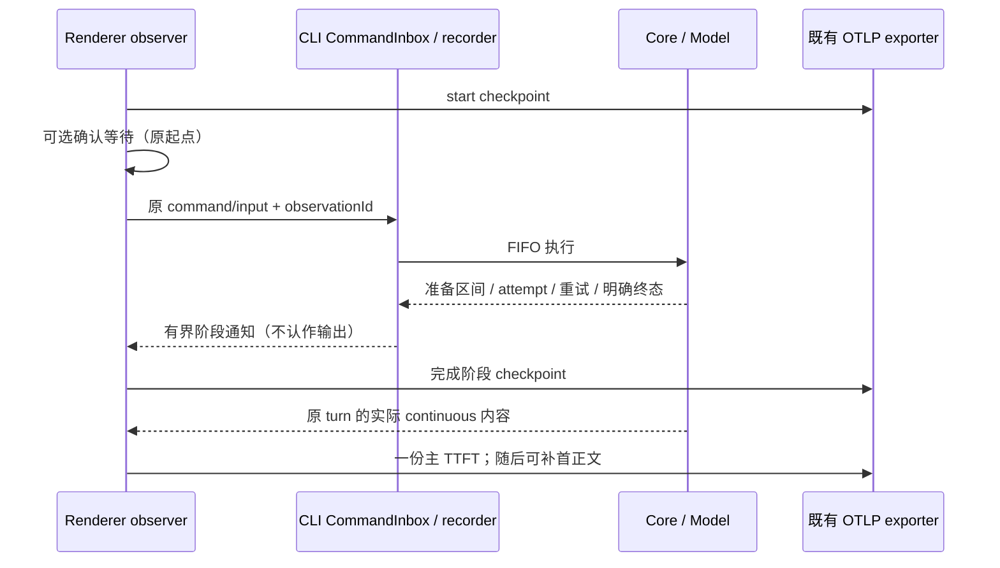

# 02 — 排队、重试和异常发送的阶段归因

**What to build:** 在普通发送的完整观测链路上，让性能分析人员能够解释真实慢消息：展开请求准备子阶段，区分排队、重试、用户确认、失败取消和前后台影响，检查未收口消息及数据质量，并在 ARMS 中完成这些场景的分位数、结果比例和瀑布图分析。

**Blocked by:** [01 — 普通发送的 TTFT 阶段指标与瀑布图](01-local-send-stage-observability.md)。其稳定关联、时间合同、导出 schema 和最终 OTLP 测试接收器是本 ticket 的真实前置条件；须在 01 完成后开始。

**Status:** in-progress

**Parent:** [桌面本地消息 TTFT 分阶段遥测](../../monitoring/ttft-stage-telemetry.md)

## 验收标准

- [x] 延续 ticket 01 的观测与导出合同，复杂场景也经过真实发送、CLI 权威生命周期、内容回传和最终 OTLP 数据；不建立另一套队列、关联主键或平行 exporter 来规避现有边界。
- [x] 展开首输出前实际发生的 hooks、上下文加载、持久化、压缩、MCP/工具准备和请求组装，提供子阶段耗时分布及瀑布明细。并发、重复和未执行子阶段按真实事实呈现，子阶段之和不被当作主阶段墙钟耗时。
- [x] 正确区分内部压缩等准备模型调用与产生用户首响应的模型调用；准备与重试交错时保留真实顺序，不将内部模型首内容抢记为用户首输出。
- [x] 排队发送转正后沿用原发送关联，队列编辑和 send-now 操作不替换原输入归因。分别呈现含排队总 TTFT、队列等待及开始执行后到首输出的耗时，空闲与排队消息可独立统计。
- [x] 队列二次确认继续使用首次提交起点，不重复建立发送记录；用户在弹窗中的等待单独标记，使纯系统处理分析能够剔除该部分。立即引导输入记录发送结果或独立分类，不抢占其他输入输出，不混入普通 TTFT 分位数。
- [x] 模型失败后重试时，物理 attempt 和重试等待关联同一发送，每次 requestId 变化不重置主起点。多个 attempt 只产生一份主 TTFT，后续工具循环请求不混入用户首次响应统计。
- [x] 首输出前明确失败、拒绝、取消或中断，记录结果、已等待时长及已完成阶段；按类型提供数量和比例。无首输出样本不以 0 或 -1 进入成功耗时分布；首输出后的失败不反转主 TTFT。
- [x] 在发送开始及阶段完成时异步提交有界检查点，使已经导出的阶段在根记录尚未收口时仍可查询。不依赖整个根 Span 结束才留下第一份记录，不逐 token 发检查点。
- [x] 只有开始或部分阶段的记录展示为未收口，可能仍在执行或已中断；没有明确证据时不能因超过查询窗口而判为失败或超时。进程强杀不承诺零丢失，也不补造缺失阶段。
- [x] 终态和阶段乱序、重复传输以及晚到合法事实按稳定身份合并，不重复产生 Metric 样本。多会话、多窗口、工作区和进程实例的测试证明不会错绑旧轮次、其他输入或子任务旁路输出。
- [x] 切到后台后继续采集，保存期间必要状态变化，准确区分持续前台与中途切后台后返回；默认体验查询仅使用持续前台且计时可靠样本，诊断查询可查看全部。
- [x] 机器休眠、暂停、时钟跳变或跨进程对齐误差超界会标记数据质量，不制造负耗时或强制钳零。仍然可靠的同进程阶段可独立保留，不可靠跨进程样本不混入精确阶段分布。
- [x] 瀑布图能呈现并行、缺失、截断及未归因区间；以真实区间并集与总时间对账，不能把差额强行归为模型或网络耗时。
- [x] 扩展 ticket 01 的查询和看板，提供准备子阶段、空闲/排队、前后台、重试结果、无首输出结果、未收口和质量分类视图。分位数同时显示样本数，累计观察、阶段观察和 attempt 观察的统计单位明确。
- [x] 灰度启用人群的有界阶段明细与统计保持全量采集，前后台和异常路径不因旧采样配置意外丢弃；验证标签组合和 series 数有界，消息、Trace、工作区或用户关联不进入指标标签。
- [x] 真实桌面 E2E 覆盖排队及转正、二次确认、立即引导隔离、重试后首输出、失败取消、准备子阶段延迟以及后台返回，并从最终 OTLP 数据验证归因；复用 01 的接收器和模型回放，不另建逐层测试专用业务接口。
- [x] 使用适当的进程集成或底层受控测试覆盖退出、强杀、缺失终态、重复乱序、并行区间及对齐误差；区分真实运行证据与模拟结果，不将 mock 成功描述为真机验证。
- [x] 验证 exporter 超时、队列满、丢弃和截断时业务继续且资源有界；扩展场景不改变旧业务/RUM 计数，也不影响远程、手机或 replayable 恢复的业务行为。
- [ ] 完成一次真实桌面运行取证，对齐提交、实际内容接收、阶段记录和最终导出，并测量消息延迟、主线程负担、内存、事件量和标签基数。核心验证覆盖 macOS、Windows、Linux，未完成的平台验证明确保留待办。
- [x] 在 ARMS 核验完整分位数查询、消息关联、瀑布展示和数据可见时延。2026-09-15 完成 API 侧核验：默认体验分位数、准备子阶段 P95、`records`/`excluded`/`attempt`/`no_output.wait` 全部可查，明细与聚合在 run 结束时即可查（上界 <5s）。控制台界面瀑布目视确认仍未做，见下节。
- [ ] 核对实际 ARMS 权限、容量、费用和保留配置，明细目标 7 天、聚合至少 30 天；满足目标的既有配置沿用。未完成核验时保留未完成项，不擅自扩大为全用户全量上线。
- [ ] 通过相关 E2E/单测、类型检查、lint 和架构门禁，补齐本 ticket 的阶段及查询使用说明。逐项对照父 spec 验收矩阵，明确本地测试、平台验证及上线条件的实际结果。

## 完成边界

本 ticket 完成后，两个 ticket 共同覆盖父 spec 的桌面本地范围。桌面远程、手机/Web TTFT、模型服务内部阶段、React 上屏耗时和产品内新诊断页面继续不在范围内；不存在依赖第三个“接线”或“测试”ticket 才能使用的交付缺口。

平台权限、保留策略或跨平台验证若暂不可完成，应在本文件留下未勾选的验收项和具体原因。不得将“实现代码已完成”直接等同于“所有验收条件已满足”。

## 实施合同（2026-09-14）

用户已允许基于 01 的现有实现继续；01 的平台验收和 CLI 既有失败不视为已完成。

- 测试边界沿用验收标准：真实 Composer → CLI → 实际内容 → 最终 OTLP；受控测试覆盖 recorder/observer/exporter 的公开接口。仅运行受影响单测。
- Renderer 是点击时钟、确认等待、前后台历史和首内容接收的唯一 owner；CLI recorder 只订阅原 command/input 的执行事实，不保存业务队列。队列编辑及 send-now 不替换观测 ID。
- 沿已有 V4 stdio/service 链路增加严格 schema 的有界阶段通知，仅作检查点，永不触发首输出。实际首输出仍由 continuous 内容帧决定。remote identity 和 replayable 不启用本地 TTFT；不修改 owner/lease/queue 行为。
- Core 通过 contracts 的可选输入级准备观察接口发布真实区间；无订阅时不计时。重复/并行准备使用独立 stage ID，内部模型调用与 main attempt 分开，首输出后停止准备采集。
- 根、主阶段、准备区间、attempt 和前后台变化均使用稳定身份；检查点与晚到合法事实可以补齐 Trace/阶段统计，但不得重复主 TTFT。终态前已输出成功不反转；未知消失/观察超期只标未收口，不判超时失败。
- 导出保持有界与异步；完成阶段独立产生 Trace/Metric，根未结束也可查。阶段并集用于时间对账，缺失/重叠/截断/时钟异常显式标记。

ARMS 写入/权限/保留/费用、Windows/Linux 实机和扩大灰度均独立保留验收，不能用本地 receiver 通过代替。

## 实施与验证（2026-09-14）

本地实现完成，仍保留 **in-progress**：第19项的Windows/Linux实机、第20–21项的平台验收和第22项的既有CLI失败未满足完整完成条件。前18项的勾选表示本地代码与对应自动化/数据合同完成，不能当作ARMS平台展示验收。

- [查询/统计单位/资源合同](../../monitoring/local-ttft-queries.md)、[看板模板](../../monitoring/dashboards/local-ttft.json)、[本次真实桌面出口与性能证据](../../monitoring/local-ttft-diagnostics-evidence.json)。
- TTFT02 真实桌面 E2E **6/6**：排队转正与后台返回、取消、503重试后首输出、400失败、guide隔离、二次确认与send-now；真实300ms Hook归因，首提交到确认结束约409.6ms用户等待，根requestId指向实际成功attempt。
- 最终 OTLP **6个成功根/6个总Histogram样本/36个主阶段样本**，8个首输出前物理attempt观察；532个Span身份全部唯一，最大实测对齐误差 **3.379ms**，6个成功根质量均complete。指标标签无消息、工作区、用户或请求关联ID。
- 01兼容回归真实桌面 **3/3**：正文/思考/工具先到、空开始、首输出早于ACK、晚到正文及六阶段对账均通过。两套用例继续位于manual-review/pending，未自行晋升正式/Docker suite。
- 根级受影响单测：首批19文件393条通过；后续只重跑相关observer/transport/exporter及新增边界，不跑全量。最终定向范围含原出口异常隔离、跨workspace unavailable、最新attempt身份、首次session绑定隔离、多窗口/CLI实例隔离及晚到完整质量。
- CLI受影响范围初次7文件：122条通过、1条失败。唯一失败为 `v4-gateway.test.ts` 的“Core admission ACK 不等待 TurnStarted projection；旧 revision retry/file rewind 只 stale”：预期 `stale/proto.staleRevision`，实际 `failed/fault.command.executionFailed`。已用开工 `a77a09bb3e` 的gateway、recorder及测试源码在同环境隔离加载复现完全相同结果；原文件未被覆盖，临时文件已清理。不宣称CLI全部通过，也不在本ticket改动该既有业务测试。
- 受控macOS进程集成通过：实际SIGSTOP约5.2秒后SIGCONT，收到clockInvalid；SIGKILL后没有补造terminal。底层验证有界准备截断仍保留主输出、重复/乱序、并行区间并集、时钟漂移、观察超期只标unclosed；这是受控测试，不是真机休眠或完整桌面崩溃恢复。
- 最终OTLP受控出口测试：5秒不响应的Trace接收器触发3秒超时；100次同步enqueue不等待网络，队列满/超时丢弃可查询；准备检查点在根结束前可见；重复根和阶段不增加样本；重叠区间及开区间正确对账。
- 根级typecheck、Desktop E2E typecheck、Bootstrap tsc、lint、architecture门禁及本case fixture check通过。Lint的既有warning单列保留，不作为本次新增错误；无新增架构违规。

### 运行取证与剩余上线条件

证据run：`desktop-e2e-20260914084007773-p85037-a1acc63987c6fc6e`。6条成功TTFT约1.7–14.9秒，包含明确的合成模型等待和后台/队列等待，不能当线上模型延迟。测试期间Renderer记录5次长任务，共513ms；Electron Browser采样CPU最大约0.99%、working set最大193344KiB，Tab最大约4.05%、302128KiB。Chromium量化JS heap约97.4MB。没有做关闭/开启的A/B对照，不能将这些运行值宣称为遥测净开销或内存无泄漏证明。

ARMS再次只读查询近1小时新service为0；可查询既有logstore，不等于有写入、看板配置、容量/费用或保留策略管理权限。本次未获得生产目标OTLP写入配置，未验证完整P50/P95、单消息瀑布、可见时延、7天明细与30天聚合保留。保持现有灰度开关默认关闭，未扩大用户范围。Windows/Linux实机、手机远控完整E2E和平台验证明确保留待办。

### 平台验收（2026-09-15）

上一段"新service为0"已被取代。接入值取自 CI 变量 `ZCODE_PACKAGED_AGENT_OTEL_ENDPOINT`/`_HEADERS` 后，本 ticket 的诊断用例（`conversation-session-ttft-diagnostics`，6/6 通过）与 01 的 stages 用例样本共 12 次发送写入北京 ARMS 并可查。

- 诊断口径全部落地：`records` 按 kind 齐全（start 16 / first_output 12 / first_text 12 / excluded 4 / checkpoint 442）；`excluded` 区分 cancelled 2 / failed 1 / guided 1；`attempt` 按 role+outcome 区分 response/failed 2 与 response/first_output 12，主 TTFT 未被重试放大；`no_output.wait` 记录 cancelled 2 / failed 1。
- 准备与等待区间齐全：context、hooks、persistence、mcp、tools、request_assembly、user_confirmation、retry_wait 均有样本及 P95。
- 默认体验过滤（`quality="complete",visibility="foreground"`）返回 idle 4 条、queued 1 条；`quality × visibility` 分布显示 foreground 5 / background_returned 6 / background 1，后台样本没有混入默认视图。
- 标签为受控低基数，未发现关联 ID 泄漏进指标标签；本次未观察到 `dropped` 序列。
- 仍未完成：控制台界面瀑布目视确认、打包版编译注入写入路径、容量/费用/保留期核对、Windows/Linux 实机、扩大灰度。灰度开关保持默认关闭。

细节见[上线清单](../../monitoring/local-ttft-rollout-checklist.md)与[平台验收证据](../../monitoring/local-ttft-platform-evidence.json)。

### Standards

首次评审发现CLI文件超400行及无TTFT时仍扫描publisher行的性能风险。已按职责拆出压缩事实、时钟采样和Span/阶段投影；在读取完整快照前先检查该session存在观测。复查无未解决发现。未将静态性能判断写成已实测回退。

### Spec

首次评审发现明确CLI退出未按workspace收口，以及首输出时冻结missing质量阻止晚到阶段统计。已补red→green与transport集成回归后修复。后续补齐最新revision的requestId更新、草稿首次session绑定隔离、首思考后中断仅关闭正文观察；复查通过。Root结果和起点不反转、不重复。

### 排查轨迹

- 准备检查点提前绑定session后，旧逻辑把正常initial快照误判recovery；最终OTLP的recovery结果帮助定位，已按协议区分initial与recovery。
- 复用测试的Electron回调用了形参解构，但wdio-electron-service会移除第一个形参，导致窗口操作静默未执行；已改成函数体内读取electron，最终回归验证真实焦点与最小化/恢复。
- 停止可能发生在provider请求之前；未消费的PAUSE fixture曾抢匹配随后合并的CONFIRM user content。根据最终network capture修正case-local排除条件，并给后台标题生成独立common fixture，避免无关Missing Fixture重试污染性能观察。未改业务发送逻辑来迎合回放。

架构复核：变更模块为 `ui / shared / services / desktop / zcode-cli`，Renderer独占点击/可见性/内容终点，CLI recorder独占执行事实，Main仅做有界导出。状态顺序沿本文件时序图，未新增owner或accepted queue。提交前架构检查 baseline=0、new=0；生产源码新增1269行、删除299行、净增970行（不含测试、看板和证据）。
