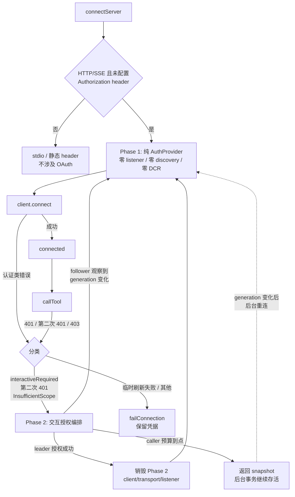
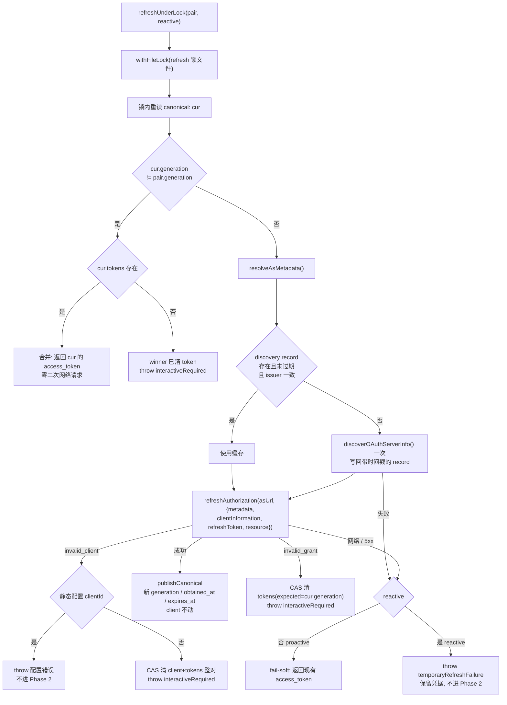
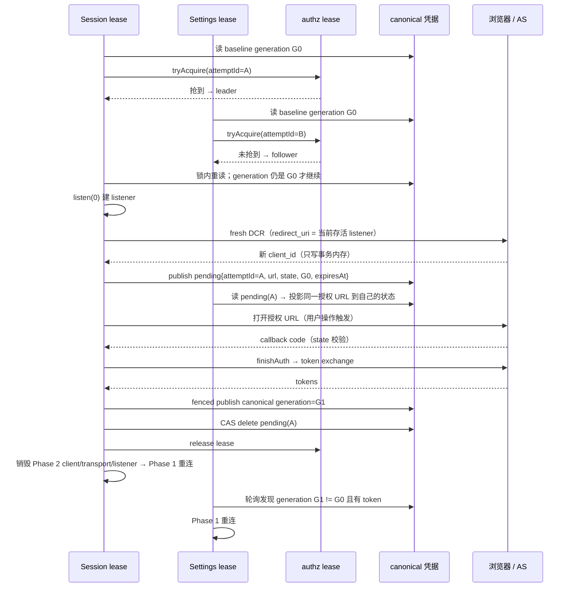
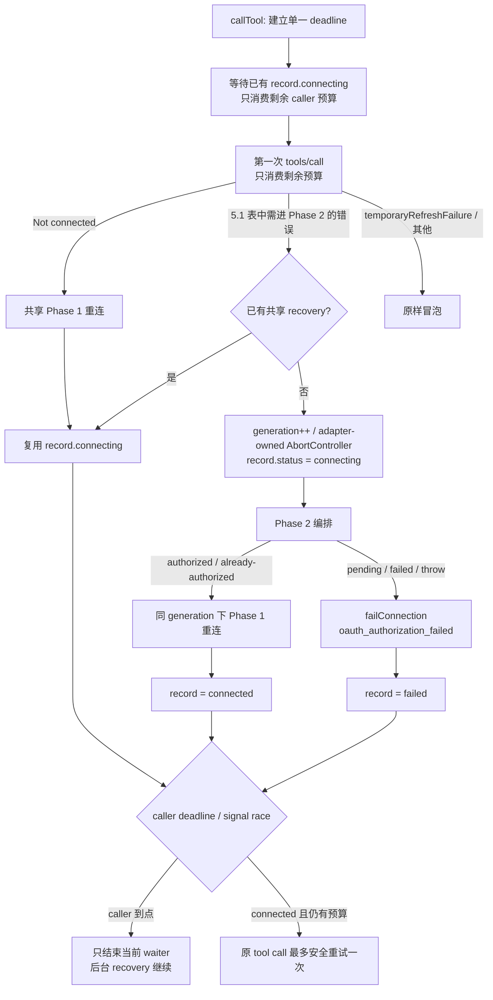

# MCP OAuth 两阶段连接规格（v4）

> 状态：设计定稿，分 PR1-PR3 实施。
> 日期：2026-08-14。
> 修订：2026-08-24，补齐运行期 tool caller 预算、共享恢复所有权与异常收敛。
> 基线：`exa-oauth-analysis` / `bfc91c54a9`。
> 生产 SDK：`@modelcontextprotocol/client@2.0.0`（`apps/zcode-cli/packages/adapters/package.json:105`）。
> 仓库同时存在 `@modelcontextprotocol/sdk@1.29.0`，本规格与实现只使用 `client@2.0.0`。
> 根因分析：`docs/analysis/exa-oauth-reauth-analysis.md`。
> 前置规格：`docs/mcp-oauth-client-auth.md`（配置、凭据完整性、设置页边界）。

## 1. 问题与目标

### 1.1 两个已定案根因

| 根因                  | 机制                                                                                                                                                                                                                                                                            | 现场证据                                                      |
| --------------------- | ------------------------------------------------------------------------------------------------------------------------------------------------------------------------------------------------------------------------------------------------------------------------------- | ------------------------------------------------------------- |
| **R1 refresh 竞态**   | 多个 CLI 进程共享 `~/.zcode/v2/credentials.json`。`withFileLock` 只覆盖凭据读写，不覆盖网络 token exchange。access token 过期时各进程并发用同一 refresh token 刷新，撞授权服务器 rotation reuse-detection，整个 token family 被撤销；SDK 随后 invalidate tokens，退化为重新授权 | 8-12 `08:54:49Z` 连接成功，`09:00:13Z` 已进入交互授权         |
| **R2 二次授权死循环** | DCR 注册的 client 把 `redirect_uris` 锁死在注册当时的随机回调端口；回调服务器每次 `listen(0)` 换端口。redirect_uri 失配时授权服务器按 RFC 6749 §4.1.2.1 禁止回跳，就地渲染错误页；回调永不到达，重试永不自愈                                                                    | client 注册端口 `54735`，后续授权使用 `58670`/`58676`/`61820` |

R2 的放大因素：设置页 lease 与 session lease 各建独立 OAuth 事务，产生多个 client、多个 state、多个授权 URL；session 启动预算 15 秒被错误实现为「授权事务只能活 15 秒」。

### 1.2 设计原则

1. 被动连接零 listener、零 discovery、零 DCR。
2. 只有交互式授权才建 listener；跨进程单飞；DCR client 事务内存化。
3. 所有 refresh（主动与 reactive）汇入一把跨进程文件锁。
4. 确定性 OAuth 错误按 generation CAS 失效；非确定性错误才 fail-soft。
5. caller 等待预算与授权事务寿命分离：15 秒是 caller 的等待预算，授权事务全局寿命 300 秒。
6. 运行期（`callTool`）与建连期使用同一套 Phase 2 → Phase 1 编排，不允许只在 startup 路径自愈。
7. 共享恢复由 adapter/session 生命周期持有；任一 tool caller 的 timeout 或取消只能结束自己的 waiter，
   不能取消共享授权。恢复 Promise 必须是 total operation，最终把 record 收敛到 connected 或 failed。

### 1.3 现状缺陷：被动连接也会开 listener

`resolveAuthorizationCodeOAuthConfig()` 对任何没有 `Authorization` header 的 HTTP/SSE MCP 都返回
`{ type: "authorization_code" }`（`mcp/index.ts:1012-1025`）。`createTransport()` 随后无条件创建 OAuth
session，而 `createMcpAuthorizationCodeOAuthSession()` 在返回前就 `listen(0)`
（`mcp/oauth.ts:67-80`、`auth/localhost-callback.ts:69-83`）。

结果：**每个 HTTP MCP 每次连接都占用一个随机端口的 HTTP listener，即使凭据完全有效、根本不需要授权。**
这既是 R2 的端口来源，也是 Phase 1 必须先解决的资源问题。

## 2. 总体架构



两阶段的硬边界：

- Phase 1 的 provider **只有** `token()` 与 `onUnauthorized()`。它不是 `OAuthClientProvider`，因此
  transport 的 `_oauthProvider` 保持为空（`client/dist/index.mjs:4977-4980` 的 `isOAuthClientProvider`
  分支），SDK 的 `auth()` / discovery / DCR 完全不参与。
- Phase 2 **不创建任何 MCP transport**。它直接调用 SDK 导出的 `auth(provider, options)` 驱动
  discovery → DCR → authorize → code exchange。因此「Phase 2 的已认证 transport 会带着
  `_oauthProvider` 活到运行期、401 时走 SDK 的 `handleOAuthUnauthorized()` → `auth()` 绕过 refresh 锁」
  （`index.mjs:245-276`）这个隐患从结构上不存在：没有 transport 可以被误留。授权成功后调用方直接用
  Phase 1 的纯 AuthProvider 重新建连。
- Phase 1 用于探测的 transport 在进入 Phase 2 前一定被关闭：negotiation 失败时 SDK 已经
  `transport.close()`（`index.mjs:3283-3287`），spent transport 不可复用。

## 3. Phase 1：运行期纯 AuthProvider

### 3.1 provider 形态

```ts
{
  async token() {
    const pair = await loadCanonical();
    if (!pair?.tokens) return undefined;                 // → 401 → onUnauthorized
    if (!isNearExpiry(pair)) return pair.tokens.access_token;
    return await refreshUnderLock(pair, { reactive: false });
  },
  async onUnauthorized() {                               // transport 之后自动重试一次
    const pair = await loadCanonical();
    if (!pair?.tokens?.refresh_token) throw interactiveRequired();
    await refreshUnderLock(pair, { reactive: true });
  },
}
```

SDK 契约（`index.d.mts:186-201`）：`onUnauthorized()` 返回 `Promise<void>`，返回值被忽略；它的职责是
「让下一次 `token()` 返回可用 token」。因此 `refreshUnderLock` 必须把结果发布到 canonical 并让
provider 的下一次读取绕过缓存。

401 座位语义（`index.mjs:4848-4866`、`5103-5120`、`5340-5358`）：

- `onUnauthorized` 每个请求最多被调用一次（`!isAuthRetry`）。
- 它抛出的错误经 `markAuthSeamEscape()` 原样冒泡，identity 保留。
- 重试仍 401 时抛 `SdkHttpError(SdkErrorCode.ClientHttpAuthentication, "Server returned 401 after re-authentication")`。

### 3.2 canonical 凭据结构

```ts
interface McpOAuthCanonicalCredentials {
  client_information: OAuthClientInformationMixed;
  expires_at?: number; // 新增：epoch ms，由 obtained_at + expires_in 推导
  generation?: string; // 新增：每次 publication 唯一的 128-bit 随机 id
  issuer?: string; // 新增：仅存字段，本次不参与 keyPrefix 键控
  obtained_at?: number; // 新增：epoch ms
  published_by: string; // 保留：事务 id，仅用于诊断
  tokens: OAuthTokens;
  version: 1 | 2; // 不 bump
}
```

**新增字段全部可选，且不 bump version。** 追加可选字段对旧 reader 向后兼容（忽略未知字段即可）；
bump version 反而会让未升级的 CLI/desktop 把新记录当未知版本整体忽略、退回 legacy 镜像，丢掉
canonical pair 保证——而「未知版本必须保留原值」正是现有约束。

`generation` 必须是每次发布都变化的随机 id，**不能复用 `published_by`**：`published_by` 是 state 派生的
事务 id，同一事务的多次 refresh 不会改变它（`oauth.ts:223-228`），无法承担 CAS 与 follower 观察的职责。
随机 id 同时消除 ABA。迁移期旧记录（无 `generation`）以 canonical 原始 JSON 的稳定 hash 作为
baseline generation。

`OAuthTokens` 只有 `expires_in`，没有获取时间，所以 `obtained_at` 必须由我们记录，否则跨进程无法计算真实
过期点。临期判断沿用 30 秒 skew。

### 3.3 refreshUnderLock



关键约束：

- **锁文件独立于 credentials 文件。** 锁内会调用 `publishCanonical()`，后者自身用
  `withFileLock(credentials.json)`。两个不同路径的锁不会自重入死锁。
- **锁文件 basename 只含 hash 与连字符。** `keyPrefix` 形如 `mcp:oauth:<hash>`，冒号在 Windows
  文件名中非法，必须转写为 `mcp-oauth-<hash>.refresh`，与 credentials 同目录。
- **锁的获取预算必须覆盖网络预算。** `withFileLock` 默认 `lockMaxWaitMs` 是 8 秒
  （`privateFilePersistence.ts:9`），而 discovery + refresh 两次网络请求可能超过 8 秒，因此显式传
  45 秒。waiter 超时后**先重读 canonical**：换代且有 token 就直接使用，否则报
  `temporaryRefreshFailure`（等锁失败不是 grant 失效）。
- **fail-soft 边界按 proactive/reactive 区分。** proactive（`token()` 临期路径）网络失败可以返回现值：
  token 还没被资源服务器拒绝。reactive（`onUnauthorized()`）网络失败**不能**返回现值，那个 token 刚被
  拒绝，返回它必然产生第二次 401 并抛 `ClientHttpAuthentication`，还会把临时 AS 故障误判成需要交互授权。
  reactive 网络失败抛独立的 `temporaryRefreshFailure`，编排层保留凭据、不进 Phase 2。
- **generation 变化但 winner 无 token** 不是成功。不能返回 `undefined` 当成「没有凭据」，必须
  join / 进入 Phase 2。
- **没有 refresh token 时不虚构刷新。** `token()` 直接返回现有 access token 撑到 401，由
  `onUnauthorized()` 统一判定为需要交互授权。

### 3.4 resolveAsMetadata

返回三元组，Phase 1 与 Phase 2 共用同一份 discovery record：

```ts
interface ResolvedAsMetadata {
  authorizationServerUrl: string;
  metadata?: AuthorizationServerMetadata;
  resource?: URL; // 经 selectResourceURL 校验
}
```

- discovery record 带 `fetched_at`，TTL 24 小时；过期或 `issuer` 与 canonical `issuer` 不一致时重发现。
  **时间戳存在一个独立 key（`discovery_state_fetched_at`），不包裹 `discovery_state` 本身**：后者的值形态
  必须继续是裸 `OAuthDiscoveryState`，换成 `{fetched_at, state}` 包裹结构会让未升级的 reader 读到一个不含
  `authorizationServerUrl` 的对象，静默失去 discovery 缓存。缺时间戳视为过期，重新发现一次后自愈。
- `resource` 必须求出并传给 `refreshAuthorization()`（RFC 8707）。SDK 自己的 refresh 会传经校验的
  resource（`index.mjs:690-697`），我们绕开 `auth()` 后必须自己补上，否则受众绑定丢失。
- Phase 2 的 interactive provider 的 `discoveryState()` 读取同一 record，避免 Phase 1 刷新了 metadata
  而 Phase 2 仍用无 TTL 的旧缓存（现状 `oauth.ts:288-294` 直接返回缓存，无 TTL）。
- Phase 2 在事务内还保留一份内存副本：SEP-2352 要求 code exchange 那一腿能读回 authorize 腿记录的
  issuer，否则 SDK 抛 `AuthorizationServerMismatchError`（`index.mjs:682-687`）。共享记录可能被别的进程
  改写或恰好过期，内存副本保证同一事务内的 issuer 绑定稳定。

### 3.5 凭据失效必须是 generation 条件事务

现有 `deleteIfValues()` 是逐 key 比较、逐 key 删除（`shared-credentials.ts:104-121`）：canonical 匹配失败
时 legacy 镜像仍可能被删掉，反之亦然，无法表达「canonical 匹配才整体失效」。

因此在共享凭据 store 增加条件事务：

```ts
deleteManyIfValue(
  guardKey: string,
  expectedGuardValue: string,
  keysToDelete: readonly string[],
): Promise<boolean>;
```

语义：在一次凭据文件 RMW 临界区内，`guardKey` 当前值与 `expectedGuardValue` 相等才删除
`keysToDelete` 全部 key，否则一个都不删并返回 `false`。OAuth 侧的调用把 canonical key 作为
`guardKey`、**发起方读到的 canonical 原始 JSON** 作为期望值（原始值即 generation 的载体，比单独
比较 generation 字段更严格），删除集合为：

- `invalid_grant` → canonical + legacy tokens（保留 legacy client 作为重新授权种子）；
- `invalid_client` → canonical + legacy tokens + legacy client（整对丢弃）。

stale 事务因此不可能删除 winner 的 canonical 或其任何一半镜像。

### 3.6 兼容规则只能有一份实现

canonical 与 legacy 镜像的交错兼容分支（哪种变化能被证明属于同一次授权）抽成纯函数
`deriveCredentialPair({canonicalRaw, legacyClientRaw, legacyTokensRaw})`，`loadCredentialPair()` 是它的
「读一次 + 派生」包装。

保留下来的旧 `authorization_code` provider 也委托同一个纯函数，用自己已经读到的快照派生：
两处各写一遍这套分支必然发散，而重复读凭据文件又会让每次 provider 读取放大一倍 I/O。该 provider
在运行期已不被使用，仅作为兼容规则的测试面保留，随 legacy 镜像窗口一起移除。

## 4. Phase 2：交互授权编排

### 4.1 时序



### 4.2 leader / follower 契约

```text
G0 = 当前 canonical generation（baseline）
tryAcquire(authz lease, attemptId)
 ├─ 未抢到 → follower
 │    读 pending：attemptId 有效且未过期 → 展示同一授权 URL
 │    轮询 canonical：generation != G0 且 tokens 存在 → 回 Phase 1 重连
 │    caller 预算（session 15s / 设置页 300s）到点 → 报「授权正在另一处进行」并返回 snapshot
 │                                                  后台共享任务继续观察，不终止 leader
 └─ 抢到 → leader
      锁内重读：generation != G0（等待期间别人已完成）→ 放锁收工，回 Phase 1
      listen(0) 随机端口（放弃端口复用：listener 在连接期长期存活，复用必撞）
      interactive OAuthClientProvider（全新 state，scope = 编排层算好的 unionScope）
        clientInformation()      静态配置 clientId → 返回；否则 undefined
                                 → SDK 必然用当前存活 listener 的 URL 重新 DCR
                                 → redirect_uri 失配从根上消除
        saveClientInformation()  只写事务内存，不落盘
        tokens()                 undefined（不触发 refresh）
        saveTokens()             锁内 saveMany 原子发布 canonical + legacy 镜像
        discoveryState()         读共享 discovery record（含 TTL）
      publish pending{attemptId, authorizationUrl, state, baselineGeneration, expiresAt}
      等回调至全局 TTL 300s
      放弃时 AbortController 真取消 listener / fetch / finishAuth
      finally：等待所有 in-flight promise settle → CAS delete pending → 放锁
               → 关 listener → 销毁 transport → 回 Phase 1 重连
```

### 4.3 为什么用独立授权锁而不是 marker

`withFileLock` 的 `maxWaitMs` 只限制获取，不限制持有（`privateFilePersistence.ts:51-75`）；活 PID 的锁不会
被 stale 回收（`atomicFileLock.ts:69-87`）；`67666ea256` 修的是 waiter 超时后误 cleanup，与长时持锁无关。
**锁本身即 fencing**：迟到的 leader 放锁后其 attempt 已失去发布权。

### 4.4 tryAcquire 必须是专用实现

不能直接用 `withFileLock(..., { lockMaxWaitMs: 0 })`，有两个独立原因：

1. **死锁无法回收。** `acquireFileLock` 在竞争时先判断 `elapsed >= maxWaitMs` 再尝试回收 abandoned lock
   （`atomicFileLock.ts:238-253`）。零等待直接超时，永远不执行 owner-dead 检查；持锁进程崩溃后，
   授权功能永久不可用。因此 tryAcquire 用一个**短但非零**的预算（250ms，重试间隔 25ms），保证失败前
   至少执行一次 owner-dead 回收检查，同时把 follower 的额外延迟限制在人机流程无感的量级。
2. **`withFileLock` 的进程内 FIFO 会阻塞 follower。** 它按 filePath 排队（`privateFilePersistence.ts:58-64`），
   排队发生在获取锁之前，同进程的第二个 caller 会等到第一个释放（最长 300 秒）而不是立即成为
   follower。所以 tryAcquire 直接调用 `acquireFileLock`，绕开该队列。

**不需要额外的进程内注册表。** 互斥由 `mkdir` 提供，这是文件系统级语义，与进程无关：同进程的第二个
caller 一样收到 `EEXIST`，随后读到的 owner PID 是本进程自己且存活，因此不会误回收，正确降级为
follower。锁路径 basename 同样只含 hash 与连字符（`mcp-oauth-<hash>.authz`）。

### 4.5 pending 键必须与 attempt 绑定

pending 至少包含 `attemptId`、`baselineGeneration`、`authorizationUrl`、`state`、`expiresAt`。删除必须是
按 `attemptId` 的 CAS，否则旧 leader 的 `finally` 会删掉新 leader 刚发布的 pending，follower 随即失去
授权 URL。TTL 只用于展示过期判断，**不能**作为锁所有权依据。

### 4.6 取消必须等待 in-flight settle

`AbortController.abort()` 之后立即进入 `finally` 放锁是不够的：token response 可能已经返回，旧事务的
code exchange / `saveTokens()` 仍在进行中。现有 callback promise 既不接受 signal，关闭 listener 也不会
reject 它（`localhost-callback.ts:24-30`、`83-90`）；现有 `withTimeout` 只忽略迟到结果、不取消底层操作
（`mcp/timeout.ts:1-53`），不能用它承担取消职责。

**实现方式是结构性的，而不是加一个 in-flight 追踪器：只有「等人点授权」这一段设超时，code exchange
一律 `await` 到 settle，不与超时竞速。**

```text
auth(provider, {...})                     ← 不设超时（构造 URL + DCR，本地/有界网络）
withTimeout(waitForCallback(), 300s)      ← 唯一的超时点：等人
auth(provider, {authorizationCode})       ← 不设超时，await 到 settle
finally: 关 listener → CAS 删 pending → 放锁
```

超时只可能发生在「还没拿到 code」的时刻，此时 token exchange 根本没开始，不存在能抢在放锁后发布的
in-flight 请求，fencing 天然闭合。代价是：回调在 299.9s 到达、交换耗时 5s 时会略微超出 300s 仍持锁——
这比丢弃一个有效 code 更正确。

### 4.7 PR2 独立落地需要过渡 seam

PR2 落地时 Phase 1 仍是现有完整 provider，而现有 provider 在 transport 创建前就 `listen(0)`，并允许 SDK
自己走 DCR / redirect（`oauth.ts:67-103`）；adapter 只在失败后才检查 `hasPendingAuthorization()`
（`index.ts:570-599`）。若不加 seam，PR2 单独部署仍会打开「旧 client + 新 redirect_uri」的授权 URL，
R2 未修复。

seam 契约（两处，缺一不可）：

1. `redirectToAuthorization()` **不再**把授权 URL 投影为 pending 状态、也不打开浏览器，而是抛出
   `interactiveRequired()`，由编排层转入新的 Phase 2 事务。
2. `clientInformation()` 在既无静态配置 clientId、又无已存 client 时同样抛
   `interactiveRequired(reason: "no_credentials")`，**而不是返回 `undefined`**。返回 `undefined` 会让 SDK
   立刻自行做一次动态注册，而 DCR 归属已经整体移交 Phase 2；那次注册永远不会被使用，只会在授权服务器
   上留下垃圾 client。没有 client 也就没有 refresh token，本来就只能交互授权，所以直接抛是正确的。

旧 provider 在 PR2 阶段只保留 `token()` / refresh 语义，交互授权的唯一出口是 Phase 2。

## 5. 错误分类与运行期恢复

### 5.1 认证错误分类表

| 错误                                                         | 来源                                             | 编排层动作                                                              |
| ------------------------------------------------------------ | ------------------------------------------------ | ----------------------------------------------------------------------- |
| `interactiveRequired`（我们的稳定 code + `Symbol.for` 品牌） | Phase 1 provider                                 | 进入 Phase 2                                                            |
| `SdkHttpError{code: ClientHttpAuthentication}`               | 重试后仍 401（`index.mjs:4862`、`5117`、`5354`） | 进入 Phase 2                                                            |
| `UnauthorizedError`                                          | 无 `onUnauthorized` 的防御路径                   | 进入 Phase 2                                                            |
| `InsufficientScopeError{requiredScope}`                      | Streamable HTTP 403（`index.mjs:5010`）          | 算 unionScope 后进入 Phase 2                                            |
| `temporaryRefreshFailure`                                    | reactive refresh 的网络 / 5xx                    | 保留凭据，failConnection，**不**进 Phase 2                              |
| 静态 clientId 的 `invalid_client`                            | Phase 1 refresh                                  | 报配置错误，**不**进 Phase 2（Phase 2 会复用同一静态 client，必然循环） |

`interactiveRequired` 用稳定 code + `Symbol.for` 品牌识别，不依赖 `instanceof`，以抗 bundle 重复加载。
SDK 的 `markAuthSeamEscape()` 是 identity-preserving 的（`index.mjs:2270-2277`），不会替换错误对象。
编排层必须在 `failConnection()`（`index.ts:570` 附近）**之前**完成分类。

### 5.2 403 unionScope 公式

SDK 自己的算法是三项并集（`index.mjs:5021-5024`，`computeScopeUnion` 已导出）：

```text
unionScope = 历史请求 scope ∪ token.scope ∪ challenge.scope
```

不是「`token.scope ∪ requiredScope`」两项。原因是 token response 的 `scope` 本身允许缺失，只靠 token
的 scope 会丢掉配置里声明过、服务器未回显的 scope。

编排层捕获 challenge 后：重读最新 canonical → 计算
`config/effective_requested_scope ∪ token.scope ∪ requiredScope` → 把最终 scope **和**
`resourceMetadataUrl` 一并传入 Phase 2 → Phase 2 不再基于旧 snapshot 二次计算。DCR 的
`clientMetadata.scope` 与 authorize 请求都使用这个最终 scope，否则 403 无限循环。

### 5.3 SSE 的 403 不支持 step-up（已知限制）

typed step-up 只由 Streamable HTTP 实现。旧 SSE transport 对 POST 403 抛普通 HTTP `Error`
（`index.mjs:4867-4869`），不产生 `InsufficientScopeError`，拿不到 `requiredScope`。

本次不为 SSE 补 step-up。SSE 的 403 按不可分类错误处理：`failConnection` 并保留凭据，**不**进入 Phase 2。
理由是无法计算 unionScope 的授权重试必然以同一 scope 再次 403，形成循环。

### 5.4 运行期恢复

`callTool()` 目前只对裸 `"Not connected"` 重连重试一次（`index.ts:307-328`），认证类错误原样冒泡。
连接建立后 token 过期、被撤销或 scope 不足时，用户看到的是裸错误，且不会自愈。

运行期恢复仍保持「原 tool call 最多重试一次」，但不能由触发错误的 caller 内联持有 Phase 2。
第一次认证错误必须原子创建或复用 server record 上的共享恢复任务：



共享任务完整拥有「Phase 2 → Phase 1 重连」，并存入 `record.connecting`。同 adapter 的并发 caller
只复用这一个 Promise；跨 adapter/process 仍由 authz lease 单飞。任务使用 adapter-owned
`AbortController`，只允许显式 `disconnectServer`、adapter/session `close` 或 generation 换代取消。
不能把 `McpCallToolOptions.signal` 传给 Phase 2，否则 core tool executor 到点 abort 时会关闭 callback
listener，使浏览器中仍在进行的授权失效。

`callTool()` 在入口建立一次 deadline。等待已有 connecting、第一次请求、等待共享恢复、重连以及
最终重试都只能消费剩余预算；不能让每个阶段重新获得完整 `timeoutMs`。caller 到点后返回
`McpTimeoutError`/取消错误，但共享恢复继续观察 canonical generation，并在授权完成后主动把 record
重连到 connected。运行期工具已经在 core 注册，因此后续调用可直接复用恢复后的连接。

共享恢复内部不能通过现有 `connectServer()` 递归重连：`connectServer()` 会先 `closeRecord()`，
从而 abort 当前 record 上的 recovery controller，形成自取消。实现应在同一个 generation/controller
下直接进入 Phase 1，或抽出不执行 `closeRecord()` 的内部状态转换函数。

### 5.5 Phase 2 异常必须收敛

`runInteractiveOAuthAuthorization()` 的公开结果已经包含 `{status: "failed", error}`，因此生产编排
必须把以下异常统一归一为 failed outcome，而不是让 Promise reject：

- canonical/legacy credential 读取损坏、EACCES 或 EPERM；
- authz lease 获取异常；
- step-up scope 计算时的 credential 读取异常；
- follower 投影 `onAuthorizationRequired` 时宿主 callback reject；
- resource metadata URL 转换及 discovery/DCR 等其他交互编排异常。

建连与运行期共享恢复拿到 failed outcome 后都必须调用
`failConnection({failureKind: "oauth_authorization_failed"})`。成功时 connected record 替换
connecting record；失败时 failed record 替换 connecting record。禁止保留 rejected
`record.connecting`，也不使用 `Promise.allSettled` 掩盖未收敛的单 server 状态。

底层 lease release 当前是 best-effort，文件删除异常已在锁实现内吞掉；它不是本次缺陷触发点。
即便后续锁实现改变，cleanup 失败也不得覆盖已经确定的授权 outcome。

### 5.6 settings / session 双 lease 的 pending 投影

settings adapter 与 session adapter 是独立 lease（`zcode-protocol-entrypoint.ts:115-133`），
`connectionKey` 对非 workspace-isolated server 使用 `leaseId`（`pool.ts:317-328`）。因此 session 成为
leader 时，settings follower 必须从共享 pending 键读取并把授权 URL 投影到自己的状态；现有状态更新只
发生在当前 adapter 自己的 `onAuthorizationRequired` 回调里（`index.ts:770-785`），跨 lease 不可见。

## 6. PR 序列（顺序不可颠倒）

| PR      | 内容                                                                                                                                                                                                                                     | 修复                  |
| ------- | ---------------------------------------------------------------------------------------------------------------------------------------------------------------------------------------------------------------------------------------- | --------------------- |
| **PR1** | `localhost-callback`：state 不匹配回 400 但**不** reject 自己的 callback promise；匹配 state 且带 `error=access_denied` 立即 settle 失败。`oauth.ts` 的 `invalidateCredentials` 各分支、授权 / 刷新事件补 warn 级日志（不含 token 明文） | 可观测性 + 回调健壮性 |
| **PR2** | 独立授权锁（专用 tryAcquire + 进程内注册表）+ fresh DCR 事务内存化 + 锁内原子发布 + attempt 绑定的 `pending_authorization` 共享键 + caller 预算与事务寿命分离 + 真 abort + **旧 provider → Phase 2 过渡 seam**                           | **R2**                |
| **PR3** | Phase 1 换纯 AuthProvider + `refreshUnderLock` + `generation` 与 `deleteManyIfValue` CAS + `obtained_at`/`expires_at` 迁移 + discovery TTL/issuer/resource + 403 unionScope 传递 + Phase2→1 交接 + 运行期 `callTool` 恢复                | **R1**                |

PR3 必须在 PR2 之后：Phase 1 换纯 AuthProvider 后 SDK 不再自发交互授权，PR2 未就位则用户无法授权。

## 7. 迁移

| 现存状态                                      | 行为                                                                                                                                                                                                             |
| --------------------------------------------- | ---------------------------------------------------------------------------------------------------------------------------------------------------------------------------------------------------------------- |
| v3 canonical（有 `generation`/`obtained_at`） | 正常路径                                                                                                                                                                                                         |
| v1/v2 canonical，有 refresh token             | 视为临期，进锁尝试**恰好一次**刷新（锁内重读防多进程重复触发）。成功 → 发布 v3；`invalid_grant` → CAS 清 tokens 进 Phase 2（旧 family 本就已死，正是 exa 现场）；临时失败 → 保留旧 pair 按 reactive 临时错误处理 |
| v1/v2 canonical，无 refresh token             | 不虚构 refresh，继续使用 access token 直到 401，再进 Phase 2                                                                                                                                                     |
| 未知更高 version                              | 保留原值并回退，禁止当损坏数据删除（沿用现有约束）                                                                                                                                                               |

让所有升级用户直接进 Phase 2 会造成不必要的授权打扰，不采用。

## 8. 验证矩阵

现有 19 条 OAuth e2e 断言全部保留。现有 e2e 从 `@modelcontextprotocol/sdk@1.29` 直连 import，需切到生产
包 `@modelcontextprotocol/client@2.0.0`。新增：

### PR1

1. 错误 state 的请求先到、正确 state 的请求后到 → 授权仍成功（错误请求不得 poison callback promise）。
2. 匹配 state 且带 `error=access_denied` → 立即失败，不等到超时。

### PR2

3. 两个真实子进程争 leader → 恰好一个 listener、一次 DCR、一个授权 URL。
4. A 超时、B 接管：断言 A 的 `finishAuth`/`saveTokens` 完全 settle 后才放锁，且 A 迟到的 `saveTokens`
   必须失败（fencing），A 永不覆盖 B。
5. 授权锁死亡回收：零等待竞争下 dead owner 可回收；旧 attempt 的 `finally` 不得删除新 attempt 的
   pending；锁路径在 Windows 合法（basename 无冒号）。
6. **过渡 seam**：仍使用旧完整 provider 时，首次 / 失效授权被 seam 转进 fresh Phase 2，旧 redirect URL
   不得被打开。
7. `ServerError`/403 路径下旧 canonical 仍在时，leader 不得把旧 token 当作新 generation。
8. settings/session 双 lease：session 先成为 leader，settings follower 看到同一 pending URL；
   session 15 秒预算结束不终止 300 秒共享授权；leader 完成后两个 adapter 都能回 Phase 1。

### PR3

9. 首次无凭据连接：断言零 discovery、零 DCR、零 listener。
10. rotation 严格服务器 + barrier 双进程：仅一次 refresh 请求（参考 `22ba5d86c4` 的
    `mcp-oauth-proactive-refresh.test.ts` 思路；文件布局已分叉，不可 cherry-pick）。该测试上再加
    expired discovery 单飞与 reactive 网络失败两个分支。
11. `invalid_client`：断言 client + tokens 整对失效；静态 clientId 的 `invalid_client` 报配置错误而非进
    Phase 2。
12. 旧 canonical 无时间字段 → 恰好一次刷新尝试，不反复。
13. generation/CAS：refresh、授权、失效并发时每次 publication 换 generation；stale `invalid_client`
    不得删除 winner 的 canonical 或 legacy 镜像。
14. 运行期恢复：已连接后 `callTool()` 分别触发 401、第二次 401、403 → 完成 Phase 2、销毁 interactive
    transport、Phase 1 重连，原 tool call 最多安全重试一次。
15. scope/resource：token response 不含 `scope`、challenge 增加新 scope → 断言新请求保留配置 / 历史
    scope，并传递 challenge 的 `resourceMetadataUrl`。SSE 403 断言「明确不支持 step-up」。
16. `callTool()` 等待 startup connecting 时，caller timeout/abort 立即结束当前 waiter，后台 connection
    与 callback listener 继续存活。
17. tool caller 在运行期触发 Phase 2 后超时，随后用户完成浏览器授权 → 无需原 caller 存活，
    record 最终自动进入 connected。
18. 两个并发 tool caller 只创建一个 adapter-owned recovery；任一 caller 取消不影响另一 caller 或
    callback listener。
19. credential load、lease EACCES/EPERM、follower callback reject 等 Phase 2 编排异常 → record
    进入 `failed/oauth_authorization_failed`，后续同配置连接可以重新尝试，不复用 rejected Promise。
20. 单一 deadline：第一次调用、恢复等待和最终重试总耗时不超过 caller 预算；授权成功后原 tool call
    最多重试一次。

## 9. 已知限制（本次不修）

- `issuer` 只作为 canonical 字段留存，不参与 `keyPrefix` 键控。同一凭据 key
  （`serverName + serverUrl + scope + redirectPath`）下切换授权服务器时，仍按现有五维 key 复用凭据。
- 远程 SSH / 容器场景下 localhost callback 跨 host 不可达。这是既有问题，两阶段设计不改变它。
- SSE transport 的 403 不支持 step-up（见 5.3）。
- 授权 URL 仍由用户在设置页显式点击打开，默认不自动拉起系统浏览器。
- **迟到授权不会向运行中的 session 注入工具。** caller 预算到点后授权事务继续存活并会写入凭据，但
  `registerMcpTools` 只在 `startMcpStartup` 调用一次（`core/src/runtime/methods/mcp.ts:105`）。leader 成功后，
  已在运行的 session 不会自动出现该 MCP 的工具；设置页按现有 pending/follow-up 轮询窗口会显示为已连接，
  session 侧需要下一次连接或刷新。把工具注册做成可在会话中途重放属于 core runtime 的改造，不在本次范围。
- PR2 窗口内 Phase 1 仍是旧 provider，因此每次连接仍会为 HTTP/SSE MCP 建一个 callback listener
  （见 1.3）。这个资源开销在 PR3 换成纯 AuthProvider 后消失。

## 10. 规范依据

- MCP Authorization：https://modelcontextprotocol.io/specification/2025-11-25/basic/authorization
- RFC 6749 §4.1.2.1（redirect_uri 失配时禁止回跳）
- RFC 8252（loopback native client 的端口例外；本设计不依赖服务端实现该例外）
- RFC 8707（Resource Indicators）
- RFC 9728（OAuth Protected Resource Metadata）
