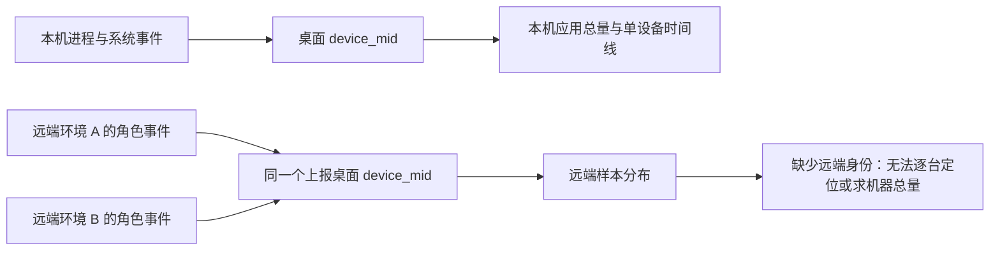

# 全进程资源仪表盘 SQL 复审

日期：2026-09-15。审查对象：`6829792905` 中的 32 张数据面板、1 条版本列表查询和 8 个筛选器。

## 结论

七个分区的组织合理，应该保留。现有查询能展示资源规模、版本分布、角色差异、插件排行和上报情况；但用于版本回归判断、单设备定位和采集故障识别时仍有缺口。

优先修正有效样本数、趋势截断、筛选口径及采集质量查询，再补单设备和慢 Bash 的关联视图。增加面板数量本身不能解决这些问题。

本次为 SQL 与字段契约审查，建议尚未实施。没有依据生产样本评估资源健康、分布稳定性、查询性能或视觉拥挤程度。现有线上配置与查询文件保持已交付版本。

## 方法与证据边界

- 逐条核对 [SQL 查询清单](./process-resource-queries.json) 和 [仪表盘 JSON](./process-resource-dashboard.json)：33 条查询均一致，`query` 与 `tokenQuery` 一致，13 张线图均使用 `classify(time, series, value)`。
- 核对 [埋点 spec](../process-resource-telemetry.md)、shared 属性白名单、main 的角色/系统事件投影与 MCP 聚合实现。
- 使用内存 SQLite 执行原查询的聚合后半段，`base` 使用构造数据；以确定性分位数聚合替代 `approx_percentile`。这些例子验证分组、计数、排序、LIMIT 和 NULL 逻辑，不代表阿里云引擎兼容性验证，也不是线上数据。
- `pnpm typecheck`、`pnpm lint` 通过；本次审查产物只有 Markdown。

## 优先修正的查询与表达

### 1. 样本资格没有落实到每个指标、每个时间桶

位置：`cpu-trend`、`rss-trend`、`role-rss`、`role-background-cpu`、`mcp-rss`、`mcp-cpu` 等群体趋势；`mcp` / `remote-mcp` 的解读列。

- 趋势只返回 `time, series, value`，没有该点的有效设备数。旁边的版本表统计整个时间范围，不能代替每个时间桶的样本量；角色表也不能代替后台窗口的有效样本量。
- MCP 的解读使用 `count(*) < 100`，但后台 CPU 实际参与分位数的是 `count(bgcpu)`。表内虽然列出后台 CPU 有效设备数，仍可能给出相互矛盾的总解读。
- heap 同理：角色总设备数可能很多，但只有少数设备存在有效 heap，不能把总设备数当成 heap 的统计资格。

构造验证：版本全天有 100 个设备，首个桶 CPU 为 1%，第二个桶只有 1 个设备且 CPU 为 50%；版本表显示可比较，趋势却从 1% 到 50%，不含样本量提示。MCP 有 101 个设备、其中只有 1 个后台 CPU 有效设备时，仍输出“可比较分布；非因果结论”。

建议：每个指标输出自己的有效设备数；趋势以 `time × version × role/MCP` 计算有效设备数，随点展示或配套样本量图。少于 100 时保留数值与“样本不足”提示，遵守此前已确认的展示规则。该阈值只是展示门槛，不代表群体构成已经可比。

### 2. 趋势超过 10,000 行会截掉最新数据

位置：所有固定时间桶的趋势查询，尤其 `role-rss`、`mcp-rss`、`mcp-cpu`。

查询使用 `ORDER BY time, series LIMIT 10000`。超过限制时保留最早的点，最新数据被丢弃；某个边界时间桶还可能只剩部分序列。

构造验证：7 天、30 分钟一桶、4 个版本、9 个角色，共 12,096 行。原查询仅返回 10,000 行，最后一个返回时间桶比实际最后一个桶早 29 小时。MCP 数量更多时，24 小时也可能达到上限。

建议：按时间范围调整时间桶；对高基数 MCP 在聚合之前选 Top N，并明确展示入选范围。估算或检测结果规模，超出时提示截断。仅增大 LIMIT 或改为倒序，仍会默默丢掉一部分时间范围。

### 3. 总览计数与资源卡片不是同一群体

位置：`coverage`、`events` 对比 `app-cpu`、`app-rss`。

前两张卡消费三种事件，仅应用环境、原生版本过滤与平台变量；后两张卡只消费系统事件，还应用架构、核数、内存和前后台变量。

因此选择某种硬件后，资源指标会变化，旁边的设备数与事件数可能不变。计数还包含远端或仅有 Bash 事件的上报桌面标识，不能充当本机系统资源指标的分母。

建议：首页的设备数改为当前系统资源群体的有效设备数；三种事件总量放采集质量区，或明确标为“全部新事件覆盖，不随硬件/前后台筛选”。资源卡片在多版本选择时按设备混合平均，应注明“所选版本合计”，避免当成版本对照值。

### 4. 采集质量查询会隐藏它应该帮助发现的问题

位置：`sample-quality`、`event-quality`、`latest-observation` 的 base 条件。

- `sample-quality` 只按 `role, surface` 分组，多个版本默认混在一起，升级后的小群体异常会被旧版本覆盖。
- 只看 sample_count 的 P50/P95 主要反映正常和较完整窗口，缺少低尾、低采样比例。
- 公共 base 先排除空 `device_mid`，所以新事件即使已经到达，只要设备标识全部缺失，质量区仍会输出“暂无新埋点数据”。
- `try_cast` 失败会变为 NULL；质量表没有单列 CPU/RSS 缺失、非法值或越界比例。
- 角色覆盖只有计数，没有同一上报设备、相近窗口内的必需角色覆盖对照。现有字段没有精确窗口 ID，不能直接把缺失认定为故障。

构造验证：旧版本 198 个 main 窗口的 sample_count 为 30，新版本 2 个窗口为 1；当前表只给出合并后的 P50=30、P95=30，新版本异常不可见。

建议：按版本/运行面/角色分组，加入 P05、低样本比例及指标字段有效率。专门的质量 base 保留标识缺失记录，分别显示原始事件数、可用设备数、无标识事件数。完整窗口与退出残窗无法精确区分时，列为排查线索，不直接判故障。

### 5. 缺失资源值会被内存水位表当作未越线

位置：`pressure`。

当前仅要求 `total_memory_gb > 0`，随后用 `CASE WHEN metric / total > threshold THEN 1 ELSE 0 END`。指标缺失或转换失败时会走 ELSE 0，进入“没有越线”的分母。

构造验证：100 个设备均有总内存，其中 1 个设备有资源数据且越线，另 99 个资源指标为 NULL；当前两个比例均为 1%，而有效样本只有 1 个。正常客户端契约本应提供这些值；该反例说明一旦字段链路损坏，仪表盘会低估占比。

建议：CPU、RSS、空闲内存分别维护有效分母；缺失保留 NULL 并在质量区计数。内存水位表要显示每项有效设备数，不能仅按总内存是否存在判断。

### 6. 两处名称或排序与 SQL 的实际含义不一致

- `bash-duration` 按 label 字符串排序，实际顺序为 `15–30s → 1–2min → 2–5min → 30–60s → ≥5min`。应增加数值桶序号排序。
- `mcp` / `remote-mcp` 的“单实例峰值”取自 `rss_kb_max_process_peak`。MCP 来源取各实例中最大单个 OS 进程的 RSS，不是某个 MCP 实例整棵进程树的峰值。应改名“最大单进程峰值”；当前字段不能还原最大单实例树总量。

## 最值得补充的信息

### 单设备排查：补齐应用总量、MCP 与异常入口

当前四条时间线只有非 MCP 的角色 CPU/RSS、整机 CPU、整机空闲内存。`device-rss` 与 `device-cpu` 明确过滤 `role <> 'mcp'`；专用 MCP 区又不接收 device 变量。因此无法在现有看板定位某个设备的 MCP 占用。

同时缺少系统事件中的应用总 CPU/RSS、角色峰值及 heap 时间线。不能把各角色分位数或窗口均值相加代替应用总量；不同角色样本时间与存活覆盖不同。

建议优先补：

1. 在单设备区用系统事件直接展示应用 CPU/RSS，与整机指标对齐。
2. 加入该设备按 mcp_id 的 CPU/RSS；Windows MCP CPU 继续显示不可用。
3. 让设备列表支持按 CPU/RSS 高值排序，显示设备、版本、最近时间、峰值；当前按最后上报取 100 行，很难从群体异常找到异常设备。
4. 需要深入定位时，再提供角色峰值、heap、进程数和 uptime。RSS 总量与最大单进程 heap 不能直接相减推导 native 内存。

### 慢 Bash：补同一事件内的资源组合

当前表独立计算耗时 P95、进程树 RSS P95、CPU 当量 P50、CLI RSS P95、空闲内存 P50。这些值可能来自不同命令，只能描述分布，不能回答“耗时最高的命令是否也吃内存”。

建议保留摘要，补一张有上限的事件明细或联合分桶表：同一行包括事件时间、设备、版本、运行平台、exit_kind、耗时、进程树 RSS、CPU 当量、CLI RSS、系统空闲内存与 sample_count。用耗时排序，或按耗时桶看同组资源分布，不需要命令文本或新增隐私字段。

耗时直方图宜按版本显示比例及各版本命令数；当前选择多个版本会合并，使用原始条数也主要受用户量影响。退出类型表可补同版本慢命令内占比，但 completed 仍不代表退出码为 0。

### 版本与角色：补 CPU 高位及有效分组

当前 CPU 主要使用 `custom.value`，即窗口均值。设备 P95 表示“设备平均负载的高尾”，不表示短时 CPU 尖峰。`cpu_percent_p95`、`cpu_percent_peak` 与 `app_cpu_percent_p95` 已解析但尚未用于展示。

保留均值口径，同时增加明确标注的窗口 CPU 高位或高位窗口比例，才能帮助发现短时后台空转。uptime 表可作为增长线索，不能独立证明泄漏；heap 的有效设备数也需要单列。

### 远端：现有信息边界应继续保留

三个远端面板适合看“上报桌面版本下的远端样本分布”。当前先按上报桌面平均、没有把多台远端资源相加，做法符合现有可见字段。

但 `device_mid` 不是远端机器 ID，app.version 是桌面版本；`background_ratio` 来自桌面应用前后台计数，不代表远端空闲。旧 CLI 缺硬件字段时，上报代码还可能逐字段回落到桌面硬件。SQL 无法可靠推导远端机器身份、远端 Agent 版本或区分回落硬件，应在解释中说明这些边界。

## 32 张面板逐项结论

“修正”表示有确定的口径/展示缺陷；“增强”表示已有价值，但无法充分回答目标问题；“保留”仍需遵守公共统计边界。

| 分区   | 面板 ID             | 结论 | 能提供的信息与主要调整                                                               |
| ------ | ------------------- | ---- | ------------------------------------------------------------------------------------ |
| 总览   | coverage            | 修正 | 新事件覆盖面有价值；不能当成同屏硬件筛选后的系统资源样本数。                         |
| 总览   | events              | 修正 | 上报总量有价值；需明确与硬件/前后台不联动及包含远端/Bash。                           |
| 总览   | app-cpu             | 保留 | 可看所选群体的长期 CPU 水平；多版本合计及有效设备数要明确。                          |
| 总览   | app-rss             | 保留 | 可看所选群体的内存规模；多版本合计及有效设备数要明确。                               |
| 总览   | version-summary     | 保留 | 本期最直接的版本分布对照；分字段有效设备数、硬件与用户群差异仍要考虑。               |
| 总览   | cpu-trend           | 修正 | 可看版本 CPU 随时间变化；补每桶有效数与结果规模控制。                                |
| 总览   | rss-trend           | 修正 | 可看版本内存随时间变化；补每桶有效数与结果规模控制。                                 |
| 总览   | system-cpu          | 保留 | 可看整机负载高位背景；是窗口 P95 均值的设备 P95，不能直接归因于应用。                |
| 总览   | free-memory         | 保留 | P05 可观察低空闲内存尾部；跨内存规格看绝对 MiB 时需筛选硬件。                        |
| 总览   | pressure            | 修正 | 越线设备占比有价值；修复缺失值分母，标明是所选范围内曾经越线。                       |
| 角色   | roles               | 保留 | 能比较角色、进程数量与单进程峰值；补 heap 有效数。                                   |
| 角色   | role-rss            | 修正 | 能定位随版本变化的角色；控制曲线数量、时间桶样本与 LIMIT。                           |
| 角色   | role-background-cpu | 修正 | 能发现持续后台耗 CPU；补后台有效设备数，明确全局选前台时与固定后台条件互斥。         |
| 角色   | uptime              | 保留 | 能提供资源随运行时长变化的线索；不同设备群与最老进程 uptime 不能当作同进程增长曲线。 |
| MCP    | mcp                 | 修正 | 能找内存占用高的插件；改最大单进程名称，拆分 RSS/后台 CPU 资格。                     |
| MCP    | mcp-rss             | 修正 | 能看插件内存变化；先筛 Top N，并补每桶有效数。                                       |
| MCP    | mcp-cpu             | 修正 | 能找桌面后台时仍耗 CPU 的插件；补后台有效数、Top N 与时间规模控制。                  |
| Bash   | bash                | 增强 | 能看慢命令分布；加入同一命令的资源组合以支持排查。                                   |
| Bash   | bash-exits          | 保留 | 能看 completed/timeout/killed/error 的构成；补同版本内比例更利于比较。               |
| Bash   | bash-duration       | 修正 | 能看慢命令耗时分布；修正桶排序，支持按版本比例比较。                                 |
| 远端   | remote-roles        | 保留 | 能看远端角色样本分布；不能当成远端机器分布或远端 CLI 版本回归。                      |
| 远端   | remote-mcp          | 修正 | 有远端插件排行价值；继承 MCP 资格/名称问题及远端身份限制。                           |
| 远端   | remote-bash         | 增强 | 有远端慢命令摘要价值；同样需要事件内关联，遵守硬件字段限制。                         |
| 单设备 | device-rss          | 增强 | 可看非 MCP 角色 RSS 均值；补 MCP、应用总量及峰值。                                   |
| 单设备 | device-cpu          | 增强 | 可看非 MCP 角色 CPU 均值；补 MCP、应用总量与窗口高位。                               |
| 单设备 | device-system       | 保留 | 可提供整机 CPU 上下文；与应用总量对照才更有价值。                                    |
| 单设备 | device-free         | 保留 | 可提供系统空闲内存下沿；需要与应用 RSS 对照。                                        |
| 单设备 | device-list         | 增强 | 可复制最近 100 个标识；改为可按资源高值找设备，形成排查入口。                        |
| 质量   | event-quality       | 修正 | 能看新事件及版本新鲜度；保留无标识事件，明确其筛选范围。                             |
| 质量   | sample-quality      | 修正 | 有样本数/heap 覆盖信息；补版本维度、低尾与无效字段统计。                             |
| 质量   | self-cost           | 保留 | 可看 main 窗口内采样聚合墙钟开销；不是全套探针成本，残窗与完整窗不可等同。           |
| 质量   | latest-observation  | 修正 | 可提供无数据/仅验收/有样本状态；不要把没有可用设备标识写成没有事件。                 |

## 筛选器与公共限制

- env 单选默认 prod、版本原生多选、平台筛选的方向正确；版本列表只返回有新事件的版本，符合已确认范围。
- 核数和内存为静态候选值，缺少 14 核、18/36 GB 等可能存在的配置。建议改为从窗口事件动态读取，避免无法选中实际机型。
- 背景专用图固定 `background_ratio >= 0.9`，全局 scene 选择 foreground/mixed 时必然无结果；应明确提示筛选条件互斥，或让专用图显式不受该变量影响。
- 设备输入只影响四条单设备时间线、设备列表独立的设计有依据；新增单设备 MCP/Bash 视图也必须显式接入同一 device 变量。
- 当前所有 `avg(window_mean)` 是窗口等权，完整窗与退出残窗权重相同，符合已交付的“窗口均值平均”实现，但不等于在线时长加权平均。若今后要回答“在线期间平均消耗”，可对 CPU/RSS 使用适用的 sample_count 权重；heap 没有独立样本数，不能盲目套用。
- `spanNulls=false` 仅控制显式 NULL。SQL 未生成缺失时间桶，单条序列的缺口是否断线需后续渲染验证；不能仅凭该配置保证整个缺失时段不会被连线。
- 无告警和无自动红绿评级的既定范围继续适用。分组样本达到 100 也不消除硬件、使用行为和版本人群差异。

## 推荐实施顺序

1. 修正有效样本数/资格、趋势结果截断、计数筛选口径、质量查询、NULL 分母和确定的标题/桶排序问题。
2. 补单设备应用总量与 MCP、资源高值设备入口、慢 Bash 事件内关联；保留七个分区，优先复用/调整现有面板。
3. 数据到达后校准 Top N、时间桶、低采样阈值及实际视觉密度；再验证多版本、Windows、MCP 和真实远端样本。
