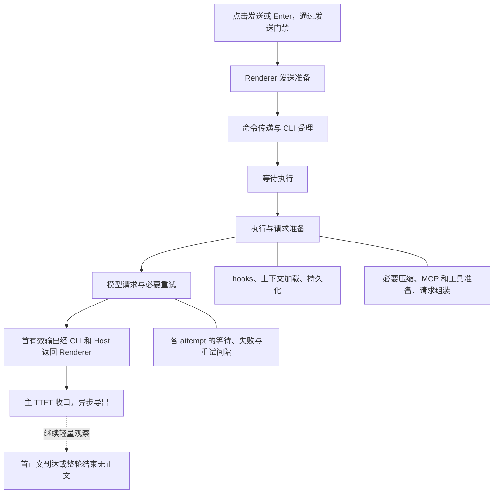

# 桌面本地消息 TTFT 分阶段遥测

Status: ready-for-agent

Issue-Tracker: local-markdown

## Problem Statement

用户需要深入分析从点击发送一条消息到客户端收到第一个有效输出之间，经过了哪些链路阶段、每个阶段花了多久，并通过各阶段的 P50、P95 和单条慢消息瀑布图定位瓶颈。

当前整体 TTFT 分散在业务事件和 ARMS RUM 中；发送漏斗记录 ACK 和用户消息显示耗时；CLI OpenTelemetry 记录模型请求 attempt 的首事件、首内容和首文本耗时。这些记录的起止点、采样与适用范围不同，没有构成一条完整、可核对的点击到首输出链路。

尤其是 CLI 受理前等待、执行队列、hooks、上下文准备、压缩以及首内容返回客户端，尚不能作为同一条消息的连续阶段统一统计。现有模型 first_content 还可能接受内容块开始事件，不能直接等同于非空可展示输出。直接相减不同指标的 P95，无法还原某个阶段的 P95。

## Solution

为桌面本地工作区新增专用 TTFT 遥测，复用已有 OpenTelemetry/OTLP 导出能力及 ARMS 接入，提供两种互相关联的观察方式：

- 阶段 Metric：查看每个阶段的样本数量、耗时分布、P50 和 P95，并按受控维度筛选和比较。
- 消息 Trace：使用稳定关联 ID 查看单条发送的阶段树、重试、等待、结果和瀑布图，解释具体慢样本。

主 TTFT 从点击发送或 Enter 提交并通过发送门禁时开始，到发起发送的 Renderer 沿实际内容链路收到第一份非空、可展示的正文、思考或工具调用时结束。空事件、心跳和状态通知不构成首输出，不把 telemetry 旁路通知或 React 上屏时刻作为终点。另行观察点击到首正文的耗时。



图表示需要观测的主要边界；准备和重试可能交错，子操作也可能并行。实现必须按真实时间线记录，不能强行把实际并发或重复操作改成图中的单次串行执行。

## User Stories

1. As a 性能分析人员, I want 查看点击到首有效输出的总耗时, so that 我能判断用户实际等待了多久。
2. As a 性能分析人员, I want 查看各主阶段的 P50 和 P95, so that 我能识别普遍瓶颈和长尾瓶颈。
3. As a 性能分析人员, I want 同时查看各分位数的样本数, so that 我不会把小样本波动误判为退化。
4. As a 性能分析人员, I want 按阶段、模型和 provider 筛选, so that 我能区分本地处理与模型请求相关问题。
5. As a 性能分析人员, I want 按应用版本和操作系统比较, so that 我能定位发布回归及平台差异。
6. As a 性能分析人员, I want 分开查看空闲发送和排队发送, so that 正常业务排队不会掩盖实际处理速度。
7. As a 性能分析人员, I want 同时查看含排队的总 TTFT 和开始执行后的耗时, so that 我能分别评价用户等待和执行效率。
8. As a 性能分析人员, I want 将队列确认弹窗中的用户等待单独标记, so that 我不会把用户停留误判为系统处理耗时。
9. As a 性能分析人员, I want 将立即引导输入与可独立归因的普通发送分开, so that 运行中已有输出不会被归因给错误的消息。
10. As a 故障排查人员, I want 用一次发送的关联 ID 找到瀑布图, so that 我能解释一条具体慢消息。
11. As a 故障排查人员, I want 查看 Renderer 的发送准备耗时, so that 我能发现发送前的本地处理延迟。
12. As a 故障排查人员, I want 查看命令传递、CLI 受理及受理前等待, so that 我能定位通信和 admission 竞争。
13. As a 故障排查人员, I want 查看消息等待开始执行的时间, so that 我能区分队列等待与执行准备。
14. As a 故障排查人员, I want 展开 hooks、上下文加载和持久化, so that 我能定位具体的请求前准备瓶颈。
15. As a 故障排查人员, I want 识别首输出之前的上下文压缩, so that 压缩耗时不会被误算成主模型首响应。
16. As a 故障排查人员, I want 查看 MCP、工具准备和请求组装, so that 我能分析扩展初始化对首响应的影响。
17. As a 故障排查人员, I want 查看每次模型 attempt 及其重试等待, so that 我能区分一次慢请求与多次失败累积。
18. As a 故障排查人员, I want 查看首有效输出从 CLI 返回 Renderer 的耗时, so that 我能发现回传链路瓶颈。
19. As a 故障排查人员, I want 看到并行、缺失及未归因区间, so that 瀑布图不会用虚构的阶段填满总耗时。
20. As a 性能分析人员, I want 区分首输出为正文、思考或工具调用, so that 不同输出方式的体验可以正确比较。
21. As a 性能分析人员, I want 另行查看点击到首正文的耗时, so that 我能区分开始有反馈与开始文字回答。
22. As a 性能分析人员, I want 首输出一到达就完成主记录, so that 我不必等整轮任务结束才观察首响应。
23. As a 性能分析人员, I want 查看首输出前失败和取消的数量、比例及已等待时长, so that 最差体验不会从统计中消失。
24. As a 故障排查人员, I want 查到发送开始及已完成阶段的检查点, so that 进程异常退出后仍可能保留排查线索。
25. As a 性能分析人员, I want 区分未收口、明确中断和明确失败, so that 缺少结束记录不会被错误地解释为超时。
26. As a 性能分析人员, I want 前后台都继续采集并保留状态变化, so that 慢消息不会因为切换会话而丢失。
27. As a 性能分析人员, I want 默认查看持续前台样本并识别休眠或暂停, so that 后台调度不会污染正常前台体验统计。
28. As a 性能分析人员, I want 对灰度启用人群不主动抽样 TTFT 明细, so that 慢样本不会因独立的 Trace 抽样而不可查。
29. As a 运维人员, I want 在 ARMS 中复用既有接入并获得专用查询和看板配置, so that 无需另建一套诊断产品。
30. As a 运维人员, I want 控制灰度、事件量、标签基数与保留期, so that 可观测成本可以在扩大覆盖前验证。
31. As a 用户, I want 遥测网络失败或队列满时不影响发送和接收, so that 诊断功能不会降低正常使用体验。
32. As a 用户, I want 遥测只包含耗时、状态和必要关联信息, so that 消息正文、文件内容和凭据不会进入该链路。
33. As a 测试人员, I want 注入已知阶段延迟并检查最终导出的数据, so that 我能证明阶段归因与真实执行一致。
34. As a 测试人员, I want 验证乱序、重复、早于 ACK 的输出及多会话并发, so that 记录不会错绑或重复计数。
35. As a 维护人员, I want 新埋点不改变既有业务事件和 RUM 口径, so that 历史看板和其他客户端保持兼容。

## Implementation Decisions

### 覆盖与兼容边界

- 第一版只为桌面本地工作区的用户发送建立 TTFT 记录。桌面远程工作区、手机和 Web 远控不纳入首版采集；其现有行为必须保持兼容。
- 桌面保持 desktop-continuous 的实际内容链路，不引入手机 replayable 的 snapshot、gap 或恢复语义。历史 hydration、回放和后台自动任务不得伪造本地用户点击记录。
- 预留客户端类型、执行环境及阶段来源的扩展位置，不提前实现跨机器测时、远程连接或移动端重连归因。
- 保留现有业务 completion、RUM TTFT 与发送漏斗事件；新模型不改变旧口径、采样和计数，不要求将全部新阶段双发到业务接口或 RUM。

### 模块职责和接口

- Composer 在真实提交门禁通过后建立一次发送的观测上下文；队列二次确认复用同一次发送，不重置起点。
- Renderer 的专用观测生命周期负责点击总时钟、客户端前后台状态、实际首内容接收、主记录收口及首正文补充观察。
- CLI 在既有 admission、排队、执行准备和模型调用边界记录权威阶段事实。Host 保留调度和传输职责，不引入第二份 accepted input queue，也不成为业务生命周期的第二数据源。
- 若需要将 CLI 阶段事实和观测上下文跨进程传递，通过共享协议的严格类型、运行时 schema 和受控桥接完成；保持旧调用兼容。Main 仅负责受控遥测导出调度，不承载 task、queue 或模型业务状态。
- 复用现有服务接口、平台注入及 OTLP 导出设施。Renderer 不直接访问 Repo 或 CLI 实现，不把导出网络调用放入发送或输出的阻塞路径。
- workspaceIdentity 仍表达身份隔离，workspacePath 表达文件执行路径；本地继续允许路径 fallback，不另造本地工作区身份格式。遥测隔离必须覆盖工作区、会话和进程实例，且不导出原始工作区路径。

### 关联、首输出及生命周期

- 一次发送有稳定观测关联 ID，在发送前准备阶段即可建立，并关联 commandId、inputId、queryId、turnId、逻辑模型调用 ID 和各物理 attempt 的 requestId。
- V4 中 inputId、queryId 与原发送 commandId 的既有关系用于关联。队列编辑或 send-now 操作命令不能替换原输入归因。requestId 随重试变化，不能作为整次发送的主键。
- 观测上下文及启用决策在进程间一致传播，不能让 Renderer 与 CLI 独立随机采样而产生碎片。新的 TTFT 记录与已有 Agent Trace 可关联，但不依赖已有 10% Trace 抽样获得完整性，也不改变旧业务 Trace 的父子归属。
- 首输出只接受沿实际会话内容路径到达发起 Renderer 的非空可展示正文、思考或工具调用。仅有 text_start、reasoning_start、tool_input_start、空 block、状态、心跳或旁路通知均不足以判定。记录 first_output_kind。
- 不把此前运行轮次、其他会话、其他输入或子任务旁路进展抢先归为本条消息；输出归属必须使用真实输入和执行因果关系验证。无法唯一归因的输入保留明确标记，不伪造独立 TTFT。
- ACK 不代表开始执行或开始请求；首输出也可能早于 ACK。关联、去重与收口必须接受合法乱序，不能使用固定等待时间来同步业务状态。
- 主 TTFT 收口后继续轻量观察首正文，首正文晚到时另行产生补充指标；整轮结束仍无正文则标记无正文。主记录已成功收口后，后续错误不得反转其首输出结果。
- 发送开始和已完成阶段生成异步检查点，不只依赖最终根 Span 结束才导出。不得在首输出后补造尚未完成的准备步骤或重试阶段。

### 阶段与时间合同

| 主阶段              | 需要解释的边界                               | 可展开的观察                                                                     |
| ------------------- | -------------------------------------------- | -------------------------------------------------------------------------------- |
| Renderer 发送准备   | 提交起点到命令向 Host 分发                   | 真实发生的本地准备；用户二次确认等待另标                                         |
| 命令传递与 CLI 受理 | 分发到 CLI 权威受理                          | Host 转发、CLI 收到、admission gate 等待、必要受理持久化；ACK 返回另记为往返观察 |
| 等待执行            | 受理后到该输入开始执行                       | 空闲或排队类型、队列等待；不与 ACK 往返重复累计                                  |
| 执行与请求准备      | 开始执行到主响应模型请求，并保留实际重复区间 | hooks、上下文加载、持久化、必要压缩、MCP/工具准备和请求组装                      |
| 模型请求与重试      | 请求准备后到 CLI 形成该输入的首有效输出      | 各 attempt 的失败或输出、重试间隔；内部压缩模型请求与主响应请求分开归因          |
| 首输出回传          | CLI 产生首有效输出到 Renderer 实际接收       | 真实协议内容经过的发送、Host 转发和客户端接收边界                                |

- 主阶段按真实路径尽可能划分为连续且互不重叠的时间区间；边界必须在实现前和实际挂点核对。允许阶段缺省、重复和子阶段并行，不把未执行的阶段填成零耗时。
- CLI 收到命令和获得 admission gate 后受理是不同边界；不能仅使用 admittedAt 代替全部受理阶段。
- CLI 受理后的执行可与 ACK 返回并行。发送到 ACK、用户消息呈现等累计观察不作为可直接相加的串行主阶段。
- 端到端 TTFT 使用发起 Renderer 的同一时钟。各进程内部使用单调时钟记录 duration；跨进程时间对齐需有实测误差界限，不能直接混用不同进程的单调时钟或未经校验的墙钟。
- 第一版精度目标是可靠区分几十毫秒、几百毫秒和数秒的慢点，不承诺亚毫秒测量。短阶段采用专门的毫秒级分桶，不能沿用最小 250ms 的旧 TTFT 分桶。
- 对齐误差超界、负区间、休眠或时钟异常显式记录质量状态。不用钳零掩盖错误，不将不可靠跨进程样本混入精确阶段分布；同进程仍可靠的观察可以独立保留。
- 明细保留阶段 interval、duration、因果关联与缺失信息。可解释区间的并集与总时长核对，重叠不重复累计，差额展示为未归因或缺失，不强行塞给模型或网络。
- 模型服务内部排队和推理、DNS/TLS/网络 TTFB 不在缺乏对应事实时细分；SDK 首事件不能冒充网络首字节。

### 统计、结果和查询

- 一次独立发送是主 TTFT 统计单位。模型 attempt 和准备子阶段有各自统计单位，查询必须标明，避免将后续工具循环请求混入用户首次响应统计。
- 空闲发送与排队发送分组；同时给出点击起算总 TTFT、开始执行后到首输出的耗时及队列等待。立即引导输入只进入发送结果或独立分类，不进入普通 TTFT 分位数。
- 首输出前失败、拒绝、取消等明确结果记录已等待时长和已有阶段，并单独统计数量、比例；无首输出样本不得以 0 或 -1 进入成功 TTFT 分布。
- 仅有开始或阶段检查点的记录展示为未收口，可能仍在运行或已中断。缺少终态、超过某个查询时间窗口都不足以判定失败；有明确退出或中断证据才给出对应结果。
- 前后台都继续采集。保存发送时、接收时及期间必要状态变化，才能判断持续前台；仅比较起止状态不足以排除中途切后台。默认体验看板筛选持续前台且计时可靠的样本，诊断看板可查看全部。
- 支持按阶段、模型/provider、应用版本、操作系统、空闲/排队及前后台状态筛选和分组。采用受控标签和预定义常用组合，不构造全部维度的笛卡尔积；高基数消息、Trace、工作区和用户关联信息不进入 Metric labels。
- 同一份阶段事实生成 Metric 与 Trace，明确 schema version、应用及 CLI 版本。统计使用有效阶段原始样本或其 Histogram，显示样本数及分桶精度；不相加 P95，也不使用总 P95 减去模型 P95 推导其他阶段。
- ARMS 交付物包括总 TTFT、各主阶段和准备子阶段 P50/P95、样本数、结果比例、未收口与数据质量视图，以及通过关联 ID 打开的单消息阶段瀑布图或关联查询。实际平台的查询、跳转和瀑布展示能力必须验证，不能仅以本地 Span 已生成视为交付完成。

### 导出、灰度与存储

- 新 TTFT 使用专用 OTel Metric 和 Trace 数据模型，复用已有 OTLP 导出器、配置注入及批量上报机制。ARMS RUM 自定义事件与业务 event/report 都不是这套新阶段数据的主要存储路径。
- 第一阶段只对灰度启用人群全量采集有界的 TTFT 明细及统计，不继承旧 Renderer 的独立随机抽样或旧 CLI 的 10% head sampling。主链路覆盖只延伸到首输出，首正文为轻量补充；不扩张为整轮所有业务 Span 的全量采集。
- 开始及阶段检查点应能在主记录收口前独立被异步提交。先到终态、后到阶段或重复传输时，以稳定记录身份和阶段身份合并，不能重复计数；检查点不要求为每个 token 或每个循环迭代发事件。
- 首输出到达立即完成主记录并交给异步 exporter，不要求逐条同步发送网络请求。健康运行下明细以秒到几十秒级可查为目标，聚合指标允许约 5 分钟更新。
- 队列、阶段记录数量和内存都设边界，导出失败、积压或满队列不能回压发送和输出。发生丢弃或截断时保留可观测的数据质量信号，不能宣称已实现 exactly-once 网络交付或强杀零丢失。
- 明细保留 7 天、聚合指标至少 30 天为需求目标；上线前核对 ARMS 实际接入、权限、容量、保留配置和费用。已有配置满足目标时沿用，未核验事项必须标注为待上线验证。
- 遥测仅记录耗时、受控阶段名、结果、版本及必要关联信息；不采 prompt、回复正文、文件内容、原始路径、凭据或请求 Header/Body。复用项目现有隐私和鉴权约束，不假定当前存在统一控制全部 exporter 的隐私总开关。

## Testing Decisions

### 主要测试边界

以“真实桌面 Composer 发送输入，到最终 OTLP 接收端解码出的 Trace 和 Metric”为最高测试边界。真实经过 Renderer、窗口 Host、CLI 和会话内容回传，使用可控模型回放及本地测试 OTLP 接收器，检查外部可观察的时间线和最终导出合同，而不是断言某个私有函数被调用了几次。

优先复用已有 conversation-session E2E、遥测最终出口捕获的测试组织方式，以及现有 OTel HTTP 接收器的 gzip/protobuf 解码和 Trace/Metric 断言。现有 RUM/event-report 捕获器不能直接充当新 OTLP 通道的验收；如需新增测试能力，应在最终 OTLP 导出边界提供一个可复用接收器，而不是在每一层新增测试专用业务接口。

底层只补充真实 E2E 难以稳定制造的时钟、乱序、去重、统计与协议边界测试。沿用既有 telemetry runtime、model-api recorder、supervisor 和 composer send-funnel 测试的注入模式，不为实现细节建立重复测试层。

### 验收场景

| 场景                             | 应观察到的外部结果                                                               |
| -------------------------------- | -------------------------------------------------------------------------------- |
| 普通正文首发                     | 一个发送关联、一份主 TTFT、正确阶段和首正文；无需等待整轮 terminal               |
| 思考或工具先到                   | 正确 first_output_kind；主 TTFT 先收口，首正文后来单独补充；空 start 事件不触发  |
| 指定阶段注入已知延迟             | 该阶段时长及总 TTFT 按真实顺序变化，其他阶段不吸收该延迟；偏差在已验证误差范围内 |
| CLI admission 竞争               | 收到命令到权威受理的等待可见，不能隐藏在业务队列或模型耗时中                     |
| 排队、转正与二次确认             | 原发送关联持续保留；含排队和执行后耗时可区分；用户确认等待单独标记               |
| 立即引导                         | 不抢占前一输入的输出，不混入普通 TTFT 分位数                                     |
| hooks、压缩和 MCP 准备           | 真正发生的准备子阶段可见；压缩的内部模型调用不冒充主响应模型请求                 |
| 重试后首输出                     | 多个 attempt 和等待关联同一次发送；主 TTFT 不因 attempt 数重复计数               |
| 首输出早于 ACK、阶段乱序或重复   | 主关联和收口正确，晚到合法阶段能合并，无重复 Metric 或重复消息 Trace             |
| 多会话、多窗口或工作区           | 消息、运行实例和观测上下文不串线；旧轮次与子任务旁路输出不抢占首响应             |
| 首输出前失败或取消               | 结果计数和已等待时长正确，无虚构成功 TTFT 或零值污染                             |
| 首输出后失败、无正文结束         | 主 TTFT 保持成功首输出事实；首正文状态独立正确                                   |
| 进程退出、强杀或缺失终态         | 已导出的检查点可查；无结束证据时保持未收口，不伪造超时或剩余阶段                 |
| 切后台再返回、机器暂停或时钟异常 | 持续前台判断准确；异常质量样本可筛除，不制造负耗时或强制钳零                     |
| 并行、重复准备和缺失阶段         | 瀑布图呈现真实 interval；并集对账，不重复相加，不将缺口硬归因                    |
| 灰度关闭、启用及关联采样         | 关闭时无新采集；启用人群全链路一致，旧 Trace 10% 采样不制造 TTFT 缺段            |
| exporter 超时、拒绝、满队列      | 发送和输出继续；内存/队列有界，丢弃可观察，正常收口不依赖导出成功                |
| 最终数据合同                     | 严格 schema、单位、版本、低基数标签和脱敏规则正确，Trace/Metric 可按定义对账     |
| 旧通道和排除场景                 | 旧业务/RUM 计数不变；远程、手机、回放和自动任务不生成本地用户 TTFT               |

实现时必须先写适当的测试再写代码；交互链路必须有 E2E。完成类型检查、lint、架构门禁和相关测试，保持 E2E 用例与实现一致。核心验证覆盖 macOS、Windows、Linux，无法完成的平台验证如实列出，不以 mock 成功冒充真机完成。

发布前另做一次真实桌面运行取证，将用户提交、实际内容接收、阶段记录和最终导出结果对齐；并测量采集带来的消息延迟、主线程负担、内存和事件量。ARMS 环境需验证分位数查询、记录关联、瀑布展示及数据可见时延。平台侧验收和本地测试的完成状态分别记录。

## Out of Scope

- 桌面远程工作区、手机/Web 远控的 TTFT 采集及跨机器时钟同步实现。
- 为手机新建独立 Host 或 Agent，或改动 continuous/replayable 的业务交付语义。
- 模型服务内部排队、推理的服务端阶段追踪，以及无事实支撑的 DNS/TLS/网络首字节拆分。
- React commit、浏览器 paint、首输出真正上屏的性能指标。
- 立即引导输入的独立普通 TTFT 归因；自动化、闲时任务、后台子任务等非用户点击入口的新增测量。
- 整轮所有 token、模型调用和工具执行的全量追踪；首输出之后仅补充首正文观察。
- 在 ZCode 产品内新建诊断页面，或迁移替换现有业务/RUM 埋点。
- 亚毫秒计时精度、遥测强杀零丢失、未经容量验证的全用户全量上线。

## Further Notes

- 需求和上述范围由本次讨论确认；本文是待实现 spec，不代表埋点、E2E、ARMS 查询或存储配置已经落地。
- 交付顺序为 spec 与协议/阶段合同、测试、实现、真实运行验证、ARMS 验收、灰度容量评估。实现前核对现有遥测规范；新增专用合同不得悄然改写旧 ui_action 或 Agent Trace 规范中的边界。
- 实现评审必须明确记录阶段挂点、时钟对齐方案及误差界限、阶段容量与截断策略、Metric 分桶和标签组合。这些是受本 spec 约束的工程细化项，不应回退为重新访谈已确认的产品范围。
- 保留期、ARMS 权限和容量仍属待核验的部署条件；不能把文档中存在接入示例当成线上已经配置的证据。

## Ticket 01 实现合同（2026-09-14）

Renderer 是一次发送观测的唯一 owner；CLI 只记录有界、无正文的阶段事实，通过实际 continuous 内容帧携带。Main 只验证、批量导出已完成的事实，不保存业务状态。命令的可选 `ttft` 上下文冻结启用决策和关联 ID；旧调用缺省关闭。不会改变 Agent Trace 的上下文或采样。

```text
Composer gate → Renderer prepare → command dispatch → CLI received → admitted
                                                            → execution → request → content
Renderer actual continuous content receipt ← Host passthrough ← content frame + timing facts
  └→ bounded async OTLP export; continue observing first text
```

测试 seam 沿用本 spec 的 Testing Decisions：真实 Composer 到最终 OTLP；仅协议、时钟和重复边界补单测。评审基点为开工 HEAD `5cc3713d3a35a404157b0ac513fba30cce18b08c`。

CLI 与 Renderer 使用 `performance.timeOrigin + performance.now()` 表达单调 epoch；命令查询返回进程实例和采样时钟，用 Renderer 往返区间给出 offset 和最大误差，最多 10ms、有效期 60 秒。校准不等待用户发送；传输握手、CLI 检查点和实际内容帧到达时若校准已过期都会重新探测。无可信校准时保留总 TTFT 和同进程 interval，跨进程阶段不进入成功分布，质量记为 missing 而非 clock_invalid。每个 interval 检查顺序和质量，不钳零。

灰度配置独立 `localTtftEnabled`，缺省 false；本机验证可显式设置 `ZCODE_LOCAL_TTFT_ENABLED=1`。配置由 Desktop 注入 Renderer，同一次发送携带至 CLI，不独立随机采样。Renderer 最多 128 个在途观测，CLI 分别保留最多 128 个活跃事实和 128 个末态事实、每个最多 6 个主阶段，5 分钟过期明确记为 expired 而非 failed；每批最多 32 条，出口最多 32 批，网络超时 3 秒。毫秒 Histogram 边界为 1、5、10、20、50、100、200、500、1000、2000、5000、10000、30000、60000、300000。

Ticket 01 只支持本地持续前台空闲发送无重试。排队/引导、重试、取消、失败、后台、恢复、关联缺失分别标记，不伪装完整样本。ARMS 平台查询验收单独记录；本地 OTLP 通过不能将平台验收勾选完成。

协议兼容：只有 `commands/query` 请求显式携带 `clock:true` 才附带校准响应；旧查询响应、旧 conversation telemetry fact 形状和计数保持不变。CLI 源事件的 executionStartedAt 在 hooks/持久化之前捕获，仅新 TTFT observer 消费。Metrics signal 的独立 endpoint/header 与 Trace 一样私有捕获并从 tool env 剔除。

实现与验证入口：[查询合同](local-ttft-queries.md)、[出口证据](local-ttft-evidence.json)。ARMS 本次新样本平台验收与 CLI 全量未通过项见 Ticket 01，不能据本地成功标为整个需求完成。

校准的 `clock:true` 请求只接受 null session 探测 key，不查命令账本或 admission gate，也不抢占 Host 的 command query workspace 绑定；普通命令查询继续执行原有工作区隔离校验。

### Ticket 02 实施补充

细分合同、统计单位、窗口、时钟质量和灰度资源边界统一见 [查询与诊断合同](local-ttft-queries.md#ticket-02排队准备重试和未收口)。保持原 accepted input 的关联与 CommandInbox owner，Core 通过可选 `observeLocalTurnPreparation` 合同观察真实准备区间；没有观察订阅时不启动准备计时。新增 V4 `localTtftFacts` 检查点走既有 stdio/service，不参与业务投影或首输出判断。`initial` 初始快照仅忽略；`recovery` 明确排除，不能把手机恢复语义带入桌面。桌面 continuous 因订阅缓冲溢出或投影重建产生的 online snapshot 同样无法唯一归因首输出，按独立结果 `resync` 排除，不记为 `recovery`。

根首输出结果只收口一次，后到阶段重新计算阶段质量；已输出 Metric 不回写、不重复。整个观察内事件使用稳定 identity，有界出口去重按 observation 整组保留。实际内容帧可以携带多个原输入的事实，以覆盖同一批里旧轮输出与队列转正并存。CLI明确退出按 workspace 收口 interrupted，未收到退出/terminal 的记录仍是 unclosed。实现和平台验收各自记录于 [Ticket 02](../issues/ttft-stage-telemetry/02-queued-retry-and-failure-diagnostics.md)。
