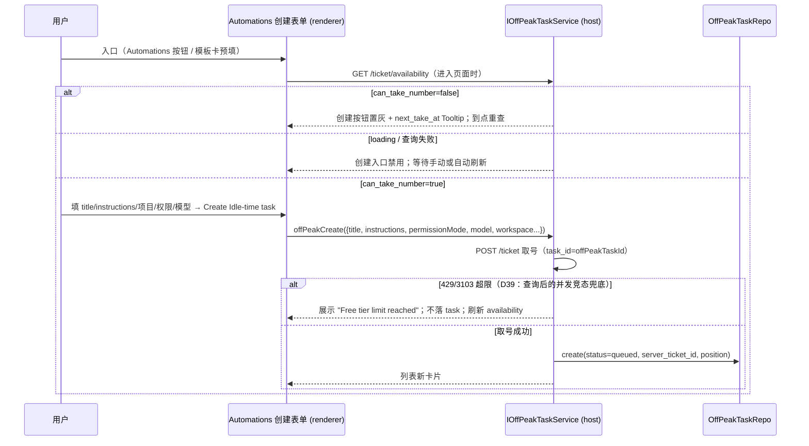
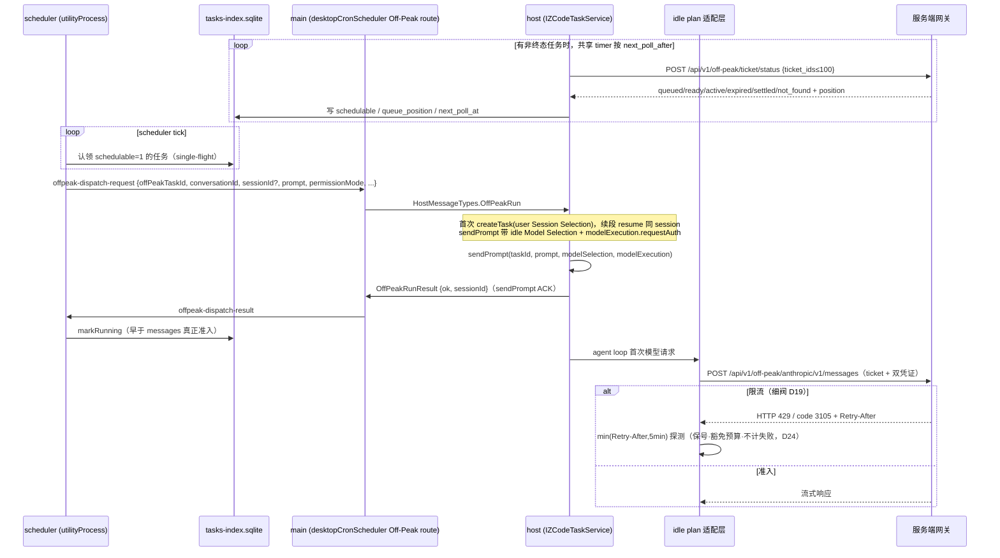
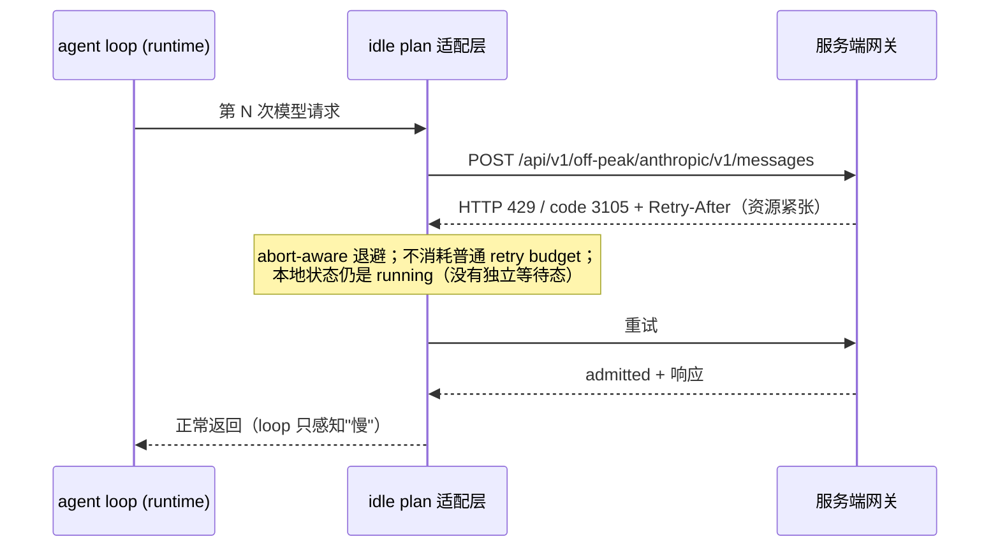
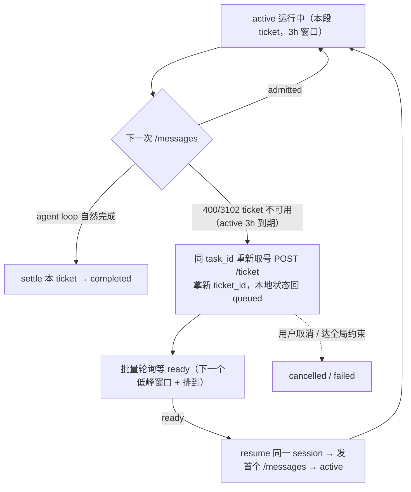
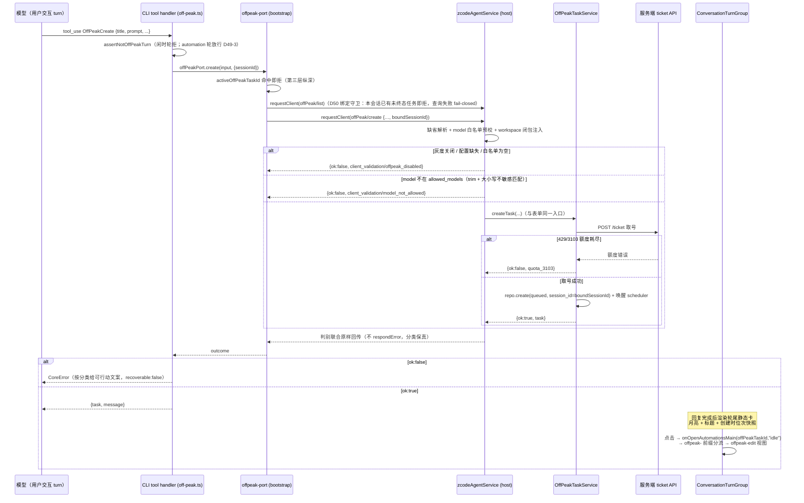
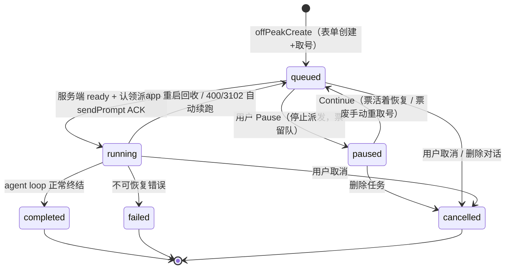
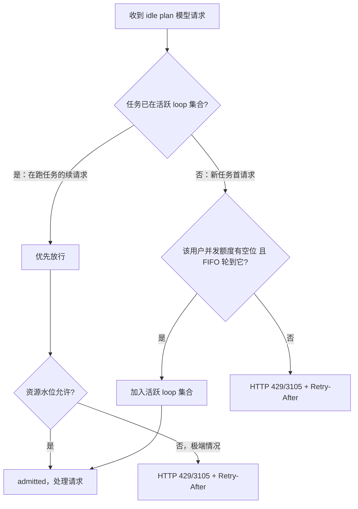
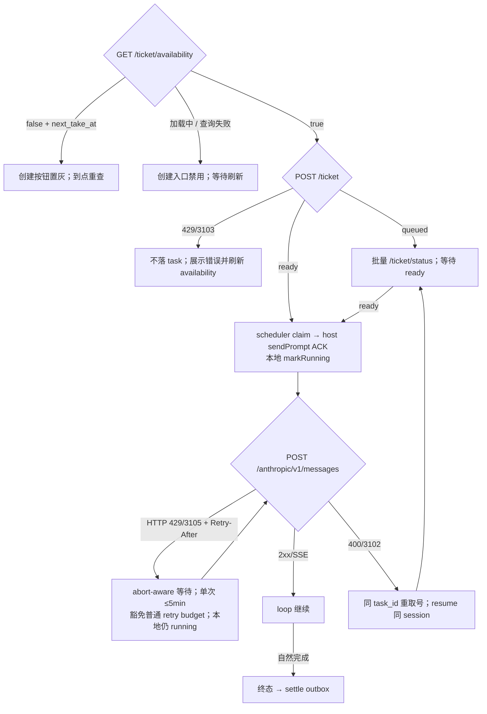
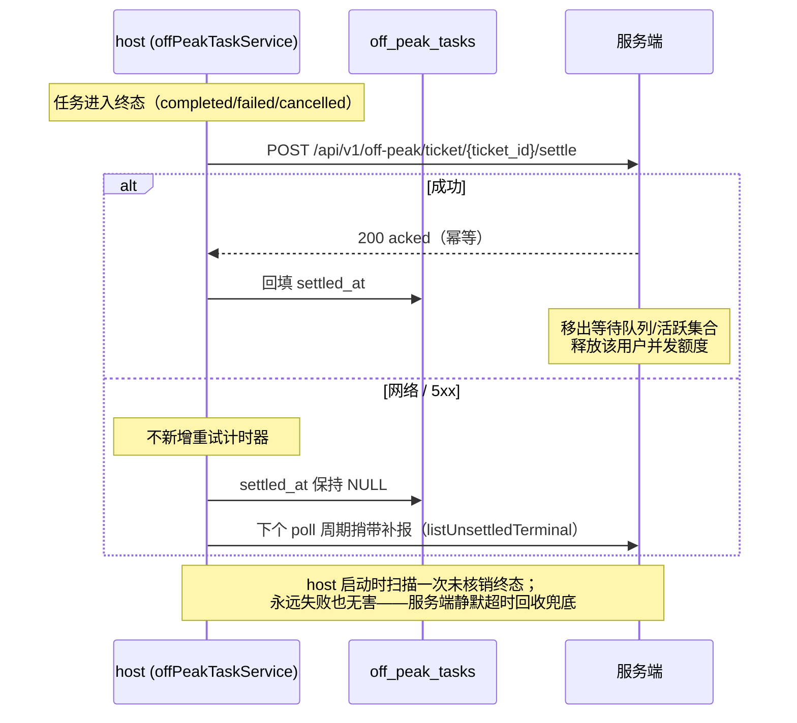

# 闲时任务（Off-Peak Task）技术设计

> **状态：已实现；2026-08-24 已同步 Provider Refactor M4 执行事实。** 当前仓库已包含 `offPeak`
> 领域类型、SQLite Repo、Service、scheduler/main/host 派发、标准 Provider/Model 执行链、UI 和 mock。
> Scheduled Automation 仍是独立领域，边界见 [Scheduled Tasks Main View](../ui/scheduled-tasks-main-view.md)。
>
> **2026-08-24 Provider Config / Model Execution 收口：** `client/configs.offPeak` 只控制曝光；隐藏的
> Built-in `builtin:offpeak-idle-plan` 提供 Provider 静态事实，Effective Model Config 提供模型静态事实。
> 自动回合提交标准 Model Selection，`modelExecution` 只携带本次 Request Auth 与 Child 策略；旧
> `turnRuntimeModel`、临时 Registry overlay 和 Session model restore 链已经删除。

> 配套文档：`spec.md`（当前产品口径）、`decisions.md`（D1–D44 历史决策记录）、
> `glossary.md`（当前术语）、`implementation-notes.md`（代码地图）。决策记录中的早期方案必须按
> 后续 superseded 标记阅读；当前行为以代码、本文和实现说明为准。

## 0. 导读与关键决策

**一句话定义**：闲时任务 = Automations 体系下的一次性后台任务（D28）——用户在 Automations 表单创建（title/instructions/项目/权限/模型），提交即取号排队，服务端在算力空闲时按全局 FIFO 准入并控制并发，派发时新建 session 在用户本机无人值守执行、走不可见的 idle plan provider，跑到终态后通知用户。

**等待策略（核心就是靠 Retry-After）：客户端从不长时间定时等待——每次排队应答按 `min(服务端 Retry-After, 5 分钟)` 钳制单次等待，靠无限次幂等探测覆盖任意长的资源缺口（3 小时的等待 = ~36 次五分钟探测），资源提前空出即被下一次探测捕获；排队探测豁免重试预算、永不计入失败（D19/D24）。**

> 完整 D1–D44（含每条的备选与否决理由）见 `decisions.md`。以下是决定最终架构形状的条目：

| 决策                                      | 一句话                                                                                                                                                                                                          |
| ----------------------------------------- | --------------------------------------------------------------------------------------------------------------------------------------------------------------------------------------------------------------- |
| **任务本质**（D28，取代 D5/D23）          | Automations 体系下的**一次性后台任务**：表单创建、列表管理、派发时新建 session；UI 一切以 Figma 定稿为准，composer 月亮开关/锁定范式作废                                                                        |
| **排队与并发归服务端**（D18/D20）         | 全局 FIFO、每用户并发额度全在服务端；客户端不承载任何调度策略                                                                                                                                                   |
| **任务生命周期五接口**（D39）             | availability → 取号 `POST /ticket`(→ticket_id) → 批量 `POST /ticket/status` → `POST /messages` → settle；服务端 ready 写成本地 schedulable；本地 running 在 sendPrompt ACK 后写入，不能与 active 按时间严格等同 |
| **3h 分段 + 自动续跑**（D26 修正 D3/D15） | 每张 active ticket 最多 3h；到期 `3102` 后换票并 resume 同一 session，每个续跑 turn 重新注入 idle plan                                                                                                          |
| **每请求可重排队**（D19）                 | 排队协议收敛在 idle plan provider 适配层；等待不计失败、不设上限，agent loop 无感                                                                                                                               |
| **idle plan**（D11/D16/D33/D44）          | 自动派发 turn 精确选择隐藏 Built-in `builtin:offpeak-idle-plan`，通过标准 Registry/ModelFactory 创建 Active Model；permission 在普通 session 内处理且聚合态保持 running，不做批准后中途切 provider              |
| **计费边界**（D23/D33）                   | idle Model Selection 与 Request Auth 只属于本次执行，不修改 Session Selection，也不落 Config/Registry View/session/queue；插话与终态后聊天按用户 Session Selection 创建模型                                     |
| **终态核销**（D22）                       | settle 幂等上报 + outbox 补报，服务端静默超时回收兜底                                                                                                                                                           |
| **灰度开关**（D31）                       | 入口曝光由共用 `GET /api/v1/client/configs` 的 `offPeak.enable_offpeak_task` 下发；模型列表来自 Built-in `builtin:offpeak-idle-plan`。有效开启 = 开关 true 且 Built-in 模型列表非空；准入仍以服务端为准         |
| **额度快照**（D39）                       | 专用 `GET /ticket/availability` 返回 `can_take_number` 与 `next_take_at`；UI 提前置灰并到点重查，实际 `POST /ticket` 仍是竞态下最终权威                                                                         |
| **砍与新开**（D1/D8/D17）                 | 免费池无余额概念、无沙盒（映射现有权限模式）；ticket 生命周期与 messages 能力为 Off-Peak 专用，客户端同时提供 mock                                                                                              |
| **会话内创建**（D49，推翻 D30-4）         | `OffPeakCreate`/`OffPeakList` 与 `Cron*` 兄弟工具族并列（统一创建入口，agent 按语义分流）；经新协议方法 `offPeak/create`/`offPeak/list` 桥到既有 `OffPeakTaskService.createTask`，与表单同一条取号链路；工具面由 host 下发 `offPeakToolEnabled` 控制（缺省不下发 = 不注册） |

**Provider/计费边界（当前实现）**：session 模型栏始终展示用户 workspace 常驻模型；idle plan
仅是自动派发 turn 的 Active Model。不能再使用“凡是人触发就一定切用户 key”的旧概括：

| 时机                          | 动作 → 结果                                                                                                                                                                         |
| ----------------------------- | ----------------------------------------------------------------------------------------------------------------------------------------------------------------------------------- |
| 不创建闲时任务                | 普通对话/任务，与闲时无关                                                                                                                                                           |
| 自动派发/自动续跑             | 当前自动 turn 使用 `builtin:offpeak-idle-plan`，turn 完成前不恢复用户 provider                                                                                                      |
| 自动 turn 忙碌时用户补 prompt | 消息进入既有 session queue；turn 结束后再 drain，并按该消息的普通 Submission 与 Session Selection 创建用户模型                                                                      |
| permission approval           | 普通 session 展示/响应 permission 或 elicitation；Off-Peak 聚合保持 running。若在当前 turn 内批准/拒绝，仍沿用同一个 idle Active Model，不切用户 provider，也不重复发 Off-Peak 通知 |
| 任意非终态「取消」后接管      | 自动化终止、文件保留，手动继续全在用户 key                                                                                                                                          |
| 终态之后继续对话              | 创建新的普通 Loop Model，使用 Session Selection 指向的用户 provider                                                                                                                 |

Session Selection 从未被闲时执行修改，因此不存在模型恢复顺序。当前 idle Loop terminal 后先结束其
Active Model/Request Auth 生命周期，再进入 ready/queue drain。D11/D27 中“批准后显式切用户 provider”
的设计已由 D44 明确砍掉。~~queued「立即执行」~~ v1 已砍掉（D32）。

**当前服务端契约基线**：`zcode-server/main@ec2b18daa01b8e1b801f0691ac22153c2e56c6db`
已确认五个端点都要求客户端携带 `X-Coding-Plan-Api-Key`；BigModel Team 连接还必须从同一次
selected credential snapshot 成对携带 `bigmodel-organization` / `bigmodel-project`，
禁止依赖服务端从 access key 反查。availability、take 与 messages
会校验，status/settle 当前只读 JWT。verifier 按 JWT 登录 provider 支持 ZAI / BigModel，并把
Coding Plan key 当 opaque credential 校验套餐和用户归属；Start Plan JWT 不属于该 credential，
明确排除。**2026-07-22 test 运行事实修正**：ZAI/BigModel 个人套餐端到端可用；BigModel Team
项目 runtime key 的客户端解析与 header 传输已成立，但 verifier 的 subscription 依赖以
`3101 coding plan is required` 拒绝该 key，服务端再包装为 `500/2007`，所以 Team 端到端当前仍
被测试后端阻塞。客户端禁止回退个人 key。生产 limit、全局 admitted 等具体数值仍由服务端动态
配置。两条硬要求勿丢：已准入任务放行到终态（3h 内）；活跃 loop 静默超时回收（客户端崩溃后
靠它释放并发额度）。

**Selected connection / credential 边界（实现真源）**：

```text
AppSettings snapshot
  providerFamilyDomain
  modelProviderFamilyModes[family]
  modelProviderFamilySelectedKeys[family]
OAuth credential identity
  activeProvider + zcode JWT
             |
             v
  exact supported-connection matrix
     |-- ZAI Coding personal ---------> cached selected provider apiKey
     |-- BigModel Coding personal ----> cached selected provider apiKey
     |-- BigModel Team org/project ---> shared Team runtime-key helper
     `-- Start/API Key/identity mismatch/missing/stale --> typed permanent rejection
             |
             v
  OffPeakCredentialSnapshot { metadata + jwt + codingPlanApiKey }
      |                    |                       |
      |                    |                       `-- modelExecution.requestAuth
      |                    `-- availability/take/status/settle client
      `-- sanitized support over RPC --> gray-enabled UI creation gate
```

Bug 根因是 UI 曾扫描所有缓存 provider，而 ticket client 与 host turn 又各自只读取个人
BigModel key；三处既不共享 selected connection，也可能在一次操作中混用不同快照。修复后
所有入口共用 resolver：秘密只留 host/service 内存，UI 只拿脱敏 support；Team key 失败禁止
回退个人 key；active OAuth provider 必须与 selected family 一致，选择或登录身份变化后下一次操作重新解析。

Tester 失败的根因与上述已修客户端 bug 不同：同一份 selected Team snapshot 已成功走到服务端；
失败发生在服务端 verifier 调用外部 subscription 依赖之后。无业务码的裸 `429` 是另一条全局
HTTP 限流路径，不得按 `3103` 额度解释。客户端仅补齐标准来源/request-id header、脱敏 service
诊断日志与用户可读错误映射，不伪造 Team 取号成功。

## 1. 背景与目标

用户把不着急的任务提交到"闲时队列"，服务端在算力空闲时按全局 FIFO 准入（客户端无窗口概念，轮询授权，D21），任务在用户本机无人值守执行，走闲时专属 provider（idle plan，用户不可见），成本更低。

**目标**：提交入口（Automations 表单/模板卡，灰度门控 D31）→ 排队 → 服务端授权与准入后执行 → 终态通知，全链路可恢复（app 重启/睡眠不丢任务）。

**非目标（v1 明确不做，见 spec §7）**：余额守护、窗口暂停/快照续跑、tier 配额、文件系统沙盒、自动 git 基线、精确 ETA、手机端发起/批准、按 active task 数自动启停 keep-awake。当前 keep-awake 是全局设置，开启后立即阻止应用因空闲挂起，与运行中任务数无关。

## 2. 总体架构

```mermaid
flowchart LR
  subgraph Client["z.code 桌面客户端"]
    subgraph Renderer["renderer (packages/ui)"]
      Automations["AutomationsSection<br/>Idle-time tab + 创建表单 + 模板卡<br/>（灰度门控 D31）"]
      TurnCard["ConversationTurnGroup<br/>会话内创建轮尾静态卡（D49）"]
      Sidebar["侧栏 Group 分组<br/>Idle-time task（跨项目 + 计数徽章）"]
      Detail["任务详情页 / run session 对话"]
      Store["offPeakStore (zustand)"]
    end
    subgraph Main["main 进程"]
      OPRouter["desktopCronScheduler<br/>OffPeakRun/Result 路由"]
      Notif["renderer notification hook<br/>系统通知"]
    end
    subgraph Sched["scheduler utilityProcess（常驻，已有）"]
      OPTick["offPeak tick：认领 schedulable 任务"]
    end
    subgraph Host["window Local Host utilityProcess<br/>按 workspaceKey 路由"]
      TaskSvc["IOffPeakTaskService<br/>create/pause/continue/cancel/list"]
      OPTool["offPeak/create · offPeak/list handler（D49）<br/>缺省解析 + 白名单预校 + workspace 注入"]
      RunSvc["IZCodeTaskService<br/>createTask / resume / sendPrompt"]
      Adapter["idle plan provider 适配层<br/>HTTP 429/3105 + Retry-After"]
      PollSync["OffPeakTaskService sync<br/>批量 POST /ticket/status → 写 sqlite"]
    end
    DB[("tasks-index.sqlite<br/>off_peak_tasks（含 schedulable 列）")]
  end

  subgraph Server["Off-Peak 服务端"]
    PollAPI["任务生命周期 API<br/>availability / ticket / ticket/status / settle"]
    Gateway["idle plan 网关<br/>全局 FIFO 排队 + 准入<br/>HTTP 429/3105 + Retry-After"]
    Pool["LLM 闲时资源池"]
  end

  Automations -->|IOffPeakTaskService RPC| TaskSvc
  TurnCard -->|onOpenAutomationsMain(id,"idle")| Automations
  Store <-->|broadcast/订阅| TaskSvc
  Sched <-->|读写| DB
  Host <-->|读写| DB
  Sched -->|offpeak-dispatch-request| OPRouter
  OPRouter -->|HostMessageTypes.OffPeakRun| Host
  Host -->|OffPeakRunResult| OPRouter --> Sched
  TaskSvc --> RunSvc
  OPTool -->|复用同一取号链路| TaskSvc
  Adapter -->|POST /messages| Gateway --> Pool
  PollSync -->|availability / 取号 / 批量状态 / settle| PollAPI
  Store -->|任务状态边沿| Notif
```

要点：

- **scheduler 只碰 tasks-index**（沿用 automation 属主方案）：host 域 `OffPeakTaskService` 负责
  `POST /ticket` 取号与 `POST /ticket/status` 批量同步，把 `schedulable`/`queue_position` 写回任务行；
  scheduler 从库里认领 schedulable task，不发 HTTP、不持有凭证。同步使用一个共享 timer，
  `next_poll_at` 是快照而不是逐任务定时器。
- **排队重试只在 provider 适配层特殊处理**：仅 `providerId=builtin:offpeak-idle-plan` 的
  HTTP `429/3105` 豁免普通重试预算；普通 provider 的 429 语义不变。
- 与 automation 共用 scheduler 进程与派发管道，但**数据表、消息类型、状态机全部独立**，不往 `ZCodeAutomation` 加字段。

## 3. 领域模型与存储

### 3.1 TS 类型（`packages/shared/src/off-peak-types.ts`，已实现）

```ts
export type ZCodeOffPeakTaskStatus =
  | "queued"
  | "paused"
  | "running"
  | "completed"
  | "failed"
  | "cancelled"; // paused 为 D30-10 新增

// D29-4：权限四档全开放（Ask/Edit automatically/Plan/Full access），直接复用现有 ZCodeTaskMode；
// 现产品词表为 build/edit/plan/yolo（automationAgentConfigOptions 同源），默认 "build"（Ask for
// approval）。旧稿的 "bypassPermissions" | "default" 两值类型作废。

export interface ZCodeOffPeakTask {
  offPeakTaskId: string; // 本地主键，同时用作服务端 task_id（稳定，跨多个 ticket）
  serverTicketId?: string; // 服务端取号返回的 Snowflake ticket_id；每次重新取号更新（D26）
  title: string; // 表单 Task title（D28）
  conversationId?: string; // 宿主对话 taskId；D30-8 创建不预建对话，首次派发 createTask 后回填
  sessionId?: string; // 首跑后回填；续跑/中断恢复 resume 用
  prompt: string; // 表单 Instructions
  permissionMode: ZCodeTaskMode; // 权限四档（D29-4），默认 "build"（Ask before changes）
  model?: string;
  thoughtLevel?: string; // 推理强度（D34，与 automation 对齐）；缺省走 workspace 默认
  workspaceKey: string; // resolveWorkspaceKey 规则
  workspacePath: string;
  workspaceIdentity?: string;
  status: ZCodeOffPeakTaskStatus;
  queuedAt: number; // 本地 scheduler FIFO/展示排序；服务端 FIFO 以 ticket 创建序为准
  startedAt?: number;
  endedAt?: number;
  failureReason?: string;
  filesChanged?: number;
  settledAt?: number; // 终态核销服务端 ack（D22）
  historyDeletedAt?: number; // 仅控制本地 History 可见性
  registeredAt?: number; // POST /ticket ack 时间
  schedulable?: boolean; // 服务端 ready 快照
  queuePosition?: number;
  nextPollAt?: number; // 服务端建议时间快照；共享 sync timer 消费
  createdAt: number;
  updatedAt: number;
}

// 批量 POST /ticket/status 的同步快照写回任务行，供 scheduler 跨进程读取：
// registeredAt(取号成功) / schedulable(服务端 ready) / queuePosition / nextPollAt。
// 创建额度不从 client/configs.limit 或本地计数推导；D39 availability 只做 UI 快照，
// POST /ticket 的 429/3103 始终是最终准入权威。
```

协议扩展点（遵守 AGENTS.md：改 `packages/shared/src/zcode-protocol/index.ts` + `validation.ts` 运行时 schema）：

- `HostMessageTypes.OffPeakRun` / `HostResponseTypes.OffPeakRunResult`（仿 CronRun/CronRunResult）。
- `schedulerProtocol.ts` 新增 `offpeak-dispatch-request` / `offpeak-dispatch-result` 消息对。
- renderer 通过独立 `IOffPeakTaskService` RPC 使用 `getTakeNumberAvailability` / `createTask` /
  `updateTask` / `cancelTask` / `pauseTask` / `continueTask` / `deleteTask` / `deleteHistory` /
  `list` / `get`。取号、批量同步、重取号与 settle outbox 在 service 内部驱动；
  ~~`offPeakRunNow`~~ 已由 D32 删除。
- **D49 会话内创建**：新增 agent→host 协议方法 `offPeak/create`（params
  `zcodeOffPeakCreateParamsSchema` = title/prompt 必填 + permissionMode/model/thoughtLevel 可选；
  result 为**判别联合** `{ok:true,task} | {ok:false,failureStage,errorCategory,errorCode}`，
  失败分类跨协议保真、禁止降级为字符串）与只读 `offPeak/list`。任务快照 schema
  `zcodeOffPeakTaskSnapshotSchema` 是最小面：不暴露 `serverTicketId`（跨边界禁带）与
  `providerName`（纯埋点维度）。workspace 不进协议参数，由 host 从当前 session 闭包注入
  （对称 `automation/create`）。
- **D49 工具面 flag**：`session/create` 与 `session/resume` params 各加
  `offPeakToolEnabled?: boolean`，并登记进 `SESSION_CREATE/RESUME_OPTIONAL_COMPAT_FIELDS`——
  旧 app-server 的 `.strict()` schema 不认时降级重试（省略该字段 = 工具不注册，方向安全）。
  resume 必须同带：否则冷恢复重建 runtime 会丢工具面（与 `toolAllowlist` 同因）。

### 3.2 sqlite（tasks-index，`OffPeakTaskRepo` 仿 `AutomationRepo`）

```sql
CREATE TABLE IF NOT EXISTS off_peak_tasks (
  off_peak_task_id   TEXT PRIMARY KEY,
  server_ticket_id   TEXT,
  title              TEXT NOT NULL DEFAULT '',  -- 表单 Task title（D28）
  conversation_id    TEXT,                 -- 宿主对话 taskId；D30-8 派发时 createTask 后回填
  session_id         TEXT,
  prompt             TEXT NOT NULL,
  permission_mode    TEXT NOT NULL,        -- ZCodeTaskMode 权限四档（D29-4），默认 'build'
  model              TEXT,                 -- 仅存量选择迁移；新版写入 NULL
  thought_level      TEXT,                 -- 仅存量选择迁移；新版写入 NULL
  model_selection    TEXT,                 -- 完整冻结 ModelSelection JSON；执行不得回读旧两列
  workspace_key      TEXT NOT NULL,
  workspace_path     TEXT NOT NULL,
  workspace_identity TEXT,
  status             TEXT NOT NULL,        -- 七态（含 paused，D30-10），见 §5
  queued_at          INTEGER NOT NULL,
  started_at         INTEGER,
  ended_at           INTEGER,
  failure_reason     TEXT,
  files_changed      INTEGER,
  settled_at         INTEGER,           -- 终态核销服务端 ack 时间；NULL=未核销（7.7/D22）
  history_deleted_at INTEGER,           -- 仅隐藏本地 History 行，不删除 task/session
  registered_at      INTEGER,           -- POST /ticket ack 时间
  schedulable        INTEGER NOT NULL DEFAULT 0, -- 服务端 ready 快照
  queue_position     INTEGER,
  next_poll_at       INTEGER,           -- 服务端建议轮询时间快照；当前由共享 timer 驱动
  -- 调度认领（single-flight，复用 automation 的 BEGIN IMMEDIATE + running 0→1 模式）
  claim_running      INTEGER NOT NULL DEFAULT 0,
  claimed_at         INTEGER,
  attempt_count      INTEGER NOT NULL DEFAULT 0,
  last_error         TEXT,
  created_at         INTEGER NOT NULL,
  updated_at         INTEGER NOT NULL
);
CREATE INDEX IF NOT EXISTS idx_off_peak_pick   ON off_peak_tasks(status, queued_at);
CREATE INDEX IF NOT EXISTS idx_off_peak_ws     ON off_peak_tasks(workspace_key, status);
```

`OffPeakTaskRepo` 关键方法：`create` / `claimDue(now)`（`BEGIN IMMEDIATE` 事务认领
`queued + schedulable=1`，10 分钟 stale claim 可回收）/ `markRunning` / `markTerminal` /
`releaseClaim` / `recoverInterrupted()` / `requeueForContinuation` / `setPaused` /
`delete` / `markHistoryDeleted` / `markSettled` + `listUnsettledTerminal` /
`updateSchedulingSnapshot`。初始化会把旧库预留值 `awaiting_approval` 迁移为 `running`。
`countNonTerminal/countActive` 用于统计，不再承担 D36 的本地创建额度判断。

## 4. 端到端数据流

### 4.1 提交流（任意时间）



关键取舍（D30-8，修订 D25 旧取舍）：**创建只落表单数据 + 取号，不预建任何对话**。派发时 `createTask` 新建 session（automation 的 CronRun 同款路径）并回填 sessionId；中断恢复/续跑 resume 同一 session。侧栏 Group 分组条目在无 session 时点击进任务详情页，有 session 后直接进对话。

### 4.2 调度 + 准入流（授权后）



- 派发失败（无可用 host / host 抛错）按 automation 同款 transient 退避重试（`DISPATCH_RETRY_BASE_MS` 系列常量独立一份）。
- **无窗口可错过（D21）**：机器睡眠 / app 未开期间什么都不发生，恢复后只要还有 queued 任务就恢复轮询与派发（原 D9 顺延语义自然成立）。⚠ 不复用 automation 的 `MISFIRE_GRACE_MS` skip 逻辑。
- 并发由服务端控制（D20）：客户端在授权期把所有 queued 任务按入队顺序全部发起，每个用户实际获得多少并发由网关准入决定；未被准入的任务保持"已排队"展示。同 workspace 并发任务的文件冲突风险与用户手动同时跑多个对话一致，不新增隔离。

### 4.3 运行中重排队流（D19，每次请求都可能发生）



适配层规则（已实现于 `apps/zcode-cli/packages/adapters/src/model/offpeak-retry.ts`，并由
generate/stream runner 调用；只对 `providerId=builtin:offpeak-idle-plan` 生效）：

- **单次等待钳制**：等待时长 = `min(服务端 Retry-After 或默认 60 秒, 5 分钟)`；
  长等待由短钳制 × 无限幂等探测覆盖，等待可被 abort 中断。
- **豁免重试预算**：HTTP 429 或业务码 3105 归入 `ModelRetryReason.OffpeakQueued`，
  runner 保持/回退 attempt，使容量等待不消耗普通重试预算；其他 provider 不走该分支。
- **stream 安全边界**：仅在尚未产生 provider-visible 输出时重试，跨越可见边界后不重放。
- **首派弃派（规则 1，实现定案改由票据 TTL 兜底）**：不在适配层单独实现弃派逻辑——queued 态首个请求挂网关时，ready 5min TTL 到期自然触发 `400/3102` → 续跑回队（§4.6），等待上界 ≈ TTL + 一次 5min 钳制探测 ≤ 10min，满足规则意图（不空挂 agent loop）且少一套状态机；重派发复用中断恢复的 resume 语义。
- 用户取消任务 → abort 等待中的定时器与在途请求。
- 请求头注入随 run 作用域 provider 配置带上：`X-Off-Peak-Ticket-ID` / 双凭证（JWT + `X-Coding-Plan-Api-Key`，D23/D26 注入点顺手做）。

### 4.4 Permission / elicitation 边界（D44）

D11/D27 曾设计“敏感操作暂停 → 专用等待态 → 批准后切用户 provider 并提示配额”。当前运行时
的 idle Active Model 覆盖整个自动 turn，permission/elicitation 不结束 turn；最终代码因此只复用
普通 session 确认，不建立第二套 Off-Peak 状态和通知。

```text
自动 turn（active turn model = builtin:offpeak-idle-plan）
  └─ permission_request（走既有通用 permission 链路）
       ├─ 普通 session 展示并收集批准/拒绝
       ├─ 本地 Off-Peak task 保持 running
       └─ 响应后：同一个 turn 继续
            ├─ 仍使用 builtin:offpeak-idle-plan
            └─ 不触发 Off-Peak 专用通知或配额提示

自动 turn terminal
  └─ 结束 idle Active Model/Request Auth → ready / drain 用户排队消息
```

run session 是普通对话，running 中用户补 prompt 走现有 busy queue。每次自动派发提交精确的 idle
Model Selection，并在 `modelExecution` 中附带本次 Request Auth 与 Child 策略：静态事实由 Built-in
Config/Rules 进入常驻 Registry，ModelFactory 为当前 Loop 创建 Active Model；Session Selection 从不
改变，动态材料不落 app 缓存、CLI record、workspace catalog、Session snapshot 或普通 Queue。turn
terminal 后结束 idle Active Model/Request Auth 生命周期，再进入 ready/queue drain，因此排队用户消息
和终态后聊天使用用户 provider。

### 4.5 中断恢复（app 重启 / 机器睡醒）

启动路径：scheduler 进程（app 单例，先于任何派发）启动时调用 `OffPeakTaskRepo.recoverInterrupted()` —— `running`/超时认领的任务置回 `queued`（保留 queued_at，天然仍是队首附近）→ 下个 tick 在授权时重新派发 → host `session/resume` 同一 session → 以续跑提示词继续。旧库若存在历史预留值 `awaiting_approval`，Repo 初始化先迁移为 running。续跑提示词（实现定案）：固定英文指令"Continue the previous task from where it left off…do not start over"，不重发原始 prompt（避免从头重做）；首跑与续跑的区分依据 = 行上是否已有 conversationId。

### 4.6 3h 到期自动续跑流（D26）

服务端 active 硬顶 3h，长任务必须分段：一段 = 一个 ticket，同一 `task_id` 横跨多段，session 全程复用。



要点：

- 触发点是 message 收到 `400/3102`（active 到期，服务端已把 ticket 置 expired），不是客户端本地计时——以服务端为准，避免时钟漂移误判。
- 重新取号用**同一 `task_id`**（服务端允许多次），换新 `ticket_id`；`server_ticket_id` 列更新，旧 ticket 作废。
- 续跑段仍走完整"等 ready → resume → 首个 message 抢 5min 窗口"，与首段同路径（复用 §4.2 派发链路）。
- 客户端用户可见状态在续跑间隙回落到"等待闲时算力"（running→queued 显示），跑起来再回 running；对用户是一个慢慢跑完的任务。
- 每段之间 session 不丢：`session/resume` + 续跑提示词（spec 待验证项 2）。

### 4.7 会话内创建流（D49）

#### Todo103 整合裁决：工具模型配置重接

保留工具创建的 yolo、名单末位模型、最高推理档位默认行为，及会话绑定/防递归/错误脱敏。
模型事实改为当前 `OffPeakClientConfig.modelSelectionView`，不恢复旧 `allowedModels`、
`allowedModelConfigs`、`reasoning.levels/defaultLevel` 或按型号猜档位的分支。

```text
工具创建请求
  -> 已有 getCodingPlanSupport 确认当前账号 Family
  -> 当前闲时 Selection View 中该 Family 的精确 Off-Peak Provider
  -> 解析模型（显式：大小写匹配；缺省：名单末位）
  -> 缺省档位复用 completeNewModelSelection（values 从低到高，取末位）
  -> 结构化 ModelSelection + workspace + boundSessionId
  -> 原有 createTask 取号和持久化
```

不能从另一 Family 的候选补模型；无支持账号/无该域模型时稳定返回客户端不可创建分类，
不取号、不落空选择。显式档位交现有 createTask 校验，不用默认档位覆盖它。
该规则只用于新工具任务，不重新绑定既有 Ticket，不修改已固定执行选择。
门禁仍在既有客户端就绪/创建恢复入口下发，不借合并重做同步系统。

工具调用与表单创建**共用同一条取号链路**（`OffPeakTaskService.createTask`），差别只在入口与
缺省解析：工具仍默认 yolo/该账号域模型名单末位/最高档（D49-4，面向"说完就走"的无人值守语义）。
表单保持当前 Selection View 的交互和完整选择提交，不因引入工具接口恢复历史 workspace 默认档。



**turn 边界三层纵深**（方向与 cron 相反，是最大的照抄陷阱）：

```text
                        ┌─ 普通用户 turn ──────── OffPeakCreate ✅  OffPeakList ✅
本轮身份判定 ───────────┼─ cron automation turn ─ OffPeakCreate ✅（D49-3 组合玩法） ✅
                        └─ 闲时派发 turn ──────── OffPeakCreate ❌            ✅

闲时轮的三层拦截（任一层独立成立）：
  L1 provider 请求边界   buildTurnDisallowedTools / buildTurnToolDisallowlist
                         ← host 派发 toolDenylist:["CronCreate","OffPeakCreate"]（D45+D49-2）
                         ← isOffPeakCreateRestrictedTurn 三信号：
                            显式 offPeakTaskId（主）∥ queryId "offpeak-" 前缀（resume 兜底）
                            ∥ denylist 已含 OffPeakCreate（busy 合并路径）
  L2 handler 执行边界    assertNotOffPeakTurn(context.offPeakTurn) → PermissionDenied
                         同一 offPeakTurn 还关闭 Bash 后台面（D51）：run_in_background → recoverable
                         ToolExecutionFailed；超时自动转后台禁用；Agent 后台由 runner BACKGROUND_UNAVAILABLE 拒
  L3 协议端口边界        offpeak-port 读 record.activeOffPeakTaskId → 拒绝，不发协议请求
  （D50 绑定守卫三级：端口读 offPeak/list top-20 快速拒绝 → service createTask 取号前
    repo.hasActiveBoundTask 精确预检 → 部分唯一索引 idx_off_peak_bound_active 在 INSERT 关闭 TOCTOU，
    后两级均回 session_bound，机审 CR-02）

⚠ OFF_PEAK_MUTATION_TOOL_NAMES 必须独立于 AUTOMATION_MUTATION_TOOL_NAMES（共 4 份副本：
  services/automationToolPolicy、core/turn-loop-state、bootstrap/prompt-turn、adapter 内联）。
  混入任何一份都会让 cron automation 轮误 deny OffPeakCreate，违反 D49-3。
```

**工具注册与创建准入分离（3.12.2）**：

```text
Host 服务装配 + 本地 workspace（不联网）
  -> workspace 策略 / legacy create-resume / V4 createSession flag
  -> createRecord 注入 OffPeakPort -> 主 Runtime 注册工具
工具 OffPeakCreate -> 审批/调用守卫 -> Host 读取灰度/套餐/模型 -> createTask/取号
工具 OffPeakList -> Host 本地列表，按 workspaceKey 过滤
```

本地能力条件仅检查依赖装配、remoteSessionId 与 remote workspaceIdentity；不使用 client config。
保留 workspace 策略以覆盖 V4 subscribe 冷恢复，没有新增 Host 或恢复通道。
灰度关闭/读取失败只影响实际创建调用；页面入口继续受灰度控制。旧 Host 未提供 flag 时仍不注册，
旧 CLI method-not-found 仍降级。已活跃 Runtime 不动态重建工具集合。

**绑定会话派发（D50，`dispatchOffPeakRun` 三分支，纯函数 `resolveOffPeakDispatchKind`）**：

```mermaid
flowchart TD
  A[scheduler 认领 → host OffPeakRun] --> K{conversation_id?}
  K -- 非空 --> R[resume：resumeTask 同 session<br/>setMode → 续跑提示词 + 单次执行完整 Selection]
  K -- 空 --> B{session_id?}
  B -- 空 --> I[init（表单）：createTask 新 session<br/>盖章 offPeakTaskId → 任务 prompt]
  B -- 非空 --> P[bound-first-run（会话内创建）]
  P --> D{listDeletedTaskIds 含该会话?}
  D -- 是 --> PERM[OffPeakBoundSessionDeletedError<br/>permanent → failed]
  D -- 否 --> S{tasks-index status === running?}
  S -- 是 --> BUSY[OffPeakBoundSessionBusyError<br/>transient → releaseClaim + 退避<br/>⚠ 未写任何会话配置]
  S -- 否 --> RES[resumeTask（盖章 offPeakTaskId → 侧栏闲时组）<br/>setMode(yolo 缺省)<br/>sendPrompt 任务原 prompt + 单次执行完整 Selection, toolDenylist]
  RES --> MR[markRunning: conversation_id = session_id]
  MR -.任务轮结束.-> T{outcome}
  T -- succeeded --> C[completed]
  T -- stopped（用户点 Stop）--> X[cancelled，票作废]
  T -- 其他 --> F[failed]
```

撞忙链路细节：CLI `session/send` 只看 `record.activeAbortController`，有则 -32010 直接拒绝（用户界面输入
走 v4 队列不撞这条）；`setMode` 没有该检查，所以探测必须发生在写配置之前。host 把非 permanent 错误
一律报 transient；调度器 `releaseClaim` 回 queued、`attempt_count+1`，退避 30s·2^(n-1) 上限 15min、
无次数上限；重试期间票据 ready 窗口若过期，sync 以同 task_id 重取号回队尾。

整合接线约束：绑定首跑与续跑都不得单独 setConfigOption(thought_level)。档位随冻结的 ModelSelection 进入 selectionScope=execution，与 Ticket Request Auth 同属本次执行；不能把 idle 档位写进既有用户 Session。保留 source 忙/删除探测、mode设置和归属标记，不增设发送前账号同步。

**卡片跳转就绪信号**：会话内创建由 agent 直接落库，不经过 UI 的 `offPeakTaskStore`；且 store 的
`loading` 初值为 false（"未加载"与"已加载"不可分）。`AutomationsSection` 收到 `offpeak-` 前缀
导航时先强制 `refresh()`，以「本次导航 id 的刷新已完成」作为唯一就绪信号，再解析 found/missing；
`refresh()` 失败不 reject 只写 `store.error`，此时列表不可信 → 解析为 `unavailable`：落到闲时 tab 并提示
「列表加载失败」，不误报 targetNotFound（review CR-01）；
tab 导航 effect 在存在 offpeak 详情导航时不抢先消费（`onOpenAutomationConsumed` 会同时清掉 id 与 tab）。

## 5. 状态机



迁移表（谁触发、谁持久化、副作用）：

| 迁移                     | 触发者                                                    | 持久化                                       | 副作用                                                 |
| ------------------------ | --------------------------------------------------------- | -------------------------------------------- | ------------------------------------------------------ |
| →queued                  | Automations 创建表单 → RPC（取号成功后落库）              | Repo.create                                  | 列表新卡片 #N in queue、侧栏 Group 分组 +1             |
| queued→paused            | 用户 Pause（D29-3）                                       | Repo.setPaused                               | 停止派发；票留服务端队列继续排                         |
| paused→queued            | 用户 Continue（票活着恢复 / 票废手动重取号）              | Repo.setPaused                               | 恢复轮询与派发                                         |
| queued→running           | 服务端 ready + scheduler/host 派发，`sendPrompt` 返回 ACK | Repo.markRunning + 回填 conversation/session | 状态条切“运行中”；此时 messages 仍可能在 429/3105 等待 |
| queued→cancelled         | 用户取消/删除（确认弹窗）                                 | Repo.markTerminal                            | 移出侧栏分组（~~立即执行出队~~ D32 砍掉）              |
| running→completed/failed | host 监听 task 终态事件                                   | Repo.markTerminal                            | 通知 + 移出分组 + files_changed 回填                   |
| running→queued           | recoverInterrupted 或 host 识别 `off-peak-ticket-expired` | Repo 回收/`requeueForContinuation`           | 保留同一 session，重新取号                             |

不变量校验点（Repo 层守卫）：终态不可逆出；单任务认领 single-flight（防重复派发），任务间并发不设本地上限（D20）。

交互边界（D30/D44）：queued 有 Pause/Delete/编辑，paused 有 Continue/Delete/编辑，running 有取消，
终态为 Delete/只读。permission/elicitation 只在普通 session 内处理；run session 内补发消息不锁，
消息在自动 turn 恢复用户模型后才 drain。

## 6. 模块设计要点

| 模块                                                  | 改动                                                                                                                                                                                                                                              | 参照物                                                         |
| ----------------------------------------------------- | ------------------------------------------------------------------------------------------------------------------------------------------------------------------------------------------------------------------------------------------------- | -------------------------------------------------------------- |
| `packages/shared`                                     | `off-peak-types.ts` 新建；protocol/validation/channels 扩展 OffPeakRun 消息对                                                                                                                                                                     | `automation-types.ts`                                          |
| `packages/services/src/session/offPeakTaskRepo.ts`    | 已实现，见 §3.2                                                                                                                                                                                                                                   | `automationRepo.ts`                                            |
| `packages/services/src/session/offPeakTaskService.ts` | 创建取号、取消、Pause/Continue、编辑、History tombstone、批量 ticket 同步、重取号、scheduler wake 与 settle outbox                                                                                                                                | `automationService.ts`                                         |
| `packages/desktop/src/scheduler/`                     | `index.ts` 增加 offPeak tick 分支（认领 schedulable 任务 + 派发消息）；`schedulerProtocol.ts` 新消息对                                                                                                                                            | 现有 cron tick                                                 |
| `packages/desktop/src/main/desktopCronScheduler.ts`   | 已并入现有路由：转发 OffPeakRun/Result 与 scheduler wake                                                                                                                                                                                          | CronRun 路由                                                   |
| `packages/desktop/src/host/index.ts`                  | 懒装配 Off-Peak runtime；首次按任务保存的精确选择 createTask（绑定会话则 resume），续段 resume；提交 idle Model Selection + `modelExecution.requestAuth`，订阅 terminal outcome，识别 3102 marker                                                                 | CronRun 处理块                                                 |
| idle plan provider                                    | 隐藏 Built-in Config 保存 Endpoint/models/access；派发只构造 JWT + Coding Plan Key + Ticket header 的 Request Auth，随当前 execution-scoped Model 绑定，不落 Config/Registry View/session/workspace catalog；适配层实现 429/3105 重试协议（§4.3） | Provider Config + `offpeak-retry.ts` + generate/stream runner  |
| `packages/ui`                                         | AutomationsSection 扩展：Idle-time tab/创建表单/列表卡片/History；New task 页引导条+模板卡；侧栏 Group 系统分组；保持唤醒开关（三入口镜像）；`offPeakStore`                                                                                       | `AutomationsSection` / `automationManagementStore`（直接扩展） |
| 通知                                                  | `useOffPeakTaskNotifications.ts` 轮询任务并对 completed/failed/awaiting 边沿发桌面通知；awaiting variant 因生产状态不可达而暂不触发                                                                                                               | —                                                              |
| i18n                                                  | PRD §8 文案表落 `en-US.ts` / `zh-CN.ts`（删除已砍字段的条目）                                                                                                                                                                                     | —                                                              |
| **会话内工具（D49）**                                 | `contracts/src/tools/off-peak.ts` + `interfaces/off-peak.port.ts`（zod v3 镜像，禁 import shared）；`core/src/tool/handlers/off-peak.ts`（handler + tool entry，`needsApproval:true`）；`core/runtime/methods/turn-loop-state.ts` 的 `isOffPeakCreateRestrictedTurn` 与独立常量；`registerBuiltInTools` 的 `includeOffPeak` 门 | `tools/automation.ts` / `handlers/cron.ts`（**防御方向相反，勿整体照抄**） |
| **协议桥（D49）**                                     | `bootstrap/zcode-protocol/offpeak-port.ts`（比 automation-port 简化：无 checkTaskBinding、不注入会话运行态、不冻结标题）；`server-operations.ts` 仅在 `offPeakToolEnabled=true` 时注入端口；`prompt-turn.ts`/`session-flow.ts`/legacy 路径维护 `activeOffPeakTaskId` | `automation-port.ts`                                           |
| **host 编排（D49）**                                  | `zcodeAgentService.ts` 的 `offPeak/create|list` handler、`isOffPeakToolSupported`、缺省解析（`resolveOffPeakToolSelection`）；`node.ts` 前向引用 holder 注入（service 单例创建晚于 agent service）                                        | `automation/create` handler                                    |

UI 遵守：改 `packages/ui` 前读 `DESIGN.md`；日志走 `packages/ui/src/logger.ts`；服务层日志 `createServiceLogger("off-peak")`——排队重试逐次记录用 `debug`（高频），认领/派发/准入/终态用 `info`，见 AGENTS.md 日志级别规则。

## 7. 服务端契约与客户端协同（真实接口 + 进程内 mock）

### 7.1 服务端职责总览

| 模块                      | 职责                                                                                                                                  | 客户端对接点                                                                                |
| ------------------------- | ------------------------------------------------------------------------------------------------------------------------------------- | ------------------------------------------------------------------------------------------- |
| Ticket 生命周期 API       | `availability` 快照、`POST /ticket` 取号、批量 `POST /ticket/status`、按 ticket settle；服务端自行推进 queued→ready，客户端轮询只观察 | host `OffPeakTaskService` 批量同步 → 写 schedulable/位次；UI 展示 queue position            |
| 排队与准入网关            | **排队唯一真源**：按服务端 ticket 创建序维护 FIFO，并对 messages 请求做容量准入；容量不足返回 HTTP 429/3105 + Retry-After             | idle plan provider 适配层（唯一特殊重试模块）                                               |
| idle plan provider 服务侧 | JWT + Coding Plan Key 鉴权；ticket ready/active 时接收请求；active ticket 有 3h 硬上限                                                | 内存 provider id `builtin:offpeak-idle-plan`，不写 provider store/session/workspace catalog |

### 7.2 服务端需维护的状态

- **FIFO 等待队列**：待准入 ticket 集合及其服务端创建顺序。
- **活跃 loop 集合**：每用户已准入、未终态的任务，作为"在跑优先"的判定依据。**必须有超时回收**：客户端崩溃后任务不再发请求，服务端应在静默 N 分钟后将其移出活跃集合、释放并发额度，否则额度泄漏。优先队列设计目标：**保证同一 session 的请求尽量连续跑完**，避免 loop 中途长时间饥饿。
- **资源水位 → ready 与并发额度**：服务端决定 ticket 何时从 queued 晋级 ready；客户端只消费
  批量 status 结果，不计算本地窗口。
- **轮询间隔**：服务端下发 `next_poll_after`；客户端钳制到 5 秒–5 分钟并用共享 timer 调度。

### 7.3 API 契约

任务生命周期五接口（D39）：**额度快照 → 取号 → 批量查状态 → 调模型 → 结算**，前缀 `/api/v1/off-peak`。客户端提交稳定 `task_id`，服务端生成 Snowflake `ticket_id`，此后一律用 ticket_id。

```http
# 0. 鉴权（全部接口通用；settle 仅需 JWT）
Authorization: Bearer <zcode-jwt>
X-Coding-Plan-Api-Key: <coding-plan-api-key>     # 原始 key，服务端校验 coding plan 资格；settle 不需要
bigmodel-organization: <organizationId>          # 仅 BigModel Team；与 project 成对发送
bigmodel-project: <projectId>

# 0. 查询能否创建新 ticket（调用时快照；已有未 expired ticket 的幂等取号不受该结果限制）
GET /api/v1/off-peak/ticket/availability
→ { can_take_number: true }
→ { can_take_number: false, next_take_at: 1783908000000 }  # Unix 毫秒

# 1. 取号（客户端 task_id → 服务端 Snowflake ticket_id；同 task_id 过期后可重新取号，计一次额度）
POST /api/v1/off-peak/ticket   { "task_id": "task_xxx" }
→ { ticket_id, task_id, state, accepted, position, next_poll_after, queued_at | ready_deadline }
→ 429/3103 + data.next_take_at # 取号额度耗尽；最终准入兜底

# 2. 批量查状态（用 ticket_id；有非终态任务才轮，间隔按 next_poll_after；只观察服务端已推进的状态）
POST /api/v1/off-peak/ticket/status   { "ticket_ids": ["…"] }   # ≤100
→ { next_poll_after, tickets:[{ ticket_id, task_id, state, position, active_deadline }] }
#    state ∈ queued|ready|active|expired|settled|not_found；ready → 客户端 schedulable
#    注意：客户端 running 在 sendPrompt ACK 后写入，时间上可能早于服务端 active
#    不存在/非本人 → { ticket_id, state:"not_found" }（HTTP 200）

# 3. 调模型（= Anthropic /messages；ready 后 5min 内发首个即 ready→active，获 3h 窗口）
POST /api/v1/off-peak/anthropic/v1/messages
X-Off-Peak-Ticket-ID: <ticket_id>                # body 原生 Anthropic Messages
#    429/3105 模型并发满 → 带 Retry-After，按 D24 退避（注意吃 3h active 预算）
#    400/3102 ticket 不可用（过期/settled/不存在/非本人）→ 触发自动续跑（§4.6）
#    400/3006 模型不在 allowed_models；499/3011 客户端取消（预期）；上游状态/SSE 直接透传

# 4. 结算（仅 JWT，无 body）
POST /api/v1/off-peak/ticket/:ticket_id/settle
→ { ticket_id, task_id, state:"settled", settled_at }   # 幂等
```

### 7.4 网关准入决策（示意）



### 7.5 协同矩阵（生命周期各阶段谁做什么）

| 阶段                | 客户端                                                                              | 服务端                                              | 边界/失败                                                                     |
| ------------------- | ----------------------------------------------------------------------------------- | --------------------------------------------------- | ----------------------------------------------------------------------------- |
| 提交                | 先查 availability（仅成功返回 true 放行）→ `POST /ticket`；取号成功才落库           | 生成 ticket 并返回 state/position；服务端额度是权威 | 查询失败/加载中禁入；`429/3103 + next_take_at` → 不落 task，刷新 availability |
| 批量同步            | 有非终态 ticket 才 `POST /ticket/status`；共享 timer 按 nextPollAfter               | 返回 ticket state + position                        | 失败 10 秒起指数退避；`not_found` 当前不自动 retake                           |
| 发起执行            | `schedulable=1` 的 task 被 scheduler 认领；host `sendPrompt` ACK 后本地 markRunning | ready ticket 的首个 messages 请求激活为 active      | messages 若 `429/3105`，适配层等待；UI 此时仍显示 running                     |
| 运行中              | 每次请求携带 ticket id；容量排队不消耗普通重试预算                                  | active 3h 到期后 messages 返回 `400/3102`           | host 识别稳定 marker，同 task 换票并 resume 同 session                        |
| 终态                | 本地落终态（核销见 7.7/D22）                                                        | 从活跃集合移除、释放额度（显式核销或静默超时回收）  | 客户端崩溃：服务端靠超时回收额度；客户端靠 `recoverInterrupted` 重新排队      |
| Permission approval | 无 Off-Peak 专用状态/切换逻辑；批准后同一自动 turn 继续                             | 无额外 ticket 动作                                  | 仍使用同一个 idle Active Model；配额提示未实现                                |

### 7.6 创建快照、ticket 粗阀与 messages 细阀

当前链路有三个不同检查点：availability 只优化创建交互，`POST /ticket` 才是创建权威；
ticket `ready` 决定 scheduler 是否派发；messages 的 HTTP 429/3105 决定单次模型请求是否等待。



**状态展示边界**：`running` 在 `sendPrompt` ACK 后写入，早于 messages 真正通过细阀。因此首个
请求就收到 429/3105 时，任务也显示 running，而不是 queued。当前没有额外“等待闲时资源”持久态。

**额度边界**：D36 的 `client/configs.limit.max_tasks/sliding_window` 与本地 createdAt 计数已删除。
客户端只消费 D39 availability 快照；快照与取号之间的竞态由 `POST /ticket` 的 3103 兜底。

**边界（有意为之）**：v1 无排队超时/任务过期机制，持续满载时任务无限等待，出口只有用户手动「取消」或「Pause」（~~立即执行~~ D32 砍）。若上线后久等成为普遍现象，再加"排队超过 X 小时提醒"通知（一条通知的事，现在不做）。

### 7.7 终态核销（D22）

目的：让服务端**及时**把任务移出 FIFO 等待队列 / 活跃 loop 集合、释放并发额度与排位——比纯静默超时回收更快、排队位置更准。核销不是计费动作（免费池按创建鉴权），纯资源记账。

```http
POST /api/v1/off-peak/ticket/{ticket_id}/settle   # 无 body
→ { ticket_id, task_id, state:"settled", settled_at }
```



客户端口径（outbox 双保险）：

- **触发**：任务进入终态时由 host（offPeakTaskService）上报，成功后回填 `off_peak_tasks.settled_at`。
- **补报**：未回填的终态任务在 poll 周期捎带重试（不新增计时器）；host 启动时扫描一次（`listUnsettledTerminal`）。
- **4xx 处理**：视为服务端已无可释放票，本地直接 `markSettled`；网络/5xx 保留 outbox。
- **删除风险**：Delete 会先 best-effort cancel/settle 再物理删除 task row；若 settle 在网络/5xx 下失败，删除也会移除 outbox 依据，后续无法补报。
- **失败兜底**：未删除的 row 可随 sync 周期重复补报；服务端静默超时回收是最终兜底。

### 7.8 待服务端对齐（其余已定案）

Ticket FIFO、终态核销与接口形状已落地。仍需关注的契约边界：

1. **429/3105 补文档写明返回 `Retry-After`**（口头已确认 2026-07-14，v2 设计文档尚未列出）。
2. ~~**暴露 `allowed_models` 给客户端**~~ 历史方案已由 2026-08-22 Provider M3 取代：客户端模型成员来自 Built-in `builtin:offpeak-idle-plan`。
3. **服务端内部 `take_number.limit/window` 的运营值**不下发客户端；客户端不得据此恢复 D36 本地计数。只使用 availability 和 3103。
4. **排队 429 不得携带 `x-should-retry: false`**：客户端 retry-after 解析在该头为 false 时会丢弃 Retry-After（spike ④，`failure-inspection.ts:205`）。
5. **灰度按账号命中则 client/configs 需要 Authorization**：现有客户端消费者均不带鉴权头，只按 app_version/platform 区分（spike ⑥）；若 offPeak 灰度要按用户放量，需服务端确认语义并由客户端补带。
6. **`next_poll_after` 单位确认**：客户端按"秒"实现（与 Retry-After 同惯例，×1000 转毫秒）；若服务端下发毫秒需告知。

字段最终命名以服务端 v2 为准：`X-Coding-Plan-Api-Key` / `X-Off-Peak-Ticket-ID` / `Bearer JWT`；重排队/限流走 HTTP 429（3105 带 Retry-After；3103 当前仅表示取号额度耗尽），无自定义 `X-OffPeak-Queue` 头。

### 7.9 客户端灰度开关（服务端 §11.1，D31）

入口曝光经**现有共用配置接口**下发，Off Peak 零新增请求：

```http
GET /api/v1/client/configs        # Authorization 可选；Common Params 走现有统一 Header，无新增字段
→ data.configs.offPeak: { "enable_offpeak_task": true }
```

- **通道复用**：通过 `bigmodelCodingPlanSubscriptionProvider.ts` 读取；进入 Automations/闲时入口时强制刷新，避免被旧 TTL 快照长期挡住。
- **有效开启判据**：`enable_offpeak_task === true`；未命中灰度不下发 `offPeak` key，与 false 一律按关闭处理。模型列表来自 Built-in `builtin:offpeak-idle-plan`，为空时表单不可提交。
- **曝光两层**：灰度关 → tab/创建按钮/模板卡/侧栏分组全部不渲染；灰度开 → 非 coding plan 置灰锁（D29-5）→ coding plan 可用。
- **中途翻转**：只藏创建入口；非终态存量任务照常展示并跑到终态（服务端 ticket 准入是真权威），无存量则整体隐藏。模型被移出白名单的存量不预判，派发撞 `400/3006` 走失败处理。
- **职责边界**：该配置只控曝光，不包含模型静态事实或 D36 的静态 `limit`；创建额度来自 `/ticket/availability` 快照，`POST /ticket` 仍是最终准入依据。服务端 messages 端点仍用 3006 做最终白名单校验。

## 8. 容错与一致性

| 故障点                                         | 影响                           | 恢复机制                                                                                             |
| ---------------------------------------------- | ------------------------------ | ---------------------------------------------------------------------------------------------------- |
| 机器睡眠/app 未开                              | 任务没跑                       | queued 原地保留，恢复后继续轮询与派发（D21），无 skip                                                |
| app 运行中退出（任务 running）                 | agent loop 中断                | 关闭确认弹窗提示；重启后 `recoverInterrupted()` 置回 queued，resume session 续跑                     |
| scheduler 进程崩溃                             | 认领悬挂                       | `CLAIM_STALE_MS` 超时回收（复用 automation 僵尸回收模式）；main 侧可重拉进程                         |
| 承载目标 workspaceKey 的窗口 Local Host 不可用 | 派发失败                       | transient 回执 → scheduler 退避重试（复用现有 no-host 路径）                                         |
| 网关排队/断网                           | 请求挂起                       | 适配层退避重试，不计失败不设上限；真实网络错误走既有 API 失败判定 → failed                           |
| `POST /ticket` 失败 / batch status 失败 | 无法取号或无法判断 schedulable | 取号失败 → 未落库并向 UI 报错；同步失败 10s 起指数退避，期间不派发、在跑不受影响                     |
| 时钟漂移                                | —（已无窗口判定）              | 轮询与准入均以服务端应答为准，客户端不做本地时间判定                                                 |
| 多设备同账号                            | 本地上限被绕过                 | 接受（D18）：服务端全局队列天然兜底                                                                  |
| 幂等                                    | 重复派发                       | offPeakTaskId 即幂等键；认领事务 single-flight；OffPeakRunResult 迟到用 id 兜底结算（仿 automation） |
| 旧 app-server 不认 `offPeakToolEnabled`（D49） | 会话内工具不可用               | `session/create|resume` compat 降级重试省略该字段 → 端口不注入 → 工具不注册；方向安全（fail-closed），用户仍可从 Automations 表单创建 |
| 工具创建时额度耗尽 / 无资格（D49）      | 单次工具调用失败               | host 判别联合原样过协议 → handler 按分类翻译为 `recoverable:false` 的稳定错误，模型转述给用户；不落 task、不写本地额度 boolean（服务端 3103 是唯一权威） |
| 灰度中途关闭（D49）                     | 已开 session 工具面未回收      | 不回收既有工具面；Host 创建入口重查当前配置，禁用则返回 offpeak_disabled，服务端取号仍为最终准入权威。新建/恢复本地 session 继续下发本地能力 flag，实际创建时校验灰度 |

## 9. 测试与覆盖现状

**已落地单测/服务集成测试**：Repo schema/认领/回收/终态守卫/History/outbox；Service 的
创建、Pause/Continue、批量同步、retake、cancel/settle；server client 与 mock 的 availability、
ticket/status、3103、3105、3102；execution-scoped Selection/Request Auth 与 Session Selection 隔离；scheduler 派发结算；
UI store、History、project options、toast 与 mobile remote 隐藏。

**会话内创建（D49）单测**：contracts schema（strict 拒未知键、permissionMode 四档词表、
快照最小面拒 serverTicketId）；core handler（闲时轮拒 / **automation 轮放行**反向断言 /
缺省与分类翻译 / port 缺失 ConfigurationError）与 `isOffPeakCreateRestrictedTurn` 三信号；
bootstrap port（activeOffPeakTaskId 递归拒、不冻结标题、判别联合透传）与
`buildTurnToolDisallowlist` 双向断言；services 的**常量隔离锁**
（`OffPeakCreate` 不在 `AUTOMATION_MUTATION_TOOL_NAMES` 中）、缺省档解析与协议快照投影；
UI 的输出解析、状态行与导航三态；bootstrap v4 createSession 的 `offPeakToolEnabled` 透传。合计 44 例。
**绑定会话（D50）单测**：bootstrap port 绑定守卫（未终态拒 / 终态与他会话放行 / 查询失败 fail-closed /
`boundSessionId` 透传）；repo `create` 写 `session_id`、`list` 联查 tasks 表回填 `sessionTitle`、
`markRunning` 回填 `conversation_id`；host `resolveOffPeakDispatchKind` 三分支与
`assertBoundSessionDispatchable`（deleted → permanent、running → transient busy）。
**WDIO E2E（manual-review/pending）**：`conversation-session-offpeak-create.test.ts`（OP-CHAT-01）
覆盖 prompt → OffPeakCreate 进入 provider 工具面 → 审批 → 轮尾卡（标题 + 位次）→ 落库缺省
（yolo / GLM-5.2 / 最高档）→ 点卡片直达 offpeak-edit → 改标题保存 → 列表回显；同名 deepseek
fixture + case manifest 已就位，Electron 内录屏产出 webm 供验收。
`conversation-session-offpeak-create-existing-session.test.ts`（OP-CHAT-02）覆盖已有对话：先聊一轮落盘 →
整机重启 Electron（进程退出屏障）→ 侧栏重开旧会话（v4 冷恢复）→ 会话内创建 → 卡片 → 直达编辑 → 改名回显；
它是 `workspace/updateOffPeakToolPolicy` 的回归锁（同步缺失时在「provider 请求含 OffPeakCreate 契约」处失败）。
该 spec 已加入 wdio manual-review 小窗口（240/80）opt-out 列表：冷恢复历史 + tool_result 会触发与本语义无关的 auto compact。
两条均尚未 promote 进 formal 目录与 Docker preset。

**WDIO**：已有创建/管理和 availability pre-gate 两条 spec，并已登记 OP01–OP09 catalog。
coverage matrix 仍把部分 GUI/目标环境执行标为 planned/pending。permission/elicitation 继续同一个 idle
Active Model 的 focused 回归已落地；代表性 Desktop E2E 仍按 matrix 的人工 review/转正状态记录。

## 10. 实施落地状态

> 2026-07-15 与用户确认：不按 MR 分批评审，客户端侧一次做完（服务端仍按契约 mock，见工序 3）；
> 每个逻辑单元一个 commit。原 MR1–MR5 降级为工序编号。

1. **数据基座：已完成。** shared 类型、protocol/validation、`off_peak_tasks`、Repo 与测试。
2. **调度链路：已完成。** scheduler tick、main 路由、host OffPeakRun、中断恢复与暂态退避。
3. **Provider/票据链路：已完成。** server client、mock、隐藏 Built-in Provider、标准 execution-scoped Model、批量同步、settle outbox、429/3105 与 3102。
4. **UI：已完成并持续按设计反馈收口。** Automations、创建/编辑、卡片、History、New task、侧栏、灰度、availability、keep-awake 与 i18n。
5. **通知/E2E：部分完成。** completed/failed 通知与两条 WDIO 已有；permission/elicitation 复用普通 session；真实目标环境执行仍有 pending。
6. **会话内创建（D49）：代码、单测与 pending E2E 完成。** 协议方法、CLI 工具与三层 turn 边界、
   host handler 与曝光 flag（legacy + v4 createSession 双路径）、轮尾卡与 idle tab 跳转均已落地并
   通过 typecheck/lint/单测；WDIO OP-CHAT-01（新会话）与 OP-CHAT-02（重启后冷恢复旧会话）在 mock 网关 +
   回放下通过并录屏；v4 冷恢复工具面经 `workspace/updateOffPeakToolPolicy` 补齐。剩余：E2E promote。
7. **绑定会话运行（D50）：代码与单测完成。** 端口绑定守卫与 `boundSessionId`、repo 落库与 `sessionTitle`
   联查、host 三分支派发（探测忙/删除）、卡片与编辑页会话标题、聊天卡提示。OP-CHAT-01 追加落库绑定与卡片
   会话标题断言；派发进绑定会话的端到端（需 mock 票据 ready 后等调度）未做，属待补验证项。

## 11. 开放问题（收敛后）

permission approval 的 v1 语义已由 D44 收敛：普通 session 负责确认，Off-Peak 聚合保持 running，
当前 turn 不切 provider。未来若重开批准后计费切换，必须先新增 mid-turn provider handoff 契约并做
端到端验证，不能只恢复状态字段和 UI。

**待服务端/联调确认**（见 §7.8）：① 429/3105 文档明确 Retry-After；② 排队 429 不得携带
`x-should-retry: false`；③ 若灰度需按账号命中，client/configs 的 Authorization 语义；
④ `next_poll_after` 单位。内部 take limit/window 只影响 availability/3103，不是客户端配置契约。

### 开工前代码 spike 结论与最终落地

以下保留开工前调查的约束，但“需新增/今天不存在”类措辞已按最终代码改写；它们不是待实施清单。

**① `session/resume` 跨 ticket 续跑 + 中途切 provider 的底层机制 —— ✅ 成立。**
冷恢复和 resume 机制可用，Off-Peak 续段已用它复用同一 session；单写由派发 single-flight 保证。
通用 runtime 具备 turn 间切 provider 的底层能力，但 D44 不在 permission 等待中切换当前 turn；
未来若重开必须先证明 mid-turn handoff 的事件顺序与凭证清理安全。

**② run 作用域 Provider/Model 执行 —— ✅ D33 不变量已由 Provider Refactor M4 收口。**
V4 `sendText` 提交标准 Model Selection 与最小 `modelExecution`；CLI 通过常驻 Registry/ModelFactory
创建 idle Active Model，动态 Request Auth 只绑定当前执行。Session Selection 从未改变，因此没有
workspace/turn overlay、模型恢复或临时 Registry 热更新顺序；动态材料不写 CLI record、Session snapshot、
普通 Queue 或 workspace catalog。

**③ 解析当前选中的 Coding Plan credential —— ✅ 已按 D40 落地。**
host/services 先读取当前 family 与 selected connection，再通过 Account Request Auth Service 按标准
`zhipu-account` Access 解析本次执行材料。Provider/Model 静态事实来自当前 Environment 的 Registry；
Individual/Team API Key、JWT 和动态 Header 只绑定本次 `modelExecution`，不进入 Provider Config、Registry
Snapshot 或 Session Selection。Start Plan、API Key mode、登录身份不一致、未选择以及不兼容连接都在
resolver 边界拒绝；Team key 解析失败不能回退个人套餐。

D41 仅为 New Task 主页模板增加“任一 Coding Plan”导航门：它读取 renderer 已有 provider 快照的
id/enabled/systemDisabledReason，不读取或选择 API Key。导航进入创建表单后，提交、ticket 和 runtime
仍走上述 D40 selected-connection resolver；未选 provider/connection 时不得提交。

**④ 429/3105 + Retry-After —— ✅ 已用 provider-aware 分支落地。**
`offpeak-retry.ts` 先校验 `providerId=builtin:offpeak-idle-plan`，再把裸 429/3105 映射为
`OffpeakQueued`；generate/stream runner 只对该 reason 豁免 attempt budget，并使用
`min(Retry-After ?? 60s, 5min)` 的 abort-aware 等待。stream 跨越可见输出边界后禁止重试。

**⑤ `files_changed` 复用 task diff —— ✅ 成立（MR4 直接照 bots 先例）。**
权威源是 session `fileChanges` 快照（工具写盘型，非 git diff），host 域 `getTaskSnapshot({taskId,...})` + `buildTaskChangeSummary(snapshot.fileChanges).fileCount`（`taskChangeSummary.ts:80`）；bots 完成通知已在终态这么用（`botsService.ts:4875`）。注意：**勿在 host 读 `meta.changeSummary`**（仅 renderer 合并缓存）；Bash 产生的改动不计入（相对 git status 偏少，接受）；off-peak 专属新 session 下 task 级 == run 级。`off_peak_tasks.files_changed` 列已随 MR1 建好，终态回填即可。

**⑥ `client/configs` 拉取 —— ✅ 仅保留产品曝光开关。**
`bigmodelCodingPlanSubscriptionProvider` 只解析 `enable_offpeak_task`，UI 进入相关入口时请求强刷；
模型成员改由 Built-in `builtin:offpeak-idle-plan` 提供，模型能力由 Effective Model Config 解析。D39 后也不再解析
`limit`。若服务端未来要求账号级灰度，Authorization 语义仍需单独确认。
