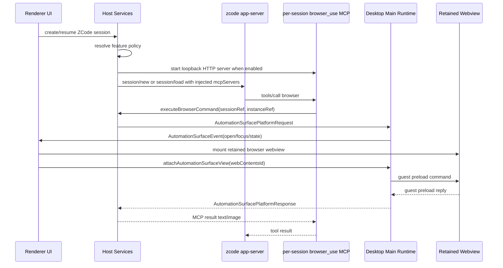

# Browser Use MCP Integration Implementation Plan

> **状态：历史规划，未实现。** 本文拟议的 `automationSurface` / `browser_use` 模块在当前分支不存在，
> 不可据此判断现行浏览器自动化能力。当前产品 CUA 权限边界见
> [ZCode CUA Permission Broker](../../cua-permission-broker/zcode-cua-permission-broker.md)。

> **For agentic workers:** REQUIRED SUB-SKILL: Use superpowers:executing-plans to implement this plan task-by-task. Steps use checkbox (`- [ ]`) syntax for tracking.

**Goal:** 让 zcode-cli 内模型可以在受控开关开启后，通过内置 `browser_use` session-injected MCP 操作 z-code 桌面内置浏览器，并为未来 iOS Simulator、Android Emulator 等可视化自动化实例复用同一套 session/instance 管理结构。

**Architecture:** 采用内置 session-injected MCP，而不是普通 official plugin。Host/service 层按 ZCode task/session 创建 `AutomationSurfaceSession`，按需注入 per-session loopback HTTP MCP；桌面 main 只承载 Electron WebContents/platform provider，UI 负责 retained/visible view 渲染。`browser` 是第一个 `AutomationSurfaceProvider`，未来 `ios-simulator`、`android-emulator` 只新增 provider 与 tool adapter，不重做 session 管理。

**Tech Stack:** TypeScript, Electron webview, React, Zustand, zod, ZCode Protocol, host/main postMessage bridge, zcode-cli HTTP MCP transport, Vitest, WebdriverIO/Electron e2e.

---

## 已确定设计

1. `browser_use` 是内置 session-injected MCP，但必须有开关：
   - `AppSettings.automationSurface.browserUse.enabled` 控制是否给新建/恢复的 ZCode session 注入内置 MCP。
   - `AppSettings.automationSurface.browserUse.autoOpenOnToolCall` 控制 tool call 是否自动把对应 view 展示到 side pane。
   - 初始 rollout 默认 `enabled=false`、`autoOpenOnToolCall=true`；开发/测试可用 `ZCODE_BROWSER_USE_MCP=1` 强制开启，用 `ZCODE_BROWSER_USE_MCP=0` 强制关闭。
   - 关闭时不启动 MCP HTTP server、不创建 automation instance、不暴露 `browser_use` tool。

2. 跨 session 管理必须通用化：
   - 一个 ZCode task/session 对应一个 `AutomationSurfaceSession`。
   - 一个 `AutomationSurfaceSession` 可以挂多个 `AutomationSurfaceInstance`，当前只挂 `kind="browser"`，未来可以挂 `kind="ios-simulator"` / `kind="android-emulator"`。
   - 隔离 key 必须包含 `workspaceKey = workspaceIdentity?.trim() || workspacePath`、`taskId/sessionId`、`surface kind` 和 `instanceId`，不能复用当前 human browser 的 workspace 级 side pane memory。

3. z-ai-pc 的方向可迁移，但不能照搬：
   - 可迁移：per-session HTTP MCP、runtime Map 管 session、partition/lastUrl 按 session 持久化、renderer 自动打开并 attach webview、guest preload 执行 DOM 操作。
   - 需要改进：去掉全局 `registerBrowserRuntime` 风格，改为 z-code DI；`BrowserRuntime` 提升为通用 `AutomationSurfaceRuntime`；`active/visible` 不能只按裸 sessionID，必须带 workspace identity、clientMode；Electron preload 例外必须限定 partition；mobile `/remote` 只能 attach 现有 host/runtime，不能独立启动。

## 关键边界

- `Main` 只做平台调度：窗口聚焦、WebContents attach、webview preload 放行、截图和 provider command dispatch。它不拥有 ZCode task/session、stream、queue、snapshot 业务状态。
- `Host/services` 拥有 automation session registry、feature policy、MCP server 生命周期、权限摘要、workspace identity 隔离和 ZCode Protocol MCP 注入。
- `UI` 不直接调用 Repo，不直接接触 Electron WebContents；UI 通过 `IPlatformService`/preload bridge 渲染 retained view、attach webview、订阅 platform event。
- Desktop 保持 `desktop-continuous` 主链路；mobile `/remote` 保持 `web-remote-replayable`，只通过 shared-host attachment 使用桌面已有 host，不启动独立 browser/simulator runtime。
- 日志遵守现有规范：UI 用 `packages/ui/src/logger.ts`；services 用 `createServiceLogger(scope)`；高频 command/event trace 用 `debug`，生命周期/开关决策用 `info`。
- UI 改动前必须读取 `DESIGN.md`；所有新增 UI 文案必须走 i18n，同时兼容浅色/深色主题和桌面/手机 Web 布局。
- 每个实现 task 完成后单独 Conventional Commit；最终必须执行 `pnpm typecheck` 和 `pnpm lint`。

## 当前事实

- z-code 已有 human Browser side pane：`packages/ui/src/EmbeddedBrowserPane.tsx` + `packages/ui/src/EmbeddedBrowserPaneParts.tsx`。
- 当前 Browser side pane memory 是 workspace 级共享，不适合直接承载 task/session-scoped automation instance。
- `packages/desktop/src/main/desktopWindowChrome.ts` 当前会删除所有 webview preload 并强制 sandbox；automation webview 必须做 partition-scoped 例外。
- ZCode app/server create/resume schema 尚未完整贯通 UI/host 注入的 MCP servers。
- z-ai-pc 的 browser runtime 证明了方向可行：`BrowserRuntime` 接口每个方法带 `sessionID`，desktop runtime 内部 `Map<string, BrowserSession>`，MCP server 是 per-session loopback HTTP。
- Browser Use 不能按普通 MCP plugin 处理：需要按当前 session/turn 过滤 backend，并把 session/turn metadata 注入每个 browser backend request；UI webview 按 conversation/tab 保留。

## 文件职责图

### Shared Contracts

- Create: `packages/shared/src/automationSurface.ts`
  - 定义 `AutomationSurfaceKind`、`AutomationSurfaceSessionRef`、`AutomationSurfaceInstanceRef`、event、command/result、feature policy schema。
- Create: `packages/shared/src/browserUse.ts`
  - 定义 `browser_use` MCP server/tool 常量、browser tool input/result schema、browser-specific DOM snapshot 类型。
- Modify: `packages/shared/src/protocol.ts`
  - `AppSettings` 增加 `automationSurface.browserUse.enabled` 和 `autoOpenOnToolCall`。
- Modify: `packages/shared/src/validationAppSettings.ts`
  - 增加 settings schema/patch schema，默认关闭 injection。
- Modify: `packages/shared/src/zcode-protocol/index.ts`
  - `zcodeSessionCreateParamsSchema` / `zcodeSessionResumeParamsSchema` 增加可选 `mcpServers`。
- Modify: `packages/shared/src/mcp.ts`
  - 暴露 HTTP MCP server schema，供 ZCode Protocol runtime 校验。
- Modify: `packages/shared/src/channels.ts`
  - 增加 renderer/main platform channels 与 host/main automation request/response message types。
- Modify: `packages/shared/src/platform.ts`
  - 在 `IPlatformService` 增加 automation surface platform API。
- Modify: `packages/shared/src/index.ts`
  - 导出新增 shared 类型。

### Services / Host

- Create: `packages/services/src/automation-surface/automationSurface.ts`
  - 定义 `IAutomationSurfaceService` descriptor。
- Create: `packages/services/src/automation-surface/automationSurfaceService.ts`
  - 管理 session/instance registry、feature policy、MCP server lifecycle、host/main bridge 调用。
- Create: `packages/services/src/automation-surface/automationSurfaceFeaturePolicy.ts`
  - 合并 env、settings、platform capability，产出是否注入与是否 auto-open。
- Create: `packages/services/src/automation-surface/automationSurfaceMcpServer.ts`
  - per-session loopback HTTP MCP server，处理 token、JSON-RPC、timeout、dispose。
- Create: `packages/services/src/automation-surface/browserUseTool.ts`
  - `browser_use.browser` tool adapter，解析参数、申请权限、调用 `AutomationSurfaceService.executeBrowserCommand()`。
- Create: `packages/services/src/automation-surface/automationSurfaceHostBridge.ts`
  - host process 通过 `parentPort` 向 desktop main 发 platform request，并等待 requestId 对应 response。
- Modify: `packages/services/src/node.ts`
  - 注册 `IAutomationSurfaceService`，把 `parentPort` 注入 host bridge；remote/web unsupported 时返回 disabled policy。
- Modify: `packages/services/src/accessor.ts`
  - 暴露 `automationSurfaceService`。
- Modify: `packages/services/src/index.ts`
  - 导出 service factory 和类型。
- Modify: `packages/services/src/zcode-agent/zcodeTaskServiceAdapter.ts`
  - create/resume 前按 feature policy 准备内置 MCP servers，并随 ZCode Protocol params 注入。
- Modify: `packages/services/src/session/zcodeTaskService.ts`
  - 保持 `mcpServers?: ZCodeAgentMcpServer[]` contract，并补中文注释说明内置 MCP 只能由 host 注入。

### zcode-cli Runtime

- Modify: `apps/zcode-cli/packages/bootstrap/src/zcode-protocol/server-operations.ts`
  - 接收 `mcpServers` 并合并进 runtimeConfig。
- Modify: `apps/zcode-cli/packages/bootstrap/src/app/runtime-config.ts`
  - MCP 合并顺序固定为 `plugin/config < explicit injected`，保证内置 per-session server 优先。
- Test: `apps/zcode-cli/packages/bootstrap/tests/zcode-protocol-session-mcp.test.ts`
  - 覆盖 create/resume 注入 HTTP MCP。

### Desktop Main / Platform

- Create: `packages/desktop/src/main/automationSurface/runtime.ts`
  - 通用 runtime，按 `surfaceSessionId` / `instanceId` 管 active、visible、provider dispatch。
- Create: `packages/desktop/src/main/automationSurface/browser/browserProvider.ts`
  - Browser provider：管理 partition、WebContents attach、导航、截图、DOM command。
- Create: `packages/desktop/src/main/automationSurface/browser/browserSession.ts`
  - 单个 browser instance 状态机，迁移 z-ai-pc `BrowserSession` 思路。
- Create: `packages/desktop/src/main/automationSurface/browser/browserStore.ts`
  - 按 instance 持久化 partition/lastUrl。
- Create: `packages/desktop/src/main/automationSurface/browser/guestChannel.ts`
  - main <-> webview guest preload request/reply。
- Create: `packages/desktop/src/main/automationSurface/security.ts`
  - partition parse、URL protocol allowlist、request ownership 校验。
- Modify: `packages/desktop/src/main/desktopWindowChrome.ts`
  - 对 automation partition 做受控 preload 例外。
- Modify: `packages/desktop/src/main/desktopHostProcess.ts`
  - 处理 host/main automation platform request，并回传 response。
- Modify: `packages/desktop/src/main/index.ts`
  - 创建 automation surface runtime 并注入 host process / IPC handlers。
- Modify: `packages/desktop/src/preload/index.ts`
  - 暴露 `window.zcode.automationSurface.*` 给 renderer。
- Modify: `packages/desktop/src/renderer/src/main.tsx`
  - `desktopPlatform` 实现 automation surface API。

### Desktop Webview Preload

- Create: `packages/desktop/src/preload/automation-surface-browser-webview.ts`
  - Browser guest preload，执行 snapshot/click/fill/type/press/wait/get。
- Create: `packages/desktop/src/preload/automationSurfaceBrowserDom.ts`
  - DOM helper，便于单测。
- Modify: desktop preload build config
  - 输出稳定 `automation-surface-browser-webview.js`。

### UI

- Modify: `packages/ui/src/lib/workspaceSidePane.ts`
  - 新增 `AutomationSurfaceSidePaneTab`，不要把 automation tab 混进 human `BrowserSidePaneTab`。
- Modify: `packages/ui/src/lib/taskSidePaneMemory.ts`
  - automation surface tab 按 task/session ref 恢复或过滤，避免 workspace 级 memory 串 session。
- Create: `packages/ui/src/automation-surface/AutomationSurfaceHost.tsx`
  - retained host：即使 side pane 未显示也能挂载 controlled webview；autoOpen=false 时保持隐藏。
- Create: `packages/ui/src/automation-surface/BrowserAutomationPane.tsx`
  - Browser provider UI，复用现有 Browser toolbar/content 逻辑或从 `EmbeddedBrowserPane` 抽 hook。
- Modify: `packages/ui/src/EmbeddedBrowserPane.tsx`
  - 把 human browser 与 controlled browser 共用的导航状态逻辑抽出，避免直接塞 automation props。
- Modify: `packages/ui/src/EmbeddedBrowserPaneParts.tsx`
  - 支持 controlled partition 参数；保留 human browser 默认 partition。
- Modify: `packages/ui/src/hooks/useAppPanels.ts`
  - 监听 automation surface open/focus event，按 policy 决定 retained-only 或展开 side pane。
- Modify: `packages/ui/src/app-shell/AnimatedSidePanePanel.tsx`
  - 渲染 `automation-surface` tab。
- Modify: `packages/web/src/main.tsx`
  - Web/mobile fallback 返回 unsupported，不启动本地 runtime。

### Docs

- Create: `docs/browser-use-mcp.md`
  - 记录架构、开关、权限、session/instance 隔离、桌面/手机远控边界、验证方式。
- Modify: `docs/web-remote-control/task-realtime-sync.md`
  - 补充 browser_use 不改变 continuous/replayable 语义。

---

## Task 0: 前置复读和基线确认

**Files:**
- Read: `DESIGN.md`
- Read: `docs/web-remote-control/web-remote-control-architecture.md`
- Read: `docs/web-remote-control/task-realtime-sync.md`
- Read: `docs/web-remote-control-task-command-queue.md`
- Read: `packages/shared/src/platform.ts`
- Read: `packages/desktop/src/main/desktopWindowChrome.ts`

- [ ] **Step 1: 读取 UI / 远控 / platform 边界文档**

Run:

```bash
sed -n '1,260p' DESIGN.md
sed -n '1,260p' docs/web-remote-control/web-remote-control-architecture.md
sed -n '1,260p' docs/web-remote-control/task-realtime-sync.md
sed -n '1,260p' docs/web-remote-control-task-command-queue.md
sed -n '180,260p' packages/shared/src/platform.ts
sed -n '180,230p' packages/desktop/src/main/desktopWindowChrome.ts
```

Expected: 确认 UI 设计规则、desktop continuous / mobile replayable 边界、`IPlatformService` 只放平台操作、当前 webview preload 被统一删除。

- [ ] **Step 2: 确认工作区状态**

Run:

```bash
git status --short
```

Expected: 只看到与当前任务相关的变更；实现时不得覆盖用户未提交改动。

---

## Task 1: 增加开关和 shared automation surface contract

**Files:**
- Create: `packages/shared/src/automationSurface.ts`
- Create: `packages/shared/src/browserUse.ts`
- Modify: `packages/shared/src/protocol.ts`
- Modify: `packages/shared/src/validationAppSettings.ts`
- Modify: `packages/shared/src/index.ts`
- Test: `packages/shared/test/automationSurfaceSettings.test.ts`
- Test: `packages/shared/test/automationSurfaceRefs.test.ts`

- [ ] **Step 1: 写 settings failing test**

Create `packages/shared/test/automationSurfaceSettings.test.ts`:

```ts
import { describe, expect, it } from "vitest";
import { appSettingsPatchSchema, appSettingsSchema } from "../src/validation.js";

describe("automation surface settings", () => {
  it("defaults browser_use injection off and auto-open on", () => {
    const settings = appSettingsSchema.parse({});
    expect(settings.automationSurface?.browserUse?.enabled).toBe(false);
    expect(settings.automationSurface?.browserUse?.autoOpenOnToolCall).toBe(true);
  });

  it("accepts explicit browser_use settings patches", () => {
    const patch = appSettingsPatchSchema.parse({
      automationSurface: {
        browserUse: {
          enabled: true,
          autoOpenOnToolCall: false,
        },
      },
    });
    expect(patch.automationSurface?.browserUse?.enabled).toBe(true);
    expect(patch.automationSurface?.browserUse?.autoOpenOnToolCall).toBe(false);
  });
});
```

Run:

```bash
pnpm vitest run packages/shared/test/automationSurfaceSettings.test.ts --runInBand
```

Expected: FAIL because settings schema does not contain `automationSurface`.

- [ ] **Step 2: Add `AppSettings.automationSurface`**

In `packages/shared/src/protocol.ts`, add:

```ts
export interface AutomationSurfaceSettings {
  browserUse?: {
    /** 是否给 ZCode session 注入内置 browser_use MCP。 */
    enabled?: boolean;
    /** tool call 触发时是否自动展开对应可视化实例。 */
    autoOpenOnToolCall?: boolean;
  };
}

export interface AppSettings {
  // existing fields...
  /** 内置可视化自动化实例开关；关闭时不启动 per-session MCP/runtime。 */
  automationSurface?: AutomationSurfaceSettings;
}
```

In `packages/shared/src/validationAppSettings.ts`, add schema:

```ts
const automationSurfaceSettingsSchema = z
  .object({
    browserUse: z
      .object({
        enabled: z.boolean().default(false),
        autoOpenOnToolCall: z.boolean().default(true),
      })
      .default({}),
  })
  .default({});
```

Add `automationSurface: automationSurfaceSettingsSchema` to `appSettingsObjectSchema`, and optional version to `appSettingsPatchSchema`.

- [ ] **Step 3: Add generic automation surface shared types**

Create `packages/shared/src/automationSurface.ts`:

```ts
import { z } from "zod";

export const automationSurfaceKindSchema = z.enum([
  "browser",
  "ios-simulator",
  "android-emulator",
]);
export type AutomationSurfaceKind = z.infer<typeof automationSurfaceKindSchema>;

export const automationSurfaceClientModeSchema = z.enum([
  "desktop-continuous",
  "web-remote-replayable",
]);
export type AutomationSurfaceClientMode = z.infer<typeof automationSurfaceClientModeSchema>;

export const automationSurfaceSessionRefSchema = z
  .object({
    surfaceSessionId: z.string().min(1),
    zcodeSessionId: z.string().min(1),
    taskId: z.string().min(1),
    workspacePath: z.string().min(1),
    workspaceIdentity: z.string().optional(),
    clientMode: automationSurfaceClientModeSchema,
  })
  .strict();
export type AutomationSurfaceSessionRef = z.infer<typeof automationSurfaceSessionRefSchema>;

export const automationSurfaceInstanceRefSchema = z
  .object({
    instanceId: z.string().min(1),
    kind: automationSurfaceKindSchema,
    session: automationSurfaceSessionRefSchema,
  })
  .strict();
export type AutomationSurfaceInstanceRef = z.infer<typeof automationSurfaceInstanceRefSchema>;

export function getAutomationSurfaceWorkspaceKey(input: {
  workspacePath: string;
  workspaceIdentity?: string;
}): string {
  return input.workspaceIdentity?.trim() || input.workspacePath;
}

export function buildAutomationSurfaceSessionId(input: {
  workspacePath: string;
  workspaceIdentity?: string;
  taskId: string;
}): string {
  const workspaceKey = getAutomationSurfaceWorkspaceKey(input);
  return `${encodeURIComponent(workspaceKey)}:${encodeURIComponent(input.taskId)}`;
}

export function buildAutomationSurfaceInstanceId(input: {
  surfaceSessionId: string;
  kind: AutomationSurfaceKind;
  ordinal?: number;
}): string {
  return `${input.kind}:${input.surfaceSessionId}:${input.ordinal ?? 0}`;
}

export const automationSurfaceEventSchema = z.discriminatedUnion("type", [
  z.object({ type: z.literal("open"), instance: automationSurfaceInstanceRefSchema }).strict(),
  z.object({ type: z.literal("focus"), instance: automationSurfaceInstanceRefSchema }).strict(),
  z
    .object({
      type: z.literal("state"),
      instance: automationSurfaceInstanceRefSchema,
      title: z.string().optional(),
      url: z.string().optional(),
      loading: z.boolean().optional(),
      lastError: z.string().optional(),
    })
    .strict(),
  z
    .object({
      type: z.literal("warning"),
      instance: automationSurfaceInstanceRefSchema.optional(),
      message: z.string(),
    })
    .strict(),
]);
export type AutomationSurfaceEvent = z.infer<typeof automationSurfaceEventSchema>;
```

- [ ] **Step 4: Add browser_use shared constants**

Create `packages/shared/src/browserUse.ts`:

```ts
import { z } from "zod";

export const BROWSER_USE_MCP_SERVER_NAME = "browser_use";
export const BROWSER_USE_MCP_TOOL_NAME = "browser";
export const BROWSER_USE_MCP_TOKEN_HEADER = "X-ZCode-Browser-MCP-Token";
export const BROWSER_USE_PARTITION_HINT_PREFIX = "zcode-browser-use:";

export const browserUseActionSchema = z.enum([
  "open",
  "goto",
  "snapshot",
  "click",
  "fill",
  "type",
  "press",
  "wait",
  "get",
  "screenshot",
  "visibility",
]);

export const browserUseToolInputSchema = z
  .object({
    action: browserUseActionSchema,
    url: z.string().optional(),
    ref: z.string().optional(),
    selector: z.string().optional(),
    value: z.string().optional(),
    text: z.string().optional(),
    key: z.string().optional(),
    timeoutMs: z.number().int().positive().optional(),
    visible: z.boolean().optional(),
  })
  .strict();
export type BrowserUseToolInput = z.infer<typeof browserUseToolInputSchema>;
```

- [ ] **Step 5: Add ref tests and export**

Create `packages/shared/test/automationSurfaceRefs.test.ts`:

```ts
import { describe, expect, it } from "vitest";
import {
  buildAutomationSurfaceInstanceId,
  buildAutomationSurfaceSessionId,
  getAutomationSurfaceWorkspaceKey,
} from "../src/automationSurface.js";

describe("automation surface refs", () => {
  it("uses workspaceIdentity for isolation when present", () => {
    expect(getAutomationSurfaceWorkspaceKey({
      workspacePath: "/repo",
      workspaceIdentity: "ssh://host/repo",
    })).toBe("ssh://host/repo");
  });

  it("builds session and instance ids with task isolation", () => {
    const surfaceSessionId = buildAutomationSurfaceSessionId({
      workspacePath: "/repo",
      workspaceIdentity: "ssh://host/repo",
      taskId: "task-1",
    });
    expect(surfaceSessionId).toContain("task-1");
    expect(buildAutomationSurfaceInstanceId({ surfaceSessionId, kind: "browser" })).toContain("browser");
  });
});
```

Export from `packages/shared/src/index.ts`.

Run:

```bash
pnpm vitest run packages/shared/test/automationSurfaceSettings.test.ts packages/shared/test/automationSurfaceRefs.test.ts --runInBand
```

Expected: PASS.

- [ ] **Step 6: Commit Task 1**

```bash
git add packages/shared/src/automationSurface.ts packages/shared/src/browserUse.ts packages/shared/src/protocol.ts packages/shared/src/validationAppSettings.ts packages/shared/src/index.ts packages/shared/test/automationSurfaceSettings.test.ts packages/shared/test/automationSurfaceRefs.test.ts
git commit -m "feat: add automation surface settings and contracts"
```

---

## Task 2: 打通 ZCode Protocol 的 injected MCP server 链路

**Files:**
- Modify: `packages/shared/src/mcp.ts`
- Modify: `packages/shared/src/zcode-protocol/index.ts`
- Modify: `apps/zcode-cli/packages/bootstrap/src/zcode-protocol/server-operations.ts`
- Modify: `apps/zcode-cli/packages/bootstrap/src/app/runtime-config.ts`
- Test: `apps/zcode-cli/packages/bootstrap/tests/zcode-protocol-session-mcp.test.ts`

- [ ] **Step 1: Add failing bootstrap test**

Create `apps/zcode-cli/packages/bootstrap/tests/zcode-protocol-session-mcp.test.ts` with a create/resume operation fixture that includes:

```ts
const mcpServers = [
  {
    name: "browser_use",
    type: "http" as const,
    url: "http://127.0.0.1:43210/mcp",
    headers: [{ name: "X-ZCode-Browser-MCP-Token", value: "secret" }],
  },
];
```

Assert runtime config contains:

```ts
expect(runtimeConfig.mcp?.servers.browser_use).toMatchObject({
  type: "http",
  url: "http://127.0.0.1:43210/mcp",
  headers: { "X-ZCode-Browser-MCP-Token": "secret" },
});
```

Run:

```bash
pnpm vitest run apps/zcode-cli/packages/bootstrap/tests/zcode-protocol-session-mcp.test.ts --runInBand
```

Expected: FAIL because create/resume params do not accept `mcpServers`.

- [ ] **Step 2: Add shared MCP server schema**

In `packages/shared/src/mcp.ts`, add/export a zod schema for stdio/http/sse MCP servers. For HTTP:

```ts
export const zcodeAgentMcpHeaderSchema = z.object({
  name: z.string().min(1),
  value: z.string(),
});

export const zcodeAgentHttpMcpServerSchema = z.object({
  name: z.string().min(1),
  type: z.literal("http"),
  url: z.string().url(),
  headers: z.array(zcodeAgentMcpHeaderSchema).optional(),
  timeoutMs: z.number().int().positive().optional(),
  enabled: z.boolean().optional(),
});
```

Include existing stdio/sse shapes if they already exist; do not duplicate type names.

- [ ] **Step 3: Extend ZCode Protocol schemas**

In `packages/shared/src/zcode-protocol/index.ts`, add:

```ts
mcpServers: z.array(zcodeAgentMcpServerSchema).optional(),
```

to both `zcodeSessionCreateParamsSchema` and `zcodeSessionResumeParamsSchema`.

- [ ] **Step 4: Merge injected MCP into runtime config**

In `apps/zcode-cli/packages/bootstrap/src/zcode-protocol/server-operations.ts`, convert array headers to runtime config object:

```ts
function headerArrayToRecord(headers: { name: string; value: string }[] | undefined) {
  return headers ? Object.fromEntries(headers.map((entry) => [entry.name, entry.value])) : undefined;
}
```

Then merge into runtime config.

In `apps/zcode-cli/packages/bootstrap/src/app/runtime-config.ts`, enforce:

```ts
// 内置 session-injected MCP 必须最后合并，避免被用户全局 MCP 配置覆盖 token/url。
const mergedMcpServers = {
  ...pluginMcpServers,
  ...configuredMcpServers,
  ...explicitInjectedMcpServers,
};
```

- [ ] **Step 5: Run and commit**

Run:

```bash
pnpm vitest run apps/zcode-cli/packages/bootstrap/tests/zcode-protocol-session-mcp.test.ts --runInBand
```

Expected: PASS.

Commit:

```bash
git add packages/shared/src/mcp.ts packages/shared/src/zcode-protocol/index.ts apps/zcode-cli/packages/bootstrap/src/zcode-protocol/server-operations.ts apps/zcode-cli/packages/bootstrap/src/app/runtime-config.ts apps/zcode-cli/packages/bootstrap/tests/zcode-protocol-session-mcp.test.ts
git commit -m "feat: support injected mcp servers in zcode protocol"
```

---

## Task 3: 实现 services 侧通用 AutomationSurfaceService

**Files:**
- Create: `packages/services/src/automation-surface/automationSurface.ts`
- Create: `packages/services/src/automation-surface/automationSurfaceFeaturePolicy.ts`
- Create: `packages/services/src/automation-surface/automationSurfaceHostBridge.ts`
- Create: `packages/services/src/automation-surface/automationSurfaceMcpServer.ts`
- Create: `packages/services/src/automation-surface/browserUseTool.ts`
- Create: `packages/services/src/automation-surface/automationSurfaceService.ts`
- Modify: `packages/services/src/node.ts`
- Modify: `packages/services/src/accessor.ts`
- Modify: `packages/services/src/index.ts`
- Test: `packages/services/test/automationSurfaceFeaturePolicy.test.ts`
- Test: `packages/services/test/automationSurfaceMcpServer.test.ts`

- [ ] **Step 1: Feature policy tests**

Create `packages/services/test/automationSurfaceFeaturePolicy.test.ts`:

```ts
import { describe, expect, it } from "vitest";
import { resolveAutomationSurfaceFeaturePolicy } from "../src/automation-surface/automationSurfaceFeaturePolicy.js";

describe("automation surface feature policy", () => {
  it("keeps browser_use disabled by default", () => {
    expect(resolveAutomationSurfaceFeaturePolicy({ settings: {}, env: {} }).browserUse.enabled).toBe(false);
  });

  it("lets env force-enable browser_use for dev and tests", () => {
    expect(resolveAutomationSurfaceFeaturePolicy({
      settings: {},
      env: { ZCODE_BROWSER_USE_MCP: "1" },
    }).browserUse.enabled).toBe(true);
  });

  it("lets env force-disable browser_use", () => {
    expect(resolveAutomationSurfaceFeaturePolicy({
      settings: { automationSurface: { browserUse: { enabled: true } } },
      env: { ZCODE_BROWSER_USE_MCP: "0" },
    }).browserUse.enabled).toBe(false);
  });
});
```

- [ ] **Step 2: Implement feature policy**

Create `packages/services/src/automation-surface/automationSurfaceFeaturePolicy.ts`:

```ts
import type { AppSettings } from "@zcode/shared";

export interface AutomationSurfaceFeaturePolicy {
  browserUse: {
    enabled: boolean;
    autoOpenOnToolCall: boolean;
    reason?: "setting-disabled" | "env-disabled" | "unsupported-platform";
  };
}

export function resolveAutomationSurfaceFeaturePolicy(input: {
  settings: Partial<AppSettings>;
  env: Record<string, string | undefined>;
  platformSupported?: boolean;
}): AutomationSurfaceFeaturePolicy {
  const forced = input.env.ZCODE_BROWSER_USE_MCP;
  const browserUse = input.settings.automationSurface?.browserUse;
  const platformSupported = input.platformSupported ?? true;

  if (!platformSupported) {
    return { browserUse: { enabled: false, autoOpenOnToolCall: false, reason: "unsupported-platform" } };
  }
  if (forced === "0") {
    return { browserUse: { enabled: false, autoOpenOnToolCall: false, reason: "env-disabled" } };
  }
  if (forced === "1") {
    return { browserUse: { enabled: true, autoOpenOnToolCall: browserUse?.autoOpenOnToolCall ?? true } };
  }
  return {
    browserUse: {
      enabled: browserUse?.enabled ?? false,
      autoOpenOnToolCall: browserUse?.autoOpenOnToolCall ?? true,
      reason: browserUse?.enabled ? undefined : "setting-disabled",
    },
  };
}
```

- [ ] **Step 3: Define service descriptor and registry API**

Create `packages/services/src/automation-surface/automationSurface.ts`:

```ts
import { createServiceDescriptor } from "../collection.js";
import type { AutomationSurfaceInstanceRef, AutomationSurfaceSessionRef } from "@zcode/shared";

export interface PrepareAutomationSurfaceSessionResult {
  mcpServers: Array<{
    name: string;
    type: "http";
    url: string;
    headers: { name: string; value: string }[];
  }>;
  instances: AutomationSurfaceInstanceRef[];
}

export interface IAutomationSurfaceService {
  prepareSession(input: {
    session: AutomationSurfaceSessionRef;
    requestedKinds: Array<"browser">;
  }): Promise<PrepareAutomationSurfaceSessionResult>;
  disposeSession(session: AutomationSurfaceSessionRef): Promise<void>;
}

export const IAutomationSurfaceService =
  createServiceDescriptor<IAutomationSurfaceService>("automationSurfaceService");
```

- [ ] **Step 4: Implement host/main bridge**

Create `packages/services/src/automation-surface/automationSurfaceHostBridge.ts` with a requestId map over `parentPort`.

Required request shape:

```ts
{
  type: HostResponseTypes.AutomationSurfacePlatformRequest,
  requestId,
  command: "ensure" | "execute" | "dispose",
  instance,
  payload,
}
```

Required response shape:

```ts
{
  type: HostMessageTypes.AutomationSurfacePlatformResponse,
  requestId,
  ok,
  result,
  error,
}
```

Add timeout default `30_000ms` and `debug` logs only.

- [ ] **Step 5: Implement per-session MCP server**

Create `automationSurfaceMcpServer.ts` modeled after z-ai-pc's per-session server:

- bind to `127.0.0.1` port `0`
- require `X-ZCode-Browser-MCP-Token`
- support `initialize`, `tools/list`, `tools/call`, `ping`
- expose one tool: `{ name: "browser", title: "Browser Use" }`
- timeout `30_000ms`
- return screenshots as MCP image blocks

Add test `packages/services/test/automationSurfaceMcpServer.test.ts` for token rejection, `tools/list`, invalid tool, and screenshot image block.

- [ ] **Step 6: Implement service factory and register**

Create `automationSurfaceService.ts`:

- read settings via `ISettingService`
- resolve policy
- if disabled, return empty `mcpServers`
- create one browser instance ref for the session
- start per-session MCP server and retain dispose handle in a `Map<surfaceSessionId, Handle>`
- call host bridge `ensure` so desktop can prepare retained view

Modify `packages/services/src/node.ts`, `accessor.ts`, and `index.ts` to register/export service.

- [ ] **Step 7: Run and commit**

Run:

```bash
pnpm vitest run packages/services/test/automationSurfaceFeaturePolicy.test.ts packages/services/test/automationSurfaceMcpServer.test.ts --runInBand
pnpm typecheck
```

Expected: PASS.

Commit:

```bash
git add packages/services/src/automation-surface packages/services/src/node.ts packages/services/src/accessor.ts packages/services/src/index.ts packages/services/test/automationSurfaceFeaturePolicy.test.ts packages/services/test/automationSurfaceMcpServer.test.ts
git commit -m "feat: add automation surface service"
```

---

## Task 4: 实现 host/main 通用 platform bridge 和 desktop runtime

**Files:**
- Modify: `packages/shared/src/channels.ts`
- Create: `packages/desktop/src/main/automationSurface/runtime.ts`
- Create: `packages/desktop/src/main/automationSurface/security.ts`
- Modify: `packages/desktop/src/main/desktopHostProcess.ts`
- Modify: `packages/desktop/src/main/index.ts`
- Test: `packages/desktop/test/automationSurfaceRuntime.test.ts`

- [ ] **Step 1: Add host/main message types**

In `packages/shared/src/channels.ts`, add:

```ts
AutomationSurfacePlatformRequest: "automation-surface-platform-request",
AutomationSurfacePlatformEvent: "automation-surface-platform-event",
```

to `HostResponseTypes`, and:

```ts
AutomationSurfacePlatformResponse: "automation-surface-platform-response",
```

to `HostMessageTypes`.

Add comments in Chinese explaining these are host/main platform dispatch messages and do not carry ZCode stream state.

- [ ] **Step 2: Add desktop runtime tests**

Create `packages/desktop/test/automationSurfaceRuntime.test.ts`:

```ts
import { describe, expect, it } from "vitest";
import {
  isAllowedAutomationSurfaceUrl,
  parseAutomationSurfacePartitionHint,
} from "../src/main/automationSurface/security.js";

describe("automation surface desktop security", () => {
  it("only parses dedicated partition hints", () => {
    expect(parseAutomationSurfacePartitionHint("zcode-browser-use:abc")).toEqual({
      kind: "browser",
      instanceId: "abc",
    });
    expect(parseAutomationSurfacePartitionHint("persist:zcode-embedded-browser")).toBeNull();
  });

  it("blocks local file and script navigation for browser provider", () => {
    expect(isAllowedAutomationSurfaceUrl("about:blank")).toBe(true);
    expect(isAllowedAutomationSurfaceUrl("https://example.com")).toBe(true);
    expect(isAllowedAutomationSurfaceUrl("file:///Users/me/.ssh/id_rsa")).toBe(false);
    expect(isAllowedAutomationSurfaceUrl("javascript:alert(1)")).toBe(false);
  });
});
```

- [ ] **Step 3: Implement security helpers**

Create `packages/desktop/src/main/automationSurface/security.ts`:

```ts
import { BROWSER_USE_PARTITION_HINT_PREFIX } from "@zcode/shared";

export function parseAutomationSurfacePartitionHint(raw: string | undefined) {
  if (!raw?.startsWith(BROWSER_USE_PARTITION_HINT_PREFIX)) {
    return null;
  }
  const instanceId = decodeURIComponent(raw.slice(BROWSER_USE_PARTITION_HINT_PREFIX.length));
  return instanceId ? { kind: "browser" as const, instanceId } : null;
}

export function isAllowedAutomationSurfaceUrl(rawUrl: string): boolean {
  try {
    const url = new URL(rawUrl);
    return url.protocol === "about:" || url.protocol === "http:" || url.protocol === "https:";
  } catch {
    return false;
  }
}
```

- [ ] **Step 4: Implement generic runtime skeleton**

Create `packages/desktop/src/main/automationSurface/runtime.ts`:

- keep `instances = new Map<string, AutomationSurfaceInstanceRef>()`
- keep `activeInstanceId` and `visibleInstanceId`
- expose `ensure(instance)`, `execute(instance, command, payload)`, `setVisible(instanceId | null)`, `dispose(instance)`
- dispatch `kind="browser"` to browser provider once Task 5 lands
- emit events to renderer via platform channel and to host via `AutomationSurfacePlatformEvent`

Do not import services or ZCode session modules.

- [ ] **Step 5: Route host requests in main**

In `packages/desktop/src/main/desktopHostProcess.ts`, handle `HostResponseTypes.AutomationSurfacePlatformRequest`:

```ts
const response = await automationSurfaceRuntime.handleHostRequest(result.data);
hostProcess.postMessage({
  type: HostMessageTypes.AutomationSurfacePlatformResponse,
  requestId: result.data.requestId,
  ok: true,
  result: response,
});
```

On error, return `{ ok: false, error }`. Keep logs at `debug` for per-command traffic.

- [ ] **Step 6: Run and commit**

Run:

```bash
pnpm vitest run packages/desktop/test/automationSurfaceRuntime.test.ts --runInBand
pnpm typecheck
```

Expected: PASS.

Commit:

```bash
git add packages/shared/src/channels.ts packages/desktop/src/main/automationSurface packages/desktop/src/main/desktopHostProcess.ts packages/desktop/src/main/index.ts packages/desktop/test/automationSurfaceRuntime.test.ts
git commit -m "feat: add desktop automation surface runtime"
```

---

## Task 5: 实现 Browser provider、webview preload 和 retained UI

**Files:**
- Create: `packages/desktop/src/main/automationSurface/browser/browserProvider.ts`
- Create: `packages/desktop/src/main/automationSurface/browser/browserSession.ts`
- Create: `packages/desktop/src/main/automationSurface/browser/browserStore.ts`
- Create: `packages/desktop/src/main/automationSurface/browser/guestChannel.ts`
- Create: `packages/desktop/src/preload/automation-surface-browser-webview.ts`
- Create: `packages/desktop/src/preload/automationSurfaceBrowserDom.ts`
- Modify: `packages/desktop/src/main/desktopWindowChrome.ts`
- Modify: desktop preload build config
- Test: `packages/desktop/test/browserAutomationProvider.test.ts`
- Test: `packages/desktop/test/browserAutomationPreload.test.ts`

- [ ] **Step 1: Port z-ai-pc BrowserSession with z-code constraints**

Implement browser provider with these differences from z-ai-pc:

- no global runtime registration
- key by `AutomationSurfaceInstanceRef.instanceId`, not bare `sessionID`
- persist partition/lastUrl under `automationSurface.browser.instances.${instanceId}`
- URL allowlist remains `about/http/https`
- popup and permission requests denied by default
- webview preload exception only when partition hint matches `BROWSER_USE_PARTITION_HINT_PREFIX`

- [ ] **Step 2: Add guest preload DOM dispatcher**

Create DOM helpers in `automationSurfaceBrowserDom.ts`:

```ts
export function listInteractiveElements(root: ParentNode = document): Element[] {
  return Array.from(
    root.querySelectorAll(
      'a[href],button,input,textarea,select,[role="button"],[role="link"],[tabindex],[contenteditable="true"]',
    ),
  ).filter((element) => {
    const rect = element.getBoundingClientRect();
    const style = window.getComputedStyle(element);
    return rect.width > 0 && rect.height > 0 && style.display !== "none" && style.visibility !== "hidden";
  });
}
```

The preload listens for `zcode:automation-surface:browser-call`, executes `snapshot/click/fill/type/press/wait/get`, and replies with `zcode:automation-surface:browser-reply`.

- [ ] **Step 3: Add controlled preload exception**

In `desktopWindowChrome.ts`, before the existing preload deletion:

```ts
const automationPartition = parseAutomationSurfacePartitionHint(params.partition);
if (automationPartition?.kind === "browser") {
  // 修复原因：browser_use MCP 需要受控 guest preload 执行 DOM snapshot/click/fill。
  // 只对 automation partition 开放，普通内置浏览器仍删除 preload，避免扩大页面权限面。
  webPreferences.preload = automationSurfaceBrowserPreloadPath;
  webPreferences.contextIsolation = true;
  webPreferences.nodeIntegration = false;
  webPreferences.webSecurity = true;
  webPreferences.sandbox = false;
  params.partition = browserProvider.resolvePersistPartition(automationPartition.instanceId);
  return;
}
```

If sandbox-compatible ESM preload works in current Electron version, prefer `sandbox=true`; otherwise keep `sandbox=false` only here and retain the Chinese reason comment.

- [ ] **Step 4: Add unit tests**

Run:

```bash
pnpm vitest run packages/desktop/test/browserAutomationProvider.test.ts packages/desktop/test/browserAutomationPreload.test.ts --runInBand
pnpm typecheck
```

Expected: PASS.

- [ ] **Step 5: Commit Task 5**

```bash
git add packages/desktop/src/main/automationSurface/browser packages/desktop/src/preload/automation-surface-browser-webview.ts packages/desktop/src/preload/automationSurfaceBrowserDom.ts packages/desktop/src/main/desktopWindowChrome.ts packages/desktop/test/browserAutomationProvider.test.ts packages/desktop/test/browserAutomationPreload.test.ts
git commit -m "feat: add browser automation surface provider"
```

---

## Task 6: UI 接入 retained AutomationSurfaceHost 和独立 side pane tab

**Files:**
- Modify: `packages/ui/src/lib/workspaceSidePane.ts`
- Modify: `packages/ui/src/lib/taskSidePaneMemory.ts`
- Create: `packages/ui/src/automation-surface/AutomationSurfaceHost.tsx`
- Create: `packages/ui/src/automation-surface/BrowserAutomationPane.tsx`
- Modify: `packages/ui/src/hooks/useAppPanels.ts`
- Modify: `packages/ui/src/app-shell/AnimatedSidePanePanel.tsx`
- Modify: `packages/desktop/src/preload/index.ts`
- Modify: `packages/desktop/src/renderer/src/main.tsx`
- Modify: `packages/web/src/main.tsx`
- Test: `packages/ui/test/automationSurfaceSidePane.test.tsx`
- Test: `packages/ui/test/automationSurfaceWebFallback.test.tsx`

- [ ] **Step 1: Read DESIGN.md**

Run:

```bash
sed -n '1,260p' DESIGN.md
```

Expected: Confirm spacing, radius, theme, responsive and i18n rules before UI edits.

- [ ] **Step 2: Add side pane tab type**

In `workspaceSidePane.ts`, add:

```ts
export interface AutomationSurfaceSidePaneTab {
  id: string;
  type: "automation-surface";
  kind: AutomationSurfaceKind;
  instanceId: string;
  surfaceSessionId: string;
  controlledByTaskId: string;
  openedAt?: number;
  title?: string | null;
}
```

Add helper `openAutomationSurfaceSidePane(current, tab)` that reuses the same `instanceId`.

In `taskSidePaneMemory.ts`, filter restored automation tabs whose `controlledByTaskId` does not match the active task. Human browser/git/code-viewer remain workspace-level memory.

- [ ] **Step 3: Add retained host**

Create `AutomationSurfaceHost.tsx`:

- subscribes to `platform.onAutomationSurfaceEvent`
- keeps a retained map of instances
- mounts hidden browser webview for `kind="browser"` even when side pane is collapsed
- if `autoOpenOnToolCall=true`, opens/focuses side pane tab on `open/focus` event
- if `autoOpenOnToolCall=false`, keeps instance hidden but attached

Do not use visible instructional text; use existing tooltips/icons when controls are visible.

- [ ] **Step 4: Add BrowserAutomationPane**

Create `BrowserAutomationPane.tsx` by extracting reusable parts from `EmbeddedBrowserPane`:

- controlled partition is `${BROWSER_USE_PARTITION_HINT_PREFIX}${encodeURIComponent(instanceId)}`
- on `dom-ready`, call `platform.attachAutomationSurfaceView({ instance, webContentsId })`
- on unmount, call `platform.detachAutomationSurfaceView(instance)`
- toolbar compactness follows existing browser toolbar
- all logs use `logger.debug/info/warn`

- [ ] **Step 5: Wire platform preload/web fallback**

Expose `window.zcode.automationSurface` in desktop preload and map through `desktopPlatform`.

In `packages/web/src/main.tsx`, return unsupported:

```ts
automationSurface: {
  ensureView: async () => ({ available: false, reason: "unsupported-platform" }),
  onEvent: () => () => undefined,
}
```

Add Chinese comment:

```ts
// 手机 /remote 只 attach 桌面已有 host/runtime，不在 Web 端启动独立 automation surface。
```

- [ ] **Step 6: Run UI tests and commit**

Run:

```bash
pnpm vitest run packages/ui/test/automationSurfaceSidePane.test.tsx packages/ui/test/automationSurfaceWebFallback.test.tsx --runInBand
pnpm typecheck
```

Expected: PASS.

Commit:

```bash
git add packages/ui/src/lib/workspaceSidePane.ts packages/ui/src/lib/taskSidePaneMemory.ts packages/ui/src/automation-surface packages/ui/src/hooks/useAppPanels.ts packages/ui/src/app-shell/AnimatedSidePanePanel.tsx packages/desktop/src/preload/index.ts packages/desktop/src/renderer/src/main.tsx packages/web/src/main.tsx packages/ui/test/automationSurfaceSidePane.test.tsx packages/ui/test/automationSurfaceWebFallback.test.tsx
git commit -m "feat: render retained automation surface views"
```

---

## Task 7: 在 ZCode session create/resume 前注入 browser_use MCP

**Files:**
- Modify: `packages/services/src/zcode-agent/zcodeTaskServiceAdapter.ts`
- Modify: `packages/services/src/session/zcodeTaskService.ts`
- Modify: `packages/ui/src/lib/zcodeSessionPromptControl.ts`
- Test: `packages/services/test/zcodeTaskBrowserUseInjection.test.ts`
- Test: `packages/ui/test/zcodeSessionPromptControl.test.ts`

- [ ] **Step 1: Add failing service test**

Create `packages/services/test/zcodeTaskBrowserUseInjection.test.ts` by copying these existing helper functions from `packages/services/test/zcodeLegacyTaskCompatTaskIndex.test.ts`: `useTempDataBaseDir()`, `makeSnapshot()`, and `createAgentMock()`. The test constructs `createZCodeTaskServiceAdapter()` with a fake `automationSurfaceService`, calls `service.createTask()`, and asserts the injected MCP server reaches `zcodeAgentService.createSession()`.

```ts
import { afterEach, describe, expect, it, vi } from "vitest";
import { setDataBaseDir } from "../src/paths.js";
import { createZCodeTaskServiceAdapter } from "../src/zcode-agent/zcodeTaskServiceAdapter.js";
import { createZCodeTaskIndexSyncer } from "../src/zcode-agent/zcodeTaskIndexSyncer.js";
import { TaskIndexRepo } from "../src/session/taskIndexRepo.js";

afterEach(() => {
  setDataBaseDir(null);
});

describe("browser_use MCP injection", () => {
  it("injects browser_use only when automation surface policy enables it", async () => {
    useTempDataBaseDir();
    const createSession = vi.fn(async () => makeSnapshot({
      sessionId: "task-browser",
      workspacePath: "/repo",
      workspaceIdentity: "ssh://host/repo",
    }));
    const taskIndexRepo = new TaskIndexRepo();
    const { agent: zcodeAgentService } = createAgentMock();
    vi.mocked(zcodeAgentService.createSession).mockImplementation(createSession);
    const taskIndexSyncer = createZCodeTaskIndexSyncer({
      agentService: zcodeAgentService,
      taskIndexRepo,
    });
    const automationSurfaceService = {
      prepareSession: vi.fn(async () => ({
        mcpServers: [{
          name: "browser_use",
          type: "http" as const,
          url: "http://127.0.0.1:4567/mcp",
          headers: [{ name: "X-ZCode-Browser-MCP-Token", value: "secret" }],
        }],
        instances: [],
      })),
    };

    const service = createZCodeTaskServiceAdapter({
      zcodeAgentService,
      taskIndexRepo,
      taskIndexSyncer,
      automationSurfaceService,
    });

    await service.createTask({
      workspacePath: "/repo",
      workspaceIdentity: "ssh://host/repo",
      provider: "glm",
    });

    expect(automationSurfaceService.prepareSession).toHaveBeenCalledWith(
      expect.objectContaining({
        requestedKinds: ["browser"],
      }),
    );
    expect(createSession).toHaveBeenCalledWith(
      expect.objectContaining({
        workspacePath: "/repo",
        workspaceIdentity: "ssh://host/repo",
        mcpServers: [
          expect.objectContaining({
            name: "browser_use",
            type: "http",
          }),
        ],
      }),
    );
  });
});
```

- [ ] **Step 2: Inject in create/resume path**

In `zcodeTaskServiceAdapter.ts`, before protocol create/resume:

```ts
const surfaceSessionId = buildAutomationSurfaceSessionId({
  workspacePath: params.workspacePath,
  workspaceIdentity: params.workspaceIdentity,
  taskId: params.taskId,
});
const automation = await automationSurfaceService.prepareSession({
  session: {
    surfaceSessionId,
    zcodeSessionId: params.taskId,
    taskId: params.taskId,
    workspacePath: params.workspacePath,
    workspaceIdentity: params.workspaceIdentity,
    clientMode: params.clientMode ?? "desktop-continuous",
  },
  requestedKinds: ["browser"],
});
const mcpServers = [...(params.mcpServers ?? []), ...automation.mcpServers];
```

Do not inject for `clientMode === "web-remote-replayable"` unless the call is executing inside the already-attached desktop host. Add a Chinese comment explaining the remote boundary.

- [ ] **Step 3: Pass mcpServers through UI continuous path**

If `packages/ui/src/lib/zcodeSessionPromptControl.ts` still has a direct `createSession`/`resumeSession` path, include `mcpServers` in both calls.

- [ ] **Step 4: Run and commit**

Run:

```bash
pnpm vitest run packages/services/test/zcodeTaskBrowserUseInjection.test.ts packages/ui/test/zcodeSessionPromptControl.test.ts --runInBand
pnpm typecheck
```

Expected: PASS.

Commit:

```bash
git add packages/services/src/zcode-agent/zcodeTaskServiceAdapter.ts packages/services/src/session/zcodeTaskService.ts packages/ui/src/lib/zcodeSessionPromptControl.ts packages/services/test/zcodeTaskBrowserUseInjection.test.ts packages/ui/test/zcodeSessionPromptControl.test.ts
git commit -m "feat: inject browser use mcp per zcode session"
```

---

## Task 8: 权限、日志、错误和用户开关 UI

**Files:**
- Modify: `packages/services/src/automation-surface/browserUseTool.ts`
- Modify: `packages/services/src/automation-surface/automationSurfaceService.ts`
- Modify: `packages/ui/src/SettingsPage.tsx`
- Create or Modify: settings section component for automation surface
- Modify: `packages/ui/src/i18n/locales/zh-CN.ts`
- Modify: `packages/ui/src/i18n/locales/en-US.ts`
- Test: `packages/services/test/browserUsePermission.test.ts`
- Test: `packages/ui/test/automationSurfaceSettingsUi.test.tsx`

- [ ] **Step 1: Add permission tests**

Test cases:

- `goto https://example.com` produces permission summary containing origin.
- `screenshot` and `snapshot` use debug logs for high-frequency details.
- `file://` and `javascript:` are rejected before reaching provider.
- closing/dispose errors log `warn`, not `error`, when recoverable.

- [ ] **Step 2: Implement permission and logging**

In `browserUseTool.ts`, route dangerous actions through existing permission/elicitation flow. Use concise summaries:

```ts
{
  permission: "browser_use",
  patterns: [`browser:${origin}`],
  description: `Allow browser_use to navigate ${origin}`,
}
```

Do not log raw DOM snapshot or typed text at `info`.

- [ ] **Step 3: Add Settings UI switch**

Add settings rows:

- Enable Browser Use MCP
- Open controlled browser automatically

Use `SettingsRow`, existing Switch components, and i18n strings. No standalone marketing copy.

- [ ] **Step 4: Run and commit**

Run:

```bash
pnpm vitest run packages/services/test/browserUsePermission.test.ts packages/ui/test/automationSurfaceSettingsUi.test.tsx --runInBand
pnpm typecheck
```

Expected: PASS.

Commit:

```bash
git add packages/services/src/automation-surface/browserUseTool.ts packages/services/src/automation-surface/automationSurfaceService.ts packages/ui/src/SettingsPage.tsx packages/ui/src/i18n/locales/zh-CN.ts packages/ui/src/i18n/locales/en-US.ts packages/services/test/browserUsePermission.test.ts packages/ui/test/automationSurfaceSettingsUi.test.tsx
git commit -m "feat: add browser use permissions and settings"
```

---

## Task 9: 桌面端到端验证

**Files:**
- Create: `packages/desktop/test/browserUseMcp.e2e.test.ts` or WebdriverIO spec under current desktop e2e structure
- Modify: package test script if needed

- [ ] **Step 1: Add e2e scenario**

Scenario:

1. enable `ZCODE_BROWSER_USE_MCP=1`
2. start desktop app
3. create a ZCode session
4. assert injected MCP server exists in protocol request
5. call `browser` tool with `goto`
6. assert retained webview attaches
7. assert `autoOpenOnToolCall=true` opens side pane
8. call `snapshot`, `click`, `screenshot`
9. assert screenshot is non-empty PNG

- [ ] **Step 2: Verify no mobile independent runtime**

Add test or manual verification note:

- mobile `/remote` attaches shared host
- no separate browser MCP server starts from web bundle
- replayable task snapshot semantics unchanged

- [ ] **Step 3: Run focused e2e**

Run the repo's desktop e2e command. If no stable command exists, run the closest WebdriverIO/Electron command and record the exact command in `docs/browser-use-mcp.md`.

Expected: controlled browser opens and tool calls succeed.

- [ ] **Step 4: Commit Task 9**

```bash
git add packages/desktop/test/browserUseMcp.e2e.test.ts
git commit -m "test: cover browser use mcp desktop flow"
```

---

## Task 10: 文档、远控说明和最终验证

**Files:**
- Create: `docs/browser-use-mcp.md`
- Modify: `docs/web-remote-control/task-realtime-sync.md`

- [ ] **Step 1: Write architecture doc**

Create `docs/browser-use-mcp.md` with sections:

```md
# Browser Use MCP

## Summary
## Feature Switches
## Session And Instance Isolation
## Data Flow
## Permission Model
## Desktop Continuous Boundary
## Mobile Remote Replayable Boundary
## Provider Extension Guide
## Verification
```

Provider extension guide must explain how iOS/Android add a provider without changing session manager:

```text
AutomationSurfaceService
  -> AutomationSurfaceProvider(kind)
       -> platform runtime
       -> retained UI view
       -> optional MCP/tool adapter
```

- [ ] **Step 2: Update remote-control doc**

In `docs/web-remote-control/task-realtime-sync.md`, add:

- browser_use MCP is injected by the attached desktop host only
- mobile remote does not spawn independent browser/simulator runtime
- automation surface events are UI/platform events, not replayable stream source of truth

- [ ] **Step 3: Full validation**

Run:

```bash
pnpm typecheck
pnpm lint
```

Expected: PASS.

- [ ] **Step 4: Commit Task 10**

```bash
git add docs/browser-use-mcp.md docs/web-remote-control/task-realtime-sync.md
git commit -m "docs: document browser use mcp architecture"
```

---

## Data Flow



## z-ai-pc Migration Notes

- Keep the good shape: per-session MCP and runtime-managed sessions.
- Improve naming and extensibility: `BrowserRuntime` becomes provider under `AutomationSurfaceRuntime`.
- Replace globals with DI and typed host/main bridge.
- Replace bare `sessionID` with `AutomationSurfaceSessionRef`.
- Replace browser-only side pane state with `AutomationSurfaceSidePaneTab`.
- Preserve z-code remote-control boundaries and workspace identity rules.

## Self-Review

- Confirmed item 1: Plan uses built-in session-injected MCP and defines both enable and auto-open switches.
- Confirmed item 2: Plan introduces generic `AutomationSurfaceSession` / `AutomationSurfaceInstance` / provider structure for browser, iOS simulator, and Android emulator.
- Confirmed item 3: Plan reuses z-ai-pc's per-session/runtime shape but explicitly fixes z-code-specific gaps: DI, workspace identity, clientMode, host/main bridge, preload scope, remote-control boundaries, logging, settings, and i18n.
- 完整性扫描: 所有任务都写明具体文件、验证命令和预期结果。
- Residual risk: Electron sandbox-compatible guest preload must be verified in Task 5. If current Electron cannot load the preload with `sandbox=true`, keep `sandbox=false` only for automation partition and document the reason in code and docs.
