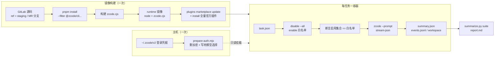
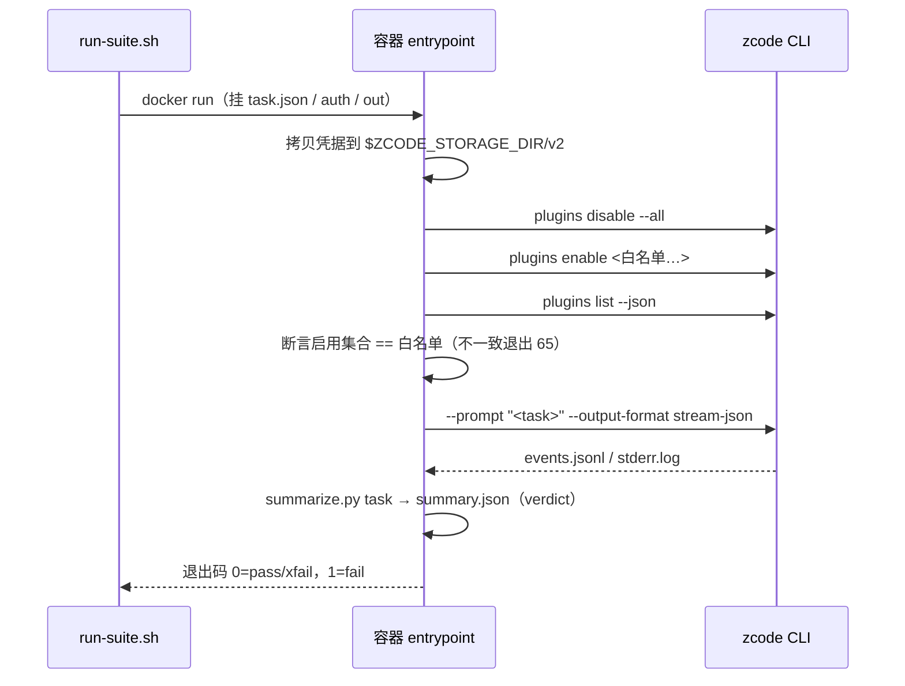

# Docker 全自动插件评测教程（从 GitLab 源码开始）

> 状态：配套 `zcode plugins` 子命令 MR（`docs/cli-plugins-command-parity.md`）。
> 目录：`docker/plugin-eval/`。评测编排、判分口径都在这里，CLI 内核不感知评测。

## 目标与边界

- 用 headless CLI（`zcode --prompt ... --output-format stream-json`）在 Docker 里全自动评测插件：
  内置插件 + zcode 官方市场全量，每个任务一个一次性容器，真模型。
- 镜像从 GitLab 源码构建，构建期把官方市场全部插件装进镜像；运行期按任务白名单只开被评测插件。
- 不做：多轮对话、人工打分、结果入库。判分只到「skill 是否被调用、文件是否产出、回复是否含关键词」这一层，
  更细的质量判分由外围读取 `events.jsonl` 自行扩展。

## 整体流程



## 前置条件

| 项 | 要求 |
|---|---|
| Docker | 20.10+，启用 BuildKit（默认）；能拉 `node:24-bookworm-slim` 并访问 GitLab、npm registry、`cdn-zcode.z.ai` |
| 主机工具 | bash、jq、node ≥ 20（运行 `prepare-auth.mjs`）、python3（汇总报告） |
| GitLab 访问 | 私有仓库需要一个只读 PAT（`read_repository`）；未给 `--token-file` 时脚本依次尝试 `GITLAB_TOKEN` 环境变量 → `glab` 已登录的 PAT → `git credential fill` 取本机已保存的凭据 |
| ZCode 登录态 | 本机 ZCode 已登录且选好可用 provider/模型；评测容器复用这份凭据 |
| 被测源码 | ref 必须已包含 `zcode plugins install / disable --all` 子命令（子命令 MR 合入后的 staging，或该 MR 分支） |

## 第一步：构建镜像

```bash
# 默认 ref=staging，镜像 tag = zcode-plugin-eval:<ref>
docker/plugin-eval/bin/build-image.sh

# 指定分支、走代理、显式给 token 文件
docker/plugin-eval/bin/build-image.sh --ref feat-cli-plugins-parity \
  --proxy http://127.0.0.1:7890 --token-file ~/.secrets/gitlab-ro-token
```

构建做了什么：

1. `source` 阶段 `git clone --depth 1 --branch <ref>`。PAT 通过 BuildKit secret 传入，以 `git config http.<host>/.extraheader`
   的 Basic 头（`oauth2:<token>`）只在该条 RUN 内存在，不进镜像层；克隆后删除 `.git` 与 `.gitconfig`。
2. `builder` 阶段 `pnpm install --frozen-lockfile --filter "@zcode/cli..." --filter zcode`，然后按仓库脚本
   `scripts/build-desktop-agent-cli.mjs` 的顺序构建 shared-types → contracts → core → adapters → i18n → telemetry → bootstrap → cli。
3. `runtime` 阶段只带 `node + zcode.cjs + jq/python3/git/ripgrep`，以 uid 10001 的 `zcode` 用户运行；
   `HOME=/data`、`ZCODE_DATA_BASE_DIR=/data`、`ZCODE_STORAGE_DIR=/data/.zcode`、`ZCODE_BASE_URL=https://zcode.z.ai`。
   内置插件不在 `zcode.cjs` 里，CLI 在入口文件同级的 `packages/<name>-plugin` 找根目录，所以 builder 阶段把
   document-skills、zcode-guide、skill-creator、restore-legacy-sessions 四个纯内容型内置插件 stage 到 `/opt/zcode/packages/`；
   同理 CLI 启动必读的内置 provider 目录 `config/provider/zcode-builtin.json` 放到 `/opt/zcode/provider/`。
4. 构建期执行 `zcode plugins marketplace update zcode-plugins-official`，再把 `list --available --json` 中
   `installed == false` 的条目逐个 `plugins install`，基线清单落在 `/data/plugins-baseline.json`。

构建结束脚本会打印被测源码 ref@sha 和烘进镜像的插件数（当前 CDN 市场 19 个 + 内置 4 个 = 23）。

## 第二步：准备凭据目录

```bash
# 看本机有哪些 provider 可选
node docker/plugin-eval/bin/prepare-auth.mjs --list-providers

# 生成容器用凭据目录；provider 可写名字或 id，模型 id 与 reasoning 档位必须显式给
node docker/plugin-eval/bin/prepare-auth.mjs --out ./.zcode-eval-auth \
  --provider ZAPI --model GLM-5.3-Highspeed --reasoning max
# 末尾会打印：export ZCODE_EVAL_CREDENTIAL_SECRET=...   （复制执行）
```

为什么不能直接把 `~/.zcode/v2` 拷进容器：

- `credentials.json` 的值用 aes-256-gcm 加密，默认密钥由 `platform:homedir:username` 派生。容器里三者全变，直接拷贝必然解密失败。
  脚本在主机上用本机密钥解密，再用 `ZCODE_EVAL_CREDENTIAL_SECRET` 重加密；容器运行时以 `ZCODE_CREDENTIAL_SECRET` 传入同一个值。
- headless 的模型选择只读 `provider_config.json` 的 `config.defaultModelSelection`，且必须是
  `{providerId, modelId, options.reasoningLevel}` 全形态。缺 `reasoningLevel` 时 CLI 会静默回退到第一个 provider 的第一个模型，
  表现为莫名其妙的 422 或模型名不对。脚本把选择写死，杜绝这一类漂移。
- `provider_config.json` 里自建 provider 的 API key 是明文。输出目录按 0700/0600 落盘，只读挂进一次性容器；不要提交、不要 `COPY` 进镜像。

## 第三步：写任务文件

每个任务一个 JSON，放在一个目录下（示例见 `docker/plugin-eval/tasks/`）：

```json
{
  "id": "finance-budget-variance",
  "plugins": ["run-fpa"],
  "prompt": "使用 run-fpa 插件的 budget-variance skill 做一次预算差异分析：……",
  "timeoutSeconds": 600,
  "expect": {
    "skills": ["run-fpa:budget-variance"],
    "responseContains": ["价格差"]
  }
}
```

| 字段 | 含义 |
|---|---|
| `id` | 任务 id，同时是结果子目录名与容器名后缀 |
| `plugins` | 白名单。裸 name 或 `name@marketplace`；容器会 `disable --all` 后逐个 `enable`，并断言实际启用集合与此完全一致 |
| `prompt` | 传给 `zcode --prompt` 的任务文本 |
| `timeoutSeconds` | 单次运行硬超时（默认 900），超时按失败处理 |
| `expect.skills` | 期望出现在 `tool.updated` 里的 `Skill` 调用（`payload.input.skill`） |
| `expect.mcpTools` | 期望被调用的 MCP 工具名子串 |
| `expect.files` | 期望在工作目录里产出的文件（相对路径） |
| `expect.responseContains` | 最终回复必须包含的字符串 |
| `xfail` | 写了原因就把失败记为 `xfail`（预期失败），不算套件失败 |

同名目录 `<id>.workspace/` 存在时，会只读挂到 `/task/workspace` 并拷进容器的 `/work` 作为模型 cwd，用来放 Excel、PDF 等夹具。

## 第四步：跑套件

```bash
export ZCODE_EVAL_CREDENTIAL_SECRET=...   # 第二步打印的值
docker/plugin-eval/bin/run-suite.sh \
  --tasks docker/plugin-eval/tasks \
  --out ./eval-results \
  --auth-dir ./.zcode-eval-auth \
  --image zcode-plugin-eval:staging \
  --jobs 2                       # 可选并行度；--filter 'finance-*' 只跑一部分
```

每个容器内部（`docker/plugin-eval/entrypoint.sh`）：



## 第五步：读结果

`--out` 目录结构：

```text
eval-results/
├── report.md            # 套件汇总表（任务 / 插件 / 结果 / 耗时 / skill / MCP 工具 / 未通过检查）
├── suite.json
└── <task-id>/
    ├── summary.json     # verdict、checks、skillsInvoked、mcpToolsInvoked、finalResponse、source ref@sha
    ├── events.jsonl     # 完整 stream-json 事件流
    ├── stderr.log
    ├── plugins.json     # 启用断言时的 plugins list --json
    ├── container.log
    └── workspace/       # 模型工作目录快照（排除 node_modules/.git）
```

判定口径：`exitCode == 0` 且有 `turn.completed`，再逐条核对 `expect.*`。任一失败即 `fail`；带 `xfail` 的任务失败记 `xfail`。
插件是否真被用到看 `events.skillsInvoked`，形如 `run-fpa:budget-variance`。

## 已知限制

- **官方 MCP 在 headless 不可用（待 CLI 侧补齐）**：金融十件套和 document-skills 的 `image_search` 声明的是
  `zcode_official` 鉴权 MCP，当前只有桌面 host 拉起的 agent 会注入信任源注册表与身份头，独立 CLI 全部 fail closed。
  结果是这些插件在容器里只有 skill 文本能力，没有行情/企业数据工具。示例任务 `finance-close-recap-mcp` 因此标 `xfail`。
- **模型会绕过限制**：headless 默认 yolo 权限。一次冒烟里模型在拿不到 MCP 工具时，自行用 Bash 解密了容器内的
  `credentials.json` 并手动 curl 数据接口。评测容器必须视为可读到全部注入凭据的环境：只注入评测账号、用完即弃、
  不要复用生产账号；判分时用 `mcpToolsInvoked` 而不是最终答案来判断插件能力是否真的被使用。
- **`ZCODE_BASE_URL` 必须显式设置**：插件 manifest 里的 MCP 地址写作 `${ZCODE_BASE_URL}/api/v1/mcp/...`，
  独立 CLI 不注入该变量时 `plugins list --json` 会出现 `plugin_variable_missing`，对应 MCP 直接被丢弃。镜像已内置生产值，
  打测试环境时用 `docker run -e ZCODE_BASE_URL=...` 覆盖。
- **代理**：CLI 自己的网络只认 `ZCODE_HTTP_PROXY`，不读 `http_proxy`；构建用 `--proxy`，运行用 `run-suite.sh --proxy`。
- **依赖桌面底座的内置插件不纳入**：browser-use、computer-use、ios-simulator、android-emulator 需要桌面 WebView、
  独立 MCP runtime 或模拟器，headless 容器里没有对应底座，镜像不 stage 它们，`plugins list` 也看不到。
- **`--plugin-dir`（会话级加载本地插件）尚未落地**：评测未发布插件请先 `zcode plugins marketplace add <本地目录>` 再 `install`。

## 排障

| 现象 | 看哪里 | 常见原因 |
|---|---|---|
| 构建卡在 clone / 401 | `build-image.sh` 输出 | 无 PAT 或 PAT 无 `read_repository`；`--token-file` 显式传 |
| `pnpm install` 拉 git 依赖失败 | builder 阶段日志 | `pnpm-workspace.yaml` catalog 里的 git+https 依赖同样需要 GitLab 凭据 |
| 容器退出 64 | `container.log` | task.json 缺 `id`/`prompt`，或路径没挂对 |
| 容器退出 65 | `plugins.json`、`plugins-enable.log` | 白名单里的插件名拼错、同名多市场需要写 `name@marketplace` |
| 422 / 模型不对 | `stderr.log`、`summary.json.source` | `defaultModelSelection` 不完整，重跑 `prepare-auth.mjs` 显式给 `--model --reasoning` |
| 全部 401 / auth_failed | `stderr.log` | `ZCODE_EVAL_CREDENTIAL_SECRET` 与生成时不一致，或本机登录态已过期 |
| `plugin_variable_missing` | `plugins.json` diagnostics | 运行时覆盖了 `ZCODE_BASE_URL` 为空 |
| skill 没被调用 | `events.jsonl` 中 `tool.updated` | prompt 没点名插件/skill；或插件未在白名单 |

## 验证记录

2026-09-14，macOS arm64 + OrbStack Docker 29，被测源码 `feat-cli-plugins-parity@bf05821832`：

| 步骤 | 结果 |
|---|---|
| `build-image.sh --ref feat-cli-plugins-parity` | 成功；pnpm install 约 12 分钟，镜像 427 MB，烘入 23 个插件（CDN 19 + 内置 4），`plugins list --json` 无 error 诊断，121 个 skill |
| `prepare-auth.mjs --provider ZAPI --model GLM-5.3-Highspeed --reasoning max` | 重加密 23 个凭据值，模型选择写入成功 |
| `run-suite.sh --jobs 3`（三任务并行） | `finance-budget-variance` pass 22s，`builtin-docx-smoke` pass 38s（smoke.docx 9.4 KB 落盘），`finance-close-recap-mcp` xfail 32s |

xfail 任务的模型回复明确说明 MCP 行情工具不可用并停止，没有用 Bash / curl 绕过；`toolCalls` 只有 Skill 与 Agent，无 MCP 工具，与「官方 MCP 在 headless 不可用」的已知限制一致。

## 评测脚本复用

镜像内命令面兼容 `claude plugin`：`zcode plugins install|uninstall|enable|disable --all|update|validate|marketplace ...`，
`zcode plugin` 为别名。参数与行为说明见 `docs/cli-plugins-command-parity.md`。同一套 task.json 换 CLI 二进制即可复用，
差别只在 stream-json 事件字段名。
