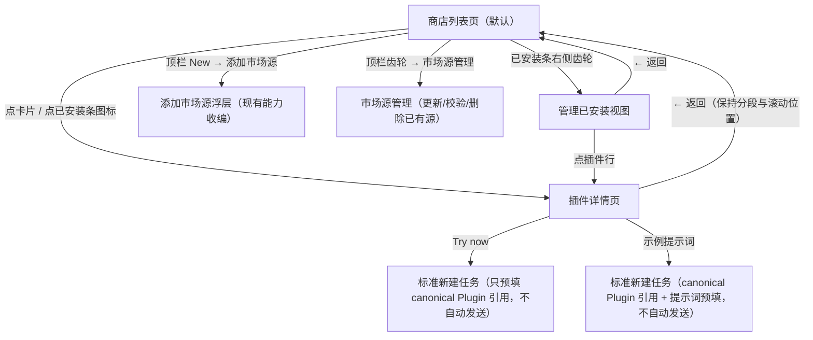
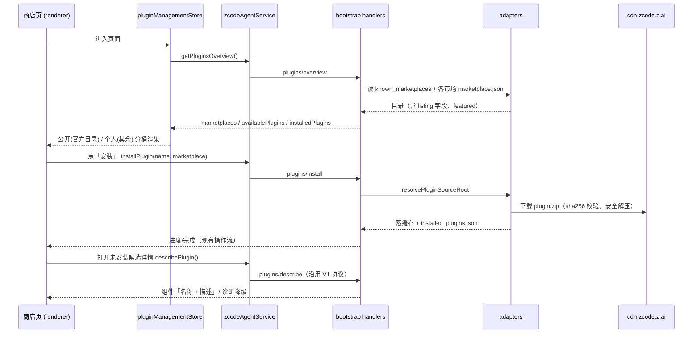

# Plugin Marketplace UI/UX 规格 V2 —— 插件商店化重设计

> 2026-07-14 全面重写。本版将插件设置页重做为展示型的"插件商店页"，
> 取代 2026-06 版的「Installed / Marketplace 双 tab + 左侧市场切换栏」信息架构。
> 旧版 IA、按市场分组限量策略、浏览页布局等章节整体作废（内容见 git history）；
> 仍然有效并被本版继承的规范：`plugins/describe` 按需组件详情协议、CLI 权威组件枚举
> （`ZCodePluginInfo.components`）、诚实降级原则、「名称 — 描述」两行体渲染。
>
> 术语以根目录 [CONTEXT.md](../CONTEXT.md) 为准；关键决策见
> [ADR-0001（listing 放目录层）](./adr/0001-store-listing-in-marketplace-catalog.md)、
> [ADR-0002（有意偏离 DESIGN.md 克制风格）](./adr/0002-plugin-store-style-deviation.md)。

## 背景与目标

列表页与详情页的视觉与交互：

- 列表页：大标题 + 副标题、全宽搜索框、已安装图标条（右侧齿轮）、公开/个人分段、
  Featured 大区 + 按分类区块的双列卡片流，各组默认全部展开，支持手动折叠。
- 详情页：大 icon + 名称 + 一句话描述、右上「…」与「立即试用」、hero 图内嵌示例提示词
  胶囊、长描述、「MCP 服务器」「技能」等组件分区、「信息」区（开发者/类别/版本/网站/
  隐私政策/服务条款）。

公开分段对应官方市场 `zcode-plugins-official`（内置插件 + CDN zip 插件，目录源
`https://cdn-zcode.z.ai/zcode/official-plugin/marketplace.json`）；个人分段承载其余一切
个人来源（claude-plugins-official、用户自加市场、inline）。

### 官方市场单一身份与合并合同

`zcode-plugins-official` 是 ZCode 官方市场唯一 id。内置插件和 CDN 插件不是两个市场，
而是同一市场的两个目录分片；不得再注册、展示或生成 `zcode-plugins` 市场及
`<name>@zcode-plugins` 插件 id。

```text
应用内置目录分片 ─┐
                  ├─ 按 name 合并（CDN 优先）─> zcode-plugins-official/marketplace.json
CDN 目录分片 ─────┘                    └─ 所有插件 id: <name>@zcode-plugins-official
```

边界决策（2026-07-15 用户确认）：

| 边界     | 决策                                                      | 剪枝 / 非目标                                  |
| -------- | --------------------------------------------------------- | ---------------------------------------------- |
| 市场身份 | 内置与 CDN 统一使用 `zcode-plugins-official`              | 不保留 `zcode-plugins` alias，不迁移旧测试数据 |
| 刷新语义 | 刷新官方市场只替换 CDN 分片，再与当前应用内置分片重新合并 | CDN 刷新不得删除或改写内置插件缓存             |
| 同名冲突 | CDN 市场条目优先，忽略内置分片中的同名目录条目            | 仅改变合并目录选择，不删除或改写应用内置缓存   |
| 更新来源 | 内置分片随应用版本更新；CDN 分片由市场刷新更新            | 不把内置插件二进制改成 CDN 热更新              |
| UI       | 市场源管理只显示一个可刷新的 ZCode 官方市场               | 不显示独立的内置 source 行或 CDN source 行     |

状态所有权与持久化：

| 状态                   | 权威来源                                                         | 本地投影                                               | 验证证据                |
| ---------------------- | ---------------------------------------------------------------- | ------------------------------------------------------ | ----------------------- |
| 内置目录分片           | 当前应用 bundle / SEA assets                                     | 官方市场目录下的内置分片快照                           | seed 单测、cache marker |
| CDN 目录分片           | 官方 CDN manifest                                                | 官方市场目录下的 CDN 分片快照                          | refresh 单测、网络响应  |
| 合并目录               | 上述两个分片按 name 合并                                         | `marketplaces/zcode-plugins-official/marketplace.json` | overview / install 单测 |
| 市场 source 与刷新时间 | `known_marketplaces.json` 中唯一的 `zcode-plugins-official` 记录 | UI marketplace summary                                 | 协议结果、设置页        |

接受的回归 case：

| Case                      | Setup                        | Action                  | Assertions                                           | Evidence                |
| ------------------------- | ---------------------------- | ----------------------- | ---------------------------------------------------- | ----------------------- |
| `official-merge-initial`  | 新 storage，仅应用内置分片   | 打开插件页              | 单一官方市场；内置插件可见；source 指向 CDN          | manifest + overview     |
| `official-merge-refresh`  | 已有内置分片，CDN 返回新插件 | 刷新官方市场            | 新插件使用 `@zcode-plugins-official`；内置插件仍存在 | manifest + protocol     |
| `official-merge-conflict` | CDN 含与内置同名条目         | 刷新官方市场            | 保留 CDN 条目并忽略内置同名目录条目                  | manifest + adapter test |
| `official-merge-reseed`   | 已缓存 CDN 分片              | 重启/重新 seed 内置插件 | CDN 条目仍存在；合并目录按新内置分片重建             | filesystem test         |

桌面端、Web 端和手机端共用 `IPluginManagementService` 与同一 CLI storage 合同，本次不新增
client mode、workspace identity 或 replayable 分支；代表性 UI 单测覆盖共享组件，运行时用
桌面 CDP 验证刷新交互。conversation E2E 状态空间不受影响，因此不修改 conversation case catalog。

## 非目标（本期不做，YAGNI）

| 项                                                                         | 原因 / 未来锚点                                                                                                                                                        |
| -------------------------------------------------------------------------- | ---------------------------------------------------------------------------------------------------------------------------------------------------------------------- |
| MCP server / skill 的**单项启停开关**（每行的 Switch 与 MCP 行齿轮） | 后端只有插件级 `plugins/setEnabled`。本期组件区**只列表不带开关**；单项开关需要新增 per-component 禁用配置 + 协议方法 + 运行时（MCP 合并、skill 发现）生效，另轮迭代。 |
| 顶栏「插件 / 技能」双 pill tab                                             | 技能是独立设置区，本期不合并。                                                                                                                                         |
| 顶栏「本地 / 远程」下拉                                                    | 现有 SSH 远程同步入口收进管理已安装视图，不做视图切换。                                                                                                                |
| 「新建插件」脚手架                                                       | 顶栏 New 按钮本期只直接打开「添加市场源」。                                                                                                                            |
| 公开/个人分段行右端的筛选/排序图标                                         | 语义未定义，分类区块已承担导航，先省略。                                                                                                         |
| 评分、下载量、README 渲染                                                  | 无数据源。                                                                                                                                                             |

### Lifecycle E2E 已知缺口

2026-07-15 的插件管理 lifecycle case 只对当前已有、产品语义已确认的入口建立绿色合同。
下列入口与规格或底层能力不一致，登记为 bug candidate，不在本轮 E2E 中通过绕过 UI 或
放宽断言掩盖：

| Bug candidate                   | 当前事实                                                                | 本轮测试边界                                   |
| ------------------------------- | ----------------------------------------------------------------------- | ---------------------------------------------- |
| 安装取消入口缺失                | 安装按钮只显示 loading/disabled，协议虽有取消能力但商店 UI 没有取消动作 | 验证安装中的 busy 状态，不宣称取消已覆盖       |
| 来源 Validate/Diagnose 入口缺失 | 添加来源会做校验，来源管理页只暴露更新和删除                            | 覆盖添加校验、更新和删除，不宣称独立诊断已覆盖 |
| Inline 插件暴露卸载             | 商店通用菜单会渲染卸载，但 inline 没有 marketplace 安装记录可供正常卸载 | 只覆盖 inline 展示与可用性，不执行卸载         |

### 删除 Personal Source 的已安装插件语义

删除来源只移除目录发现与更新关系，不级联删除已经安装的插件、配置或数据。插件进入
`Orphaned Installed Plugin` 状态后仍保留在已安装条、详情和管理页，继续支持配置、启停、
运行与卸载；更新入口必须隐藏或禁用，并给出来源缺失的诚实提示。重新添加同一来源后，
插件恢复目录详情与更新能力。完整决策见
[ADR-0003](./adr/0003-marketplace-source-removal-keeps-installed-plugins.md)。

## 信息架构

插件设置页的内容区整体替换为**插件商店页**（宿主不变：仍在 Settings → 插件 section，
不动全局导航与 `SettingsPage` 容器）。三个视图：



视图间为同容器内切换（沿用现有 list↔detail 就地切换模式），不新增路由。

## 列表页规格

自上而下：

### 1. 顶栏

- 左：无（「插件/技能」tab 不做）。右侧操作组，顺序如下：
  - **刷新**（Manual Refresh）：触发 `plugins/marketplace/update(null)`（全部市场），复用现有 loading 态；不受自动刷新节流限制。
  - **目录自动刷新**（Catalog Auto-Refresh）：进入商店页后只刷新 `zcode-plugins-official`，
    判据为 `now - max(lastUpdated, lastAttemptAt) >= 10 分钟`。`lastUpdated` 来自 Host 用户级
    目录持久化；`lastAttemptAt` 是 Renderer 模块内的尝试时间，发起时占位，跨页面重新挂载保留，
    进程重启清零。窗口内的失败、在途请求不因重进页面重复发起；成功的手动刷新会更新持久时间。
    不新增定时轮询，不自动拉取 `claude-plugins-official` 或个人来源，避免未加载的 GitHub
    市场每次进入都执行长超时请求。自动刷新不弹发现更新的 toast，沿用现有 loading/错误反馈。
    桌面与 Web 共用此 UI 和服务，不改变 user inventory、workspaceIdentity 或请求路由。
  - **齿轮**：进入**市场源管理**——现有 marketplace source 管理能力换位置（列出已有源：
    更新/校验/删除/诊断）。「添加」不放这里。
    市场源行按以下规则排序：`zcode-plugins-official`、`claude-plugins-official` 固定置顶；
    其余自定义源按 `lastUpdated` 倒序排列；缺少 `lastUpdated` 的自定义源沉底；同一时间按本地化
    展示名称稳定排序。
  - **New**：使用 `default`、`size="lg"` 的图标加文字按钮，直接打开「添加市场源」，收编现有 AddMarketplacePopover 的
    github / git / URL / 本地路径（含拖放）能力。零后端新增。

「添加插件市场」与「市场源」弹窗统一使用 `text-ui-lg` 标题、`text-ui-base` 正文及辅助信息。
添加弹窗的文字操作按钮使用 `size="lg"`；市场源行内纯图标操作使用 `size="icon-lg"`。
输入框保持 `size="lg"` 的组件标准高度，不额外覆盖高度。

插件详情标题右侧动作遵循设置页统一尺寸：更多菜单使用 `outline + icon-lg`，并承载
启用/禁用操作；标题行不单独显示 `Switch`。Try now 与安装按钮使用 `size="lg"`。Try now
使用按钮默认圆角，不继承 Hero 提示词的胶囊圆角；Hero 区提示词动作保留胶囊圆角。
动作组垂直居中排列，列表卡片仍使用紧凑尺寸。

### 2. 标题区

- Display 级大标题「插件」+ 副标题一句（ZCode 措辞，i18n 双语；实施时定稿文案）。

### 3. 搜索框

- 全宽、圆角、放大镜前缀，placeholder「搜索插件」。
- 中文名称支持无声调全拼和首字母（feishu、fei shu、fs），英文界面也使用 listing 中的中文名。与管理页共用匹配器，不做错字模糊匹配或改变排序。
- **搜索范围横跨公开 + 个人**（沿用现有全量搜索逻辑）。输入非空时，分段/Featured/分类
  布局让位于统一的搜索结果卡片流（双列，同卡片样式），清空恢复。

### 4. 已安装条（Installed Strip）

- 2026-09-15 裁切修复：横向滚动视口必须为右上角更新按钮、悬停缩放和键盘焦点环预留空间；首项左侧与末项右侧也不得裁切，名称提示框不得覆盖更新角标。保持图标的原始对齐、顶部间距及横向滚动能力，桌面与手机 Web 共用样式。布局由 `PluginStoreListView` 独占负责，不改变更新命令或安装状态。

- 一排已安装插件 icon（含内置），官方 PDF、PPT、Excel、Word 按此顺序优先，其余内置/inline 插件按展示名称稳定排序；
  其余市场安装插件按安装时间倒序，溢出横向滚动。
- 鼠标悬停或键盘聚焦 icon 时，使用应用统一 Tooltip 显示插件名称。
- 点 icon → 该插件详情页。
- 行首标题「已安装」，行尾**齿轮 → 管理已安装视图**。
- Installed Strip 的图标保持资源原始不透明度，不根据启用状态整体降透明度；启用状态在
  「管理已安装」视图中表达。
- 有可更新的插件（`canUpdatePluginItem`，孤立插件排除）在 icon 右上角叠加 `size-4` 圆形
  更新按钮（success 底色 + `Download` 图标，更新中转 spinner），点击原地触发更新，不必进
  详情页；任一插件操作进行中时禁用。
  > 2026-09-02 修订：此前更新入口只藏在详情页「高级信息」折叠区，用户检查更新后看不出
  > 哪个插件可更新、也找不到入口。已安装条、卡片、管理已安装视图三处统一暴露角标与
  > 行内更新入口，判定复用同一 `canUpdatePluginItem`。

### 5. 公开 / 个人分段

- pill 分段控件，默认「公开」。切换只改下方目录内容，搜索框与已安装条不变。

### 6. 公开分段内容

- **Featured 大区**：名单来自 CDN 目录顶层 `featured: string[]`（按序）。区标题
  "Featured"（i18n）。双列卡片。
- **分类区块**：其余插件按 `category` 聚合，默认全部展开。超过 6 张卡片时保留“收起”入口；
  用户手动收起后只展示前 6 张，其余折叠为底部一行：`[前 3 个的小 icon] 查看 A、B，以及另外 N 个`，
  点击可再次展开。本次不按数量自动折叠，新出现的分组也默认展开；当前页面内保留用户手动选择。无 `category` 的插件归入「其他」区（默认排最后）。
- 分类及分类内插件支持服务端按界面模式下发排序，详见
  [模式排序契约](plugins/plugin-store-mode-order.md)。编程模式使用 `code`，通用模式使用
  `work`；未配置项按原顺序追加，显式配置允许调整「其他」的位置。精选及其余列表不受影响。
- 分类区块的标题 Divider 使用 `surface` 语义色；上下 padding 合计 32px（上、下各
  16px），相邻分类之间形成稳定的 32px 间距。该间距只作用于目录分类，不改变搜索、
  Installed Strip 或分段控件的布局。
- 已卸载的**内置插件**（可恢复）正常出现在公开分段，卡片按钮为「安装」（走
  `plugins/restoreBuiltin`）。
- 分类显示名走 i18n 已知映射（如 `productivity` → 生产力/Productivity），
  未知 category 原样展示。
- 指南类目已并入实用工具，旧 `guides` 目录缓存也归并到 `utilities`。`legal` 显示为
  法律/Legal，沿用有插件才展示区块的规则；当前不新增法律插件。

### 7. 个人分段内容

- 按市场分组展示各个人来源的候选插件（组标题 = 市场显示名），组间按 `lastUpdated`
  倒序——最近刷新/添加的市场在最上（添加成功跳转过来第一眼就能看到）；无刷新时间的
  沉底，同刻或都缺失时按显示名字母序兜底。组内双列卡片，默认全部展开，沿用公开分类相同的手动收起/展开行为。
- inline 插件与本地目录市场同样成组展示。
- 推荐区（Recommended）已下线：个人分段不再置顶仓内策展名单。

### 8. 卡片

- 结构：icon（40px 圆角）· 显示名（粗体）· 一行截断描述 · 右侧操作。
- 右侧操作：未安装 → 「安装」胶囊按钮（安装中转 spinner，可取消，沿用现有操作流）；
  已安装 → 「…」菜单：启用/禁用、更新（仅当有更新且来源仍存在）、卸载
  （卸载走现有确认弹窗）。
  > 2026-07-17 修订：双列商店卡片保持紧凑，不再重复展示插件级 Switch；启停仍可从
  > 「…」菜单操作。需要显式查看当前启用状态时，详情页头部和「管理已安装」视图继续
  > 提供可见的插件级 Switch（单项组件开关仍在非目标清单，见 ADR 边界）。
- 已安装且有可更新时：标题右侧追加「可更新」角标（`Download` `size-3` 图标 +
  `settings.plugins.list.updateAvailable`，success 语义色胶囊，`text-ui-sm`，与套餐徽标
  同规格并列）；右侧操作区在「…」菜单前追加「更新」胶囊按钮（更新中转 spinner），
  「…」菜单里的更新项保留。角标与按钮的显示条件与详情页更新入口完全一致。
- 点击卡片主体（非按钮区）→ 详情页。

## 详情页规格

自上而下，单列居中（max-width 按设计稿）：

1. **头部**：大 icon（64px）后，显示名与操作保持同一水平行：
   `显示名 | 插件级启停 Switch | 「…」菜单 | Try now / 安装`。显示名允许收缩截断，
   操作区不收缩；一句话描述与来源缺失提示独占下一行，不得夹在显示名和操作之间。
   - **插件级启停 Switch**（已安装且有 runtime info 时，状态显性化）。
   - 「…」菜单：与卡片菜单一致（启用/禁用、更新、卸载）；孤立插件在来源重新关联前
     不显示更新项。
   - 主按钮：已安装 → 「立即试用 / Try now」；未安装 → 「安装」。
     点击「立即试用」复用 Root 标准新建任务动作，只预填
     `[@Plugin](plugin://stable-id)` 结构化 mention，不附加示例文本、不自动发送。
2. **Hero 区**（有 `heroImage` 才渲染）：圆角横幅图，其上垂直堆叠**示例提示词胶囊**
   （来自 `examplePrompts`，每颗：文档产品 icon + 插件名前缀 + 提示词 + → 按钮）。Document Skills
   示例使用随 UI 打包的 `documents@2x.png`、`pdf@2x.png`、`spreadsheets@2x.png`：DOCX/Word
   映射 documents，PDF 映射 pdf，XLSX/Excel/CSV 映射 spreadsheets；无法识别时回退 documents，
   不重复展示插件头像。
   桌面横幅采用约 `3:1` 的宽矮比例与大圆角，手机端保留最小高度；底层复用引导弹窗
   `ThemeHeroVisual` 的主题感知彩色渐变与光斑，图片以半透明方式叠加并增加轻量暗色遮罩。
   无图片、图片透明或加载失败时仍保留彩色背景，不退化为普通按钮列表。
   提示词在视觉中心按内容自然宽度排列。胶囊使用深色半透明背景和大圆角，正文允许换行、
   不做单行截断；插件名使用弱化颜色，提示词使用主要白色，箭头置于独立圆形弱表面中。
   点击胶囊 → 复用与「立即试用」相同的 Root 标准新建任务动作，退出 Settings 并把
   `[@Plugin](plugin://stable-id) + 空格 + 示例提示词` 预填进输入框，**不自动发送**。
   canonical 链接必须复用 Composer `@` Picker 的构造器，Agent 侧仍只认 destination stable ID，
   不新增第二套 Plugin 引用状态。插件未安装时点击胶囊先引导安装（等价于点「安装」），
   留在详情页且不新建会话；安装完成后再次点击才进入草稿。
   无 `heroImage` 但有 `examplePrompts` → 无图纯胶囊列表；两者皆无 → 整区不渲染。
3. **长描述**：listing `description`（按 locale 取 `description_i18n`，回退 `description`）。
4. **组件分区**：按 「MCP 服务器」「技能」「命令」「子智能体」「Hooks」顺序，
   仅渲染非空组。每区：区标题 + 数量角标 + 分隔线 + 条目行（小 icon/字母头像 + 名称 +
   截断描述），同一行样式套用到全部五类。**本期无单项开关、无行内齿轮**（见非目标）。
   资源图标必须与各设置列表保持同一语义：MCP 服务器使用 `Server`、技能使用
   `WandSparkles`、命令使用 `Terminal`、子智能体使用 `Bot`、Hooks 使用 `Anchor`；
   详情页不得另建一套近似但不一致的图标映射。
   - 数据源不变：已安装 → `ZCodePluginInfo.components`（CLI 权威枚举）；
     未安装候选 → `plugins/describe` 按需拉取（loading / 失败降级 / 缓存规则沿用 V1：
     失败回退 componentTypes 标签 + 诚实提示，绝不编造）。
5. **信息区**：标签-值两列：开发者 · 类别 · 版本 · 网站 ↗ · 隐私政策 ↗ · 服务条款 ↗。
   链接用外链图标，系统浏览器打开，仅允许 https。取值见「listing 优先级」；某行无值则整行省略。
6. Hook 明细、userConfig 配置项、rootPath 等高级信息：折叠区「更多详情」，
   沿用现有 `PluginConfigControls` 与 hook 明细渲染，不在主视觉层。有更新且来源仍存在时，
   折叠区上方显示更新提示与按钮；孤立插件不得显示该更新入口。

个人来源插件走同一详情布局，靠降级矩阵自然收敛（通常无 hero/提示词区、字母头像、
信息区仅剩 manifest 回退出的开发者/网站/版本）。

## 数据模型与 schema 扩展

### Claude 官方市场图标补齐

`claude-plugins-official` 的上游目录不保证为每个插件提供 `icon`。刷新该市场时，Agent
可以从 ZCode CDN 的
`https://cdn-zcode.z.ai/zcode/official-plugin/assets/icon-sources.json` 获取可选图标映射，
并按插件 `name` 为缺失 `icon` 的目录条目补齐：

- 仅作用于 `claude-plugins-official`；用户自加市场、inline 插件及孤立安装不按名称套用，
  避免跨市场同名插件误用图标。
- marketplace 条目自带的 `icon` 优先，映射不得覆盖。
- 映射只消费 `name`、`icon`、`mimeType`、`sha256`；素材溯源字段不得进入协议、日志或 UI。
- `icon` 必须是安全的相对 PNG 路径，最终 URL 固定落在
  `https://cdn-zcode.z.ai/zcode/official-plugin/assets/` 下。
- 市场 manifest 是主数据，图标映射是可选增强。映射下载或解析失败不得导致市场刷新失败；
  有旧缓存时继续使用旧缓存，无缓存或未命中时按统一的 Blocks 图标降级。
- 映射在 marketplace 更新阶段获取并缓存；`plugins/overview` 不为每个条目单独发起图标网络请求。
- 存量迁移：Agent 进程首次处理某个 plugin storage 的 `plugins/overview` 时，对已有
  `claude-plugins-official` catalog 启动一次后台 best-effort icon-only enrich。overview 立即返回
  现有 catalog；迁移不重拉 Git marketplace、不修改 `lastUpdated`，网络获取期间不占用 plugin
  storage 锁，只在写回前短暂加锁并重新读取 manifest。失败不影响 overview，并在下次 Agent
  进程启动后重试；补齐结果从后续 overview 开始可见。

```text
update claude-plugins-official
  ├─ fetch marketplace manifest
  └─ fetch icon-sources.json（失败可降级）
            ↓
     校验并缓存 name → icon
            ↓
     仅补齐缺失 listing.icon
            ↓
     plugins/overview → PluginStoreAvatar

existing catalog after upgrade
  → first plugins/overview returns current catalog immediately
  → background fetch/cache icon-sources.json（网络阶段不持锁）
  → acquire plugin storage lock
  → re-read + enrich cached claude-plugins-official/marketplace.json
  → later plugins/overview → PluginStoreAvatar
```

### CDN / 市场目录条目新增字段（全部可选）

`marketplace.json` 顶层已有 `name` / `description(_i18n)` / `owner` / `plugins[]`，新增：

| 字段                                     | 层级 | 类型                                   | 用途                                    |
| ---------------------------------------- | ---- | -------------------------------------- | --------------------------------------- |
| `featured`                               | 顶层 | `string[]`（插件 name）                | 公开分段 Featured 名单与排序            |
| `displayName` / `displayName_i18n`       | 条目 | `string` / `Record<locale,string>`     | 卡片/详情显示名（缺失回退 `name` slug） |
| `icon`                                   | 条目 | `string`（https URL 或包内相对路径）   | 卡片、已安装条、详情头图标              |
| `homepage`                               | 条目 | `string`（https URL）                  | 信息区·网站                             |
| `privacyPolicy`                          | 条目 | `string`（https URL）                  | 信息区·隐私政策                         |
| `termsOfService`                         | 条目 | `string`（https URL）                  | 信息区·服务条款                         |
| `heroImage`                              | 条目 | `string`（https URL 或包内相对路径）   | 详情 hero 横幅                          |
| `examplePrompts` / `examplePrompts_i18n` | 条目 | `string[]` / `Record<locale,string[]>` | hero 区提示词胶囊                       |
| `requiresPaidPlan`                       | 条目 | `boolean`（仅 `true` 生效）            | 卡片/详情标题右侧编程套餐杏色徽标        |

已有可用字段继续透传：`category`、`author{name,url?}`、`description_i18n`、`keywords`。

- 付费套餐提示：`requiresPaidPlan` 只在显式布尔 `true` 时生效，`"true"` / `1` 等歧义写法
  一律按无需套餐处理，避免目录写错就给免费插件挂上付费提示。字段描述的是「使用条件」
  （需要付费套餐才好用），不代表插件本身是收费商品——它是纯展示标记，不参与安装门禁
  与计费。命名刻意不绑定具体套餐商品名，套餐改名或文案换口径时字段不用跟着改。
- 卡片与详情标题使用杏色胶囊视觉，文案前展示 `size-3` 的小皇冠图标；浅色主题参考 `#FFE3C8` 背景与 `#4B280F` 文字，
  深色主题使用同色相的深底浅字；颜色必须通过插件套餐徽标专用 token 提供。徽标文字使用
  `text-ui-sm`，中文显示「编程套餐」，英文显示「Coding Plan」；完整条件说明保留在
  hover/focus Tooltip 中，不读取 150% 活动配置。

- 图片字段：CDN 条目用绝对 https URL；**内置插件**在仓内 `official-plugin-definitions.ts`
  补齐同构 listing 元数据。需要覆盖旧缓存或尚未发布 CDN 素材的官方内置插件，可由共享
  图标解析器按完整官方插件 id 选择客户端打包图标；当前 Documents、PDF、
  Presentations、Spreadsheets、Image Search 与 Plugin Creator 使用此路径，个人市场同名插件
  不得复用。其余 icon/hero 作为打包资源随应用分发（seed 生成 marketplace.json 时写入可解析
  的本地路径）。仅接受 https 与受控本地资源两种来源，其余 scheme 一律丢弃。
- i18n 取值规则统一：`x_i18n[locale] ?? x`。

### Wire 类型传播

listing 字段从 adapter 解析层（`PluginMarketplaceEntry`）一路透传：

- `AvailablePluginSummary` / `InstalledPluginSummary`（overview）与 `ZCodePluginInfo`
  （plugins/list）增加可选 listing 字段（displayName/icon/category/author/homepage/
  privacyPolicy/termsOfService/heroImage/examplePrompts）。
- `PluginsOverviewResult` 的 marketplace 记录增加 `featured?: string[]`。
- **manifest 回退**：CLI 侧在能拿到插件根目录时（已安装/内置/describe 已解析），
  把 plugin.json 的 `author` / `homepage` 也带上；UI 展示时 **listing 优先，manifest 回退**
  （ADR-0001）。未安装且未 describe 的个人候选没有回退值，正常省略。

### 数据流



公开/个人分桶规则（纯 UI 层，按市场 id）：`zcode-plugins-official` → 公开；
其余（含 `claude-plugins-official`、`inline`、用户自加）→ 个人。

## 降级矩阵

| 缺失                                            | 列表页                                         | 详情页                                                    |
| ----------------------------------------------- | ---------------------------------------------- | --------------------------------------------------------- |
| `icon`                                          | `bg-surface` 圆角方形容器 + 中性 Blocks 默认图标，无边框 | 同左（64px，沿用详情页圆角）                              |
| `displayName`                                   | 回退 `name` slug                               | 同左                                                      |
| `heroImage`                                     | —                                              | 无图；仍有提示词则纯胶囊列表，否则整区不渲染              |
| `examplePrompts`                                | —                                              | hero 只剩横幅图；连同 heroImage 都无则整区不渲染          |
| `category`                                      | 归入「其他」区块                               | 信息区·类别行省略                                         |
| `homepage` / `privacyPolicy` / `termsOfService` | —                                              | 对应信息行省略（试 manifest 回退后仍无才省略）            |
| `author`                                        | —                                              | 开发者行：listing → manifest → 省略                       |
| `requiresPaidPlan`（缺失或非 `true`）           | 卡片标题右侧无编程套餐徽标                     | 详情标题右侧无编程套餐徽标                                |
| `featured` 空/缺失                              | 公开分段无 Featured 大区，直接分类区块         | —                                                         |
| 图片加载失败                                    | 与缺失同（头像兜底），不出现裂图               | 同左；hero 加载失败整区按无图处理                         |
| describe 失败/超时                              | —                                              | 组件区回退 componentTypes 标签 + 诚实提示（沿用 V1 规则） |

## 管理已安装视图

现有 Installed tab 的管理能力整体迁入，不减功能：

- 每插件一行：icon + 显示名 + 版本 + 来源 badge + 更新 badge + **插件级启停 Switch**。
  更新 badge 即「可更新」角标（与卡片同一组件），紧跟显示名；有更新时行尾「…」菜单前
  额外提供行内「更新」按钮，菜单中的更新项保留。
- 行点击 → 详情页；卸载在详情页完成，更新可在行内或详情页完成。
- 顶部：启用状态筛选（全部/已启用/已禁用）、检查更新（全部）、SSH 远程同步入口
  （现有 RemotePluginSyncDialog 收编于此）。

## i18n 与主题

- 全部新文案进 `packages/ui/src/i18n/locales/{en-US,zh-CN}.ts`（`settings.plugins.*`
  命名空间延续），零硬编码。
- listing 的 `*_i18n` 字段按当前 locale 解析；分类显示名维护已知映射表，未知原样。
- 深浅主题（Zai Light/Dark）均需验证；hero 渐变与胶囊为图片/半透明叠层，
  不依赖硬编码颜色（ADR-0002：商店页留白与视觉尺度可偏离 DESIGN.md 克制规则，
  但语义 token 与可达性不豁免）。

## 验收清单

列表页：

- [ ] Settings → 插件 呈现商店页：大标题、副标题、搜索框、已安装条、公开/个人分段、卡片流，视觉符合设计稿（间距/字号/圆角/双列栅格）。
- [ ] 已安装条展示全部已安装插件 icon（含内置，中性 Blocks 图标兜底），悬停/聚焦显示插件名称，点击进详情；齿轮进管理视图。
- [ ] 公开分段 = 仅官方市场：Featured 区（CDN `featured` 驱动，可为空）+ 分类区块；各区默认完整展示；每区 >6 时可手动收起，再通过「查看 A、B，以及另外 N 个」展开。
- [ ] 个人分段 = 推荐区（recommendedPlugins.json）+ 按市场分组的其余来源（含 claude-plugins-official、inline）。
- [ ] 搜索横跨两个分段，输入时切换为统一结果流，清空复原（分段与滚动位置保持）。
- [ ] 卡片：未安装显示「安装」（含进行中/取消态），已安装显示「…」（启用/禁用、更新、卸载）；卸载有确认弹窗。
- [ ] 可更新：卡片标题「可更新」角标 + 行内「更新」胶囊、已安装条 icon 右上角更新按钮、管理已安装视图行内角标与按钮同时出现；无更新或孤立插件三处都不出现。
- [ ] 顶栏：刷新触发全市场 update；齿轮打开市场源管理（更新/校验/删除）；New 直接打开「添加市场源」，github/git/URL/本地路径与拖放全可用。
- [ ] 目录自动刷新：进入商店页自动刷新官方市场且只刷官方市场；10 分钟内重进不再刷新；刷新失败或在飞时重进不重复发起；手动刷新不受节流影响（PLM-LC-018/019）。
- [ ] 已卸载内置插件出现在公开分段并可恢复安装。
- [ ] 目录自动刷新：只刷新过期的 ZCode 官方目录；十分钟内重进、失败后重进不重复发起；手动刷新绕过节流（PLM-LC-018/019）。

详情页：

- [ ] 头部 icon/显示名/描述与右上操作（已安装=启停开关+「…」+「立即试用」，未安装=「安装」主按钮）。
- [ ] 「立即试用」只预填 canonical Plugin mention；示例提示词胶囊预填 mention + prompt；两者都不自动发送，未安装时仍只展示安装入口。
- [ ] hero/提示词/信息行按降级矩阵渲染，无裂图、无空区块、无编造字段。
- [ ] 组件分区按 MCP 服务器/技能/命令/子智能体/Hooks 渲染名称+描述，无单项开关；未安装候选走 `plugins/describe`（loading→内容，失败诚实降级，二开走缓存）。
- [ ] 信息区：开发者/类别/版本/网站/隐私政策/服务条款，listing 优先 manifest 回退，外链走系统浏览器且仅 https。
- [ ] 个人来源插件同布局自然降级，不出现官方专属区块的空壳。

管理视图与横切：

- [ ] 管理已安装视图保留：插件级开关、更新 badge、卸载、状态筛选、检查更新、SSH 远程同步入口。
- [ ] 中英文完整、深浅主题不破、窄视口（web/mobile 宽度)布局不溢出：卡片流降单列、已安装条横向滚动、详情页单列自适应。
- [ ] CDP 截图检查覆盖：列表页（公开/个人/搜索态/折叠展开）、详情页（全量 listing 与降级两态）、管理视图。

## 2026-09-16 添加菜单

顶栏 New 改为“添加 ▾”，菜单只有“创建插件”和“添加插件市场”，覆盖桌面/手机与中英文、深浅主题。本节取代旧规格“New 只打开添加市场源”的限制；创建通过内置 plugin-creator Skill 引用进入新草稿。添加市场继续复用既有对话框。详见 [插件创建入口](plugin-creator.md)。

### 缺失配置记录与商店目录（2026-09-17）

插件拆分/下架后，`plugins.enabledPlugins` 或 `plugins.options` 中可能仍有旧 ID。
Agent 保留 `source: missing` / `packageStatus: missing` 的记录作为 User/Workspace 配置诊断数据；
该配置记录自身不证明插件可以安装。商店仅从 availablePlugins、restorableBuiltins 或实际发现的插件包
构造条目：缺包且没有目录/恢复来源的记录不生成商品卡片、搜索结果或安装入口。
有目录来源的缺包插件仍可安装；可恢复内置条目和实际已安装的孤立插件保持原行为。
这项投影不删除用户配置、缓存或安装记录，适用于桌面与手机 Web 的共同商店实现。

链路：用户配置 → Agent 缺包诊断 → 协议保留诊断数据；商店 join 先保留目录/恢复条目，再仅补入真实包。
回归场景：`PLM-MISSING-CONFIG`，见生命周期 case catalog 与 coverage matrix。

### 文档插件默认排序（2026-09-17）

官方完整 ID `pdf`、`presentations`、`spreadsheets`、`documents`（均来自 `zcode-plugins-official`）
按 PDF → PPT → Excel → Word 排在已安装图标条及管理页预置分组前四位。缺少的插件跳过，停用不影响排序，个人来源同名插件不置顶。
公开分类及复用其排序的引用选择器，在同一分类内默认按上述顺序优先；服务端显式分类/插件排序仍优先，其余规则保持。
桌面/手机、中英文及深浅主题使用相同顺序。排序仅改变展示，不改安装、启停、配置或原数组。
