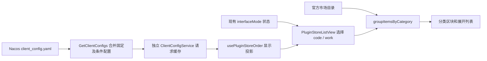

# 插件商店按界面模式下发排序

## 功能与边界

市场排序范围限定公开分段的分类区块；后续确认输入框 @ / + 复用同一配置（见文末）。按头像菜单的界面模式选择 Code / Work 排序。
`interfaceMode=coding` 对应 `code`，`interfaceMode=general` 对应 `work`，继续使用现有
Zustand、本地偏好及窗口广播机制。分类归属仍来自 marketplace listing.category。

- 只排序已有分类和插件，不创建分类、不移动插件归属、不隐藏未配置项。
- 配置项先按数组顺序显示；剩余项沿用现有顺序。other 默认最后，显式配置时可调位。
- 未配置分类：productivity、developer-tools、utilities、finance、legal、template，
  然后未知 slug 码点序，最后 other。未配置插件：官方 PDF → PPT → Excel → Word 优先，其余按本地化展示名称顺序。
- 有序列表中重复项取首次、两端空白 trim；不存在的分类或插件忽略。
  `pluginOrder` 的键使用准确 category slug，插件使用完整 ID 精确匹配。
- 单个模式无效或缺失时该模式回退默认，不继承另一个模式。空数组表示使用默认顺序。
- 市场 Featured、个人分段、全局搜索、已安装条的排序不受影响；管理已安装、安装/启停/运行时不变。单独退出展示的恢复插件见下方专节。
- 每分类默认显示 6 项，折叠预览与展开列表都使用同一份排序结果。

### 分类调整（2026-09-15）

- 取消 `guides` 类目，内置 `zcode-guide` 的目录定义改为 `utilities`。客户端把旧缓存
  `guides` 归并到 `utilities`，保留插件、安装状态及行为。
- 新增 `legal` 已知分类，中文“法律”、英文“Legal”；暂不新增插件。
- 测试环境 Code / Work 排序移除 `guides`，加入 `legal`。空分类沿用不展示规则；
  新插件未来声明 `category: legal` 后即可按服务端位置展示。
- 覆盖：旧指南与实用工具合并、无指南标题、法律标签双语、空分类不生成卡片、将来有
  法律插件时按配置排序。迁移仅改变分类投影与内置目录，不改插件 ID 或功能。
- 列表与详情页共享分类归并，旧缓存的详情也显示为实用工具。测试环境两套排序均已
  移除 `guides` 并把 `legal` 放到金融之后；真实 dev 切换两种模式验证通过。

## 配置契约

`GET /api/v1/client/configs` 的 `data.configs.pluginStoreOrder`：

```json
{
  "code": {
    "categoryOrder": ["developer-tools", "productivity"],
    "pluginOrder": {
      "productivity": ["lark-cli@zcode-plugins-official"]
    }
  },
  "work": {
    "categoryOrder": ["productivity", "finance", "other"],
    "pluginOrder": {
      "productivity": [
        "tencent-meeting-cli@zcode-plugins-official",
        "lark-cli@zcode-plugins-official"
      ]
    }
  }
}
```

以上 ID 为结构示例；发布时从实际目录复制 ID。每个模式的两个字段均可省略。
客户端在服务边界用运行时 schema 校验；格式错误不进入排序器。

## 状态归属与时序



- 使用独立 `IClientConfigService.getSnapshot({ forceRefresh? })` 读取公开字段，
  通过 `client-config` 普通 RPC 频道暴露；详见 [配置服务契约](../client-config-service.md)。
- 窗口 Local Host 配置服务是本链路唯一请求/TTL owner；远程 workspace 与手机附件复用
  同一实例。缓存按 endpoint/version/platform 隔离，1 小时有效；UI 不加 TTL 缓存。
- 仅迁移本 MR 新增的插件读取；订阅、安全校验、强更、闲时、帮助和 Built-in 的旧链路保持原样。
- 打开商店时异步读取，目录立即按默认规则显示；配置到达后按当前模式重排。
- 切换模式只重新计算，不请求、不覆盖界面偏好，不重置展开状态。
- 手动刷新并行补拉排序配置；不等待配置才刷新目录。读取失败保留当前有效投影，首次失败用默认。
- 组件卸载、服务切换、较旧请求完成后不能覆盖新投影；服务切换不能展示旧服务配置。
- 缺失字段（包括配置撤销）为成功的默认配置，必须清除旧排序。无周期轮询或持久化迁移。
- 桌面、Web、手机共用 UI/hook，通过注入的 service 读取；本功能不触及 workspace
  identity、shared-host attachment、continuous 或 replayable 的会话数据路径。

## 服务端落点

zcode-server 已支持 `ClientConfigItem.Value:any`，Nacos 更新解析成功后替换快照。
`GetClientConfigs` 合并数据库固定配置和条件配置；相同 key 后命中的条件配置整体覆盖，
不是嵌套合并。两种模式放同一个 value 原子发布，不能用两个同名 key 各放一个模式。
无需新增 Go 业务接口或迁移；服务端提供 Nacos 示例与对象顺序透传回归测试。

## 影响面（Feature Impact Brief）

改动层级：option-source、presentation。模式：planning → implementation-handoff。

| UI 场景               | 入口/共享实现                                                | 显示 owner / 默认源              | 校验与提交            | 权威/持久化           | 模式及隔离                            |
| --------------------- | ------------------------------------------------------------ | -------------------------------- | --------------------- | --------------------- | ------------------------------------- |
| 公开分类浏览/展开     | PluginStorePage → PluginStoreListView → groupItemsByCategory | hook 配置投影 / 旧排序           | 服务 schema；只读     | Nacos / Host 内存缓存 | desktop/web/mobile 共用，不改插件状态 |
| 界面模式菜单          | 原有 interfaceMode 设置                                      | Zustand / normalizeInterfaceMode | 原有 setInterfaceMode | 本地偏好及窗口广播    | coding/general 映射 code/work         |
| 精选/个人/搜索/已安装 | 同一 ListView 的各自 selector                                | 原有目录/安装态                  | 无新增动作            | 原有来源              | 排序完全隔离                          |

共享的是列表组件、配置来源与目录；各入口的筛选、排序和安装动作保留原有语义。

| 级别           | 关系                           | 证据/检查点                                                            |
| -------------- | ------------------------------ | ---------------------------------------------------------------------- |
| must-inspect   | 服务配置 → hook → 分类排序     | ClientConfigService.getSnapshot、PluginStorePage、groupItemsByCategory |
| must-inspect   | interfaceMode → 排序规则选择   | useIsGeneralMode、StoreProvider                                        |
| should-inspect | 排序 → 折叠前 6 项及其余项     | PluginStoreListView                                                    |
| invariant-only | 搜索/精选/个人/已安装 selector | pluginStoreListing、PluginStoreListView                                |
| invariant-only | 安装/运行时/workspace 隔离     | 不改管理服务或 Agent 协议                                              |
| evidence-only  | schema、服务、排序和浏览器测试 | 下方覆盖表                                                             |

CodeGraph：两个工作区均无 `.codegraph/`，按约定跳过索引，以 rg 定位实际调用方。
静态追踪深度 2：Page → ListView → groupItemsByCategory；service → provider → client/configs。
图谱漂移：已有 interface-mode 能力缺少公开商店排序语义；本次补充明确的 capability 与代码种子。
状态提交仅发生于原有界面模式设置；排序配置不写本地偏好、插件目录或任务。

## 决策与覆盖交接

用户已确认两项边界：公开分类限定；未配置项追加且 other 可显式排序。无待定产品问题。
主要维度：code/work × 有效/缺失/无效配置 × 初次/切换/刷新 × 展开/折叠。
平台/主题/语言作代表组合验证，未修改会话交付及插件生命周期，剪枝其笛卡尔积。

| ID     | 设置 → 动作 → 断言                                                       | 证据              |
| ------ | ------------------------------------------------------------------------ | ----------------- |
| PSO-01 | 同一目录和双模式配置 → 切换现有模式状态 → 分类与插件各自重排、请求数不变 | 排序单测 + 浏览器 |
| PSO-02 | 无配置/空配置/模式字段损坏 → 浏览 → 默认排序，另一模式仍有效             | schema + 排序单测 |
| PSO-03 | 重复/未知 ID、other 显式项 → 排序 → 首次有效、没有增删或跨类别移动       | 单测              |
| PSO-04 | 配置未返回/网络失败 → 浏览 → 目录可见；刷新失败保留旧投影                | hook + 服务测试   |
| PSO-05 | 两服务或较旧请求迟到 → 切换服务/刷新 → 不覆盖新结果                      | hook 测试         |
| PSO-06 | 超过 6 项 → 展开/收起 → 全部项按统一顺序且展开状态保持                   | 浏览器            |
| PSO-07 | 同页精选/个人/搜索/已安装 → 切模式 → 原有排序不变                        | 浏览器/已有单测   |
| PSO-08 | Nacos 双模式嵌套数组 → 解析/覆盖/JSON 序列化 → 两级数组顺序原样保留      | Go 测试           |
| PSO-09 | 官方恢复插件已安装且被精选 → 两种模式浏览和搜索 → 所有市场入口隐藏，个人同名插件保留 | 浏览器 + 真实 dev |

浏览器用例放 `packages/ui/test/browser/manual-review/pending/plugin-store-mode-order.*`，
使用真实 ListView、hook 和界面模式 Zustand，注入有限服务响应；不依赖模型或线上配置。
覆盖桌面/390px、中文/英文、明/暗主题。它验证共享 UI 交互，不冒充完整 Electron/远控链路验收。

## 恢复旧版会话插件退出市场展示

- `restore-legacy-sessions@zcode-plugins-official` 不再出现在商店精选、分类（含展开）、搜索及已安装快捷条中；Code / Work、桌面与手机 Web 使用同一规则。
- 由共享 `PluginStoreListView` 在分类、精选、搜索等派生前统一过滤完整插件 ID，旧目录缓存或服务端精选名单不能使其重新出现；个人来源的同名插件不受影响。
- 本次仅移除市场展示入口，保留插件包、已安装状态与插件管理页，避免隐藏入口导致已有安装无法管理。排序配置不承担上下架职责，当前下发配置未引用该插件，无需改动 Nacos。
- 浏览器回归覆盖官方插件已安装且被列入精选、两种模式、搜索和个人来源同名插件。
- 2026-09-15 两组浏览器用例通过（1200px/en-US/light、390px/zh-CN/dark）；真实 Electron dev 通过头像菜单切换两种模式，市场条目与该插件搜索结果均为零。typecheck、lint（43 条既有警告、0 错误）、架构检查通过。

## 本次验证记录

- schema、分类排序、服务缓存、hook 竞态及相邻功能共 114 个定向单测通过。
- 浏览器用例通过：1200px / en-US / light、390px / zh-CN / dark；验证真实共享组件、
  hook、Zustand 模式偏好及 DOM 顺序，包含配置延迟、失败、撤销与展开状态保留。
- `pnpm typecheck` 通过；`pnpm lint` 无错误，43 条既有警告；架构检查零违规。
- 功能图新增节点、边、代码种子校验通过；图谱基线已有 4 条悬空边，本次新增 0 条。
- zcode-server 的 config 和 application/client_config 包测试通过。
- 2026-09-15 已完成真实测试环境链路：MSE `zcode_test / ZCODE / client_config.yaml`
  仅追加 `pluginStoreOrder`，原 14 项配置内容保持不变；带原 MD5 发布并精确回读成功。
  在线测试后端 `/api/v1/client/configs` 随即返回完全一致的对象，服务端未重启。
- 当前工作区 `mise run dev` 启动 Electron，真实 Host 配置 RPC 经商店手动刷新取得新配置。
  使用头像菜单切换「编程模式 / 通用模式」，验证 Code 顺序为开发者工具、实用工具、生产力、
  金融、指南；Work 顺序为生产力、金融、实用工具、开发者工具、指南。
- Code 的开发者工具前三项为 GitHub、GitLab、阿里云 CLI；Work 的生产力前四项为飞书、
  腾讯会议、钉钉、企业微信。展开全部分类后，对照服务器配置逐项验证配置前缀顺序，
  分类成员与已安装条保持一致，切换前后展开状态保留，未新增排序配置 RPC。
- 首次打开因 Host 在发布前已缓存配置而使用旧顺序，手动刷新后生效，符合 1 小时缓存契约。
  服务端实时加载 Nacos 不等于向已经打开的客户端主动推送。
- 未运行真实手机 shared-host 联调；浏览器自动用例仍为 manual-review/pending，未宣称进入正式 CI。

## 输入框 @ / + 复用排序

- 两个入口共用 `usePluginsMentionProvider`：仅对 authority catalog 内已启用的官方插件按市场分类及类内顺序排序，展开成一列；个人来源随后保留发现顺序，冲突项可见但禁选。
- 抽取 shared 纯排序函数供市场和 Picker 共用，含 guides → utilities、默认分类顺序、other 显式排序与本地化名称兜底。配置未到/失败/撤销时 Picker 保持原发现顺序，不阻塞编辑和菜单。
- 分类是目标 Host 的可变 listing 展示信息，通过完整插件 ID join；不改变 Session 冻结的身份、能力、启用状态，不从市场补入新插件。
- `plugins/referenceCatalogWithCategory` 复用原查询实现，仅增加 category 展示字段。原方法保持旧响应结构。新版服务仅在新方法返回 -32601 时回退旧方法；其他错误原样抛出。旧目录无 category 时保留原序。
- 配置请求仍由窗口 Local Host 的 ClientConfigService 缓存与合并；Picker 打开时才请求，关闭后的迟到结果丢弃，Code/Work 切换仅本地重排。远程 workspace 保持自身 catalog authority，手机继续共用 attachment Host。

```text
workspace/session catalog ── enabled 与冲突状态 ─┐
目标 Host listing ── category（display-only）───┼─ 共用排序 ─ 搜索匹配度（同分保序）─ @ / +
窗口 ClientConfigService ── Code/Work 配置 ─────┘
```

| ID | 场景与断言 | 验证 |
| --- | --- | --- |
| PSO-10 | 同一目录在市场和 Picker 官方子集的 Code/Work 顺序一致；个人项保序 | 纯函数/Provider 单测 |
| PSO-11 | 配置未到/失败/关闭迟到/撤销不阻塞，切模式不发请求 | Hook + 浏览器 |
| PSO-12 | Session 身份冻结、category 可更新，旧方法不返回新字段，新方法补 category | 协议测试 |
| PSO-13 | 新方法 -32601 回退旧方法，其他错误不回退 | 服务测试 |
| PSO-14 | @ 与 + 实际入口同序，搜索匹配度优先、冲突禁选、禁用隐藏 | 浏览器 |

### 输入框排序验证记录

- UI/Hook/市场共用排序及服务降级：4 个测试文件、44 项通过；CLI 协议 4 项通过，覆盖旧入口字段保持、新入口分类投影、冻结 Session 及 workspace authority。
- 真实 @ / + 组件的浏览器用例：1200px/en-US/light、390px/zh-CN/dark 两组通过；既有市场浏览器回归两组通过。用例替换文件/技能/会话等非插件数据源，保留真实插件 provider、引用 Hook、配置 Hook、Lexical @ 面板及 + 菜单。
- 重启当前工作区 dev 后，真实 Host 的配置和引用目录 RPC 成功。编程模式官方插件以 GitHub、阿里云 CLI、Android 模拟器开头；通用模式以飞书、腾讯会议开头。编程模式 @ / + 已渲染的官方条目同序；个人条目尾部因虚拟滚动挂载范围不同，不以 DOM 数量推断目录全集一致。
- 根 typecheck、bootstrap typecheck、lint（43 条既有警告、0 错误）、architecture 检查通过。真实手机/远程旧 Agent 混合版本未实机联调，兼容降级由协议与服务测试验证；不发送消息、不改变会话能力或模型配置。
