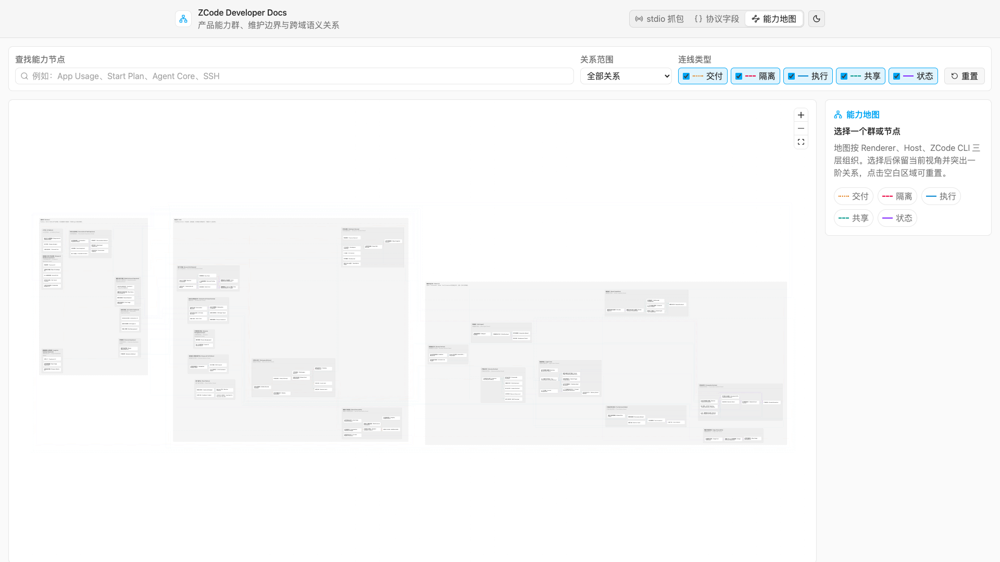

# ZCode 产品能力关系图

## 目标

本文定义 ZCode 产品能力图的维护口径。关系图不是代码目录图，也不是组织架构图，而是用来回答：

1. 产品能力主要运行在 Renderer、Host 还是 ZCode CLI，或属于产品运行时之外的工程基础设施；
2. 每个顶层区域由哪些能力群组成；
3. 每个能力群包含哪些可独立维护的能力节点；
4. 不同节点通过什么语义产生依赖；
5. 跨团队修改时，需要邀请哪些能力 owner 共同评审。

交互式关系图由 `apps/dev-docs` 承载。运行 `pnpm dev:docs` 后访问
`http://localhost:5186/?view=capabilities`。



## 图模型

```text
Top-level Area
  └─ Capability Group
       ├─ Capability Node
       ├─ Capability Node
       └─ Capability Node

Capability Node ── semantic relationship ──> Capability Node
```

- **顶层区域（Top-level Area）**：前三个区域按真实部署与状态边界划分为 Renderer、Host、ZCode CLI；第四个区域是产品运行时之外的工程基础设施。
- **能力群（Group）**：顶层区域内适合分配一个主要维护团队或负责人的能力集合，例如 Agent Core、账户权益、构建发布、测试自动化。
- **能力节点（Node）**：拥有独立产品语义、权威状态或提交副作用的可维护单元。
- **关系（Edge）**：只记录有明确产品语义的依赖，不把所有静态代码引用都画成产品关系。

## 命名规则

- 能力群、节点和 owner 统一使用“中文（English）”，中文是主要识别文本，现有英文名称保留在全角括号中。
- MCP、OAuth、CLI、UI、CDP、CUA、ARMS 等产品缩写不强制翻译，但仍应补足中文语义。
- 图中的名称描述产品能力，不直接复制目录名、类名或历史兼容层名称。

## 布局算法

关系图使用 React Flow 渲染，并采用“能力群优先”的两阶段确定性布局。节点级跨群引用只影响群的相邻顺序，不再直接把整个能力群拉到不同 Layer：

```text
群内节点 + 群内关系 ──> 每个能力群独立 ELK Layered
                              |
                              +──> 紧凑节点位置 + 群内正交路由

同层跨群节点关系 ──> 聚合为带权群关系图 ──> 关系度优先遍历
                                           |
                                           v
                                 ELK Rectangle Packing
                                           |
                                           v
Renderer -> Host -> ZCode CLI 固定层顺序
                  +
Engineering Infrastructure 位于三层下方
                  +
React Flow 跨群连线
```

- 顶层区域和能力群都使用 React Flow parent node；能力群位于唯一顶层区域内，能力节点位于唯一主要能力群内。
- 每个能力群独立使用 ELK Layered 计算节点位置与群内正交 bend points，群内关系仍参与排序和避让。
- 同一顶层区域内的跨群节点关系按 source/target 能力群聚合为带权无向邻接关系；以关系度和边权作为稳定遍历顺序，让强关联群优先相邻，但不允许单条跨群长边拉大群间层级。
- 能力群使用 ELK Rectangle Packing 紧凑装箱；Renderer、Host、ZCode CLI 保持固定从左到右的运行层顺序，工程基础设施作为独立区域居中放在三层下方。
- 布局使用稳定随机种子、定义顺序作为 tie-breaker 和确定性输入，保证相同数据得到相同布局，方便评审和截图比较。
- 布局采用紧凑间距 profile：压缩顶层区域外边距、能力群间距、群内节点间距和节点卡片宽度；文字仍使用原有 `text-ui-*` 层级，不通过缩小字体换取密度。
- 顶层区域标题、能力群标题与其子元素起始位置使用同一组几何常量；子元素必须位于标题分隔线下方，并至少保留 12px 的画布间距，双语标题、owner 和规模徽标不得侵入子元素区域。
- 跨群关系由 React Flow 按节点实际位置绘制；默认保持弱化，选择节点或群后再突出相关关系和标签，避免全量跨群线路压过群组层级。
- React Flow 负责 viewport、选择、键盘可达性和只渲染可视元素；ELK 只负责布局，不拥有交互状态。

## 实现边界

- 能力群、节点和关系的权威数据位于
  `apps/dev-docs/src/data/productCapabilityMap.ts`，不能再嵌入静态 HTML。
- 交互页面位于 `apps/dev-docs/src/capability-map/`，通过动态 import 按需加载
  React Flow 与 ELK，避免影响 stdio 和协议文档首屏。
- `docs/product-capability-map-preview.png` 是文档预览，不是权威数据或可交互实现。

## 视觉编码

- 顶层区域、能力群与节点统一使用中性色，归属关系只通过空间包含和标题表达。
- 彩色只用于连线，不用于能力群或节点分类，避免同一种颜色同时表达两种语义。
- 连线同时使用颜色、虚实线型和文字标签，不能只依赖颜色识别关系。
- 图层顺序固定为“能力群背景 → 语义连线 → 群标题与节点 → 连线标签”；连线标签是最高语义层，必须完整覆盖在节点和线路之上，不能被节点裁切或遮挡。
- 总览中同组连线比跨组连线更醒目；选择群后突出一阶关系但隐藏密集标签，选择节点后只显示该节点一阶关系的标签。
- 选择能力群或节点只更新高亮与详情，不改变当前 viewport 的缩放和位置。
- 能力图不记录具体人员分工，也不提供人员选择或人员职责高亮；能力群中的 owner 只描述建议维护角色。
- 画布滚轮用于以指针位置为中心放大或缩小；平移画布使用指针拖拽，不使用滚轮移动。
- 点击画布空白区域与点击“重置”等价：清空搜索和选择、恢复全部关系筛选，并适应全局总览。

## 代码量估算

能力群可以携带“主责生产代码量（Estimated Production LOC）”和估算置信度，用于辅助判断维护负担，但不能替代依赖影响分析：

- 产品运行时能力群按 tracked TypeScript/JavaScript 文件的非空物理行估算，包含注释，排除 docs、dist、node_modules、generated、fixtures 和 locale 数据。
- 工程基础设施能力群统计其主责工程源码：除 TypeScript/JavaScript 外可包含 CI YAML、Shell、PowerShell 和构建配置；共享 E2E harness、runner、reporter 计入基础设施，具体产品功能的 E2E case 不重复归属给测试平台。
- 孵化能力群的 LOC 只统计已经落地的产品代码；规划节点可以没有实现，不能用预估未来代码量抬高群规模。
- 每个文件只归属一个主要能力群；跨群共享基础设施、Workflow、通用协议、开发工具和无法稳定判断 owner 的代码不强行摊派。
- 群标题使用中性紧凑徽标显示 `≈23.6k LOC`；选择群后，详情面板显示完整估算行数和置信度。
- LOC 只作为元数据，不参与 ELK 排序、群面积、节点面积或连线路由计算，避免大群在线性缩放下吞没小群。
- 代码量是人工审计快照，不是构建时实时指标。能力边界、目录归属或大规模重构变化后，应重新审计并更新权威数据。
- 测试代码可在专项审计中单独统计；由于端到端测试经常覆盖多个群，本图默认不把测试行数写入群标题。

## 能力群复杂度指标

能力群标题同时展示 `LOC · 入 · 出` 三个维度，用于区分代码规模、被依赖程度和对外依赖程度：

- `LOC` 沿用主责生产代码量估算。
- `入度（In-degree）` 是目标节点属于当前群、源节点属于其他群的有向能力边数量。
- `出度（Out-degree）` 是源节点属于当前群、目标节点属于其他群的有向能力边数量。
- 同一对能力群之间的多条节点级关系分别计数；群内关系不计入群级入度或出度。
- 入度和出度始终基于完整权威关系图计算，不随关系类型开关或“仅跨群关系”筛选变化，避免指标因浏览状态漂移。
- 三项指标保持独立展示，不合成为单一分数。LOC 表示维护规模，入度更接近被依赖和变更影响面，出度更接近集成负担；三者量纲不同，直接加权会制造缺乏依据的精确感。
- 选择能力群后，详情面板应分别解释完整 LOC、入度和出度；标题徽标只提供紧凑概览。

## 连线类型

| 类型        | 含义                                   | 示例                                                      |
| ----------- | -------------------------------------- | --------------------------------------------------------- |
| `state`     | 状态投影、权威事实或持久化关系         | ProductProjection 向 Conversation UI 投影                 |
| `runtime`   | 触发执行、调用或运行时承载             | Automation Scheduler 触发 Agent Turn Runtime              |
| `shared`    | 候选项、组件、配置或扩展资源共享       | Provider Registry 向 Model Selector 提供候选              |
| `delivery`  | 跨进程、跨端交付或恢复路径             | Mobile Replayable 经 Shared Host Attachment 进入同一 Host |
| `invariant` | 必须保持隔离、不得越权或不得共享的边界 | Task Index 不得成为会话正文权威源                         |

## 三层运行边界与工程基础设施

```text
Renderer（Desktop / Web / Mobile）
  Composer / Settings / Timeline / Charts / Workbench UI
                         |
                         | intent、query、projection subscription
                         v
Host（Local / SSH / WSL / Docker / Shared Host）
  platform services / process supervision / routing / attachment
                         |
                         | ZCode Protocol / service RPC
                         v
ZCode CLI
  AgentRuntime / CommandInbox / ProductProjection /
  session event journal / usage SQLite
```

| 运行层                    | 拥有的状态或副作用                                                                                         | 明确不拥有                                              |
| ------------------------- | ---------------------------------------------------------------------------------------------------------- | ------------------------------------------------------- |
| 渲染层（Renderer）        | 输入草稿、选择态、筛选范围、图表 range、UI projection cache                                                | Agent 运行态、会话正文、CLI queue、usage 事实           |
| 宿主层（Host）            | 窗口级服务、Credential、远程连接、进程监督、附件路由、平台 IO、远端权益请求、Telemetry/ARMS 发送           | conversation 正文、Agent turn、手机 replayable 业务状态 |
| 智能体运行层（ZCode CLI） | Agent/Turn、CommandInbox、ProductProjection、session event、模型/工具执行、会话恢复、usage SQLite 权威事实 | Renderer 草稿、窗口布局、Electron 平台状态              |

- Desktop Renderer、未来 Web App 和 Mobile Renderer 复用产品语义，但通过不同 attachment 接入 Host。
- SSH、WSL、Docker 和本地窗口都由 Host 建立工作区级连接；远程工作区必须贯穿 `workspaceIdentity` 与 `remoteSessionId`。
- Host 与 relay 只路由和交付，不复制 CLI 的 conversation、queue、snapshot 或 usage 权威状态。
- 桌面 `desktop-continuous` 与手机 `web-remote-replayable` 是 Host 交付能力；二者消费同一个 CLI ProductProjection，但恢复语义不能互相扩散。
- 能力图将 `desktop-continuous` 展示为“桌面连续通信（Desktop Continuous）”；这里的 `continuous` 指完整 direct realtime 通信 profile，不是“持续交付”，也不包含手机 replayable 的 gap/snapshot 恢复语义。

工程基础设施不属于上述三层，也不参与线上请求链：

```text
Renderer  ->  Host  ->  ZCode CLI
    \           |          /
     \          |         /
      +---------+--------+
                |
                | 构建、验证、度量、发布
                v
Engineering Infrastructure
  Build & Release Engineering
  Test Automation Platform
  Quality Intelligence & Engineering Governance
```

- 工程基础设施可以构建、验证、观测和发布前三层，但不能成为 Renderer、Host 或 CLI 的线上运行时依赖。
- Host 的“客户端更新生命周期”只负责客户端检查、下载、安装和更新完成呈现；CI 打包、签名、公证、制品上传、CDN 预热、灰度/稳定发布属于“构建与发布工程”。
- 测试平台拥有共享 harness、runner、capture/replay、fixture contract、跨平台执行和晋级工具；具体功能 case 的产品断言仍由相应能力群共同维护。
- 质量数据只记录测试结果、覆盖率、失败制品、时长、趋势和工程预算，不得混入 `/report`、ARMS/RUM、Conversation telemetry 或本地 App Usage。

## 能力群

| 顶层区域  | 能力群                                                              | 维护边界                                                                                                |
| --------- | ------------------------------------------------------------------- | ------------------------------------------------------------------------------------------------------- |
| Renderer  | 对话与任务体验（Conversation & Task Experience）                    | Composer、Projection Store、Timeline、会话动作、任务导航、附件体验                                      |
| Renderer  | 模型与账户体验（Model & Account Experience）                        | Provider Settings、Model Selector、套餐状态/购买、套餐用量界面                                          |
| Renderer  | 扩展体验（Extension Experience）                                    | Plugin/Skill/MCP 等扩展设置、市场与导入入口                                                             |
| Renderer  | 浏览器与开发工作台体验（Browser & Workbench Experience）            | Browser、File、Terminal、Git/Diff 产品界面                                                              |
| Renderer  | 办公套件与计算机操作孵化（Office Suite & Computer Use Incubation）  | PDF/Office 预览与编辑路线图、Computer Use 任务体验、人工接管与安全确认                                  |
| Renderer  | 自动化体验（Automation Experience）                                 | 定时自动化、闲时任务与 Bot 配置/历史界面                                                                |
| Renderer  | UI 平台（UI Platform）                                              | 设计系统、主题、国际化、响应式、Settings/Onboarding                                                     |
| Renderer  | 数据洞察与反馈体验（Insights & Feedback Experience）                | App Usage 图表、Feedback 入口、Resource Manager（资源管理器）展示                                                     |
| Host      | 账户与权益（Account & Entitlements）                                | OAuth/Credential、Plan Identity、Start/Coding/Team Plan、支付、远端 quota/monitor                       |
| Host      | 扩展管理与同步（Extension Management & Sync）                       | Plugin 安装升级、资源贡献、跨本地/远程同步                                                              |
| Host      | 浏览器与计算机操作平台（Browser & Computer Use Platform）           | BrowserView/WebContentsView、CDP backend、Computer Use Helper 生命周期、可信 broker、系统观察与输入执行 |
| Host      | 工作区与交付（Workspace & Delivery）                                | workspace identity、Local/Remote Host、手机远控、continuous/replayable                                  |
| Host      | 工作台服务（Workbench Services）                                    | File/Terminal/Git 服务                                                                                  |
| Host      | 自动化与渠道运行时（Automation & Channel Runtime）                  | scheduler、automation record、off-peak、Bots、第三方渠道                                                |
| Host      | 客户端平台（Client Platform）                                       | Electron 生命周期、客户端更新、Feedback ticket 与诊断包                                                 |
| Host      | 数据与可观测性（Data & Observability）                              | App Usage bridge、产品埋点、Conversation telemetry、ARMS、性能可靠性、日志与进程监控                    |
| ZCode CLI | 智能体核心（Agent Core）                                            | runtime 装配、turn 状态机、上下文、memory、compact、stream recovery、goal/target、故障收口              |
| ZCode CLI | 对话运行时（Conversation Runtime）                                  | session lifecycle、input admission、CLI queue、event journal、ProductProjection、fork/rewind            |
| ZCode CLI | 模型能力（Model Capabilities）                                      | provider runtime、目录能力、token 预算、多模态、推理与工具能力                                          |
| ZCode CLI | 工具运行时与安全（Tool Runtime & Safety）                           | 内置工具、调度、权限、模式策略、工具产物                                                                |
| ZCode CLI | 多智能体（Multi-Agent）                                             | Subagent profile、child runtime、交互协调与后台任务                                                     |
| ZCode CLI | 扩展运行时（Extension Runtime）                                     | MCP、Skill、Hooks、Commands、Memory resources                                                           |
| ZCode CLI | 浏览器运行时（Browser Runtime）                                     | Browser Use Plugin、Node REPL/Playwright、Headless backend                                              |
| ZCode CLI | 用量可观测存储（Usage Observability）                               | model/turn/tool usage 事实、SQLite 30 天保留与 App Usage SQL 聚合                                       |
| 基础设施  | 构建与发布工程（Build & Release Engineering）                       | GitLab pipeline、跨平台构建、打包签名、公证、制品、CDN、灰度/稳定发布                                   |
| 基础设施  | 测试自动化平台（Test Automation Platform）                          | Desktop/CLI E2E harness、capture/replay、跨平台执行、故障注入、用例准入与晋级                           |
| 基础设施  | 质量数据与工程治理（Quality Intelligence & Engineering Governance） | E2E 报告、覆盖率、质量趋势、静态门禁、工程性能与失败制品                                                |

## 套餐、App Usage 与可观测性边界

```text
Renderer
  套餐状态/购买 UI ─────────────> Host Subscription & Billing
  套餐用量 UI <────────────────── Host Plan Quota & Monitor <── Coding / Team Plan backend
  Start Plan UI <──────────────── Host Start Plan balance       （不走 monitor）

  App Usage Dashboard
          ^
          | snapshot
Host      |
  App Usage Protocol Bridge       Product Telemetry / ARMS / Logs
          ^                                  |
          | usage/stats                      `--> 外部数据与诊断后端
ZCode CLI |
  App Usage SQL Aggregation
          ^
          |
  model_usage / turn_usage / tool_usage SQLite（30 天）
          ^
          |
  Model / Turn / Tool lifecycle facts
```

- Personal Coding Plan、Team Plan、Start Plan 是三套不同 entitlement 身份，必须拆成独立节点。
- Start Plan 使用 OAuth zcode JWT 与 balance/daily quota；它不使用 Coding Plan monitor API。
- Team Plan 使用 organization/project/project-key 隔离，不能退化为个人 Coding Plan 的显示标签。
- Plan Quota & Monitor 是远端商业套餐数据；失败时不得回退 App Usage。
- App Usage 是本地产品使用统计。权威源是 ZCode CLI 默认
  `~/.zcode/cli/db/db.sqlite` 中独立语义的 `model_usage`、`turn_usage`、`tool_usage` 表，
  经 `usage/stats` 协议提供给 Host 和 Renderer；它不是计费账本。
- `/report` 产品埋点、ARMS/RUM、Conversation telemetry、日志基础设施和 App Usage 是不同通道，
  不能再合并成一个 `telemetry` 或 `usage-quota` 节点。

## 智能体核心与对话运行时边界

智能体核心不再压缩成 Turn、Context、Compact、Session 四个节点。ZCode CLI 内至少要区分：

```text
Agent Core
  Runtime Bootstrap
  Turn Orchestration
  Context Assembly
  Memory Recall & Write
  Context Compaction
  Model Step / Streaming Recovery
  Goal / Target Continuation
  Runtime Fault Recovery

Conversation Runtime
  Session Lifecycle & Resume
  Input Admission / Queue / Steering
  Command ACK / Dedupe / Recovery
  Session Event Journal
  ProductProjection
  Branch / Retry / Rewind
  Session Store
```

- Agent Core 负责一轮工作如何执行；Conversation Runtime 负责多轮产品状态如何接纳、持久化、投影与恢复。
- Model Capabilities 提供模型目录、limits、modalities 与 provider options；模型步骤的流式顺序、背压和 durable event 收口属于 Agent Core。
- Tool Runtime 拥有 registry/scheduler/executor/permission；Agent Core 只消费工具生命周期结果继续 turn。
- Extension Runtime 拥有 MCP/Skills/Hooks/Memory resource 的发现和加载；Agent Core 拥有它们如何进入上下文与 turn。
- Multi-Agent 拥有 child runtime 和 broker；每个 child 内部仍复用 Agent Core，但 raw child 事件不得直接污染父会话投影。

## 模型能力边界

模型能力是独立核心能力，不归属于智能体核心，也不与账户权益合并。它同时向运行时和多个产品入口提供模型事实：

```text
模型供应商注册表（Provider Registry）
               |
               v
模型目录与能力元数据（Model Catalog & Capabilities）
        |              |                 |
        |              |                 +--> 推理与工具能力（Reasoning & Tool Capabilities）
        |              +--------------------> 多模态能力（Multimodal Capabilities）
        +-----------------------------------> 上下文与输出预算（Context & Output Limits）
               |
               v
模型选择器（Model Selector）
        |
        +--> 发送消息 / 当前会话（Composer / Conversation）
        +--> 子智能体配置（Subagent Profiles）
        +--> 定时自动化（Scheduled Automation）
        +--> 闲时任务、机器人（Off-Peak / Bots）

上下文与输出预算 ──> 模型运行时（Model Runtime）
        |
        +────────────> 上下文压缩与记忆（Compact & Memory）
```

- 模型目录拥有 `contextWindow`、`maxOutputTokens`、输入输出模态、reasoning、tool call 和 structured output 等能力事实。
- `contextWindow - maxOutputTokens` 共同决定输入预算和 compact 阈值；模型输出上限也进入 provider adapter 请求。
- 目录 schema 可以描述 text、image、video、audio、PDF 模态；当前 Agent 请求链已对 image、video 与 PDF 做能力 gating，audio 仍不是已交付的输入链路。能力图记录“模型目录声明”和“模型/provider wire 的有效能力”两层边界，不把目录声明误写成已经完整落地的音频运行时支持。
- 模型选择器可以复用候选构建和 UI 组件，但各入口的草稿与提交状态必须隔离：会话选择写当前 runtime / projection，自动化写 automation record，Subagent 写 profile / override。
- OAuth、Credential、Coding Plan、Usage 和 Quota 影响 provider 可用性与额度，但由“账户与权益（Account & Entitlements）”独立维护，通过关系边连接模型能力，不与模型目录或模型运行时共用权威状态。

## Office 与 Computer Use 孵化边界

Office 与 Computer Use 是跨层产品域，但不新增第四个产品运行层。Renderer 拥有预览、编辑、操作轨迹和接管体验；Host 拥有文件/转换服务与系统级 CUA 权限主体；ZCode CLI 通过 Document Skills 和 Computer Use MCP 执行 Agent 意图。

```text
Renderer
  Office Preview / Editor（PDF、DOCX/DOC、XLSX read-only current；native editing/PPTX preview planned）
  Computer Use Task / Takeover UX（permission entry current；control UX planned）
                    |
                    | intent / projection / workspace-scoped IO
                    v
Host
  File Service + Office Document Service（planned）
  Computer Use Helper Lifecycle + Trust Broker + Surface/Input Backend（macOS beta）
                    ^
                    | ZCode Protocol / per-server MCP broker credentials
                    |
ZCode CLI
  Document Skills（DOCX/PDF/PPTX/XLSX current）
  Computer Use MCP Integration（current beta）
```

- 当前 Office 产品基础是 PDF、DOCX/DOC、XLSX 的只读 Preview Pane 和官方 DOCX/PDF/PPTX/XLSX Document Skills；这不等于已经具备 Office 原生编辑器、批注/修订或 PPTX 原生预览。
- 未来 Office 原生 UI 的解析、转换、保存和版本冲突处理先保留在 Host Workbench Services 边界，Renderer 不直接引用 Node、LibreOffice 或本地路径实现。
- 当前 Computer Use 是 macOS/Windows desktop-local、显式 opt-in/kill switch 的内部 beta。签名 Helper、peer/token 校验、权限和输入执行失败时必须 fail closed。
- 手机 Web 只能经 shared-host attachment 复用桌面已存在的 Local Host；SSH/WSL/Docker 或 mobile remote Host 不得另起本地 Computer Use Helper。
- 能力图用节点 scope 区分“当前（Current）”“孵化（Incubating）”“规划（Planned）”；群级 LOC 和复杂度只反映当前代码与已确认语义边。

## 2026-08 当前能力事实补充

本次更新把近期已落地的细粒度能力纳入图谱；它们仍遵循 Renderer → Host/transport → CLI runtime 的权威状态边界。

| 能力                      | 当前事实                                                                                                                                         | 图谱边界                                                                                           |
| ------------------------- | ------------------------------------------------------------------------------------------------------------------------------------------------ | -------------------------------------------------------------------------------------------------- |
| Office 文件预览           | Preview Pane 已支持 PDF、DOCX/DOC、XLSX（只读、工作区文件服务取字节）；原生编辑、保存、批注和修订仍是规划                                        | 预览连 `file-service`；未来 Office Document Service 只承载原生编辑/转换路线                        |
| 视频输入与已发送媒体      | Composer 可附加 image/video，模型能力与 provider wire 共同决定是否可发送；已发送媒体以有序 gallery/视频预览展示，音频输入仍未交付                | 媒体预览只消费安全的 local/remote preview，不把附件草稿或媒体状态写入 relay                        |
| 本轮 Hook 摘要            | 仅真实 client-visible Hook 执行显示 Anchor/Popover 摘要，内容为来源、状态、耗时等安全事实                                                        | 从 ProductProjection 投影到 desktop-continuous 与 web-remote-replayable，不暴露命令/路径等敏感详情 |
| MCP 设置与官方 Server MCP | 设置页显示本地化 initialize/tools/list 诊断并按 `pluginId` 归属；官方 Server MCP 单独处理 auth/quota/unavailable，不能把广告能力当作 entitlement | 诊断属于 Renderer 设置投影；凭据、配额和请求状态仍由 Host/账户权益维护                             |
| 浏览器 Tab 生命周期       | Embedded Browser 有 32-tab 硬上限与进程内生命周期；`open` 默认复用 agent-owned 同站点 Tab，找不到候选才新建，`tabs.new` 语义不变                 | 复用/上限是 Browser runtime + Host 宿主事实，不新增 task-end 清理或跨进程持久化                    |
| `/plan` 快捷入口          | 空 `/plan` 只切换 Plan Mode；带任务文本时以 compare-and-set 方式切换并提交；附件场景拒绝 shortcut                                                | 这是 Composer/Commands 的 UI intent，不新增协议字段、持久化事件或第二份输入队列                    |

## 权威状态边界

```text
UI intent
   |
   v
Host service / transport
   |
   v
workspace CLI command inbox
   |
   v
Agent runtime + ProductProjection
   |
   +---- desktop-continuous ------> Desktop UI
   |
   `---- web-remote-replayable ---> Mobile UI
```

- CLI runtime / ProductProjection 是 conversation 正文和运行态的权威源。
- Task SQLite index 只拥有任务列表元数据，不拥有 session 正文。
- Desktop Main 和外部 relay 只做调度、配对和数据透传，不拥有 task/session/queue/snapshot 业务状态。
- `workspaceIdentity?.trim() || workspacePath` 用于身份隔离；`workspacePath` 用于文件和命令执行。
- 共享 UI、字段名或选项来源不代表共享草稿状态和提交副作用。

## 维护方式

新增或修改能力节点时：

1. 先确认节点的用户语义、权威状态和提交落点；
2. 先判断能力属于 Renderer / Host / ZCode CLI 运行时，还是只构建、验证、度量、发布产品的工程基础设施，再放入唯一主要能力群；
3. 只添加有明确语义的跨节点关系；
4. 如果只是测试依赖或静态可达关系，不进入产品图；
5. 涉及 desktop/mobile、local/remote 时，明确 `clientMode`、`deliveryKind` 和 workspace identity 边界；
6. 同步更新 `apps/dev-docs/src/data/productCapabilityMap.ts` 中的群、节点和关系数据。
