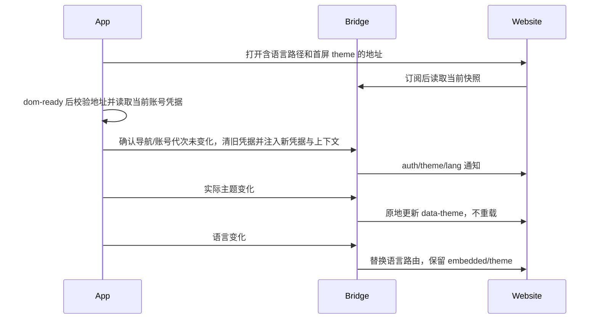

# Rewards 奖励中心内嵌接入

## 范围与归属

Windows/Linux 的奖励页及其登录入口必须保留顶部窗口按钮，关闭网页与关闭窗口是独立操作。
`marketing-touch-rewards.test.ts` 打开奖励及登录后断言窗控可见且不被遮挡；macOS 沿用原生红绿灯。

奖励中心（Rewards）菜单入口使用 Lucide `Gift` 礼物盒图标，保持 `size-4`、继承文字颜色；账户头像的 `User` 图标不变。

奖励中心入口仅在现有 user 登录状态非空时显示；未登录或退出登录后整行不渲染。桌面和 Web 共用同一条件，不新增登录状态副本。

营销 navigate 的 page=rewards 共用 RewardsProvider。网页仅接受 /{cn|en}/rewards；旧 page=referrals 与旧 /{cn|en}/referrals 均拒绝。Provider 唯一持有登录后续接的尝试 ID，取消/失败/替换即丢弃，成功且用户就绪后仅打开一次，独立于营销实例的账号切换重建。详见 marketing-touch-actions.md。

菜单入口保留「邀请好友 [奖励] / Refer a friend [Rewards]」，内嵌页面标题为「奖励中心 / Rewards」。入口文案与标题使用独立的 rewards i18n key。菜单宽度适配中英文内容，保留明暗主题与移动端支持。页面内真正的邀请好友、邀请链接、邀请记录仍使用 referral/invite 语义。

左下角头像菜单在升级下方显示「邀请好友 [奖励]」。窗口级 Rewards Provider 唯一持有打开状态，不依赖套餐库存，不更改任务、模型或设置导航。App 与 website 共用 URL/bridge 契约；邀请数据和奖励由服务端拥有，网页当前静态样例不算业务完成。Coding Plan 购买完成、渠道与主题原协议保持兼容。

## 2026-09-15 Rewards 切换验证

- App 88 项相关单测、全量 typecheck、lint、architecture 检查通过；菜单保留邀请好友和奖励徽标。
- macOS Electron 实测 3 项 E2E 通过（营销导航/单次上报、菜单/主题/语言/关闭、取消登录）。最终运行 desktop-e2e-20260915-094821-908 的退出清理曾报告进程超时，该 PID 随后已退出；功能断言通过不等于退出阶段无异常。
- Website 5 项单测、生产构建、类型检查、受影响文件 lint、浏览器中英文新路径 200/旧主页 404、真实邀请子路由与 390/900/1440px 明暗布局检查通过。全量 Website lint 仍有无关文件的既有错误，未扩展修改。
- 本次未验证生产部署、真实服务端奖励发放、Windows/Linux 原生运行；不更改任务实时链路和 Coding Plan 协议。

## 地址与模式

入口展示奖励徽标，保留原有插件徽标尺寸、6px 文案间距和礼物图标样式。

共用 EmbeddedWebsiteHeader（邀请好友与升级页）的底部内边距为 0，保留顶部 py-4 和左右 px-6 / max-sm:px-4。

布局约束：App WebView 撑满窗口可用宽度，页面滚动条位于窗口右侧；网站内部负责内容限宽居中。顶部导航位于滚动视口外固定显示，不增加 App 外层滚动容器。此修复不改变 Coding Plan 或 Web/mobile 外部打开路径。

- 本地显式开发联调：http://localhost:3000；测试：https://zcode.z.ai；正式：https://zcode.z.ai。
- `pnpm dev:desktop:test` 默认使用测试域名；`pnpm dev:desktop` 默认使用正式域名，开发模式不自动切换到 localhost。
- 本地 Website 联调显式启动：`VITE_REWARDS_WEBVIEW_ORIGIN=http://localhost:3000 pnpm dev:desktop:test`。仅覆盖奖励网页地址，App 接口仍使用测试环境；不改变语言、主题或鉴权协议。
- URL：/{cn|en}/rewards?embedded=app&theme={zai-light|zai-dark}；zh-CN 映射 cn，en-US 映射 en。
- 本地地址只允许开发/E2E；正式和测试部署校验 HTTPS origin、精确路径和 embedded 标识。拒绝用户信息、伪造子域及相似路径。
- Desktop 使用隔离 WebView；Web/mobile 使用 HTTPS 外部网页和网站登录，不把 App token 放进 URL 或传给外部浏览器。不改 desktop-continuous / web-remote-replayable、host attachment、任务权威状态。

## 状态与时序

### 奖励页请求头（2026-09-16）

最终决定：访问奖励页面不注入 App 公共请求头或 Authorization。此前请求头方案撤销；完整公共头与 Bearer JWT 仅用于 App 自身 `/event/report`，见 [上报投递合同](monitoring/event-report-delivery-reliability.md)。

```text
打开 WebView（普通网页请求） → dom-ready → 原 bridge 注入/状态同步（保留）
```

删除奖励页专用请求上下文 IPC、hook、Main 网络拦截器及对应 schema；网页加载不再等待请求头准备。

Bridge 保留登录状态、主题、语言及当前网页所需存储注入和导航/账号代次校验。Web/mobile 外部打开仍不转交 App token，不改变 task continuous/replayable。

验收 REW-17：首个请求/刷新不携带额外 App 通参或 Authorization；原 bridge/菜单/主题/语言与手机外链不变。文末早期请求头验证记录仅为已撤销方案的历史证据，不代表当前协议。

最终回归：本机 Electron `desktop-e2e-20260916-043702-139` 3/3 通过，同时确认 App `/event/report` 的登录/匿名请求头；未使用 Docker。移除专用 IPC/hook 后不再出现“请求头上下文准备”前置步骤。



## Bridge v1

### 2026-09-15 直接切换决定

- 改动层级：presentation / validation / commit-effect / persistence；既有状态归属不变。
- 页面级目录、组件、函数、类型、i18n、日志、测试标识与构建入口统一 Rewards/rewards；本地环境配置改为 VITE_REWARDS_WEBVIEW_ORIGIN，不读取旧变量。
- 新分区为 persist:zcode-rewards，新上下文事件为 zcode-rewards-context；window.zcodeBridge、OAuth/JWT key 不变。
- 不迁移、不读取、不自动清理旧 persist:zcode-referrals 分区，不订阅旧事件、不导出旧别名、不兼容旧路径，不添加重定向或切换失败时回旧页。现有非法配置校验、安全拒绝及普通 Web 无 bridge 行为不属于迁移兜底，继续保留。
- Website 的 /invite、/invite/accept、/invite/unavailable 与 /referrals/unavailable 是实际邀请业务，不属于被移除的奖励主页，保持原语义；仅旧 /{cn|en}/referrals 根页面返回 404。
- 升级、领取、营销上报、任务/session、手机 replayable 与桌面 continuous 均不改变。用户数据/奖励仍归服务端，页面展示状态归 Website，登录续接归窗口 Provider。

| 验收项 | 设置/动作 | 断言/证据 |
| --- | --- | --- |
| REW-13 | 三环境、cn/en、明暗构造并校验 URL | 仅 rewards 精确路径；旧路径、相似路径、旧配置拒绝/不读取，单测 |
| REW-14 | 安装 bridge 后分别派发新旧事件 | 旧事件不更新状态，新事件生效；分区只使用新名称，单测/桌面 E2E |
| REW-15 | 登录菜单及营销按钮打开 | Gift + 邀请好友 [奖励] / Refer a friend [Rewards]；rewards 路由、鉴权、语言主题与单次上报正常，真实 Electron E2E |
| REW-16 | Website 普通/embedded 新旧主页与邀请页 | 新页 200、旧主页 404；邀请路由不变，中英明暗与 390/900/1440px，无横向溢出，浏览器测试 |

以上用例已按用户决定 accepted；迁移/旧版本兼容组合 pruned，不增加迁移测试。沿用 REF-01…12 的原登录/桥接隔离用例 ID；初始新增 E2E 保持 pending，2026-09-16 转正决定见下文，不使用 Docker。图谱保留稳定 capability ID，增加 Rewards 别名及营销入口关系；codegraph 不可用，采用二层静态调用核对，不声称完整索引扫描。

window.zcodeBridge 提供 getTheme/onThemeChange、getLang/onLangChange、getAuthState/onAuthChange。订阅返回取消函数；读取在尚未就绪时返回 null。theme 为 zai-light/zai-dark，locale 为 zh-CN/en-US。AuthState 为 {status: ready|anonymous, provider: zai|bigmodel|null, revision: number}，ready 仅表示注入完成，不等于服务端验签成功。事件不携带 token。禁止购买完成能力出现在邀请页。

凭据 key 与购买页一致：当前渠道 oauth:zai:access_token 或 oauth:bigmodel:access_token，以及 zcodejwttoken。切账号和关闭时清除旧值；每次注入前与异步读取后都检查当前 URL、组件生命周期和账号代次，旧结果不能写进新页面。不添加主动邀请提交或鉴权失败自动业务重试。

## 影响面（静态核对）

| 层级 | 入口/共享实现 | 归属/约束 |
| --- | --- | --- |
| must-inspect | WorkspaceSidebar 头像菜单、Root | Rewards 打开独立于 Coding Plan inventory |
| must-inspect | 网页外壳、Rewards Provider | 复用展示控件，鉴权和回传分开 |
| must-inspect | desktop will-attach-webview、preload、分区清理 | 可信页面限定桥权限，不扩散到普通浏览器 |
| should-inspect | CodingPlanEmbeddedWebviewDialog | 购买导航、关闭、刷新与回传保持原行为 |
| invariant-only | 手机远控、任务流 | 不改变 runtime、队列、workspace identity |
| evidence-only | UI 单测、Electron WebView E2E、website 单测 | 断言设置、动作和结果，不以静态样例代表服务端联调 |

codegraph 不可用，以上是源码静态核对而非完整调用图扫描；语义图已补 Rewards 节点及购买壳展示复用、远控边界关系。

## 验收与交接

| Case | 设置与动作 | 断言 |
| --- | --- | --- |
| REF-01 | cn/en、三环境、明暗构建 URL | 域名、精确路径、embedded/theme 正确 |
| REF-02 | 菜单点击、重复打开、关闭 | 升级下方入口；独立容器；原任务不变 |
| REF-03 | bridge 先/后就绪，切主题 | 快照可读、通知一次、无页面重载、退订有效 |
| REF-04 | 切语言 | 路由替换并保留 theme/embedded，不携带 token |
| REF-05 | 注入/切账号/关闭/异步迟到 | 清旧值、只保留当前渠道、旧注入不生效 |
| REF-06 | 外域、相似路径、恶意 URL | 无桥/无凭据注入 |
| REF-07 | 加载失败、刷新、重开 | 可恢复且旧事件不串入新页面 |
| REF-08 | 普通网页/手机 | 无 bridge 不崩溃；不转交 App token |
| REF-09 | 回归 Coding Plan | 原购买桥与完成刷新不变 |
| REF-10 | 明暗主题下滚动邀请页 | WebView 左右边界与窗口一致；页面可滚动，顶部导航位置不变 |
| REF-11 | Banner / 独立弹窗下发 navigate rewards | 打开既有邀请页，每次 confirm 只上报一次，不触发领取 |
| REF-12 | 未登录导航后成功、取消、失败、替换登录尝试 | 同 ID 且 user 就绪才续接；取消/失败/替换后不因其他登录补跳；Web 外链只打开一次 |

2026-09-16 用户确认转正：3 条 Rewards E2E 移至 `packages/desktop/test/e2e/ui-shell/marketing-touch-rewards.test.ts`，纳入默认 spec 扫描，不使用 Docker。标准 promotion dry run 不支持 ui-shell，沿用营销领域手动迁移。正式运行由 runner 在构建前启动隔离网页 fixture 并配置随机 loopback origin，不依赖手动启动 localhost:3000；fixture 只实现网页侧 bridge 消费协议和长页滚动，不替代真实 Website 业务或视觉验收。保留之前真实 Website 联调证据，真实服务端验签、部署和发奖不在本用例范围。

转正验证：本机 macOS Electron `desktop-e2e-20260916-033102-475`，正式路径、无 MANUAL_REVIEW 开关、无网页地址手动覆盖，3/3 通过，runner exit 0。Fixture HTTP 单测 16/16、根 typecheck、desktop typecheck:e2e、lint（47 warnings / 0 errors）、architecture check 通过。未进行 Docker 准入或运行远端 CI，不将单测覆盖的账号竞态、安全边界及环境选择声称为新增 E2E。

## 2026-09-15 验证记录

- 营销 rewards 导航增量：8 个单测文件 113 项通过；3 条 macOS Electron E2E 通过，包含 Banner/独立弹窗各一次 confirm、匿名引导登录/取消且上报不带 Authorization，以及原嵌入流程。登录成功续接、用户就绪时序、取消/失败/替换和 Web 单次打开由 Provider 单测覆盖，未执行真实 OAuth 授权。E2E 退出清理有一次超时警告，检查时对应进程已退出。

- macOS Electron 实际嵌入 localhost:3000：入口位于升级下方、OAuth/JWT 注入且另一渠道清空、明暗切换不重载、中英文往返、刷新和关闭重开通过；截图在本地 E2E artifacts。
- Coding Plan 现有 BigModel 与 Z.ai 购买完成通知、关闭及 Provider 刷新两条 E2E 通过，未执行真实支付。
- URL/bridge/窗口导航/启动鉴权及 Coding Plan 相关 85 条单测、桌面命令与分区清理 18 条单测通过；website 3 条协议单测及生产构建通过。
- App typecheck、lint 与 architecture check 通过；lint 有仓库既存警告。图谱既存 4 条悬空边，本次未新增，新增源码种子已校验；codegraph 运行时索引不可用。
- 未验证：Windows/Linux 实机、手机浏览器实机、真实邀请 API、真实令牌失效响应、生产/测试环境网站部署。网站目前只订阅鉴权就绪状态，不声称服务端已验证登录或发放奖励。

## 2026-09-16 请求头验证记录

- 6 个相关单测文件共 22 项通过：覆盖请求范围、窗口身份隔离、重定向撤销、无所属窗口请求、匿名请求、账号切换迟到结果丢弃、刷新重读 JWT 及既有 bridge/导航行为。
- macOS Electron 3 条 E2E 通过，运行标识 `desktop-e2e-20260916-024814-751`。实际观察初次加载和刷新发出的请求，确认通参及无 Bearer 的 Authorization；同时回归主题、语言、关闭重开、营销导航与匿名取消。测试只记录请求头存在性，不输出凭据。
- 根 `pnpm typecheck`、desktop `typecheck:e2e`、`pnpm lint`（47 个警告，0 个错误）、`pnpm architecture:check --changed` 通过。桌面模块尚未纳入 managed 架构契约，不能将此视为完整边界证明。
- 额外对独立 main/preload/renderer TypeScript 配置作 HEAD 对照：仍有既存配置/类型诊断，未出现新的文件、错误码与消息组合；该额外检查不宣称通过。
- 本轮未验证真实服务端验签、生产/测试网站部署、Windows/Linux 及手机实机。网页业务 API 不在当前精确页面路由的请求头注入范围；bridge 保持原行为。
