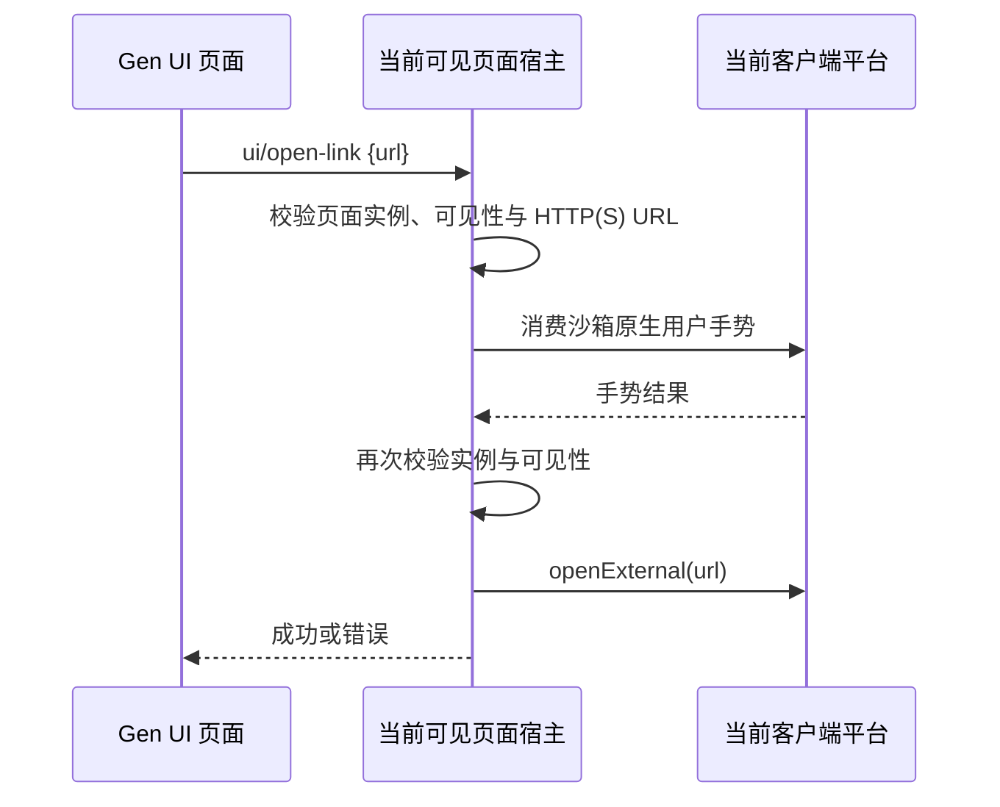

# Gen UI 外部链接

## 目标与范围

Gen UI 中的普通 `<a href="https://example.com/subscribe">` 可直接跳转；需要脚本控制时，提供 `window.zcode.openExternal({ href })`，返回 `Promise<void>`。两个入口复用同一条宿主链路，不增加其他页面 API。

## 行为契约

- 支持绝对 `http:` / `https:` URL；相对地址、`file:`、`javascript:`、`data:` 和其他协议不能通过宿主打开。
- 普通链接由页面运行时委托处理，包括动态添加的链接、链接内图标、键盘 Enter 激活、带修饰键的左键和中键点击。`target` 不改变宿主路由；卡片自身不跳转、不创建 guest 窗口。右键仍保留原有行为。
- 已被页面 `preventDefault()` 的点击不重复处理。空 href 与 `#片段` 保留页内行为。`download` 链接不转成外部打开，本次不提供下载能力。
- 外部链接须由真实用户操作触发；合成点击不打开，无用户手势的页面加载或定时调用会被拒绝。宿主复用现有近期原生手势消费机制，并在异步校验返回后重新检查页面有效性。
- 显式 API 参数为 `{ href: string }`，失败时 Promise 拒绝；普通链接失败通过既有 `zcode:error` 事件报告。Promise 确认宿主已调用平台入口，不表示浏览器已加载成功。
- 页面宿主声明 `openLinks` 能力并处理标准 `ui/open-link` 请求。外部打开函数通过依赖注入获得，不向页面暴露 Desktop preload，不放宽原有导航、新窗口和下载拦截。
- 打开动作发生在查看页面的客户端，由 `IPlatformService.openExternal` 决定实际浏览器行为；远程工作区不执行远程打开命令、不发送 Agent 消息、不新增持久状态。
- Web / 手机未提供 Gen UI 沙箱时继续使用现有 HTML 降级行为；本次不新增 Web 沙箱，也不改变 continuous / replayable 消息链路。无主题、文案或布局变化。

## 验证

在现有 Electron Gen UI 集成夹具中使用生产 guest bridge、原生手势登记和 CDP 可信鼠标/键盘事件验证：普通链接、嵌套内容、动态链接、`target`、修饰键、中键、键盘与显式 API 均只打开一次；片段、取消默认行为、下载、非法 URL、合成点击、无手势和隐藏页面不打开。拦住手势响应后隐藏页面，验证迟到请求不会打开。远程工作区卡片必须调用客户端 opener，原有状态、follow-up、布局与页面复用检查继续通过。

夹具通过 Electron 原生键盘输入登记手势，再用 CDP 可信点击/Enter 命中嵌套 iframe（CDP 本身不触发 Electron `input-event`）。最终平台 opener 被记录器替换，验证请求路由与失败传播，不启动系统浏览器。自动化覆盖不等同于实际浏览器启动或各操作系统的人工输入验收。

执行 `pnpm typecheck`、`pnpm lint`、架构门禁与 `node packages/desktop/scripts/gen-ui-e2e.mjs`。实际平台覆盖与无法运行的检查记录在提交说明中。
