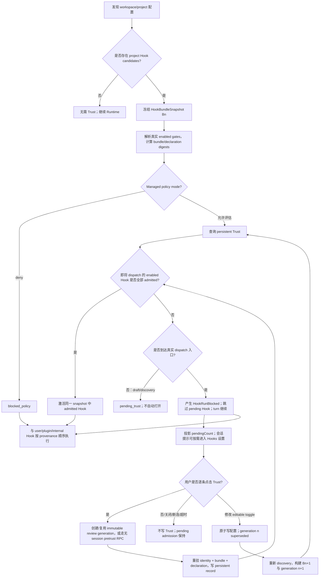
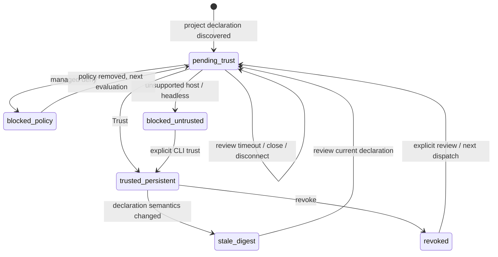

# Workspace Hook 手动 Trust 机制规格（Settings-centered）

> **2026-08-13 持久信任简化修订：** 最新产品语义见
> [`workspace-hook-trust-persistent-only.md`](./workspace-hook-trust-persistent-only.md)。
> Workspace Hook 只保留精确声明的逐条持久 Trust。本文各规范章节已按当前 schema
> 收敛；已废弃的授权状态机不再作为可执行的 NL→Code 输入。

> **交互模型（2026-08 当前事实）：** 发送 prompt 时若存在未信任 Hook，turn 不等待人工审核；
> pending Hook 本轮产生 `HookRunBlocked` 并跳过，聊天底部显示提示条。用户主动进入 Hooks
> 设置后只能逐条建立持久 Trust；已跳过的 SessionStart 不补跑。详细时序见
> [`workspace-hook-trust-soft-gate.md`](./workspace-hook-trust-soft-gate.md)。

| 字段      | 值                                                                                                                                                                                                                  |
| --------- | ------------------------------------------------------------------------------------------------------------------------------------------------------------------------------------------------------------------- |
| 状态      | 已实施；当前交互为 persistent-only + soft-gate，静态与自动化检查完成，最终真实 Desktop 人工验收由产品方执行                                                                                                         |
| 日期      | 2026-08-07                                                                                                                                                                                                          |
| 适用范围  | ZCode CLI Runtime、ZCode Protocol v4、Desktop/Web UI、Remote Workspace、Headless CLI                                                                                                                                |
| 主要对象  | workspace/project 级 `zcode.json` 与 `.zcode/config.json` Hooks                                                                                                                                                     |
| 安全基线  | 默认拒绝、显式授权、声明变化按条失效、策略拒绝优先                                                                                                                                                                  |
| 关联文档  | `docs/security/deep-link-project-trust-boundary.md`；`docs/web-remote-control/web-remote-control-architecture.md`；`docs/web-remote-control/task-realtime-sync.md`；`docs/web-remote-control-task-command-queue.md` |
| 交互方案  | `设置 → 钩子 → 工作区` 内完成审核；不使用任务页独立 Trust Dialog                                                                                                                                                    |
| 交互 Demo | `docs/specs/workspace-hook-trust-demo.html`（历史原型，已由 persistent-only 规格取代）                                                                                                                              |
| 人工验收  | `docs/testing/workspace-hook-trust-manual-acceptance.md`；fixture 由 `scripts/create-workspace-hook-trust-uat-fixture.mjs` 生成                                                                                     |

## 1. 摘要

本节摘要描述当前实现；交互和状态以
[`workspace-hook-trust-persistent-only.md`](./workspace-hook-trust-persistent-only.md) 与
[`workspace-hook-trust-soft-gate.md`](./workspace-hook-trust-soft-gate.md) 为准。本文只描述当前
持久 Trust 与 soft-gate 契约，不保留旧交互模型的规范性细节。

安全基线、隔离 discovery、Trust domain、Runtime admission、Desktop/Mobile Review、Remote
route、CLI/Headless、rollout 与 telemetry 已完成，并由 persistent-only 与 soft-gate 收敛为：

- workspace/project Hook 声明由 Runtime discovery 规范化为 immutable snapshot，未 admission 前不能进入可执行路径；
- Desktop 在 `设置 → 钩子 → 工作区` 展示 Hook 配置；未信任行只提供逐条持久“信任”，并将有效运行开关显示为关闭且不可操作；已信任行不显示额外 Trust 状态徽章；
- 无 capable Host、旧客户端、stale generation、snapshot mismatch、Trust store 失败与配置 rebuild 失败均 fail closed；
- Desktop continuous 与 Web/Mobile replayable 共享同一 Runtime review projection；response 绑定 task/run/remoteSession/runtime epoch，敏感命令只做 ACK query、不自动重放；
- Headless 提供 exact status/review/grant/revoke 与 pretrust diagnostics；trusted rollout gate、脱敏 telemetry、安全/远控/用户文档和旧诊断迁移由 Phase 6 完成。

本规格引入独立于普通 Hook 启用状态的 **Workspace Hook Trust Admission**，并明确采用 **Settings-centered** 交互：

1. 从项目配置中发现 Hook，但先不把它转换为可执行 callback；
2. 对当前项目 Hook 声明形成不可变 `HookBundleSnapshot`；
3. 为 bundle 计算 `bundleDigest`，同时为每条 Hook 声明计算 `hookDeclarationDigest`；
4. 持久 Trust 以 `workspace identity + hook declaration digest` 为权限 key，支持逐条审核；
5. 用户可在 `设置 → 钩子 → 工作区` 主动信任；若任一真实 project Hook dispatch 入口发现未审核声明，Runtime **不再停住 turn 或强制跳转设置页**——pending hook 本轮直接跳过（`HookRunBlocked`），turn 立即执行，聊天底部出现常驻提示条（N 个 Hook 待审核 + 去审核/忽略），用户主动点击才打开 Hooks 设置（详见软门禁 spec）；
6. 设置界面对每条未信任声明只提供持久 `Trust`，信任与配置开关保持正交；
7. 关闭设置界面或客户端 attachment 暂时断开不产生安全决定；提示条 dismiss 只是本地隐藏，不落盘；pending admission 可通过 continuous event 或 replayable snapshot 恢复。信任落盘只影响后续自然 Hook 事件，已经跳过的 SessionStart **不补跑**，最早在下一次真实 SessionStart 生效；
8. Hook 声明变化只使受影响的 declaration digest 失效；snapshot/bundle digest 仍用于保证 review 与 execution 一致；
9. 无交互环境默认 fail closed，必须通过显式 CLI 命令预先建立精确 Trust；
10. 企业/托管策略 deny 优先于任何用户授权；
11. 未信任声明的有效运行开关保持关闭且不可操作，展示或信任动作不得改写原始 workspace 配置；信任成功后按真实 `configuredEnabled` 恢复开关；
12. Desktop 使用 `desktop-continuous`，手机 Web 使用 `web-remote-replayable`；二者连接同一 Host/Runtime，审核命令通过可信 attachment 与 owner/stale-run 路由提交。

此设计授权的是 **设置页中展示的当前 Hook 声明**，不是 Hook 命令引用脚本及其依赖的完整传递代码内容。

---

## 2. 背景与现状

### 2.1 当前安全修复

`apps/zcode-cli/packages/adapters/src/config/project-config.adapter.ts` 当前分两条隔离路径处理项目 Hooks：

1. `loadProjectConfigFile()` 在检测到 `result.config.hooks` 时产生诊断，并把声明保存在独立 candidate/snapshot side-channel：

```text
config_project_hooks_pending_trust
Project hooks are pending workspace trust and remain blocked
```

2. `normalizeProjectConfig()` 仍从返回的 executable `RuntimeConfigPatch` 中剥离整个 `hooks` 字段；candidate 不会被配置合并器或 configured runner 消费。

该行为修复了以下攻击链：

```text
外部 deep link / 未信任目录
  -> 打开攻击者控制的 workspace
  -> 自动发现项目配置
  -> SessionStart Hook 在 startup 或 resume 路径执行 shell/process
```

因此，新的 Trust 机制不能只在 renderer 设置页增加开关，也不能只在某一个 `turn.ts` 调用点临时判断。安全边界必须位于 **项目 Hook 从配置声明进入可执行 Runtime 之前，并覆盖所有 Hook dispatch 入口**。

### 2.2 设置页与 Runtime 语义不一致

Phase 1 的 Settings Service 与 Runtime Adapter 已复用同一 discovery/canonical resolver，能够展示项目 Hook snapshot、真实 configured gates、source provenance 与 `editable`。Runtime 的 executable patch 仍始终剥离项目 Hook，因此当前 UI 展示的是“已配置但未 admission”的状态，而不是可执行状态。

新模型必须明确区分：

```text
configuredEnabled  Hook 配置是否启用
trustState         当前声明是否通过 Trust admission
effectiveRunnable  本次上下文中是否实际允许执行
```

不能继续使用一个 `enabled` 同时表示“配置启用”和“安全允许执行”。

### 2.3 配置发现不是单文件模型

在 Git worktree 内，项目配置从当前目录向 worktree root 发现：

```text
<dir>/zcode.json
<dir>/.zcode/config.json
```

并按 root 到 cwd 的顺序合并；显式 `projectConfigPath`（目前主要由测试和少数构造链路透传）在 discovery files 之后追加，属于前向兼容能力，不作为 V1 UI 主路径。

**非 Git 目录的现有行为不同：** `getProjectConfigDirectories()` 最终只返回 `cwd`，不会把途中父目录加入发现范围。Snapshot builder 必须复用这一行为，不能自行实现“非 Git 也向父目录扫描”的另一套规则。

因此 discovery snapshot 不能只代表某一个 `.zcode/config.json` 文件，也不能只 hash 最终 UI 展示文本。完整 bundle 必须覆盖真实发现范围、来源、相对顺序和合并结果；逐条 Trust 的 declaration digest 也必须包含该 Hook 的 source、event、matcher、位置和全部已知执行语义。

### 2.4 Draft prewarm 与真实执行时机不同

V4 composer 会提前创建 draft session，但 draft prewarm 不执行 Hook。

`SessionStart` 当前至少有两条真实执行路径：

- `turn.ts` 调用 `runSessionStartHooks("startup", ...)`；
- `resume.ts` 调用 `runSessionStartHooks("resume", ...)`。

`runSessionStartHooks()` 的 matcher source 类型还预留了 `clear` 和 `compact`。虽然当前没有对应独立调用点，未来新增时必须自动继承 admission，不得成为旁路。

本规格不在 draft prewarm 阶段自动打开审核界面。用户可以提前在设置页主动审核；当任何可能 dispatch workspace Hook 的真实入口到达时，Runtime 必须先完成 admission，再允许匹配该 source/event 的项目 Hook 运行。

---

## 3. 术语

### 3.1 Workspace Hook / Project Hook

来源于 workspace 项目配置发现范围内 `zcode.json`、`.zcode/config.json` 或显式 `projectConfigPath` 的 Hook。

本文统一称为 **Workspace Hook**；代码来源枚举建议使用 `project`，以保持与现有 `ConfigScope.Project` 一致。

### 3.2 Hook Bundle

对一个 workspace 本次配置发现得到的、所有与项目 Hook 执行有关的声明进行规范化后的集合。

### 3.3 HookBundleSnapshot

在 admission 之前创建的不可变内存快照。用户看到的摘要、canonical digest 和实际执行必须来自同一个快照。

### 3.3.1 Hook Declaration Digest

对单条 `CanonicalWorkspaceHookEntry` 的执行语义进行 versioned canonical serialization 后计算的 digest。持久 Trust 和逐条 revoke 以该 digest 为内容边界。

`bundleDigest` 仍存在，但用于标识本次完整 snapshot、检测 review/execute 不一致和聚合诊断，不再作为 V1 唯一的持久 Trust 粒度。

### 3.4 Workspace Identity

Trust 的 workspace 维度身份：

- 本地 workspace：使用协议/服务层已有的 canonical `workspacePath` / `workspaceKey`；
- 远程 workspace：使用已有 `workspaceIdentity`；
- 不允许仅用远程机器上的裸 path 作为身份；
- identity 对 Trust 服务应作为 opaque string，不由 Trust 服务自行猜测或重新拼接。

### 3.5 Trust 生命周期

Workspace Hook 的授权只来自 user-owned Trust store 中的精确持久记录。`sessionId`、`taskId`、
`runId`、`reviewFlowId` 与 `interactionId` 只用于把一次审核命令绑定到当前可信 Runtime 快照，
不能扩大 Trust 的作用域。授权是否成立只取决于
`workspace identity + hook declaration digest` 精确记录以及当前 policy/snapshot gate。

compact、resume、fork、new task 与 subagent 均不得生成或继承额外授权；它们只能重新使用同一
workspace identity 下仍匹配当前 declaration digest 的持久记录。Runtime 重建后必须从 Trust
store bootstrap，并在读取完成前 fail closed。

### 3.6 Trust Record

用户域安全存储中的持久记录，表示某个 `workspace identity + hook declaration digest` 已被用户选择信任。当前产品每次从 Hook 行建立一条精确记录。

### 3.7 Admission

项目 Hook 在进入 Runtime 可执行集合前的安全判定。Admission 与普通工具 permission、Hook 的 enabled 状态是不同维度。

---

## 4. Goals

1. 允许用户明确授权 workspace 当前 Hook 声明，而不是永久屏蔽所有项目 Hook。
2. 默认保持 fail closed，未授权项目 Hook 不得进入可执行路径。
3. deep link、普通文件夹打开、最近 workspace、remote workspace 使用同一 admission 边界。
4. 不在用户只浏览 workspace 或 composer draft prewarm 时打扰用户。
5. 用户未建立 Trust 时仍能继续使用任务，仅跳过 workspace Hook。
6. 项目 Hook 声明变化后自动要求重新授权。
7. UI 在现有 `设置 → 钩子 → 工作区` 中提供逐条 Trust，并以锁定关闭的有效开关表达未信任状态。
8. Headless/automation 有确定、可审计、无隐式提权的行为。
9. Trust 数据不写入项目仓库，避免项目自我声明为可信。
10. 保持 user Hook、plugin Hook、internal Hook 的现有行为和执行顺序语义。
11. 支持显式 revoke，且后续项目 Hook 执行及时停止获得 admission。
12. 形成可扩展的策略接口，允许未来加入 managed deny/allow policy。

---

## 5. Non-goals

1. 不验证 Hook 引用的脚本、二进制、解释器、依赖包或网络资源的完整供应链。
2. 不为项目 Hook 建立新的 OS sandbox；Hook 仍使用既有 Hook executor 能力。
3. 不把 Hook Trust 合并进普通工具 permission prompt。
4. 不改变 workspace MCP 的既有信任策略。
5. 不改变项目 subagent profile 的 `permissionMode` 安全边界。
6. V1 不提供“永久信任该 workspace 内以后所有 Hook 变化”。
7. V1 不提供“按整个 Hook event 永久放行”的粗粒度授权；Trust 目标是实际 Hook 声明。
8. V1 不通过环境变量静默创建持久 Trust。
9. V1 不在 workspace 配置文件中写入 trust token、签名或 allowlist。
10. Revoke 不负责终止已经启动的外部 Hook 进程；进程取消属于后续独立能力。

---

## 6. 威胁模型与安全原则

### 6.1 需要防御的场景

- 攻击者通过 deep link 诱导用户打开包含恶意 Hook 的目录；
- 克隆仓库后，首条消息触发 `SessionStart` Hook；
- 项目修改 Hook 配置后继续复用旧 Trust；
- 远程 workspace 仅因路径相同而错误复用另一主机的 Trust；
- renderer/UI 被绕过，CLI 或协议调用直接创建 Runtime；
- draft prewarm 在没有明确用户意图时触发授权或执行；
- review 时展示一份配置，批准后执行时重新读取另一份配置；
- 企业策略明确禁止项目 Hook，但本地用户 Trust 将其覆盖。

### 6.2 安全原则

1. **Default deny**：没有明确 admission 结果就不执行项目 Hook。
2. **Runtime-enforced**：判定发生在 Runtime 可执行集合形成之前，不依赖 UI 自律。
3. **Content-bound**：持久 Trust 与当前单条 Hook declaration digest 绑定；bundle digest 用于 snapshot 一致性。
4. **Identity-bound**：Trust 与 workspace identity 绑定。
5. **Policy-first**：managed deny 高于用户 Trust。
6. **Snapshot consistency**：review、digest、执行使用同一不可变快照。
7. **No repository self-trust**：项目内容不能写入或声明自身 Trust。
8. **Explicit automation**：无交互环境只接受显式、可审计的预授权命令。
9. **Graceful refusal**：拒绝 Hook 不等于拒绝使用 workspace。
10. **Honest wording**：UI 必须说明授权的是 Hook 声明，不保证被调用脚本内容不变化。

---

## 7. 最终用户决策树



### 7.1 Dismiss、断连与终止语义

以下事件不是 Trust decision：

- 关闭或离开设置页；
- desktop renderer reload；
- mobile Web 页面刷新或 replayable attachment 暂时断开；
- 同一 Runtime 仍存活时的 transport gap/reannounce。

这些事件都不写 Trust、不调用通用 `cancel`，pending admission 保持有效，并从 Runtime projection/snapshot 恢复。

只有以下事件终结当前 review generation：

- 用户对精确选中声明提交持久 Trust；
- configured toggle mutation 成功提交后，旧 generation 被 `superseded` 并由新 generation 替换；
- `WORKSPACE_HOOK_REVIEW_TIMEOUT_MS` 到期，仅使 immutable request 过期，不写任何用户决定；
- session 明确取消/删除；
- Runtime/Host 进程终止。进程终止不伪造用户决定；后续 resume 必须重新 discovery/evaluate，并创建新的 interactionId。

### 7.2 审核中 Toggle 的原子替换

审核中的 toggle 不修改旧 immutable snapshot。对于 `editable=true` 的当前 workspace `.zcode/config.json`：

```text
acquire workspace review mutation lock
  -> validate proposed config in memory
  -> atomic write temp + fsync/close + rename
  -> rebuild discovery snapshot Bn+1
  -> mark generation n superseded
  -> atomically install generation n+1
  -> re-evaluate persistent Trust
  -> preserve renderer presentation state
```

约束：

- 旧 interactionId 的迟到 response 返回 `workspace_hooks_review_superseded`，不得写 Trust；
- disable 后的新 snapshot 中该 declaration 不得从旧 enabled snapshot 执行；
- enable 后若 declaration 未 Trust，则进入新 pending generation；
- 如果写入或重建失败，当前任务 fail closed，旧 generation 不可继续执行，UI 显示配置写入/解析错误；
- `bundleDigest` 继续包含 configured gates，不为迁就 UI toggle 削弱 snapshot identity。

### 7.3 没有项目 Hook 的语义

不得创建空 review flow 或无意义 Trust Record。设置页可以展示普通空状态。

## 8. 已采纳的产品与架构决策

### D1. Trust 粒度

**采纳：** `workspace identity + hook declaration digest`，只支持逐条持久 Trust。

辅助标识：`bundleDigest` 用于冻结完整快照、关联 pending request、校验 response 和执行一致性，但不是允许未来 bundle 整体变化的永久授权。

理由：

- 逐 Hook 审核让用户能明确看到自己信任的是哪一条命令；
- 单条 Hook 变化只需要重新审核受影响声明，避免无关 Hook 被整体打回 pending；
- workspace identity 防止相同命令在不同本地/remote workspace 间错误共享 Trust；
- declaration digest 必须包含 event、matcher、source、顺序和所有执行相关字段，防止“看似同名但执行语义不同”的声明复用 Trust；
- 每次 mutation 必须绑定显式选中的精确 declaration；现行 UI 每次只提交当前行。

### D2. 询问时机与承载界面

**采纳：** 信任操作统一发生在 `设置 → 钩子 → 工作区`。任何真实 workspace Hook dispatch
入口发现 pending 声明时，本轮只产生 `HookRunBlocked` 并继续 turn；Host 不阻塞 turn、
不强制打开设置。会话提示条允许用户主动进入同一 Hooks 设置。

当前必须覆盖：

- startup：`turn.ts -> runSessionStartHooks("startup")`；
- resume：`resume.ts -> runSessionStartHooks("resume")`；
- 其他 Hook events 的每次 dispatch；
- 未来接入的 `clear` / `compact` SessionStart source。

推荐把 SessionStart admission 下沉到共享的 `runSessionStartHooks(source, ...)` 前置路径，而不是只在 `turn.ts` 打补丁，从结构上避免 resume/未来 source 绕过。

不采用任务聊天页的独立 Trust Dialog。

理由：

- Trust 是 workspace Hook 的长期安全状态，和 Hook 来源、配置、启停、撤销属于同一设置上下文；
- 打开 workspace 或 draft prewarm 不自动导航到 Hooks 设置；
- Runtime 的强制边界按所有 execution entry point 定义，不按某一产品路径定义；
- 设置页只是决策入口，安全判定仍由 Runtime/Trust Service 强制执行。

### D3. 用户操作集合

**采纳：**

- `Trust`：只持久信任当前 workspace 中当前行的精确 Hook declaration；
- `Enable / Disable`：只修改 configured 状态，不隐式创建或删除 Trust；未信任时有效运行开关显示关闭且不可操作；
- `Revoke`：底层保留精确撤销能力，但当前 Hook 列表不显示撤销按钮；
- 关闭设置、忽略提示、超时或断连均不构成用户决定，也不写负向状态。

V1 不提供 `Always trust this workspace`，也不提供对未来新增 Hook 的 wildcard。

理由：

- 只保留可解释、可审计的逐条持久授权；
- configured toggle 与 Trust 分离，避免“开关一开就执行未知代码”；
- 所有动作都映射到清晰、可测试、可撤销的状态。

### D4. 拒绝后的任务行为

**采纳：** 任务继续，只跳过 project Hook。

理由：

- Hook 通常是增强能力，不应劫持 workspace 的基本可用性；
- 用户可以在不执行未知代码的前提下查看和修改项目；
- 与当前“项目 Hook 被忽略但任务可用”的安全基线兼容。

### D5. 配置变化语义

**采纳：** 重新构建 snapshot；变化后的 declaration digest 不命中旧 Trust，未变化的 declarations 可以继续命中。

细化：

- `command`、process `args`、command `async`/`shell`、归一后的 timeout/max-output、event、matcher、source identity 或语义顺序变化：对应 declaration 需要重新审核；
- 仅 `configuredEnabled` 变化：不删除持久 Trust；重新启用时仍可命中相同 declaration digest，但 effectiveRunnable 仍由 enabled 与 policy 共同决定；
- 新增 Hook：新 declaration 为 pending，不影响未变化 Hook 的持久 Trust；
- 删除 Hook：记录可保留用于审计，但当前状态不再展示为 active；
- 尚未开始真实 turn 的 draft session：失效并重建 snapshot；
- 已开始的活跃 session：保持启动时获准的不可变 snapshot，不热替换磁盘新声明；
- 后续显式 reload/restart：使用新 snapshot 并逐条重新判定。

理由：

- 防止批准后替换命令；
- 降低 bundle 中无关变化导致的重复审核；
- 保持 configured、trusted、effective 三个维度独立。

### D6. Revoke 语义

**采纳：** 支持逐条 revoke 和 workspace 范围批量 revoke。

逐条 revoke：

- 删除目标 `workspace identity + hook declaration digest` 持久 Record；
- 后续尚未开始的目标 Hook execution 立即 blocked。

批量 revoke：

- 删除当前 workspace identity 下指定或全部 declaration records；
- 不强杀已启动的 Hook 进程。

理由：

- 与设置页逐 Hook 状态和操作保持一致；
- 立即阻止未来执行符合用户预期；
- 强杀外部进程需要可靠 process ownership、cancel 和清理合同，超出本规格范围。

### D7. Headless / Bot / Automation

**采纳：** 默认 fail closed，并提供显式 CLI Trust 管理命令。

理由：

- headless 没有可信交互界面，不能自动选择 Allow；
- 通过命令预授权比环境变量更可审计；
- CI 可以显式查看 digest，再决定是否 trust。

### D8. Remote identity

**采纳：** Remote 使用 `workspaceIdentity`，不使用裸 remote path。

理由：

- `/repo` 在不同 remote host/container 中不是同一信任主体；
- 现有协议已经提供远程 workspace identity，应复用而不是再发明一套 host key；
- 本地与远程 Trust 记录天然隔离。

### D9. Trust 持久化位置

**采纳：** 独立用户域安全存储，不写 workspace，不随普通设置同步。

建议逻辑位置：

```text
~/.zcode/security/workspace-hook-trust.json
```

实际路径必须通过现有用户数据目录/CLI storage root resolver 生成，不能在业务代码中直接硬编码 `$HOME`。

理由：

- workspace 内容不能自我建立 Trust；
- 普通设置同步到另一台机器会扩大授权范围；
- 独立 schema、文件权限、原子写入和迁移更容易审计。

### D10. 企业策略优先级

**采纳：** `managed deny > user trust > default deny`。

理由：

- 管理策略必须能建立不可被本地用户覆盖的组织安全边界；
- 用户 Trust 只在策略允许用户决策时生效；
- 即使已有 Trust Record，policy deny 也必须显示为 blocked，而不是 trusted。

### D11. 持久 Trust 生命周期

**采纳：** Workspace Hook 的唯一授权事实是 user-owned store 中的精确持久 Trust；
session/task 生命周期不会创建或继承授权。

- 当前 session、compact、resume、fork、new task 与 subagent 都不创建新的授权种类；
- Runtime bootstrap 从 Trust store 加载记录，并以 security revision 使内存 evaluation 失效/刷新；
- declaration digest 变化后旧记录不再授权新声明；
- 页面关闭、进程内 session 关系或 attachment 生命周期都不能扩展 Trust；
- Trust store 尚未 ready 或加载失败时一律 fail closed。

### D12. 审核期间的 Configured Toggle

**采纳：** 保留可编辑 toggle；toggle 成功提交后，旧 review generation 被 supersede，并对原子写入后的配置重建 snapshot 与 pending request。

采用 `reviewFlowId + generation + interactionId`：

- `reviewFlowId` 表示用户看到的连续审核流程；
- 每个 immutable bundle 使用递增 `generation` 和新的 `interactionId`；
- UI 可以保留窗口、滚动和展开状态，但安全响应只对当前 generation 有效；
- persistent Trust 仍按 declaration digest 复用，configured gates 仍进入 bundle digest。

不采用“从 bundle digest 删除 configuredEnabled”，因为这会让 bundle 无法准确表示本次可执行集合；也不采用 V1 全程冻结 toggle，因为设置页正是用户理解和修正 Hook 配置的主要入口。

### D13. Desktop / Mobile 多端交互边界

**采纳：** Desktop 与手机 Web 连接同一个 Host/Runtime，均实现响应式 `设置 → 钩子 → 工作区` 审核 UI；delivery 与恢复语义按可信 attachment 区分。

- Desktop：`clientMode=desktop-continuous`，通过 direct continuous projection 更新提示条与 Settings store；
- Mobile Web：`clientMode=web-remote-replayable`，从 conversation snapshot/resume 恢复 pending review；
- pending review 对同 task 的 capable 在线客户端可见，但不阻塞 turn；
- 任一经过认证且声明 UI capability 的 attachment 可提交决定；
- response 经 owner/lease/stale-run 路由到唯一 Runtime，必须携带 workspace identity、remote session、task/session、run、interaction generation 等关联信息；
- relay 与 desktop main 只透传/路由，不持有 Trust、snapshot 或 pending review 业务状态；
- 多端并发 decision 只接受当前 generation 的第一次有效提交。

旧或不支持该 UI 的客户端只能展示兼容提示，不能自动回答；若没有 capable client，request 等待到安全 deadline 后 blocked。

### D14. Execution Gate 与 Security Revision

**采纳：** 新增宿主级、workspace-scoped 的 security revision，gate 只走内存快路径。

- 每个宿主进程创建随机 `coordinatorEpoch`；
- 每个 workspace identity 维护单调 `counter`；
- persistent Trust grant/revoke、policy revision 变化时递增；
- Runtime admitted cache 保存最近验证 revision；
- revision 相同且 declaration 在 admitted set 内时 O(1) 放行；
- revision 不同则用内存中的 Trust/policy index 重新 evaluate，禁止在 dispatch 热路径读取磁盘、网络或重新 discovery；
- 未通过时在 `HookRunStarted` 与 background dispatch 前产生 blocked lifecycle。

### D15. Soft-gate Activation 契约

> turn 永不停等审核；pending hook 本轮跳过（`HookRunBlocked`），turn 立即
> 执行；review flow 由用户主动点击提示条中的「去审核」经 `requestWorkspaceHookReview` 命令按需打开。
>
> **当前 `activate()` 契约：** 只等待 Trust store bootstrap 与内存评估完成；发现 pending
> declaration 时不创建或等待人工 review，本轮在执行边界产生 `HookRunBlocked` 后跳过。
> 用户随后可通过提示条主动开启 review flow，该操作不恢复或补跑已经跳过的 Hook 事件。

### D16. Review 单调性单一裁决函数（收敛漂移）

同一套 review 单调性规则（同 flow 按 generation 单调；equal generation 视为幂等
replay/corrupt 拒收；跨 flow 属于 Runtime 换代，需要 epoch 边界裁决）由 shared 纯函数统一。
当前镜像消费方只有 bootstrap product projection（事件回放）与 renderer review store（binding
展示）；prompt-turn observer 已随软门禁删除。

**采纳：** 裁决与应用分层，单一裁决函数放 shared（`workspace-hook-review-monotonicity`），三个镜像消费方共用：

```text
裁决（纯函数，单一来源）：输入 current {reviewFlowId, generation, interactionId}
                          与 candidate 同构三元组，输出：
  no_current            -> 无当前权威，candidate 接管
  same_flow_advance     -> 同 flow 更高 generation，接受
  same_flow_replay      -> 同 flow 同 generation 且同 interactionId，幂等 replay
  same_flow_conflict    -> 同 flow 同 generation 但 interactionId 不同，违反 controller 单调性
  same_flow_stale       -> 同 flow 更低 generation，迟到事件
  cross_flow            -> 不同 flow，Runtime 换代；由调用方按 own epoch 证据裁决

应用（各消费方保留）：projection cross_flow -> drop（等待 onSessionResumed 清空）
                     store        cross_flow -> 接受（新 Runtime 权威覆盖旧 binding）
                     replay/conflict/stale  -> 两方一致忽略
```

core flow registry 是 mutation 契约 owner（supersede/validate 语义），不强制改用本函数；新增
镜像消费方时必须消费本函数。事件 order（sequenceNumber）由 product projection 保持，store
的连接生命周期仍归 store。

**暴露路径约束（2026-08-07 修订，2026-08-10 扩列）：** 直连 subpath 白名单：`@zcode/shared/workspace-hook-review-monotonicity`（裁决函数）、`@zcode/shared/workspace-hook-mutation`（`WorkspaceHookMutationError`/原子写 API，2026-08-10 起 review controller 直连）。全部消费方必须直连声明的 subpath；`workspace-hook-discovery` barrel **禁止 re-export 上述模块**。根因：D16 首版经 discovery barrel 的 `export *` 暴露，packages/ui 的 Desktop 构建链解析该 re-export 边失败，App 重启后无法打开；且 barrel 会形成“同一 API 双暴露路径”，漂移回潮无法被 import 处发现。cli SEA/esbuild 打包侧（`packages/cli/scripts/build.mjs`）必须为**每个** subpath 声明精确 alias——esbuild 按前缀改写，漏声明会被通用 `@zcode/shared` 改写为 `src/index.ts/<subpath>`（文件当目录）导致 pack 失败；alias 顺序由 `build.test.mjs` 锁定。**新增 subpath 三处同步清单：package.json exports / 消费方 import / build.mjs 精确 alias。**

**toggle 错误归属约束（2026-08-10，TR27）：** controller.toggle 的 catch 必须按 `WorkspaceHookMutationError.code` 透传（`snapshot_mismatch` ≠ `config_write_failed`）——mismatch 发生在写盘之前，报成“写入失败”会诱导无效重试并掩盖真实原因（UAT 实测：配置写入路径无故障，用户看到的全是误报）。telemetry 的 toggle_failure 必须携带 errorMessage 原文。

### D17. Hook 配置 schema 单一来源（2026-08-07 修订：re-export 受双 zod 实例阻断）

`adapters/config/schema.ts` 的 hooksSchema 副本与 `shared/workspace-hook-config.ts` 逐字段等价。曾尝试三项收敛，均被依赖现实阻断：

- re-export shared schema：两个 pnpm workspace 解析出**物理不同的 zod 实例**（adapters 4.4.3 / shared 4.3.6，lockfile 分区），shared schema 嵌入本包 `ZCodeConfigFileSchema` 组合后，dts 引用 foreign zod 内部类型触发 TS2742（"not portable"）；
- 显式 `typeof` 注解：可命名 re-export 的四个 const，但组合 schema（ZCodeConfigFileSchema）的推断类型仍携带 foreign 引用，注解传染到输出类型循环（TS2502/2456）；
- 统一 zod 版本（^4.4.3）：需要滚动根 pnpm-lock 且 shared 的全部 protocol schema 依赖 zod strict/passthrough 语义，minor 升级存在行为漂移风险与合并成本——**否决，除非产品级决策**。

**采纳（当前落地）：** 副本保留，但位置降级为“配置文件装载诊断专用”——运行时权威校验一律走 shared schema（discovery / trust 装配 / settings service 入口全部 import shared）；`project-config.adapter` 的 `workspaceHooksConfigSchema.parse(hooks)` 保留为**类型桥**（`HooksRuntimeConfigPatch` 与 `WorkspaceHooksConfig` 是两个领域类型，禁止改成 as 断言）；双 builder digest parity 哨兵（services 侧）锁定装配一致。**重审条件：统一 zod 实例后删除副本改 re-export。**

### D18. Runtime Admission 权威

**采纳：** Runtime admission 只依赖当前 immutable snapshot、持久 Trust index、managed policy
和 workspace security revision。task/session 生命周期不创建任何授权记录，也不扩展 Trust
作用域。`InMemoryWorkspaceHookPolicyProvider` 的可变 API（set/clear policy + subscribe revision
链路）仍是 managed policy 扩展点，不属于用户 Trust 状态。

### D19. 持久 Trust 展示语义统一

Settings 静态快照与 Runtime review item 统一使用 persistent-only schema。用户可授权状态只有
`pending_trust -> trusted_persistent`；其他 blocked/revoked/stale 状态是安全评估结果，不是另一种
用户授权。

**采纳：** 未信任行只显示逐条“信任”按钮和锁定关闭的有效运行开关；持久信任成功后按钮
消失。UI 不展示 Trust 状态 badge 或运行预期 badge；Settings 行只根据静态 snapshot 与持久
Trust store 呈现事实。

### D20. Runtime / Settings digest parity 测试职责

services 侧 `workspaceHookDigestParity.test.ts` 实为“Settings builder 自一致”校验（两侧都是 hooksService 装配公式的镜像），不覆盖 Runtime；Runtime 入口的 parity 由 adapters 侧 `tests/workspace-hook-digest-parity.test.ts` 以真实 `createConfig` 产物（Runtime 层级含 Default/user/project/env/cli）对比 Settings 装配公式。当前两 builder 收敛（Default/env/cli 层对 hooks 为 no-op 幂等项），任何一侧层级或 merge 语义变动由 adapters 侧转红。

### D21. Dismiss 不改变 Trust

提示条 dismiss 只是 renderer 本地隐藏，key 为 `sessionId + bundleDigest`；关闭设置、超时或
断连也不写 Trust。撤销只删除精确持久记录并回到 pending admission。产品若未来需要
workspace 级“不要再提示”能力，应作为可见、可撤销的用户偏好另行设计，不得扩展 Trust
状态机或使用模糊 source/event 权限键。managed 组织级黑名单继续由 `blocked_policy` 表达。

### D22. Settings 只展示可证明的持久事实

`hooksService.readPersistentWorkspaceHookTrustDigests` 只读取 user-owned Trust store；这是设计边界，
不是缺失运行态查询。Settings 只根据静态 snapshot 判断当前 declaration 是否已持久信任，
不得新增 task/session 授权查询，也不展示“将会运行/不会运行”等跨越 policy、configured gate
和未来事件的推导徽章。

---

## 9. 未采纳方案与决策理由

| 决策点            | 未采纳方案                                  | 未采纳理由                                                                                                           | 后续可重审条件                                          |
| ----------------- | ------------------------------------------- | -------------------------------------------------------------------------------------------------------------------- | ------------------------------------------------------- |
| Trust 粒度        | 永久信任整个 workspace                      | 后续新增或替换 Hook 会自动获得执行权，授权范围随项目内容增长                                                         | 有签名策略、受控仓库身份或发布者策略                    |
| Trust 粒度        | 仅按 digest、跨 workspace 信任              | 相同声明可在不同 workspace/remote 中复用，缺少项目身份边界                                                           | 存在全局发布者签名和可信 publisher identity             |
| Trust 粒度        | 只按完整 bundle 做 all-or-nothing Trust     | 任一无关 Hook 变化都会使全部 Trust 失效；无法支持逐条审查与 revoke                                                 | 产品重新明确要求极简 bundle-only 模型                   |
| Trust 粒度        | 按整个 Hook event 放行                      | 同一 event 下可能有多个不同命令，授权对象过宽                                                                        | 有受控 event policy 且禁止任意命令                      |
| 交互位置          | 任务聊天页独立 Trust Dialog                 | 与 Hook 配置、来源、toggle、revoke 分离；产生第二套管理入口，且不符合现有设置设计                                    | 任务页必须支持无法进入设置的特殊 Host                   |
| 交互位置          | 单独的 Runtime Inspector / 决策流程页       | 信息密度和视觉改动过大，不符合现有设置产品风格                                                                       | 仅作为内部调试工具，不作为用户界面                      |
| 询问时机          | 打开 workspace 立即自动打开审核             | 仅浏览目录就被打扰，此时不一定会创建任务或执行 Hook                                                                  | 产品要求进入 workspace 前统一完成代码信任               |
| 询问时机          | Draft prewarm 时自动打开审核                | prewarm 是性能优化，不应产生用户可见安全副作用                                                                       | prewarm 被重新定义为显式用户动作                        |
| 询问时机          | 每次 Hook 执行前询问                        | 高频打扰，改变 Hook 时序，难以处理 non-interactive event                                                             | 引入高风险 Hook 分级且确有逐次确认需求                  |
| 用户选项          | `Always trust this workspace`               | 忽略未来声明变化，风险表达不诚实                                                                                     | 引入明确警告、仓库签名或 managed policy                 |
| 拒绝行为          | 阻止整个 session 创建/首个 turn             | Hook 不是 workspace 基础功能；会迫使用户执行未知代码才能使用项目                                                     | Hook 被定义为项目启动硬依赖并有安全替代流程             |
| 拒绝行为          | 静默当作无 Hook                             | 用户难以理解项目自动化为何没有运行                                                                                   | 仅用于明确兼容模式并保留可见诊断                        |
| 配置变化          | 活跃 session 热加载新 Hook                  | 新命令未经过批准，容易产生 review/execute 不一致                                                                     | 新 snapshot 重新 admission 后才允许显式热加载           |
| Revoke            | 只删除记录，不影响活跃 Runtime 的后续事件   | 用户点击 revoke 后 Hook 仍继续获得 admission                                                                         | 无                                                      |
| Revoke            | 强杀所有已启动 Hook 进程                    | 缺少统一、安全的进程归属与清理保证                                                                                   | Hook executor 拥有可靠 process-group cancellation       |
| Headless          | 未信任时自动临时放行                        | automation 会成为绕过交互安全边界的通道                                                                              | 仅在 managed policy 控制的封闭环境                      |
| Headless          | 环境变量永久信任                            | 容易由父进程或 CI 模板静默扩权，审计弱                                                                               | 受保护的短期签名 token                                  |
| Remote            | 仅按 remote path                            | 不同主机或 container 的相同路径会冲突                                                                                | 永远不建议；至少需要 host/workspace identity            |
| 持久化            | 写入 `.zcode/config.json`                   | 仓库可以提交自我信任                                                                                                 | 永远不建议                                              |
| 持久化            | 复用普通 settings store 并云同步            | 授权可能扩散到未审核机器，安全记录与偏好混合                                                                         | 有设备绑定、加密和跨设备授权设计                        |
| Digest            | 只 hash command 字符串                      | 忽略 event、matcher、timeout、source、顺序等执行语义                                                                 | 无                                                      |
| Digest            | hash 整个配置文件原始字节                   | 无关格式或非 Hook 设置变化会重复询问，多文件合并语义不清                                                             | 产品希望任何项目字节变化都重审                          |
| Digest            | hash Hook 引用脚本内容及依赖闭包            | 依赖闭包不可完整枚举，容易制造虚假安全感                                                                             | 有受限执行模型或可验证依赖图                            |
| 交互基础设施      | 复用普通 tool permission 类型               | Trust 生命周期、持久化和摘要结构不同，容易混淆安全概念                                                               | 可复用 broker/queue，但不复用领域事件类型               |
| 审核中 toggle     | 从 bundle digest 删除 configured gates      | bundle 无法表示真实可执行集合，削弱 review/execute identity                                                          | 只有 bundle 不再承担 snapshot identity 时               |
| 审核中 toggle     | 整个 pending 期间冻结所有 toggle            | 实现简单但阻断用户在审核入口直接修正配置                                                                             | 若 supersede/rebuild 实现无法在 V1 安全落地             |
| 多端交互          | 手机端永远只读、只能回桌面决定              | 与现有 blocking permission/elicitation 的多端 owner route 不一致，也不满足移动端 UI 约束                             | 产品明确禁止移动端做持久安全决定                        |
| 多端交互          | 为手机单独创建 Agent Runtime/Host           | 破坏 shared-host 与 workspace identity 边界                                                                          | 更新远控架构并完成独立安全评审                          |
| Digest 版本       | 执行语义 minor 变化继续命中旧 Trust         | 旧 record 只有 digest，通常无法证明新字段默认值与旧授权等价                                                          | 有可验证 migration proof 和旧 canonical 数据            |
| 策略优先级        | 用户 Trust 覆盖 managed deny                | 破坏组织策略权威                                                                                                     | 永远不建议                                              |
| Prompt transport  | 仅让 review decision command 绕过串行队列   | 形成隐藏优先级旁路，仍不能保证 readState/subscribe/createSession 路由完整，复杂且难证明                              | protocol 正式提供有序的 control lane                    |
| Prompt transport  | 把所有普通 protocol request 改为并发        | 破坏现有 command FIFO、session gate、幂等与 projection 时序假设                                                      | 完成全协议并发语义重构与验证                            |
| Runtime admission | 将 `activate()/review` 改为 fire-and-forget | background Hook dispatch 可能越过尚未完成的 admission，直接破坏 fail-closed execution gate                           | 永远不建议                                              |
| Crash recovery    | Runtime 重启后静默重放 pending input        | 可能重复执行用户输入或在新 epoch 中错误继承旧 decision；当前 ledger 没有可恢复 hold 状态                             | 增加 durable held state、flow 重建和 ACK reconciliation |
| Client lifecycle  | 仅依赖 `client.onClose` 清理 service cache  | request-timeout recycle 可先 dispose protocol client，而 service 仍缓存旧引用，下一次命令直接报 `client is disposed` | transport close 与 manager lifecycle 被证明严格同序     |

---

## 10. Trust 状态模型

### 10.1 独立维度

Contracts、服务层和 renderer 对每条 workspace Hook 统一暴露下列七态；其中用户授权只存在
`pending_trust -> trusted_persistent` 一条路径：

```ts
interface WorkspaceHookEffectiveState {
  reviewItemId: string;
  sourceRootEnabled: boolean;
  declarationEnabled: boolean;
  runtimeHooksEnabled: boolean;
  configuredEnabled: boolean;
  editable: boolean;
  trustState:
    | "not_applicable"
    | "pending_trust"
    | "trusted_persistent"
    | "blocked_untrusted"
    | "blocked_policy"
    | "revoked"
    | "stale_digest";
  admissionClass: "not_applicable" | "admitted" | "pending" | "blocked";
  effectiveRunnable: boolean;
  workspaceIdentity?: string;
  bundleDigest?: string;
  hookDeclarationDigest?: string;
  sourcePaths: string[];
  reasonCode?: string;
}
```

`configuredEnabled` 必须由 Runtime discovery/config merger/configured runner 的同一权威 resolver 计算：

```text
sourceRootEnabled     = source hooks.enabled !== false
declarationEnabled    = hook.enabled !== false
runtimeHooksEnabled   = merged hooks.enabled === true
configuredEnabled     = declaration 是否按上述真实语义进入 callback construction
```

Settings 当前使用的 `hooksConfig?.enabled ?? false` 与 Runtime 的 `enabled !== false` 语义不一致，V1 必须消除这条双轨：Trust/UI 展示读取 Runtime discovery evaluation；`hooksService` 只承担受控 mutation 与 compatibility rows，不再自行定义安全状态。

### 10.2 State、Admission 与 Reason 映射

| trustState           | admissionClass   | effectiveRunnable             | reasonCode                           |
| -------------------- | ---------------- | ----------------------------- | ------------------------------------ |
| `not_applicable`     | `not_applicable` | false                         | `workspace_hooks_not_applicable`     |
| `pending_trust`      | `pending`        | false                         | `workspace_hooks_pending_trust`      |
| `trusted_persistent` | `admitted`       | 按 configured/policy/snapshot | `workspace_hooks_trusted_persistent` |
| `blocked_untrusted`  | `blocked`        | false                         | `workspace_hooks_blocked_untrusted`  |
| `blocked_policy`     | `blocked`        | false                         | `workspace_hooks_blocked_by_policy`  |
| `revoked`            | `pending`        | false                         | `workspace_hooks_revoked`            |
| `stale_digest`       | `pending`        | false                         | `workspace_hook_declaration_changed` |

`revoked` 与 `stale_digest` 是用户可读诊断状态，不是第三种可执行授权。Coordinator 必须把它们归一为未 admitted；后续显式 review 可回到 `pending_trust`。

Transient renderer/mobile disconnect、关闭设置、提示条 dismiss 与 review timeout 都不产生新的
Trust state。`blocked_untrusted` 表示 Runtime/Host capability 不可用等 fail-closed 评估结果，不是
用户选择；review timeout 只让 immutable request 过期，pending admission 仍保持。

### 10.3 `effectiveRunnable` 计算

```text
effectiveRunnable =
  configuredEnabled
  AND admissionClass == admitted
  AND current policy permits this grant class
  AND declaration belongs to current immutable snapshot and evaluated admitted set
  AND workspace security revision has been validated
```

对于祖先目录、`zcode.json`、显式 projectConfigPath 或其他 settings service 不能安全回写的 project Hook，`editable=false`。`.agents/settings.json`、`.claude/settings.json` 等 compatibility rows 保持 disabled/read-only，但不进入 Runtime Trust snapshot。

### 10.4 状态转换



## 11. 数据模型

### 11.1 HookBundleSnapshot

建议新增纯数据结构，不包含可变 closure：

```ts
interface WorkspaceHookBundleSnapshot {
  schemaVersion: 1;
  workspaceIdentity: string;
  discoveredAt: string;
  sourceFiles: Array<{
    canonicalPath: string;
    baseDir: string;
    discoveryOrder: number;
    configFileKind: "zcode.json" | ".zcode/config.json" | "explicit";
    explicitProjectConfig: boolean;
    editable: boolean;
    hooksRoot: {
      enabled?: boolean;
      timeoutMs?: number;
      maxOutputBytes?: number;
    };
  }>;
  hooks: CanonicalWorkspaceHookEntry[];
  digestAlgorithm: "sha256";
  bundleDigest: string;
}
```

`discoveredAt` 仅用于诊断，不进入任何 digest。`.agents/settings.json` 和 `.claude/settings.json` 等 settings compatibility rows 不进入该 snapshot。

### 11.2 CanonicalWorkspaceHookEntry

字段必须从当前真实 Hook schema 和 runner 解析函数导出，不得臆造 `cwd`、`env` 或单独的 `process` 可执行字段：

```ts
interface CanonicalWorkspaceHookEntry {
  reviewItemId: string; // 仅在当前 snapshot/request 内使用的 opaque ID
  event: HookEventName;
  matcherIndex: number;
  hookIndex: number;
  sourceFileIndex: number;
  sourceRelativePath: string;
  matcher: string | null;

  type: "command" | "process";
  command: string; // 两种类型都使用 command
  args?: string[]; // process only
  async?: boolean; // command only
  shell?: true | string; // command only

  // 使用与 configured-runner 相同的归一结果，而不是同时保存 timeout/timeoutMs 权限语义。
  resolvedTimeoutMs: number;
  resolvedMaxOutputBytes: number;

  // Presentation-only，不进入 declaration digest。
  statusMessage?: string;

  sourceRootEnabled: boolean;
  declarationEnabled: boolean;
  runtimeHooksEnabled: boolean;
  configuredEnabled: boolean;
  editable: boolean;

  declarationDigestAlgorithm: "sha256";
  hookDeclarationDigest: string;
}
```

字段来源约束：

- `process` 类型的可执行文件来自 `command`，参数来自 `args`；不存在 `process?: string`；
- Hook schema 当前没有 `cwd` 和 `env`；执行 cwd 由 runner 的 workspace/input 提供，不是 declaration 字段；
- command 的 `timeout`（秒）与 `timeoutMs`（毫秒）必须复用 `resolveHookTimeoutMs()` 语义归一为 `resolvedTimeoutMs`；
- source root `timeoutMs` 是单 Hook timeout 的默认输入；
- source/merged root `maxOutputBytes` 解析后的有效值进入 `resolvedMaxOutputBytes`；
- command 的 `async` 和 `shell` 是执行语义，必须进入 canonical form；
- `statusMessage` 只影响呈现，不改变命令执行，明确排除在 declaration digest 之外；
- schema 的 `.passthrough()` 未知扩展字段为 round-trip compatibility，V1 明确不进入 digest；Runtime 不得消费任何未知扩展字段，除非先把它加入受支持 schema、提升 digest schema version 并增加测试。

`reviewItemId` 不能由 renderer 解释为权限 key；Runtime 必须通过等待中的 immutable request 将其映射回 declaration digest。

### 11.3 持久 Trust Record

```ts
interface WorkspaceHookTrustStoreFile {
  schemaVersion: 1;
  records: WorkspaceHookTrustRecord[];
}

interface WorkspaceHookTrustRecord {
  workspaceIdentity: string;
  hookDeclarationDigest: string;
  digestAlgorithm: "sha256";
  decision: "trusted";
  grantedAt: string;
  lastUsedAt?: string;
  bundleDigestAtGrant?: string; // 仅诊断，不参与权限匹配
  eventAtGrant: string;
  displayCommandAtGrant: string;
  sourcePathAtGrant: string;
  sourceDiscoveryOrderAtGrant?: number;
  matcherAtGrant?: string | null;
  matcherIndexAtGrant?: number;
  hookIndexAtGrant?: number;
  appVersionAtGrant?: string;
}
```

约束：

- Workspace Hook 的所有用户 Trust 都写入该文件；不存在额外的 task/session 临时 grant；
- 当前 UI 每次只提交精确选中的 declaration；store 的批量底层 API 也必须保持原子性；
- 文件使用用户私有权限创建；
- 更新使用 temp file + fsync/close + atomic rename，或复用已有原子 JSON store；
- 解析失败时 fail closed；
- event/command/source/order/matcher slot 只用于诊断与精确识别 `stale_digest`，不作为权限 key；缺失旧版 slot metadata 时宁可显示 `pending_trust`，不得用模糊 source/event 匹配制造错误 stale 归因；
- 实现必须提供有界 GC/compaction 策略，至少能删除已长期未使用且当前 discovery 不再出现的旧 records；GC 不能删除正在使用或刚建立的 current records。

### 11.4 Security Revision 与宿主级载体

```ts
interface WorkspaceHookSecurityRevision {
  coordinatorEpoch: string;
  counter: number;
}

interface WorkspaceHookWorkspaceSecurityState {
  workspaceIdentity: string;
  revision: WorkspaceHookSecurityRevision;
}
```

该状态位于可信 Runtime/Coordinator 边界。Trust store grant/revoke、policy revision 与 snapshot
失效会递增 revision；dispatch gate 可用它使内存 evaluation cache 失效。revision 不是授权记录，
不能由 workspace 提供，也不能代替精确 Trust store 查询。

### 11.5 Review Flow / Generation

```ts
interface WorkspaceHookReviewFlowState {
  reviewFlowId: string;
  generation: number;
  interactionId: string;
  sessionId: string;
  workspaceIdentity: string;
  bundleDigest: string;
  state: "pending" | "resolved" | "superseded" | "cancelled" | "timed_out";
  supersededByInteractionId?: string;
  createdAt: number;
  deadlineAt: number;
}
```

同一个 settings presentation 可以跨 generation 保持打开，但任何 Trust decision 都必须绑定当前 `interactionId + generation`。旧 generation 不得回写 Trust store。

## 12. Canonical Digest 规则

### 12.1 两层 Digest

V1 使用两层 digest：

1. `hookDeclarationDigest`：持久 Trust 和逐条 revoke 的内容边界；
2. `bundleDigest`：整个 immutable snapshot 的身份，用于 pending request、response 校验、TOCTOU 和诊断。

### 12.2 Hook Declaration Digest 输入

每条 declaration digest 必须包含：

1. digest schema version；
2. source file 在 workspace namespace 内的 canonical identity；
3. source file discovery order；
4. Hook event；
5. matcher 及 matcherIndex；
6. hookIndex；
7. Hook 类型；
8. `command`；
9. process 的有序 `args`；
10. command 的 `async`；
11. command 的 `shell`（`undefined`、`true`、具体 shell string 必须区分）；
12. 复用 `resolveHookTimeoutMs()` 得到的 `resolvedTimeoutMs`；
13. 真实 runner 使用的 `resolvedMaxOutputBytes`；
14. 未来新增的任何已被 Runtime 消费的执行字段。

明确不存在于当前 Hook declaration schema、不得写入 canonical 模型的字段：

- `cwd`；
- `env`；
- `process` 可执行字段（process 类型同样使用 `command`）。

`configuredEnabled` 及其原始 gates **不进入 declaration digest**。启停是配置状态，不是内容 Trust；用户停用再重新启用完全相同的声明时，不需要仅因开关变化重复 Trust。

语义归一要求：

```text
{ timeout: 30 }
{ timeoutMs: 30000 }
```

在其他字段相同且 resolver 输出相同的情况下，必须产生相同 declaration digest。

### 12.3 Bundle Digest 输入

`bundleDigest` 包含：

- digest schema version；
- source file 集合、file kind 和发现/合并顺序；
- 每个 source 的 hooks root `enabled`、`timeoutMs`、`maxOutputBytes` 原始值；
- 有序的 `{hookDeclarationDigest, sourceRootEnabled, declarationEnabled, runtimeHooksEnabled, configuredEnabled}` 列表；
- 显式 `projectConfigPath` 与自动发现来源区别。

因此 enable/disable、新增、删除、source defaults 或顺序变化都会产生新的 bundle snapshot identity，但不会自动删除未变化 declaration 的持久 Trust。

### 12.4 明确排除项

Declaration digest 不包含：

- `statusMessage`；
- `.passthrough()` 保留的未知扩展字段；
- Hook 引用脚本、二进制或依赖包的文件内容。

任何未知扩展字段在被 Runtime 首次消费前，必须：

1. 进入正式 Hook schema/contracts；
2. 定义 canonical 规则；
3. 提升 digest schema version；
4. 增加“字段变化导致重审”的 exhaustive test。

Bundle/declaration digest 都不包含：

- `discoveredAt`；
- UI locale/theme；
- JSON 空白、key 原始排列和格式化；
- user/plugin/internal Hook；
- Trust 状态；
- Hook 执行结果或日志。

### 12.5 Canonical serialization

建议流程：

```text
parse and validate project config files with current schema
  -> preserve source hooks root settings and provenance
  -> resolve real discovery/merge order
  -> normalize command fields, defaults, timeout and output limits with shared runner helpers
  -> preserve matcher/hook order
  -> canonicalize supported execution fields for one Hook
  -> SHA-256 => hookDeclarationDigest
  -> build ordered snapshot descriptor including configured gates
  -> SHA-256 => bundleDigest
```

不得直接依赖普通 `JSON.stringify()` 对未规范化对象的偶然 key 顺序，也不得在 digest builder 复制一套与 runner 不同的 timeout/default 逻辑。

### 12.6 Source path 规则

- source file identity 进入 declaration digest；
- 本地 path 使用 workspace identity resolver 的规范形式；
- remote path 必须在对应 `workspaceIdentity` 命名空间内解释；
- symlink alias 不自动继承另一路径的 Trust，除非现有 resolver 明确归一为同一 identity；
- Windows path 大小写/分隔符规范化复用已有平台规则；
- 非 Git 目录只包含 cwd discovery，不把父目录声明意外纳入 snapshot。

### 12.7 Digest 版本化

任何会改变 canonical 语义的实现修改必须提升 schema version。版本变化后旧 Trust 默认不命中，并在设置页显示需要重新审核。

### 12.8 重要限制

对于：

```json
{
  "type": "command",
  "command": "./scripts/session-start.sh"
}
```

脚本内容变化不会必然改变 declaration digest。因此 UI 用语必须是：

```text
Trust / 信任当前 Hook 声明
```

不得使用“信任当前所有 Hook 代码”“已验证脚本未变化”等表述。

---

## 13. 防止 TOCTOU 与 Review Generation Race

基本链路：

```text
发现配置
  -> 解析/规范化
  -> 创建 immutable HookBundleSnapshot Bn
  -> 计算 bundleDigest 与 declaration digests
  -> 创建 review generation n
  -> 设置页展示 Bn 摘要
  -> response 通过 interactionId/generation 映射回 Bn
  -> 仅从 Bn 构造 admitted callbacks
```

禁止：

```text
读取 A -> 展示 A -> 用户批准 -> 再从磁盘读取 B -> 执行 B
```

实现要求：

1. snapshot 创建后深冻结或转换为不可变 DTO；
2. executable Hook 必须由 snapshot 派生；
3. pending request 保存 `workspaceIdentity + bundleDigest + reviewItemId -> hookDeclarationDigest`；
4. Host response 只引用 opaque `reviewItemId`，不能提交或覆盖 digest；
5. response 校验 workspace identity、reviewFlowId、generation、interactionId、bundleDigest；
6. unknown、expired、superseded、cancelled 或 stale response 一律拒绝；
7. 当前 immutable Runtime snapshot 不被普通 watcher 热替换；
8. 审核中的受控 toggle 是唯一 V1 原地重建入口，必须走 workspace mutation lock 与原子 generation swap；
9. toggle mutation 成功后 Bn 永久 superseded，当前任务只能等待/执行 Bn+1；
10. 多窗口/多端并发 decision 与 toggle 按同一 flow lock 串行化，第一份对当前 generation 的有效 commit 获胜。

错误恢复：

- 原子写前 validation 失败：保留 generation n，配置不变；
- 原子写成功但 discovery/build 失败：generation n 标记 superseded，project Hook fail closed，创建 configuration-error projection；
- renderer 在 swap 中断线：Runtime 仍完成或回滚 mutation，客户端重连后从 snapshot 得到权威 generation；
- Runtime 进程重启：旧 interaction/generation 全部失效，resume 从新 discovery 开始。

## 14. Runtime Admission 架构

### 14.1 分层

```text
Project Config Discovery
  -> Workspace Hook Candidate Bundle
  -> Snapshot + Declaration/Bundle Digests
  -> WorkspaceHookTrustService.evaluate()
  -> Admission Result
  -> admitted project hooks / blocked project hooks
  -> merge with user/plugin/internal hooks
  -> Hook Runtime
```

### 14.2 安全边界

`normalizeProjectConfig()` 不再无条件删除项目 Hook，但也不能直接把它放回普通 merged runtime config。

建议拆分返回值：

```ts
interface ProjectConfigDiscovery {
  // 既有字段
  projectHookCandidates?: WorkspaceHookCandidateBundle;
}
```

项目 Hook 在 admission 前保存在独立通道。普通 `configResult.config.hooks` 只包含已可按既有规则处理的 user/internal Hook；或者 contracts 明确携带 source/admission state，确保 merge 后仍不可执行。推荐前者，因为“候选声明”和“可执行配置”的类型边界更强。

### 14.3 Trust Service Port

```ts
interface WorkspaceHookTrustPort {
  evaluate(input: {
    workspaceIdentity: string;
    bundleDigest: string;
    declarations: Array<{
      reviewItemId: string;
      hookDeclarationDigest: string;
      configuredEnabled: boolean;
    }>;
    policy: WorkspaceHookPolicy;
  }): Promise<WorkspaceHookTrustEvaluation>;

  grantPersistent(input: GrantWorkspaceHookDeclarationsPersistentInput): Promise<void>;
  revoke(input: RevokeWorkspaceHookTrustInput): Promise<void>;
  list(input?: ListWorkspaceHookTrustInput): Promise<WorkspaceHookTrustRecord[]>;
}
```

`evaluate()` 必须是无 UI 的领域判定，并逐条返回 trust/effective state。`stale_digest` 与 `revoked` 必须归一为 `admissionClass=pending`。是否创建 pending review request、是否导航 UI，由 admission coordinator 和 Host 决定。

### 14.4 Admission Coordinator

Coordinator 负责：

1. 接收 immutable snapshot；
2. 读取 managed policy；
3. 逐条查询 persistent record；
4. 通过 `WorkspaceHookAdmissionUpdated` 事件上报 pendingCount；仅在用户主动请求时创建专用 immutable review request；
5. pending hook 本轮直接跳过（`HookRunBlocked`），turn 立即执行；用户主动点击提示条中的「去审核」时通过 `requestWorkspaceHookReview` 命令打开 Hooks 设置；
6. 只接收 `trust_selected` 持久 Trust；
7. 校验 response 与 request snapshot；
8. 原子记录 persistent grant；关闭、超时或断连不记录任何用户安全决定；
9. 返回同一 snapshot 中 admitted declarations 与 blocked diagnostics。

关闭设置页、renderer reload 或 transient attachment disconnect 不调用 decision API；Coordinator 保持 request pending，直到显式决定、安全 timeout、generation supersede、session cancel 或 Runtime 终止。

### 14.5 所有 SessionStart 入口的前置条件

Admission 不能只接在 `turn.ts`。当前共享入口 `runSessionStartHooks(source, ...)` 接受：

```ts
type SessionStartSource = "startup" | "resume" | "clear" | "compact";
```

当前真实调用点至少包括：

```text
turn.ts
  -> ensureContextInitialized
  -> runSessionStartHooks("startup")

resume.ts
  -> restore/append resumed state
  -> runSessionStartHooks("resume")
```

推荐把 project Hook admission guard 下沉到 `runSessionStartHooks()` 内部，并位于任何 matcher/runner dispatch 之前：

```text
runSessionStartHooks(source)
  -> ensureWorkspaceHookAdmission(snapshot, source)
  -> resolve admitted/blocked declarations
  -> mark SessionStart decision as consumed for this runtime
  -> dispatch only admitted matching callbacks from the same snapshot
```

这样未来新增 `clear` / `compact` 调用点时会自动继承 gate。禁止只修改 `turn.ts`，否则 `matcher: "resume"` 可以从 `resume.ts` 绕过 admission。

如果 Runtime 在 materialization 时已构造 Hook executor，则 executor 只能接收不可执行 candidate wrapper；在 shared admission guard 完成前不能让任何 SessionStart callback 进入 runner。

### 14.6 其他 Hook event、Security Revision 与 Async Dispatch

Admission 完成后，对同一活跃 snapshot 的其他事件有效，但 **每条 project Hook 每次 dispatch 前** 仍需检查：

- declaration 是否属于当前 admitted immutable snapshot；
- configured snapshot gate 是否允许；
- 当前 workspace security revision 是否与 Runtime cache 一致；
- managed policy 是否允许当前 grant class。

Fast path 约束：

```text
same coordinatorEpoch + same counter + digest in admittedSet
  -> O(1) allow
revision mismatch
  -> use in-memory trust/policy indexes to re-evaluate
  -> update cache or block
```

热路径禁止：

- 文件系统读取或 Trust store 解析；
- 网络请求；
- 重新 project-config discovery；
- 重新计算整个 bundle digest；
- 为 blocked Hook 创建外部进程或 background Promise。

Execution gate 必须位于 `HookRunStarted` 和 foreground/background 分支之前。command Hook 的 `async:true` 未通过 gate 时，只产生 `HookRunBlocked` 与稳定 reason code。

Revoke/policy 变化只拦截未来 dispatch。已启动的 async/foreground 外部进程不在 V1 强杀范围内，但其后续 lifecycle 仍按既有 invocation/run ID 收口。

### 14.7 Mixed-source ordering

user/project/plugin/internal Hook 合并后，必须保留既有事件、matcher 和 Hook 顺序语义。Project candidate 在 admission 后必须按照原 config scope、source discovery 和 matcher/hook provenance 插回逻辑位置，不能简单 append 到数组尾部。

当 project Hook 被 blocked 时：

- 只从执行列表中过滤 project source entries；
- user/plugin/internal entries 保持相对顺序；
- 不因 project entry 被移除而错误改变 matcher 匹配；
- 执行状态/日志明确记录 `skipped_untrusted` 或 `skipped_policy`，而不是伪装为 disabled。

### 14.8 Soft-gate Turn Boundary

turn 永不停等审核。`activate()` 发现 pending 声明时不创建 review flow，也不等待；pending hook
逐条发 `HookRunBlocked`，turn 照常执行。review flow 只在用户主动点击提示条中的「去审核」时
经 `requestWorkspaceHookReview` 命令按需打开。

软门禁下的 activate 时序：

```text
sendText / createSession(firstInput)
  -> durable input admission
  -> background sendInput starts
  -> activate(): pending → skip (HookRunBlocked)
  -> WorkspaceHookAdmissionUpdated { pendingCount }
  -> snapshot.workspaceHookAdmission 投影
  -> TurnStarted committed
  -> command accepted

用户点击提示条 [去审核]
  -> requestWorkspaceHookReview 命令
  -> controller openReviewFlowForNewPendingItems + supervise
  -> Settings/Hooks 行内逐条信任
  -> trust 落盘, revision bump
  -> 只影响后续自然 Hook event；已跳过的 SessionStart 不补跑
```

`SessionResumed` epoch 边界仍然清除旧 canonical Workspace Hook review；旧 generation/interaction、不同 flow 的迟到事件不能续期或结束当前 monitor——这些 review 单调性规则在软门禁下继续适用。

---

## 15. Protocol 与多端 Delivery 设计

### 15.1 新增协议能力

可复用 interaction registry 的 pending/queue/resolve/reject 基础设施，但必须新增独立领域与多端路由：

1. `hostCapabilities.workspaceHookReview: boolean`：Host 是否理解 review domain、projection 与 secure response route；
2. `clientHello.capabilities.workspaceHookReviewUi: boolean`：当前 attachment 是否能呈现并回答响应式 Hooks Settings 审核；
3. `workspaceHookReview` pending interaction kind；
4. `workspaceHookReviewState` conversation projection/snapshot row；
5. desktop continuous banner/store 与 mobile replayable snapshot/resume；
6. owner/stale-run response command；
7. reviewFlow/generation/supersede 语义；
8. `conversationSnapshotSchema` 新增 additive 字段 `workspaceHookAdmission`（`pendingCount`、`bundleDigest`、`workspaceIdentity`，`default: null`）；
9. 新事件 `WorkspaceHookAdmissionUpdated`（与 `WorkspaceHookReviewRequested/Settled/Superseded` 同族）；
10. 新命令 `requestWorkspaceHookReview`（用户主动点击提示条中的「去审核」时发送，handler 开 review flow 并受 supervisor 监管）。

`clientMode` 与 `deliveryProfile` 来自可信 connection context，不能由 UI decision body 伪造。

### 15.2 Host / Client Capability

建议扩展 Zod contracts。为兼容已部署的旧 Host/Client，V4 wire 字段采用 additive optional；所有消费方必须通过 capability helper 将缺失解释为 `false`，不能直接依赖字段存在：

```ts
const hostCapabilitiesSchema = z.object({
  nativeDialogs: z.boolean(),
  localTerminal: z.boolean(),
  binaryFrames: z.boolean(),
  compression: z.enum(["none", "permessage-deflate"]),
  workspaceHookReview: z.boolean().optional(),
});

const clientHelloSchema = z.object({
  // existing fields
  capabilities: z
    .object({
      workspaceHookReviewUi: z.boolean().optional(),
    })
    .optional(),
});
```

语义：

- wire 上 optional 只用于协议兼容，不表示默认开启；`workspaceHookReview !== true` 与 `workspaceHookReviewUi !== true` 均视为 capability false；
- Host domain capability 缺失：Runtime 立即 fail closed，不发送未知 method 探测；
- Host 支持但当前没有 capable attachment：request 保持 pending 到 deadline；
- capable desktop/mobile attachment 加入后，从 continuous projection 或 replayable snapshot 得到同一 request；
- 旧客户端不显示虚假 trusted，也不能提交通用 permission answer。

### 15.3 Review Request / Projection Schema

```ts
interface WorkspaceHookReviewRequest {
  kind: "workspaceHookReview";
  reviewFlowId: string;
  generation: number;
  interactionId: string;
  sessionId: string;
  taskId: string;
  runId: string;
  workspaceIdentity: string;
  workspaceLabel: string;
  remoteSessionId?: string;
  bundleDigest: string;
  createdAt: number;
  deadlineAt: number;
  sourceFiles: Array<{
    path: string;
    displayPath: string;
    editable: boolean;
  }>;
  summary: {
    eventCount: number;
    hookCount: number;
    pendingCount: number;
  };
  items: Array<{
    reviewItemId: string;
    event: string;
    matcher?: string;
    type: "command" | "process";
    displayName: string;
    displayCommand: string;
    sourcePath: string;
    resolvedTimeoutMs: number;
    resolvedMaxOutputBytes: number;
    executionMode: "foreground" | "background";
    configuredEnabled: boolean;
    editable: boolean;
    trustState: WorkspaceHookEffectiveState["trustState"];
  }>;
  warningCode: "workspace_hooks_execute_code";
}

type WorkspaceHookReviewDecision = { action: "trust_selected"; reviewItemIds: string[] };
```

所有类型必须进入 `packages/shared` 的 Zod runtime schema，并同步扩展 pending interaction snapshot、conversation projection/delta 与独立的 owner-command answer union。`workspaceHookReview` 不得复用或扩展通用 `resolveInteraction` answer；只有 `respond_workspace_hook_review` secure owner route 可以提交 Trust decision。

### 15.4 Navigation 与 Decision 分离

Desktop 点击提示条后由 renderer 设置 Hooks navigation intent 并打开设置页；这个导航动作不提交
Trust decision。关闭设置页也不调用 registry `resolve()`，不发送通用 `cancel`。Mobile replayable
从 snapshot/delta 恢复 pending state，用户点击提示后导航到响应式
`设置 → 钩子 → 工作区`；relay/main 不保存导航或 Trust 业务状态。

### 15.5 Auto-resolution 安全隔离与 Timeout

turn 不停等审核；review flow 超时只使 immutable request 过期，不产生 Trust 或负向用户决定。

硬约束：

- registry kind 必须是 `workspaceHookReview`，不是 `askUserQuestion`/`other` 通用安全语义；
- `autoResolutionEligible=false`；
- 不进入 AskUserQuestion 60s/300s auto-accept；
- 显式传 `WORKSPACE_HOOK_REVIEW_TIMEOUT_MS`，建议 V1 为 10 分钟；
- deadline 到期固定为 `timed_out` settlement；Trust store 与 pending admission 均不变；
- transient attachment disconnect、renderer reload、mobile replayable gap 不重置 deadline，也不触发 blocked；
- Runtime/Host process termination 使旧 request 失效，resume 新建 request，不伪造 decision。

在 prompt command 路径上，软门禁后只有一个 timeout 概念：

| 层级                              | 标准值     | 职责                                                                                              |
| --------------------------------- | ---------- | ------------------------------------------------------------------------------------------------- |
| Prompt request authority watchdog | 25 秒      | 等待 committed `TurnStarted`；未出现则 fail closed（普通 turn 语义，不再有 ReviewRequested 分支） |
| Workspace Hook review deadline    | 10 分钟    | immutable 操作快照有效期；到期关闭该 generation，但不写授权或拒绝                                 |
| Host protocol request watchdog    | 普通默认值 | review 不占用 RPC；用于发现真正无 authority/stale Runtime                                         |

Host timeout 不得被解释为 Trust decision；一旦触发，只能回收 Runtime、使旧 interaction 失效并 fail closed。不得通过放宽 Host timeout 掩盖 serialized request deadlock。

### 15.6 Response / Owner Route

来自 capable attachment 的 response 通过可信 route envelope 进入 Runtime owner：

```ts
interface RespondWorkspaceHookReviewCommand {
  type: "respond_workspace_hook_review";
  commandRequestId: string;
  workspacePath: string;
  workspaceIdentity: string;
  workspaceKey: string;
  remoteSessionId?: string;
  taskId: string;
  runId: string;
  sessionId: string;
  reviewFlowId: string;
  generation: number;
  interactionId: string;
  decision: WorkspaceHookReviewDecision;
}
```

要求：

- command 复用 task realtime owner envelope：`commandRequestId` 用于 command 幂等/跟踪，`workspaceKey` 参与 owner 定位，不能用 `workspaceIdentity` 替代现有 owner key；
- `clientMode`/delivery profile 由 attachment context 注入，不接受 body 自报；
- owner/lease 按 workspaceKey + taskId + runId 拒绝 stale run；
- `reviewItemIds` 必须是当前 request 子集；
- `reviewItemIds` 必须非空、无重复且全部属于当前 immutable request；
- Host 不回传 declaration digest；Runtime 从 request 映射；
- superseded/expired/cancelled/unknown generation 返回稳定错误且不写 record；
- 多端重复 response 只接受第一次；
- ACK 不明时可 query command status，敏感 decision 不跨 runtime epoch 自动重放。

### 15.7 Toggle Mutation Protocol

Toggle 是独立的 settings mutation command，不是 Trust decision。它必须携带 current review generation，并由 Host/Service：

1. 校验 `editable`、workspace identity 与 source file；
2. 在 workspace review mutation lock 内原子写配置；
3. 触发 snapshot Bn+1；
4. supersede 旧 interaction；
5. 发布新 pending projection；
6. 向所有 attachment 广播 generation replacement。

### 15.8 旧 Host / 旧 Client

- 新 Runtime + Host domain capability false：project Hook blocked；
- 新 Host + 旧 desktop/mobile client：request 可由其他 capable attachment 处理，否则等待安全 timeout；
- 旧 Runtime + 新 Host/UI：沿用旧 hard block，不显示虚假 Trust；
- 不通过未知 reverse method 的 `-32601` 做能力探测。

## 16. Desktop / Web UI

### 16.1 唯一审核入口

Runtime 不自动导航到设置页；聊天底部提示条只在用户主动点击「去审核」后打开 Hooks 设置。

用户级交互统一放在：

```text
设置 → 钩子 → 工作区
```

不在任务聊天页增加独立 Trust Dialog，不增加 Runtime Inspector、决策流程图或事件日志等常驻产品 UI。

设置页保持现有视觉结构：

- 左侧设置导航选中”钩子”；
- 主区域保留”用户 / 工作区”Tab、搜索和现有 Hook 配置样式；
- 聊天底部常驻提示条（`WorkspaceHookPendingBanner`）显示「N 个工作区 Hook 待审核，本会话暂未启用」+ [去审核] + [忽略]，用户主动点击才打开 Hooks 设置；
- Hooks 列表只保留逐行配置与 Trust 操作，不增加第二套审核区域。

### 16.2 Hooks 行内信任

- 未信任行只在最右侧有效运行开关左边显示 outline `信任` 按钮；
- 按钮可见性来自 Settings 静态 persistent Trust 快照，不依赖 live review flow 是否已存在；
- 有 session command binding 时先请求/复用包含该条目的 immutable generation，再提交该行；
- session command binding 存在，但 Runtime 以 `workspace_hooks_require_trust_capable_host`、
  `workspace_hooks_snapshot_mismatch` 或 `workspace_hooks_bundle_changed` 明确拒绝当前 Settings
  bundle 时，若可信 Host 提供 workspace grant authority，则转入 workspace 级 Agent RPC
  重新发现并精确校验 canonical snapshot；不得热替换活跃 session snapshot，也不得对 policy、
  store、timeout 等其他拒绝做泛化回退；
- 无 task/session 时通过 workspace 级 Agent RPC 重新发现并精确校验 canonical snapshot；
- mutation 进行中按钮禁用；成功后刷新列表并消失，失败时保留按钮并显示本地化错误；
- 未信任行的有效运行开关显示关闭且不可操作，但不得改写原始 `configuredEnabled`；
- 已信任行不显示 Trust badge 或撤销入口；
- Desktop 与手机 Web 复用同一响应式信息架构和可信 Host/Runtime 边界。

### 16.3 视觉与信息层级

V1 UI 必须遵循：

- 复用现有深色设置页 surface、边框、字号、间距和 icon 风格；
- 风险提示使用既有 warning token；不额外使用颜色或 check 表示已信任；
- 当前 Settings scope 中只要存在与行内 Trust 按钮同判定的未持久信任 Workspace Hook，
  就在列表上方显示无交互风险提示：
  “Hooks can run outside of the sandbox so we ask you to review any recently installed or modified hooks”
  （中文：“钩子可在沙盒外运行，因此，请审查最近安装或修改的所有钩子”）。提示仅由当前
  target workspace 的 HooksService 快照派生，不新增按钮、点击事件、导航或审核状态；持久信任
  后随同一快照刷新消失，搜索过滤不得隐藏该 scope 级提示。

  ```text
  target workspace HooksService snapshot
                    |
                    v
  workspaceHook.trustState !== trusted_persistent
                    |
              +-----+------+
              |            |
          review needed   no review
              |            |
       show static notice  hide notice
  ```

- 不引入与现有产品不一致的紫色渐变、大型流程面板、多场景切换器；
- configured toggle 与 Trust button 并列但语义独立；toggle 必须由 `editable` 决定是否可操作；
- `.agents/.claude` compatibility rows 保持现有 disabled/read-only 语义，不进入 workspace Trust 审核。

### 16.4 交互语义

soft-gate 下 turn 立即执行，pending hook 跳过；以下语义描述用户在 Hooks 行内提交持久 Trust 的效果。

- 单条 Trust 后，该行立即更新；提示条在 pendingCount 降为 0 后消失；
- 所有 enabled 行已 admitted 后，提示条消失；已经跳过的 SessionStart 不补跑；
- 关闭窗口、切换页面或 transient reconnect 不解析 request；
- 提示条「忽略」只是 renderer 本地 dismiss（key 为 `sessionId + bundleDigest`），不落盘；bundle 变化后提示条重新出现；
- editable toggle 通过受控 mutation 触发 `superseded -> rebuild -> generation+1`；UI 保持打开并显示”配置已更新”；
- disabled declaration 在新 generation 中不得执行；enabled 且未 Trust declaration 进入 pending；
- 收到旧 generation response 时显示”审核内容已更新”，不能静默无响应；
- managed deny 时按 policy mode 禁用对应操作；
- revoke 立即提升 security revision，影响后续 gate，不强杀已启动进程。

### 16.5 Settings 与真实 Runtime

设置页不能只读磁盘配置自行推导 Runtime admission。Runtime discovery/evaluation 是
configured、trust 与 effective 结果的权威来源；静态 Settings 快照只负责“是否存在精确持久
Trust”以及按钮/开关展示，不得形成第二套安全语义：

| 维度      | 示例                                                                    |
| --------- | ----------------------------------------------------------------------- |
| Config    | Runtime enabled / Source enabled / Hook enabled / Read-only source      |
| Trust     | Pending persistent Trust / Trusted persistent / Policy denied / Changed |
| Effective | 仅用于锁定开关，不渲染“将运行/不会运行”徽章                             |
| Source    | `zcode.json`、`.zcode/config.json`、user、plugin、internal              |

若当前没有 task/session，Hooks service 可通过只读 Agent control plane 使用同一 discovery resolver
获取静态 snapshot；点击 Trust 时必须再由 Agent 重验 identity、bundle 与 declaration digest，
并先通过 Protocol Host 与 session Runtime 共用的受信 managed policy provider；只有
`user_decides` 可执行 mutation，`deny` / `allow_trusted_only` 必须在任何 Trust store mutation 前
分别返回 `workspace_hooks_blocked_by_policy` / `workspace_hooks_policy_requires_pretrust`。
不能由 UI 或 services 直接写 Trust store。UI 必须使用服务层返回的 `editable` 和复合
`configuredEnabled`。所有 `.zcode/config.json` mutation 使用 temp + fsync/close + atomic rename；
写入后由 Runtime discovery 重建权威 snapshot。Compatibility rows 可在普通设置列表中展示，
但不计入待审核数量。

### 16.6 执行状态

复用 Hook provenance/display metadata，新增 project source 和 skip reason：

```text
source: project
status: skipped_untrusted | skipped_policy | skipped_revoked | executed | failed | disabled
```

`skipped_untrusted` 不得显示为普通失败，也不得伪装成 configured disabled。

### 16.7 i18n / Accessibility

- command/path 使用等宽字体和可复制文本；
- command/args 中疑似 token、URL query、header 或 credential 的片段默认遮罩；
- 不能只靠颜色区分 trusted/blocked；
- 初始焦点放在审核标题或风险说明，不因 Enter 默认触发持久 Trust；
- Escape/关闭只关闭展示，不产生 Trust decision；
- keyboard、screen reader 和窄屏能完整查看列表、详情和操作。

---

## 17. CLI / Headless

### 17.1 命令建议

```text
zcode hooks trust status [--workspace <path-or-identity>] [--json]
zcode hooks trust review [--workspace <path-or-identity>] [--json]
zcode hooks trust grant --workspace <path-or-identity> --hook-digest <sha256> [--hook-digest <sha256> ...]
zcode hooks trust grant --workspace <path-or-identity> --all-current --bundle-digest <sha256>
zcode hooks trust revoke --workspace <path-or-identity> [--hook-digest <sha256>|--all]
```

最终命令形状遵循现有 CLI conventions，但必须满足：

- `review/status` 只读，并同时输出 bundle digest 和逐条 declaration digest/state；
- 精确 `grant` 必须显式指明 workspace 和一个或多个 `--hook-digest`；
- `--all-current` 是 headless 预信任命令，必须绑定当前 `bundleDigest`，并只为当前 configured
  declarations 分别建立精确 persistent records；它不是 review decision action，UI 也不暴露该操作；
- TTY 可以展示稳定于当前 output 的临时 index 并交互选择；index 仅作 UX selector，提交时仍绑定当前 bundleDigest 并校验对应 declaration digest；
- non-TTY 不得用模糊 `--yes` 信任未知或变化后的声明；
- `revoke` 支持精确 declaration digest 和 workspace 全部 records；
- `--json` 输出稳定 reason code，供 CI 使用。

### 17.2 Headless admission

无交互 Host 且有 declaration 未命中 Trust 时：

- 未 admitted 的项目 Hook 不执行；
- 已有精确 persistent Trust 的项目 Hook 可以执行；
- session/turn 可以继续；
- stderr/structured diagnostics 输出 workspace identity、bundle digest、pending declaration digests 和建立 Trust 的命令提示；
- 普通任务不因 Hook skipped 单独失败；未来 `--require-workspace-hooks` 模式可以失败。

### 17.3 禁止的旁路

V1 不支持：

```text
ZCODE_TRUST_WORKSPACE_HOOKS=1
ZCODE_ALWAYS_ALLOW_PROJECT_HOOKS=1
```

如果未来引入 automation token，必须是短期、绑定 workspace identity 与精确 declaration digest set、可撤销且可审计的能力，而不是全局布尔值。

---

## 18. Remote Workspace 与多端 Delivery

### 18.1 Identity 与宿主边界

1. Trust namespace 使用 `workspaceIdentity`；
2. remote response route 同时携带并校验 `remoteSessionId`；
3. declaration source path 只在该 identity namespace 内解释；
4. Trust store 位于执行 admission 的可信用户宿主侧，不能由 remote repository 控制；
5. 相同 remote path、不同 identity 不共享 Trust；
6. identity 缺失时 fail closed，不回退裸 path；
7. relay/main 不持有 Trust、review flow 或 snapshot 业务状态。

### 18.2 Desktop Continuous

```text
CLI Runtime
  -> continuous conversation projection
  -> desktop attachment (desktop-continuous)
  -> pending banner (user opens Hooks Settings)
  -> requestWorkspaceHookReview
  -> respond_workspace_hook_review
  -> owner/stale-run validation
  -> same CLI Runtime
```

Desktop 不拼接 mobile replayable 的 gap/snapshot 恢复消息。Renderer reload 不销毁 Runtime pending request。

### 18.3 Mobile Web Replayable

```text
CLI Runtime owns pending review
  -> conversation snapshot/delta
  -> host owned subscription
  -> mobile attachment (web-remote-replayable)
  -> responsive Hooks Settings review
  -> owner-routed response command
  -> same CLI Runtime
```

要求：

- 手机 `/remote` 只 attach 已存在 shared Host，不创建独立 Agent Runtime/local/remote Host；
- pending review、deadline、generation 与 state 可从完整 replayable snapshot 恢复；
- gap/resync 只影响 mobile subscription，不暂停 desktop sibling；
- attachment 重建不清除 user-owned persistent Trust；
- Runtime restart 改变 epoch，旧 interaction/command 不自动重放；resume 重新 discovery/evaluate；
- pending review 对同 task 的在线 capable client 可见，不能被普通 owner-only 内容过滤吞掉；
- 敏感 decision 的 pending-command registry 只保存 digest/command status，不保存可自动重发的原始授权 payload。

### 18.4 多端并发与无可用 UI

- desktop 与 mobile 同时打开同一 reviewFlow 时，共享同一 current generation；
- 第一个通过 owner/stale-run/generation 校验的 decision 获胜；
- 其他客户端收到 resolved/superseded projection 并关闭旧操作状态；
- Host 支持 review domain 但当前无 capable UI attachment 时，保持 pending 到安全 deadline；
- Headless/Host domain capability 缺失时不等待 UI，直接 fail closed 并输出 CLI 指引。

## 19. Managed Policy

```ts
type WorkspaceHookPolicy =
  | { mode: "deny"; reason: string; policyRevision: string }
  | { mode: "user_decides"; policyRevision: string }
  | { mode: "allow_trusted_only"; reason?: string; policyRevision: string };
```

### 19.1 Mode 语义

| mode                 | 使用已有 persistent Trust | 新建/更新 persistent Trust | 未命中时                                           |
| -------------------- | ------------------------- | -------------------------- | -------------------------------------------------- |
| `deny`               | 否                        | 否                         | `blocked_policy`                                   |
| `user_decides`       | 是                        | 是                         | interactive pending 或 headless blocked            |
| `allow_trusted_only` | 是                        | 否                         | `blocked_policy`，提示需由管理员/预审 CLI 建立记录 |

`allow_trusted_only` 不等于自动 Trust，也不退化成 `user_decides`。

逐条判定：

```text
policy deny
  -> blocked regardless of records
policy allow_trusted_only
  -> matching persistent record only; no new grant
policy user_decides
  -> matching persistent -> pending/default deny
```

### 19.2 Policy 来源与热更新

V1 决策：优先复用现有 managed-settings / organization policy 通道，由可信 Host 提供只读 policy snapshot 与 revision；若该通道在实现阶段无法满足 Runtime/Remote 所有权要求，则新增专用 provider，但 workspace 文件永远不能成为 policy 来源。

要求：

- policy provider 不得被仓库覆盖；
- 读取失败或 revision 无法验证时 fail closed；
- policy revision 变化提升 workspace security revision；
- 已启动 Hook 不强杀，后续 dispatch 重新 evaluate；
- deny 放开后不自动 Trust；
- policy UI state 通过 continuous/replayable projection 同步。

## 20. 配置与 Session 生命周期

### 20.1 Draft session

- discovery、snapshot 和 digest 可在 prewarm 阶段完成；
- 每条未 Trust declaration 保持 `pending_trust`；
- 不自动导航到用户可见的 Hooks 设置；
- 用户仍可从设置页主动审核；
- 不激活 project Hook callback；
- 配置文件变化导致 draft invalidation/rebuild。

### 20.2 所有真实 dispatch 入口

Admission 不是“只在首个 turn 执行一次”的 UI 前置步骤，而是两层 Runtime 安全边界：

1. **Activation admission**：在 project candidate 首次进入 admitted immutable snapshot 前完成；
2. **Execution gate**：在每次 project Hook dispatch 前检查 declaration、policy 与 workspace security revision。

任何能触发 project Hook 的入口都必须经过这两层边界。当前 SessionStart 至少包括 `startup` 与 `resume`；未来新增 `clear`、`compact` 调用点或其他 event dispatch 时，必须复用共享 guard，不得各自复制一份容易遗漏的判断。

### 20.3 Startup

soft-gate 下 `activate()` 不等待 review；pending 声明直接跳过，turn 立即执行。

`turn.ts -> runSessionStartHooks("startup")` 的顺序：

- 获取/确认当前 immutable snapshot；
- 逐条 evaluate admission；
- 若存在 pending declarations，**不再创建 review request 或等待**——pending hook 逐条发 `HookRunBlocked`，turn 照常执行；
- 通过 `WorkspaceHookAdmissionUpdated` 事件上报 pendingCount，snapshot 投影 `workspaceHookAdmission` 字段，聊天底部出现提示条；
- 仅从同一 snapshot 激活 admitted project Hook；
- 通过 execution gate 后执行匹配 `startup` 的 `SessionStart` Hook；
- 已跳过的 SessionStart 事件立即结束；信任落盘只影响后续真实事件，不补跑。

### 20.4 Resume

`resume.ts -> runSessionStartHooks("resume")` 必须与 startup 使用同一共享 admission guard：

- resume 不得因绕过 `turn.ts` 而执行未 Trust Hook；
- `matcher: "resume"` 及其他能匹配 resume source 的 project Hook 均受 gate 约束；
- persistent Trust 只按 identity + declaration digest 命中；
- 应用/宿主进程重启后重新从 user-owned Trust store bootstrap；读取完成前 fail closed。

### 20.5 活跃 session

- 使用 activation 时的 admitted immutable snapshot；
- watcher 发现磁盘变化时在设置页标记 `Hook declaration changed`；
- 不自动热加载新声明；
- 未变化 declaration 的 persistent Trust 不受影响；
- revoke、grant set 或 managed policy 更新提升 security revision；尚未开始的匹配 project Hook 由 gate 重新判定；
- 已经启动的前台或 async/background Hook 不承诺强杀。

### 20.6 Clear / Compact

当前代码事实：

- compact 是当前 session 内的原地操作，不创建新的 session id；
- 当前没有独立 clear protocol/runtime 调用点；
- `SessionStartSource` 类型预留了 `clear`、`compact`。

因此 V1 不为不存在的调用链造特殊旁路。未来接入对应 `runSessionStartHooks(source)` 时：

- 自动复用共享 admission guard；
- 新增或变化 digest 不命中；
- persistent Trust 按逐条规则命中。

### 20.7 Fork / New Task

- 可逐条命中 persistent Trust；
- 剩余未命中 declarations 重新进入审核。

### 20.8 Subagent

- child `AgentRuntime` 虽是独立实例，仍使用自己的 workspace identity 与当前 declaration digests 逐条判定；
- child 使用不同 workspace identity 或不同 declarations 时不得复用其他 Runtime 的 evaluation cache；
- child 不得自行创建持久 Trust；持久写入只能来自用户 Host 决定或显式 CLI 管理命令。

### 20.9 Client Reconnect / Runtime Restart

- desktop renderer reload、mobile attachment disconnect/reconnect：Runtime 仍存活时，pending review 保留；
- replayable client 从 snapshot 恢复 current generation，不创建重复 interaction；
- Runtime/Host 进程重启：旧 interaction、generation 和 coordinator epoch 失效；
- Process Manager 发布当前 Runtime `unavailable` 时，Service 同步清除对应 active protocol client、Provider Registry readiness 状态、interaction preference sync 与 session model cache；下一次命令必须获取/启动新 Runtime，不能复用 disposed client；这里的 Registry 状态属于当前 Environment，不表示 Desktop 向远端同步 Registry；
- 清理必须比较 client identity；旧 Runtime 的迟到 close/unavailable 事件不得删除同 workspace 已登记的新 client；
- resume 使用新进程 discovery snapshot，persistent Trust 重新 evaluate；如仍有 pending declarations，创建新 reviewFlow/interaction；
- 不把 runtime restart 前的敏感 decision 自动重放到新 epoch。

---

## 21. 改动范围

### 21.1 Config Discovery / Adapters

主要位置：

- `apps/zcode-cli/packages/adapters/src/config/project-config.adapter.ts`
- `apps/zcode-cli/packages/adapters/src/config/config-factory.ts`
- `apps/zcode-cli/packages/adapters/src/config/config-merger.ts`
- `apps/zcode-cli/packages/adapters/src/config/schema.ts`
- `apps/zcode-cli/packages/adapters/tests/config.test.ts`

改动：

- 取消“解析后直接删除 project hooks”的最终形态；
- 保留 candidate 声明、source path、baseDir、发现顺序和 diagnostics；
- 新增 immutable snapshot、declaration digest 和 bundle digest builder；
- canonical builder 逐项映射真实 schema：`command`、process `args`、command `async`/`shell`、归一 timeout/max output；
- `.passthrough()` 未知字段不进入 digest，且 Runtime 不得消费；
- `configuredEnabled` 与 declaration digest 分离，并保留 source-root / declaration / merged-runtime 三层 gate；
- 防止 candidate 在 admission 前混入 executable runtime hooks；
- 在产生当前诊断的 `loadProjectConfigFile()` 路径中，将 `config_project_hooks_ignored` 迁移为 pending/blocked diagnostics；`normalizeProjectConfig()` 继续只负责隔离 executable patch。

### 21.2 Contracts / Provenance

主要位置：

- `apps/zcode-cli/packages/contracts/src/hooks/index.ts`
- `apps/zcode-cli/packages/core/src/hooks/display-metadata.ts`
- Hook lifecycle / product projection contracts

改动：

- `HookSourceKind` 增加 `project`，`HookConfigSource.kind` 同步增加 `project`，并修改 `buildHookExecutionDescriptor()` 的 source 推导与 `clientVisible`；
- 增加 `reviewItemId`、declaration digest、bundle digest、workspace identity、trust/admission state、skip reason；
- 增加 Settings-centered review request/result schema；
- 扩展 lifecycle/projection，使 project Hook 对客户端可见；
- 复用现有 `HookRunStarted`、`HookRunCompleted`、`HookRunFailed`、`HookRunBlocked`，并为 untrusted/policy/revoked 建立稳定映射。

### 21.3 Trust Domain / Persistence

建议模块：

```text
apps/zcode-cli/packages/contracts/src/interfaces/workspace-hook-trust.port.ts
apps/zcode-cli/packages/adapters/src/security/workspace-hook-trust.adapter.ts
apps/zcode-cli/packages/core/src/hooks/workspace-hook-admission.ts
```

改动：

- per-declaration evaluate/grant persistent/revoke/list；
- 用户域原子 JSON store；
- schema version、损坏恢复、record migration 和有界 GC；
- workspace security revision `{coordinatorEpoch,counter}` 与内存 Trust/policy indexes；
- 宿主进程级 `WorkspaceHookTrustCoordinator`，持有 persistent index、policy snapshot 和 security revision；
- 接入 Phase 2 选定的 managed policy provider。

### 21.4 Runtime

主要位置：

- `apps/zcode-cli/packages/core/src/runtime/methods/hooks.ts`
- `apps/zcode-cli/packages/core/src/runtime/methods/turn.ts`
- `apps/zcode-cli/packages/core/src/runtime/methods/resume.ts`
- `apps/zcode-cli/packages/core/src/hooks/configured-runner-input.ts`
- `apps/zcode-cli/packages/core/src/hooks/runner.ts`
- Hook registry/executor/session runtime 构建链路

改动：

- 在共享 `runSessionStartHooks(source, ...)` 前置路径接入 activation admission，覆盖 startup、resume 及未来 clear/compact；
- `turn.ts` 与 `resume.ts` 不再各自承担唯一安全边界；
- 从 immutable snapshot 中逐条激活 admitted callbacks；
- 每次 project Hook execution 前走 O(1) security revision fast path；revision mismatch 时只用内存 index 重新 evaluate；
- async/background runner 必须在创建 fire-and-forget dispatch 之前通过 gate，未 admitted 时不能创建 Promise、进程或后台生命周期；
- blocked project Hook 产生明确 lifecycle/status；
- 活跃 snapshot、partial admission 与 reload 语义；
- 已启动 async/background Hook 与 revoke 的“不强杀”边界；
- admission activation 只等待 Trust store bootstrap；turn `AbortSignal` 不参与人工 review，review flow 按显式命令、deadline 与 Runtime lifecycle 独立收敛。

### 21.5 Protocol / Bootstrap

主要位置：

- `packages/shared/src/zcode-protocol-v4/transport.ts`
- `packages/shared/src/zcode-protocol-v4/snapshot.ts`
- `apps/zcode-cli/packages/bootstrap/src/zcode-protocol/interaction-broker.ts`
- `apps/zcode-cli/packages/bootstrap/src/zcode-protocol-v4/interaction-registry.ts`
- `apps/zcode-cli/packages/bootstrap/src/zcode-protocol/server-operations.ts`
- `packages/shared/src/zcode-protocol-v4/command.ts` 或实际 owner-command schema
- conversation projection/delta/snapshot contracts
- 对应 protocol contracts/method registry

改动：

- 在 V4 `hostCapabilities` 增加 `workspaceHookReview: boolean`，在 `clientHello` 增加 `capabilities.workspaceHookReviewUi`；
- 增加独立 `workspaceHookReview` pending interaction kind/payload，不复用 permission/userInput/askUserQuestion；
- registry 对该 kind 永久禁用 AskUserQuestion auto-resolution；
- 调用 broker 时显式传 `WORKSPACE_HOOK_REVIEW_TIMEOUT_MS`；timeout 只使当前 immutable request 过期；
- conversation continuous snapshot/delta 与 replayable snapshot 都投影 review/admission 状态；
- renderer 本地导航与 Trust decision 分离；dismiss 不调用 resolve/cancel；
- workspace/bundle/reviewItem 关联与响应校验；
- Host domain capability 缺失或安全 timeout 时 fail closed；transient attachment disconnect 通过 reannounce/snapshot 恢复；
- owner/lease/stale-run review response command 与 remote/headless 结果传播；
- `prompt-turn.ts` 不观察 review 事件；committed `TurnStarted` 继续作为普通 prompt request authority；review flow 由用户主动通过 `requestWorkspaceHookReview` 命令按需打开；
- `conversationSnapshotSchema` 新增 additive 字段 `workspaceHookAdmission`（`default: null`），以及新事件 `WorkspaceHookAdmissionUpdated`。

### 21.6 Services / Desktop Host

主要位置：

- `packages/services/src/zcode-agent/zcodeAgentService.ts`
- `packages/services/src/hooks/hooksService.ts`
- Desktop main ↔ renderer request/event bridge
- task realtime owner/lease/stale-run route
- mobile replayable attachment / projection bridge
- `packages/ui/src/lib/settingsNavigation.ts`
- tab/settings store navigation integration

改动：

- renderer 的提示条通过现有 settings intent 本地导航到 `设置 → 钩子 → 工作区`；
- 页面打开、关闭与提示条 dismiss 都不作为 Trust decision；
- 提供逐条 effective trust state；
- 提供 `trust_selected`、revoke、toggle 与无 session workspace pretrust API；
- settings 操作与等待中的 Runtime request 同步；
- 多窗口 request 去重与状态广播；
- 对不可安全回写的 source 返回 `editable=false`；
- Settings mutation 使用原子写，并在 review mutation lock 内触发 generation supersede/rebuild；
- 对齐 `hooks.enabled` 默认语义，删除 Settings 与 Runtime 的双重解释；
- prompt-capable v4 command 的 request authority 只有 committed `TurnStarted`；prompt 不阻塞等待审核，继续使用默认 protocol timeout；
- 监听 Process Manager 的 current-runtime `unavailable` 生命周期，立即 identity-guarded invalidation service active client 和 runtime-scoped sync/cache。

### 21.7 UI

主要位置：

- `packages/ui/src/store/hooksStore.ts`
- `packages/ui/src/settings/HooksSection.tsx`
- `packages/ui/src/settings/HooksList.tsx`
- `packages/ui/src/settings/useWorkspaceHookInlineTrust.ts`
- `packages/ui/src/v4/composer/useDraftSessionPrewarm.ts`

改动：

- 不新增任务页独立 Trust Dialog；
- 在 `SessionPane` 的 `conversationBottomDock` 新增 `WorkspaceHookPendingBanner` 常驻提示条（`role="status"`、border/bg-surface、主操作[去审核]+次操作[忽略]），显示条件为 `snapshot.workspaceHookAdmission?.pendingCount > 0` 且未被忽略；
- [去审核] = `setPendingSettingsSectionIntent("hooks")` + `openSettingsTab()` + 经 `findWorkspaceHookCommandBinding` 发送 `requestWorkspaceHookReview` 命令；
- [忽略] = renderer 本地 dismiss，key 为 `sessionId + bundleDigest`；bundle 变化后提示条重新出现；
- 删除 `V4InteractionDialogs.tsx` 的强制跳转（`presentedWorkspaceHookReviewInteractions` Set + `setPendingSettingsSectionIntent/openSettingsTab`）；保留 store connect/upsert/clear；
- `chatLoadingVisibility.ts`：`workspaceHookReview` 不再是 chat-loading blocker；
- `SessionPane` 的 `blockingInteractionId` 推导必须排除 `workspaceHookReview`；
- 删除独立 settings review panel、批量选择与状态徽章；
- 未信任行只在有效运行开关左侧显示逐条 `信任`；无 session 时走 workspace Agent pretrust RPC；
- 未信任开关显示关闭且锁定，不改写原始配置；信任成功后按真实 configured 状态恢复；
- 祖先 `zcode.json`、上游 `.zcode/config.json`、显式 projectConfigPath 等不可安全回写来源显示只读 toggle 与 `Open source config`；
- `.agents/.claude` compatibility rows 保持 disabled/read-only，且不进入 Trust snapshot；
- draft pending/invalidation、policy deny、execution status 和 provenance；
- Desktop 与手机 Web 均实现响应式审核 UI，复用现有设置页 design tokens，避免独立视觉系统。

### 21.8 CLI

主要位置：

- `apps/zcode-cli/packages/cli/src/*`

改动：

- status/review/grant/revoke 命令；
- declaration digest 与 guarded `--all-current`；该 CLI 能力不扩展 review decision schema；
- TTY 与 non-TTY 行为；
- structured diagnostics/JSON output；
- 无 Trust 时 fail-closed skip；
- 明确显示 startup/resume 等 source 与 blocked reason。

### 21.9 Docs / Security

改动：

- 更新 `docs/security/deep-link-project-trust-boundary.md`、`docs/web-remote-control/web-remote-control-architecture.md`、`docs/web-remote-control/task-realtime-sync.md` 与 task command queue 文档；
- 用户文档解释 configured、Trust、effective 的区别；
- 说明唯一 UI 入口是 `设置 → 钩子 → 工作区`；
- CLI automation 示例；
- 安全限制、脚本内容不进入 digest、unknown extension fields 不被 Runtime 消费的说明。

---

## 22. 兼容性与迁移

### 22.1 默认行为

升级后，没有 Trust Record 的 workspace 项目 Hook 仍不执行。因此相对当前版本不存在静默扩大执行权限。

### 22.2 Project Hook diagnostic migration

Phase 1 已在 `loadProjectConfigFile()` 检测到合法 project hooks 时生成 `config_project_hooks_pending_trust`，同时保留 candidate side-channel；`normalizeProjectConfig()` 仍只负责从 executable patch 中剥离 hooks。后续 admission 阶段继续在前者/Trust evaluation 中细分 blocked diagnostics，不把安全归因放进 normalize 阶段。

迁移状态与后续建议：

- discovery 成功且尚未判定：`config_project_hooks_pending_trust`（Phase 1 已启用）；
- 用户/无 Host block：`config_project_hooks_blocked_untrusted`；
- policy block：`config_project_hooks_blocked_policy`；
- 旧 code 可以短期保留 alias，日志/telemetry 逐步迁移。

### 22.3 Trust store 首次创建与保留

- 没有文件等价于空 store；
- 不从现有 Hooks enabled 设置推断 Trust；
- 不从最近打开 workspace 历史推断 Trust；
- 不自动迁移任何 project 为 trusted；
- stale/orphaned records 可为审计短期保留，但必须有有界 GC/compaction，且具体阈值在实现前固化。

### 22.4 旧 Host / 旧 CLI

- Host domain capability 扩展 V4 hello 的 `hostCapabilities.workspaceHookReview`；client UI capability 扩展 `clientHello.capabilities.workspaceHookReviewUi`；
- 新 Runtime + capability false/缺失的旧 Host：project Hook blocked，并输出 `workspace_hooks_require_trust_capable_host`；
- 新 Runtime 不发送未知 reverse method 来依赖 `-32601` 探测支持；
- 旧 Runtime + 新 Host：沿用旧 Runtime 的 hard block，不显示虚假 trusted；
- CLI/Headless 若没有交互 capability，只能使用预先建立的精确 persistent Trust，否则 fail closed skip；
- 旧 mobile/desktop attachment 不回答 review；同 Runtime 可等待其他 capable attachment 或安全 timeout。

---

## 23. 可观测性与诊断

### 23.1 Reason codes

权威稳定 code（必须与 contracts schema 同步）：

```text
workspace_hooks_no_enabled_hooks
workspace_hooks_not_applicable
workspace_hooks_pending_trust
workspace_hooks_trusted_persistent
workspace_hooks_blocked_untrusted
workspace_hooks_blocked_by_policy
workspace_hooks_policy_requires_pretrust
workspace_hook_declaration_changed
workspace_hooks_bundle_changed
workspace_hooks_require_trust_capable_host
workspace_hooks_interaction_timeout
workspace_hooks_trust_store_corrupt
workspace_hooks_snapshot_mismatch
workspace_hooks_review_superseded
workspace_hooks_config_write_failed
workspace_hooks_config_unreadable
workspace_hooks_config_rebuild_failed
workspace_hooks_revoked
workspace_hooks_unknown_execution_field
workspace_hooks_feature_disabled
```

### 23.2 Hook lifecycle / Product projection

执行状态复用现有 Hook lifecycle：

```text
HookRunStarted
HookRunCompleted
HookRunFailed
HookRunBlocked
```

要求：

- project source 必须在 `display-metadata.ts` / projection 的 `clientVisible` 判定中显式可见；
- `skipped_untrusted`、`skipped_policy`、`skipped_revoked` 映射为 `HookRunBlocked` + 稳定 reason code，而不是伪装成 `HookRunFailed`；
- state/admission/reason 使用 §10.2 的唯一映射表；
- 未通过 async gate 的 Hook 只产生 blocked lifecycle，不产生 started/background-dispatch；
- `hookInvocationId` / `hookRunId` 沿用现有关联模型；
- user/plugin/internal Hook 的现有 projection 行为保持不变。

### 23.3 日志安全

- 可记录 event、source path、digest 前缀、decision、reason code；
- 默认不要把完整 command/args 或其中疑似 token、URL query、header、credential 的片段上报 telemetry；
- 持久 Trust 写入、revoke、policy deny 应有 audit-friendly 本地日志；
- telemetry 不上传完整 workspace path，除非符合现有隐私规范。

### 23.4 Metrics

可选指标：

- declaration pending -> persistent Trust 转化；
- stale declaration digest 次数；
- headless blocked 次数；
- Host unsupported 次数；
- 设置页离开、interaction timeout 与 Trust 转化；
- project Hook executed/skipped/failed；
- startup/resume blocked 分布；
- async Hook 在 dispatch 前被 gate 拦截次数；
- review generation superseded/config rebuild failure 次数；
- desktop continuous 与 mobile replayable 的 pending restore/decision 分布；
- stale-run/old-generation response 拒绝次数。

所有指标必须使用匿名/聚合字段，不上传完整 Hook 命令。

---

## 24. 测试矩阵

### 24.1 Config / Digest / Settings Alignment

| ID    | 场景                                                    | 预期                                                                                 |
| ----- | ------------------------------------------------------- | ------------------------------------------------------------------------------------ |
| CFG01 | command Hook                                            | 生成 project candidate、declaration digest 和 bundle digest，不进入 executable hooks |
| CFG02 | process Hook                                            | `command` 为 executable，`args` 保序进入 digest；无独立 `process` 字段               |
| CFG03 | command `async` 变化                                    | declaration digest 变化                                                              |
| CFG04 | command `shell` 在 undefined/true/string 间变化         | declaration digest 变化                                                              |
| CFG05 | `{timeout:30}` 与 `{timeoutMs:30000}`                   | resolver 结果相同时 declaration digest 相同                                          |
| CFG06 | effective timeout 改变                                  | declaration digest 变化                                                              |
| CFG07 | root `timeoutMs` / `maxOutputBytes` 改变                | effective declaration 与 bundle digest 按归一结果变化                                |
| CFG08 | command/matcher/event/source identity/order 变化        | 对应 declaration digest 变化                                                         |
| CFG09 | 仅 `statusMessage` 变化                                 | declaration digest 不变                                                              |
| CFG10 | `.passthrough()` unknown 字段变化                       | digest 不变；Runtime 不消费该字段                                                    |
| CFG11 | 新增 Runtime 消费字段但 canonical schema 未更新         | exhaustive test 失败，禁止发布                                                       |
| CFG12 | source-root / declaration / merged-runtime enabled 组合 | `configuredEnabled` 与 Runtime 真实语义一致                                          |
| CFG13 | 仅 configured gates 变化                                | declaration digest 不变，bundle digest 变化                                          |
| CFG14 | Settings `hooks.enabled` 缺省                           | 与 Runtime `enabled !== false` 的权威 resolver 一致                                  |
| CFG15 | root 与 cwd 多配置文件                                  | source 顺序、provenance 与 digest 稳定                                               |
| CFG16 | 祖先 `zcode.json` / 上游 `.zcode/config.json`           | 进入 snapshot；Settings row `editable=false`                                         |
| CFG17 | `.claude/.agents` compatibility Hook                    | disabled/read-only，不进入 Trust snapshot/pending count                              |
| CFG18 | 非 Git workspace                                        | 只扫描 cwd，不纳入父目录                                                             |
| CFG19 | JSON 空白/key 排列变化                                  | digest 不变                                                                          |
| CFG20 | 无效 schema                                             | 不创建 executable snapshot，诊断并 fail closed                                       |
| CFG21 | symlink/worktree                                        | 遵循 identity/source 规则，不扩大 Trust                                              |
| CFG22 | explicit `projectConfigPath`                            | 标记显式来源并进入 digest                                                            |
| CFG23 | Settings atomic write success                           | temp + flush/close + rename 后 watcher 只看到完整 JSON                               |
| CFG24 | Settings atomic write failure                           | 原文件保持可解析；不安装新 review generation                                         |
| CFG25 | project candidate admitted 后合并                       | 按原 scope/discovery/matcher provenance 插回，不简单 append                          |

### 24.2 Review Generation / Trust Evaluation

| ID   | 场景                                                            | 预期                                                                                                                                     |
| ---- | --------------------------------------------------------------- | ---------------------------------------------------------------------------------------------------------------------------------------- |
| TR01 | 无记录、capable Host                                            | 创建 reviewFlow generation 1，并投影 Settings review                                                                                     |
| TR02 | 单条 Trust                                                      | 仅目标 declaration 写 record；其他行 pending                                                                                             |
| TR03 | 多条 pending，信任其中一条                                      | 只提交显式 `reviewItemIds`；不得隐式授权其他行                                                                                           |
| TR04 | 应用重启后 resume                                               | persistent record 可命中；旧 interaction 无效                                                                                            |
| TR05 | child Runtime                                                   | 按自身 workspace identity/declaration digest 重新 evaluate                                                                               |
| TR06 | 无 task/session 的 Settings pretrust                            | Agent 重验 canonical snapshot 后逐条落盘；不创建隐藏 task                                                                                |
| TR07 | 关闭设置或 dismiss                                              | 不写用户决定；未 admitted Hook 保持 pending 并在 dispatch 时跳过                                                                         |
| TR08 | Dismiss / desktop reload                                        | request 保持 pending，不写 record                                                                                                        |
| TR09 | mobile attachment disconnect/reconnect                          | deadline 不重置；从 replayable snapshot 恢复同一 generation                                                                              |
| TR10 | 安全 timeout                                                    | immutable request 过期；Trust 与 pending admission 均不变                                                                                |
| TR11 | toggle disable pending item                                     | 原子写；旧 generation superseded；新 snapshot 不执行该 item                                                                              |
| TR12 | toggle enable untrusted item                                    | 新 generation 出现 pending item                                                                                                          |
| TR13 | toggle 后旧 Trust response 到达                                 | 返回 `workspace_hooks_review_superseded`，不写 record                                                                                    |
| TR14 | toggle write 成功、rebuild 失败                                 | project Hook fail closed；发布 config rebuild error                                                                                      |
| TR15 | Trust 与 toggle 并发                                            | flow lock 串行化；只有当前 generation 的首次有效 commit 生效                                                                             |
| TR16 | 一个 declaration 变化                                           | 仅该行 `stale_digest/admission=pending`；其他 record 命中                                                                                |
| TR17 | revoke                                                          | 状态 `revoked/admission=pending`，不写负向用户决定                                                                                       |
| TR18 | workspace identity 改变、digest 相同                            | 不命中                                                                                                                                   |
| TR19 | managed deny + records                                          | blocked_policy，所有授权操作 disabled                                                                                                    |
| TR20 | `allow_trusted_only` + existing record                          | persistent record 可运行                                                                                                                 |
| TR21 | `allow_trusted_only` + no record                                | blocked_policy；新建 Trust disabled                                                                                                      |
| TR22 | Trust store 损坏                                                | fail closed，有诊断，不阻止 workspace 基本使用                                                                                           |
| TR23 | response session/workspace/generation 不匹配                    | 拒绝，不写 record                                                                                                                        |
| TR24 | stale/orphan record GC                                          | 不删除 current/active record；store 有界                                                                                                 |
| TR25 | response 的 bundle digest 与当前 admission snapshot 不一致      | `workspace_hooks_snapshot_mismatch`，不写 record（授权不得经 replaceSnapshot 落到新 bundle；D5 watcher 前置防线）                        |
| TR26 | review pending 期间 policy 收紧为 deny/allow_trusted_only       | grant 显式拒绝 `workspace_hooks_blocked_by_policy`，不得误报 trust_store_corrupt                                                         |
| TR27 | toggle 时 mutation 前置校验失败（bundle 已变/discovery 读败）   | 透传 `workspace_hooks_snapshot_mismatch`，不得误报 `config_write_failed`；telemetry 带 errorMessage                                      |
| TR28 | 活跃 session 的 immutable snapshot 无法审核当前 Settings bundle | 仅对 require-capable-host/snapshot-mismatch/bundle-changed 转入 workspace pretrust；Agent 重验 exact digest，当前 session 不热加载新声明 |

### 24.3 Runtime / Security Revision / TOCTOU

| ID   | 场景                                              | 预期                                                                                                               |
| ---- | ------------------------------------------------- | ------------------------------------------------------------------------------------------------------------------ |
| RT01 | startup SessionStart project Hook                 | admission 完成前绝不执行                                                                                           |
| RT02 | resume SessionStart，含 matcher resume            | 共享 guard；未 Trust 不执行                                                                                        |
| RT03 | future clear/compact 接入共享方法                 | 自动继承 guard                                                                                                     |
| RT04 | review 后普通磁盘变化                             | 只执行已 admitted immutable snapshot，不重读 B                                                                     |
| RT05 | 审核中受控 toggle                                 | 只能等待/执行新 generation snapshot                                                                                |
| RT06 | partial Trust                                     | 只激活 admitted project Hook；其余逐条产生 HookRunBlocked                                                          |
| RT07 | project blocked + user/plugin/internal            | 非 project Hook 相对顺序保持                                                                                       |
| RT08 | project source descriptor                         | `HookConfigSource.kind=project`，clientVisible=true                                                                |
| RT09 | revoke 后下一 event                               | security revision 变化，目标 `skipped_revoked`                                                                     |
| RT10 | policy revision 变化                              | security revision 变化，下一 gate 重新 evaluate                                                                    |
| RT11 | revision fast path                                | 不读文件/网络、不 discovery、不重算 bundle；O(1) membership check                                                  |
| RT12 | revision mismatch                                 | 只查询宿主内存 Trust/policy index                                                                                  |
| RT13 | async 未通过 gate                                 | 不创建 background Promise/进程，只产生 HookRunBlocked                                                              |
| RT14 | async 通过后 revoke                               | 已启动进程不强杀；后续 dispatch blocked                                                                            |
| RT15 | draft prewarm                                     | 不自动打开审核、不运行 project Hook                                                                                |
| RT16 | snapshot/request mapping 不一致                   | fail closed，禁止批准 A 执行 B                                                                                     |
| RT17 | child 使用不同 workspace identity                 | 不复用父 Runtime evaluation cache，重新判定                                                                        |
| RT18 | Coordinator process epoch 变化                    | 所有旧 runtime evaluation cache 无效                                                                               |
| RT19 | 25 秒内无 committed `TurnStarted`                 | 单一 latch 进入 timeout/uncertain、请求 abort、RPC 立即 fail closed（普通 turn 语义，不再有 ReviewRequested 分支） |
| RT20 | dispatch 遇到 pending declaration                 | 发出 `HookRunBlocked`，turn 继续，不创建 review flow                                                               |
| RT21 | review deadline 到期                              | immutable request 过期；pending admission 与 Trust store 均不变                                                    |
| RT22 | 当前行 Trust 成功                                 | record 只影响后续自然 Hook event                                                                                   |
| RT23 | turn 收到 abort                                   | 结束当前 turn，不生成任何 Trust decision                                                                           |
| RT24 | 新 generation + 旧 settled 迟到                   | 旧 interaction 不结束、缩短或延长新 generation                                                                     |
| RT25 | Runtime 在 pending 时重启                         | 提示条/review 清除，新 flow 可从 generation 1 接管；旧 input 正常执行完毕或 discarded                              |
| RT26 | queued input 在 pending 时                        | turn 立即执行，queue item 在 `TurnStarted` commit 后正常移除                                                       |
| RT27 | cold resume 发送 prompt                           | turn 立即执行，pending hook 跳过，提示条出现                                                                       |
| RT28 | timeout 与迟到 TurnStarted projection commit 竞态 | 共用单一不可逆 latch；首个终态胜出，迟到 commit/timeout 都是 no-op                                                 |
| RT29 | queue authority timeout / commit 状态不确定       | reservation 保持 promoting；禁止 release、自动重放或生成第二次 promotion                                           |
| RT30 | 同 flow、同 generation、不同 interaction          | projection 与 renderer store 都忽略冲突事件，不替换当前 authority                                                  |
| RT31 | review notification 与 projection commit 乱序     | 按 canonical `sequenceNumber` 收敛；Settled/Resumed 不被迟到 Requested 反转                                        |

### 24.4 Protocol / Desktop Continuous

| ID   | 场景                                           | 预期                                                                             |
| ---- | ---------------------------------------------- | -------------------------------------------------------------------------------- |
| PD01 | Host domain capability true                    | 可创建 domain request 与 projection                                              |
| PD02 | Host domain capability false/缺失              | 不发未知 method；project Hook blocked                                            |
| PD03 | desktop capable attachment                     | continuous projection 更新提示条；只有用户点击才打开 Hooks Settings              |
| PD04 | desktop renderer reload                        | Runtime request 保持；重连后恢复同一 generation                                  |
| PD05 | `workspaceHookReview` kind                     | 不伪装 permission/userInput/askUserQuestion                                      |
| PD06 | 超过 AskUserQuestion 300 秒                    | 不 auto-accept；直到独立 deadline                                                |
| PD07 | 离开 Hooks Settings                            | 不 resolve Trust；pending admission 保持                                         |
| PD08 | 提示条 dismiss                                 | 只更新 renderer 本地隐藏状态，不调用 decision API                                |
| PD09 | client body 伪造 clientMode                    | 忽略/拒绝；使用 connection context                                               |
| PD10 | Zod schema                                     | request/projection/decision/command runtime validation 全覆盖                    |
| PD11 | prompt 触发 pending Hook                       | turn 立即执行；review flow 仍需用户显式请求                                      |
| PD12 | current Runtime unavailable                    | service active client 立即失效；下一命令不得命中 disposed client                 |
| PD13 | 任意普通 RPC 卡死                              | 使用默认 protocol watchdog；不因 Workspace Hook review 全局放宽                  |
| PD14 | Runtime 重启后旧 review + 新 flow generation 1 | SessionResumed 清旧 projection；新 flow 接管 renderer store                      |
| PD15 | cold-resume 首条 prompt 遇到 pending Hook      | prompt 立即执行，pending hook 跳过，提示条出现                                   |
| PD16 | request watchdog 先于 projection commit 结束   | command 保持 failed/uncertain；迟到 commit 不得把终态翻回 accepted               |
| PD17 | 不同 flow Requested 未经过 SessionResumed      | 视为 stale/error event；不能覆盖当前 canonical review authority                  |
| PD18 | renderer command client 换代                   | 旧 disconnect/effect 不得清除或覆盖新 binding；Settings 不得复用 disposed client |

### 24.5 Mobile Web Replayable / Owner Route

| ID   | 场景                               | 预期                                                          |
| ---- | ---------------------------------- | ------------------------------------------------------------- |
| PR01 | mobile capable attachment          | 从 conversation snapshot 恢复 pending review                  |
| PR02 | gap/resync                         | 完整 snapshot apply 后恢复权威 generation，不 merge stale row |
| PR03 | mobile refresh                     | 不创建独立 Runtime/Host，不解析为 blocked                     |
| PR04 | desktop/mobile 同时 decision       | owner route 只接受当前 generation 第一次有效响应              |
| PR05 | stale runId / wrong task/workspace | owner/lease 拒绝                                              |
| PR06 | remote workspace route             | 全程携带 workspaceIdentity + remoteSessionId                  |
| PR07 | mobile decision ACK 不明           | query command status；不自动重发敏感 payload                  |
| PR08 | Runtime logEpoch/进程更换          | 旧 decision 不重放；resume 创建新 review                      |
| PR09 | old mobile client                  | 不回答 review；其他 capable client 或 deadline 处理           |
| PR10 | mobile gap                         | 不暂停 desktop continuous sibling                             |
| PR11 | blocking projection                | 不被普通 owner-only 内容过滤吞掉                              |
| PR12 | relay/main inspection              | 不持有 Trust/review snapshot 业务状态                         |

### 24.6 CLI / Headless

| ID    | 场景                                | 预期                                                      |
| ----- | ----------------------------------- | --------------------------------------------------------- |
| CLI01 | non-TTY 首次运行                    | pending Hook skipped，输出 bundle/declaration digest 指引 |
| CLI02 | status --json                       | 输出 identity、bundle、items、state、reason code          |
| CLI03 | grant 精确 digest                   | 后续仅该 declaration 命中                                 |
| CLI04 | TTY index 选择 + digest 校验        | index 仅作选择器，最终校验 digest                         |
| CLI05 | all-current + 正确 bundle           | 为当前 configured items 分别写精确 persistent records     |
| CLI06 | all-current + stale bundle          | 拒绝，不写 record                                         |
| CLI07 | revoke exact/all                    | 删除目标 records并提升 security revision                  |
| CLI08 | remote identity 缺失 / 环境变量旁路 | fail closed                                               |
| CLI09 | resume 且无 persistent Trust        | Hook skipped；不会创建其他授权状态                        |

### 24.7 Deep Link Regression

| ID    | 场景                             | 预期                                    |
| ----- | -------------------------------- | --------------------------------------- |
| SEC01 | deep link 打开恶意目录           | open confirmation 保留；Hook 仍需 Trust |
| SEC02 | 确认打开但未 dispatch            | 不执行、不自动打开审核                  |
| SEC03 | 首次 dispatch 未建立 Trust       | Hook 不执行，任务继续                   |
| SEC04 | UNC/network deep link            | filesystem probe 前拒绝                 |
| SEC05 | Host domain capability false     | fail closed                             |
| SEC06 | deep link 后 resume              | 仍经过 shared admission guard           |
| SEC07 | deep link + mobile remote attach | 不绕过 identity/replayable/owner route  |

## 25. 分阶段实施计划

### Phase 0：Contracts 与安全测试先行

- 固化 source kind、snapshot、两层 digest、state/admission/reason 映射；
- 固化 reviewFlow/generation/supersede、Host/Client capability、continuous/replayable projection 与 owner response schema；
- 真实 Hook schema exhaustive lock；
- 增加 startup/resume/async/auto-resolution/replayable/toggle race 的先红安全测试；
- 为当前 hard block 建立 golden tests。

**退出条件：** schema exhaustive、startup+resume、AskUserQuestion 隔离、旧 generation 不写 Trust、mobile replayable 不绕过 owner route 的测试均存在；project candidate 仍不可执行。

#### Phase 0 实现记录（2026-08-06）

已完成：

- 新增 `workspace-hook-trust` contracts，固化 trust state、admission class、reason code、两层 digest 输入与 immutable bundle snapshot；
- 以当前 Adapter 的真实 Hook Zod schema 建立 exhaustive field manifest/golden test，新增执行字段时必须显式更新 Trust canonicalization；
- V4 protocol 新增独立 `workspaceHookReview` request/decision/response target contracts，并固化 reviewFlow、generation、interaction、workspace/session/run 与 review item 子集校验；
- V4 Host/Client capability 采用“wire optional，missing = false”的向后兼容策略；当前 Host/UI 不宣告 `true`，避免 production admission/UI 尚未接通时产生虚假支持；
- Desktop continuous delta 与 Mobile replayable snapshot 使用同一 pending interaction schema；该 kind 禁止携带 AskUserQuestion `autoResolution`；
- interaction registry 新增 `workspaceHookReview` kind，禁止继承或注入 AskUserQuestion 60/300 秒倒计时；
- task realtime owner command 新增 `respond_workspace_hook_review`，复用 `commandRequestId + workspaceKey + taskId + runId` 的既有 owner/lease/stale-run envelope；本阶段只固化 schema，实际 handler 留到 Phase 5；
- Hook lifecycle provenance 接受 `sourceKind=project` 且保持 client-visible；Settings 审核 UI 尚未接通，因此现有通用 Dialog、通知与 session permission/userInput 徽标均不得降级呈现该 request；
- startup、resume、async project Hook hard-block golden tests 已建立；Phase 0 当时的实现仍由 `normalizeProjectConfig()` 剥离 project hooks，尚未保留 candidate，也未生成 executable callback。Phase 1 已在不改变 executable hard block 的前提下补充隔离 candidate/snapshot side-channel。

Phase 0 安全结论：

- project Hook 继续 default deny，当前行为与修复前基线相比没有扩大执行面；
- 旧 Host/Client、缺失 capability、未知 generation、remote identity 不完整均 fail closed；
- 本阶段不得被解释为“用户已经可以 Trust workspace Hook”；真实 discovery candidate、Trust store、Settings UI、Runtime admission 与 response handler 仍分别属于后续 Phase。

### Phase 1：Discovery Snapshot、Digest 与 Settings 对齐

- 保留 project Hook candidates；
- 实现 versioned digests 与 immutable provenance；
- 复用 timeout/max-output resolver；
- 将 Runtime discovery resolver 作为 Settings configured state 权威来源；
- `.agents/.claude` compatibility rows 与 Trust snapshot 隔离；
- `.zcode/config.json` 原子 mutation primitive。

**退出条件：** Settings 与 Runtime 对 `hooks.enabled` 默认值、source、editable、configured gates 完全一致；unknown passthrough 不被 Runtime 消费；项目 Hook 仍不执行。

#### Phase 1 实现记录（2026-08-06）

已完成：

- 新增 Node-only `@zcode/shared/workspace-hook-discovery` subpath，CLI Adapter 与 Settings Service 共用配置路径发现、Hook schema、configured gate、timeout/max-output 归一与 digest/snapshot builder；主 `@zcode/shared` browser-safe 入口不导出 Node-only 实现；
- 自动发现继续遵循现有 root-to-cwd 语义，支持 `zcode.json`、`.zcode/config.json` 与末尾追加的显式 `projectConfigPath`；非 Git workspace 只扫描 cwd，不自行扩大父目录发现范围；
- `loadProjectConfigFile()` 将合法 project Hook 声明保存在独立 `hookCandidate` 通道，并产生 `config_project_hooks_pending_trust`；`normalizeProjectConfig()` 继续从 executable patch 剥离 `hooks`，candidate 不进入 `mergeConfigs()`、configured runner 或 callback construction；
- 实现 versioned `hookDeclarationDigest` 与 `bundleDigest`：declaration digest 覆盖 source identity/order、event、matcher/order、command/process args、command async/shell、resolved timeout 与 max output；`statusMessage`、unknown passthrough 和 configured gates 不进入 declaration digest；configured gates 与 source root 原始值进入 bundle digest；
- snapshot 通过 contracts schema 二次校验并深冻结；JSON 空白与 key 排列不影响 digest，`timeout`/`timeoutMs` 经相同 resolver 归一后语义等价；
- configured gate 固化为 `sourceRootEnabled = source.enabled !== false`、`declarationEnabled = hook.enabled !== false`、`runtimeHooksEnabled = merged hooks.enabled === true`，三者共同决定 `configuredEnabled`；仅 gate 变化保持 declaration digest 不变并改变 bundle digest；
- Core configured runner 复用同一 `resolveWorkspaceHookTimeoutMs()` 与 `resolveWorkspaceHookMaxOutputBytes()`，避免 Trust canonicalization 和真实 runner 的数值边界分叉；
- Settings `loadHooks()` 返回同一 canonical `workspaceHookSnapshot`，Hook row 暴露 `configuredState`、`workspaceHook` 与 `editable`；只有当前 workspace 的 `.zcode/config.json` 可编辑，ancestor config、`zcode.json` 和显式配置只读；
- `.agents/.claude` compatibility rows 保持 disabled/read-only，不进入 Trust snapshot、bundle digest 或 pending 数量；保存设置时只写 user config 与当前 workspace `.zcode/config.json`，不会把只读 ancestor/project 声明复制到当前文件；
- 新增 `.zcode/config.json` 原子 mutation primitive：同目录 temp file 写入、`fsync`、`close` 后 atomic rename；rename 前失败时保留原文件并清理 temp file；
- 本地 Phase 1 identity 暂沿用现有 `workspaceIdentity?.trim() || workspacePath` 语义，并明确不调用 `realpath`。

Phase 1 安全结论：

- project Hook 仍为 default deny；Phase 1 只让声明可发现、可比较、可展示，没有扩大 executable surface；
- candidate snapshot 与 executable Runtime config 是两条隔离通道；当前 `result.config.hooks.events` 不包含 project Hook，startup/resume/async hard block 继续成立；
- unknown passthrough 只可被解析保留，不进入 digest 且不得被 Runtime 消费；新增任何 Runtime 执行字段仍必须先更新 contracts、canonicalization、schema version 与 exhaustive tests；
- 当前 Host/UI capability 继续保持 false；Trust store、managed policy、security revision、Runtime admission、review flow 和 response handler 尚未实现；
- 因此 Phase 1 不得被解释为 production workspace Hook Trust 已启用，进入 Phase 2/3 前仍保持 hard block。

### Phase 2：Trust Domain、Policy 与 Security Revision

#### Phase 2 实施决策（2026-08-06 冻结）

- **分层**：纯 Trust evaluation、Policy 与 security revision 位于 `@zcode/core`，dispatch fast path 只读内存；文件路径、锁、原子 JSON 与损坏恢复位于 `@zcode/adapters`；contracts 只承载 versioned data schema。
- **Trust store 路径**：使用受信任的 user CLI storage root 下 `security/workspace-hook-trust-v1.json`。只读取 user config 的 `storage.dir`；不得使用 project config、workspace 文件、环境变量或 `resolveWorkspaceStorageDir()` 覆盖安全记录位置。
- **并发与原子性**：单进程 mutation 串行化；跨进程使用同目录 `wx` lock file，持锁后重新读取 current store，再以 temp file `write -> fsync -> close -> rename` 提交精确 persistent grant 或 revoke，避免 lost update 和部分写入。
- **权限**：security 目录使用 user-only mode，store/temp/lock 文件使用 `0600`；权限设置失败不得退化为宽松写入。
- **损坏恢复**：schema/JSON 损坏时把原文件原子移动为 `.corrupt-<timestamp>`，当前加载返回空索引与 `workspace_hooks_trust_store_corrupt`，所有 admission fail closed；只有后续新的显式 Trust mutation 才创建干净 store。
- **GC**：保留当前 discovery digest、近期使用/授权记录，并同时施加 max-record 上限；GC 与 mutation 同一原子事务，不删除 current 或刚建立记录。
- **Policy**：仓库当前没有满足 Runtime/Remote 所有权要求的通用 managed-settings provider，因此 V1 采用专用只读 `WorkspaceHookPolicyProvider`。默认内建 policy 为 `user_decides`；provider 读取/校验失败转为 fail-closed deny snapshot，workspace 文件不能成为 policy 来源。
- **Security revision**：宿主级 coordinator 为每个 workspace identity 持有 `{coordinatorEpoch,counter}`；persistent Trust mutation、revoke 与 policy revision 变化都提升 counter。dispatch gate 只比较内存 revision，不进行文件、网络、discovery 或 digest 重算。
- **Revoke**：persistent Trust 可按精确 declaration 撤销；revoke 不强杀已启动进程，但立即提升 revision 并阻止后续 dispatch。

- per-entry persistent grants 与 exact revoke；
- workspace security revision 与内存 Trust/policy indexes；
- managed-settings policy provider，完整实现三种 mode；
- 原子 Trust store、损坏恢复、GC、并发写测试。

**退出条件：** persistent Trust、policy hot update、revoke cache invalidation 均可在无 UI 情况下稳定工作，dispatch gate 不需要 I/O。

#### Phase 2 实现记录（2026-08-06）

已完成：

- contracts 新增 versioned Trust store、record、managed policy 与 security revision schema；store schema 拒绝重复 `workspaceIdentity + hookDeclarationDigest` key；
- Trust record 只从 immutable snapshot 与 opaque `reviewItemId` 构造，renderer 不能提交 digest、command 或 provenance；record 保存 source/order/matcher slot 仅用于诊断和精确 `stale_digest` 识别，不改变权限 key；
- Core 新增宿主级 `WorkspaceHookTrustCoordinator`，内存维护 persistent index、revoke markers、policy snapshot 和 per-workspace security revision；
- 实现 `deny > allow_trusted_only > user_decides(persistent > pending)` 的同步 evaluation；policy provider 读取/校验失败转换为 fail-closed deny；`allow_trusted_only` 禁止新建 persistent Trust；
- policy hot update、persistent record replacement 和 revoke 都提升 workspace revision；`validateSecurityRevision()` 为纯内存 O(1) fast path，不进行文件、网络、discovery 或 digest 计算；
- revoke 可清除内存 persistent index并立即使旧 revision 失效；revoke marker 显示 `revoked`，精确同 slot 旧 record 显示 `stale_digest`；
- Adapters 新增 user-only `FileWorkspaceHookTrustStore`，默认路径为可信 user CLI storage root 下 `security/workspace-hook-trust-v1.json`；相对 `storage.dir` 绑定 user home，不能随 workspace cwd 漂移；
- store mutation 使用进程内队列与跨实例 `wx` lock，持锁后重读 current store，再以 temp `write -> fsync -> close -> rename` 原子提交；persistent grant、revoke、touch 与 compact 不会产生部分记录或 lost update；
- security 目录强制 `0700`、store/temp/lock 强制 `0600`；rename 前失败保留原 store 并清理 temp/lock；
- JSON/schema 损坏时原子备份为 `.corrupt-<timestamp>`，加载返回空记录与 corrupt 状态，evaluation fail closed；只有后续显式 Trust mutation 才创建干净 store；
- GC 保留 current digests 和近期记录，并在不删除 current records 的前提下应用 max-age/max-record 上限。

Phase 2 安全结论：

- Phase 2 建立了可供多个 Runtime 共用的内存安全域和持久化 adapter，但尚未把 project candidate 插入 executable Hook runner；
- 当前 Runtime admission、review response handler 与 Host/UI capability 仍未启用，因此 project Hook 继续 hard block；
- 后续 Phase 3 必须只从当前 immutable snapshot 构造 admitted callbacks，并在每次 dispatch 前校验 coordinator revision。

### Phase 3：Runtime Admission 与 Hook Lifecycle

- shared `runSessionStartHooks(source)` activation admission；
- per-dispatch security revision gate；
- provenance-preserving mixed-source insertion；
- async/background dispatch 前 gate；
- project source client-visible lifecycle/projection。

#### Phase 3 冻结实施决策（2026-08-06）

1. **异步 Trust store bootstrap 不改变同步 App 构造契约**
   - `createZCodeApp()` 继续同步返回；Bootstrap 创建一次 `workspaceHookTrustReady` Promise，异步完成 user-only Trust store 路径解析与 `load()`；
   - Promise 只在首次 activation admission 前等待。加载成功后 persistent records 与 store status 一次性灌入宿主级 coordinator；加载失败转换为 `corrupt/fail-closed` 内存状态，不阻断 user/plugin/internal Hook 和主任务；
   - 每次 Hook dispatch 禁止等待该 Promise、读取文件、访问网络、重新 discovery 或重新计算 digest。

2. **Core 使用显式 Runtime admission port，不依赖 Adapter**
   - `AgentRuntimeDeps` 只接收 Core 定义的 `WorkspaceHookRuntimeAdmissionPort`；
   - Bootstrap 负责把 immutable snapshot、Trust coordinator 与 readiness Promise 组合成 port；
   - Core Hook runner 只消费 admission port 的同步 per-entry decision，不直接读取 Trust store 或 project config。

3. **Callback 只从 immutable snapshot materialize**
   - Phase 3 不把 project config 重新并回 `RuntimeConfigPatch`，也不在批准后重读磁盘；
   - snapshot entry 被逐字段转换为现有 configured Hook callback 所需的受支持字段，使用 snapshot 内已经归一的 `resolvedTimeoutMs`、`resolvedMaxOutputBytes`、command/process args、async/shell 与 provenance；
   - `reviewItemId -> hookDeclarationDigest` 映射只存在于 Runtime admission 实例，renderer/Host 仍不能构造可执行 callback。

4. **Shared activation 与 per-dispatch gate 分工**

```text
createZCodeApp (sync)
  -> create coordinator
  -> start workspaceHookTrustReady (async store load)
  -> construct Runtime with immutable snapshot + admission port

runSessionStartHooks(startup|resume|clear|compact)
  -> await admission.activate(source)
  -> evaluate current snapshot from in-memory indexes
  -> cache {admittedSet, securityRevision}
  -> dispatch matching registrations

for each project registration
  -> gate before HookRunStarted
  -> revision equal + digest admitted: O(1) allow
  -> revision changed: synchronous in-memory snapshot re-evaluation
  -> denied/pending/revoked/policy: emit HookRunBlocked only
  -> allowed: create foreground callback or async/background Promise
```

5. **Blocked lifecycle 不伪装失败，也不阻断主任务**
   - 未 Trust、policy deny、revoke、corrupt store 与 stale snapshot 的 enabled project Hook 产生 client-visible `HookRunBlocked`；
   - `descriptor.sourceKind=project`，`errorCode` 使用稳定 `WorkspaceHookReasonCode`，`outcome=blocked`；
   - admission block 不设置 Hook 输出层的 `preventContinuation`，因此只跳过 project Hook，user/plugin/internal Hook 与主任务继续；
   - gate 必须位于 `HookRunStarted`、stdin temp file、ExecutionPort 调用和 async Promise 创建之前。

6. **Mixed-source ordering**
   - 现有 executable registrations 的相对顺序保持不变；
   - 对每个 event，project registrations 按 snapshot 的 source discovery / matcher / hook 顺序插入到最后一个 user registration 之后、首个 internal/plugin registration 之前；
   - mailbox 等 Runtime 后注册 internal Hook 继续位于 configured registrations 之后；
   - blocked project registration 只贡献自己的 `HookRunBlocked`，不会重排或吞掉相邻来源。

7. **Phase 3 暂不创建交互 request**
   - 本阶段只接通 pre-trusted persistent records 与 Runtime enforcement；pending 项默认 blocked-and-continue；
   - review flow 只提供带外持久 Trust mutation，不得让 `activate()` 等待人工 decision；该扩展不得改变 per-dispatch gate 与 snapshot materialization 边界。

**退出条件：** startup/resume/async 无法绕过；fast path 无文件/网络/discovery；blocked project source 可见且不影响其他 Hook 顺序。

#### Phase 3 实现记录（2026-08-06）

已完成：

- Core 新增 `WorkspaceHookRuntimeAdmissionPort` 与 snapshot-bound admission 实例；首次 `activate(startup|resume|clear|compact)` 等待一次 Bootstrap readiness，之后 per-dispatch 只比较内存 security revision 和 exact digest set；
- `runSessionStartHooks()` 在 runner/null-runner 判断之前调用 admission，startup/resume 共用同一 guard，未来 clear/compact 调用点自动继承；
- configured runner 只从 immutable `WorkspaceHookBundleSnapshot` materialize project callback，使用 snapshot 内归一后的 timeout/max-output、command/process args、async/shell 和 source path，批准后不重读磁盘；
- project-only workspace 即使普通 merged `runtimeConfig.hooks.enabled=false` 仍会创建 gated runner；未 Trust 项不进入 ExecutionPort；
- `InMemoryHookRunner` 在 `HookRunStarted`、stdin temp file、ExecutionPort 和 background Promise 之前执行同步 admission gate；blocked async Hook 不产生后台任务；
- pending/revoked/policy/corrupt/mismatch 使用稳定 reason code 产生 `HookRunBlocked`，descriptor 保持 `sourceKind=project` 与 client-visible；只跳过 project entry，不阻断主任务；
- mixed-source registrations 按 user → project → internal/plugin 插入，原有来源相对顺序与 mailbox 后注册顺序不变；
- Bootstrap 新增异步 user-only Trust store bootstrap：`createZCodeApp()` 保持同步，首次 SessionStart activation 等待 store load；失败转为内存 fail-closed，不影响其他来源 Hook；
- 单元与 Bootstrap 集成测试覆盖 pending startup、exact persistent、revoke revision、policy hot deny、snapshot mismatch、blocked async、mixed-source 顺序、startup/resume shared guard，以及真实 Trust store pretrust 后执行。

Phase 3 安全结论：

- production Runtime 已不能从 project config executable merge、resume 或 async 分支绕过 Trust；
- 每次 project dispatch 都经过 snapshot identity + security revision gate，fast path 无外部 I/O；
- Phase 3 独立交付时 pending 项采用 blocked-and-continue；Phase 4 已在 capable Desktop Host 上接入专用 Review Flow，旧/无能力 Host 仍保持该 fail-closed 行为。

### Phase 4：Review Flow、Atomic Toggle 与 Desktop UI

#### Phase 4 冻结实施决策（2026-08-06）

1. **Review 权威状态归 Runtime security handle，不归 renderer / Settings Service**
   - Core 新增纯领域 `WorkspaceHookReviewFlowRegistry`，只管理 `reviewFlowId + generation + interactionId`、deadline、current immutable snapshot 和 first-valid-decision；
   - Bootstrap 的 `WorkspaceHookRuntimeSecurity` 组合 registry、Trust coordinator、user-only Trust store 与受限 review/toggle/revoke controller；
   - UI、Host、`IHooksService` 均不能直接获得 coordinator/store，只能提交 opaque `reviewItemId` 与当前 generation target。

2. **Activation 不等待 review，旧/无能力 Host 继续 fail closed**
   - `WorkspaceHookRuntimeAdmission.activate()` 只完成 store readiness 与内存 evaluate；enabled pending declarations 本轮直接跳过；
   - review generation 只在用户主动请求时创建/复用；deadline 到期不写 Trust 或负向决定；
   - Host capability 缺失时不探测未知 method，保持 blocked-and-continue。

3. **Desktop continuous 使用专用 SessionEvent / projection，不复用通用 Dialog**
   - 新增 workspace Hook review requested/resolved/superseded/config-error lifecycle event，由 conversation projection 映射为 `pendingInteractions[kind=workspaceHookReview]`；
   - Desktop renderer 从 continuous snapshot 得到当前 generation；软门禁下不再自动导航，改为聊天底部常驻提示条，用户主动点击「去审核」才打开 `设置 → 钩子 → 工作区`；关闭设置、切 tab 或 renderer reload 均不发送 decision；
   - `V4InteractionDialogs` 继续明确跳过该 kind，Settings 面板通过小型 workspace review store 消费 projection，不复制 Runtime 权威状态。

4. **Decision 使用独立 v4 command，不走 `resolveInteraction`**
   - 新增 `respondWorkspaceHookReview` command，payload 必须包含 `workspaceIdentity + bundleDigest + reviewFlowId + generation + interactionId` 与 decision；
   - handler 只调用 `ZCodeApp.respondWorkspaceHookReview()` 受限 API；Runtime registry 校验 session/workspace/bundle/current generation 后才提交；
   - unknown、resolved、superseded、expired 或 snapshot mismatch 返回稳定 reason，绝不写 store；同 generation 多端并发只有第一份 commit 成功。

5. **Toggle 只允许改变当前 snapshot 中 editable declaration 的 configured gate**
   - 当前 Runtime runner 为 snapshot 中所有 declaration 预注册 callback；是否 configured/trusted 由 dispatch gate 从 admission 当前 snapshot 判定；
   - callback 的可执行字段仍绑定 declaration digest。toggle 不改变 declaration digest，因此可安全复用；手工编辑 command/args 导致 digest 变化时旧 callback 立即 mismatch 并 blocked；
   - V1 review controller 不借 toggle API 新增、删除或改写 declaration 内容，这些变化由下一次 Runtime materialization 处理。

6. **Atomic toggle 与 generation swap 顺序固定**

```text
generation n + bundle Bn
  -> acquire workspace mutation lock
  -> rebuild disk snapshot and require digest == Bn
  -> validate editable reviewItemId and mutate only enabled gate
  -> temp write -> fsync -> close -> atomic rename
  -> invalidate Bn admission + mark generation n superseded
  -> rebuild immutable snapshot Bn+1
  -> admission.replaceSnapshot(Bn+1)
  -> atomically publish generation n+1
```

- rename 前失败保留 generation n；rename 成功后 generation n 永不恢复；
- rename 成功但 rebuild 失败时 admission 进入 fail-closed invalidated 状态并发布 configuration-error，旧 response 和旧 callback 都不能执行。

7. **Trust/revoke 的提交顺序与回滚边界**
   - persistent Trust：先由 store 原子 grant，成功后把 store 返回 records 应用到 coordinator 并提升 revision；store 失败不改变内存 admission；
   - revoke persistent：先由 store 原子 revoke，成功后更新 coordinator revoked state；
   - 每次 mutation 后重新 evaluate current snapshot，并只从同一 snapshot 的 exact digest set 激活。

8. **Capability 与 Settings 状态合并**
   - Phase 4 只有在 dedicated command handler、continuous projection 与 Settings UI 同时可用时，Desktop Host 才宣告 `workspaceHookReview=true`，Desktop renderer 才宣告 `workspaceHookReviewUi=true`；missing 始终解释为 false；
   - Settings 主动打开时仍通过现有 discovery snapshot 展示 configured 三层 gate，并叠加 exact persistent record；若当前 Runtime 有 pending generation，以 Runtime projection 的 trust/effective state 覆盖静态结果。

- 专用 pending interaction 与独立 timeout；
- reviewFlow/generation registry；
- Desktop continuous admission/review projection 与行内 Trust；
- workspace mutation lock、atomic toggle、supersede/rebuild；
- Desktop Hooks Settings 逐条 persistent Trust 与配置开关流程；
- old Host/client fail-closed。

**退出条件：** toggle 后旧 response 永不写 Trust、disabled Hook 不从旧 snapshot 执行，关闭窗口/reload 保持 pending。

#### Phase 4 实现记录（2026-08-06）

已完成：

- Core 新增 Runtime-owned `WorkspaceHookReviewFlowRegistry`，实现 pending generation 复用、独立 deadline、first-valid-decision、superseded/stale response 拒绝、dismiss/close 无决定与 timeout fail-closed；
- `WorkspaceHookRuntimeAdmission` 支持按需 review port 与动态 snapshot replacement/invalidation；activation 不等待 review，无 review port 时继续 blocked-and-continue；
- Bootstrap 组合单例 Trust store、coordinator、admission、review controller 与 mutation port；Review lifecycle 先落 `SessionEventStore` 再进入 projection；
- persistent Trust 采用 store-first、memory-second 顺序；关闭、超时或断连不创建授权记录；
- 共享层新增 exact declaration digest helper 与原子 `.zcode/config.json` toggle primitive，只允许修改 reviewed snapshot 中 editable declaration 的 `enabled` gate，并执行 temp write → fsync/close → atomic rename；
- Bootstrap 新增 process-global workspace mutation lock，在锁内执行 disk rebuild、`Bn` exact compare、原子写与 `Bn+1` rebuild；并发旧 bundle mutation 在首个 commit 后被拒绝；
- toggle write commit 后旧 admission 立即 invalidated，旧 generation superseded；rebuild 失败发布 configuration-error，旧 callback 和旧 response 均不能恢复执行；
- Contracts/Protocol v4 新增 `WorkspaceHookReviewRequested/Settled/Superseded` SessionEvent、专用 pending projection，以及 `respondWorkspaceHookReview`、`toggleWorkspaceHookReviewItem`、`revokeWorkspaceHookTrust` 三条独立命令；不复用通用 Dialog 或 `resolveInteraction`；
- Desktop continuous Host 与 renderer 分别声明 `workspaceHookReview` / `workspaceHookReviewUi` capability；missing capability 始终按 false 处理；
- Renderer 通过 continuous conversation snapshot 注册 review request；软门禁下不再自动导航，改为常驻提示条，用户主动点击「去审核」才打开 `设置 → 钩子 → 工作区`；关闭设置、切页和 renderer reload 不产生 Trust decision；
- Settings 列表实现行内逐条 persistent Trust 与 editable toggle；删除独立面板、批量操作、状态徽章与当前 UI 的 revoke 入口；
- 普通 Hooks Settings discovery 只读叠加 exact persistent Trust record；未信任行显示“信任”与锁定关闭的有效运行开关；
- Settings 主动打开且没有 pending generation 时，可通过独立 session command channel 提交 `workspaceIdentity + current bundleDigest + hookDeclarationDigest` exact revoke；Runtime 只接受当前 immutable snapshot 中存在的 digest，stale bundle 或 snapshot 外 digest 均 fail closed；若 revoke 发生在 pending review 中，Runtime supersede 旧 generation 并发布更新后的 `revoked` projection；
- UI 保持原有 Settings 风格，只使用 `text-ui-*` 与语义 token，不创建独立 Trust Dialog；相关 controller/renderer 文件保持单文件不超过 400 行。

验证覆盖：

- Core review/admission：pending 复用、timeout、first-valid、stale/superseded、snapshot replacement、command/args change、disabled/enabled callback 复用与 fail-closed；
- Bootstrap：selected Trust、无 pending exact revoke、revoke generation refresh、atomic toggle、process-global lock、rebuild failure、Desktop capable request → decision → settled event；
- Protocol/projection：dedicated command schema、session/target mismatch、stable rejection reason、requested/settled/superseded pending interaction；
- Shared/Services/UI：原子写完整性、approve-A/mutate-B 拒绝、persistent Trust discovery alignment、renderer generation store、command channel stale cleanup 与 Settings revoke action。

Phase 4 安全结论：

- renderer/Settings Service 仍不持有 Trust store 或 coordinator；所有 Trust/revoke/toggle mutation 最终由当前 Runtime security handle 校验并提交；
- review decision、toggle 与 revoke 都绑定 immutable snapshot identity；旧 generation、旧 bundle 与未知 digest 无法改变 Trust；
- configured gate 与 Trust gate 继续独立，disabled declaration 即使已 Trust 也不会执行；revoke 提升 security revision，只影响后续 dispatch，不强杀已经启动的进程；
- Desktop capable 路径支持带外行内 Trust；old Host/client、UI capability 缺失与 transient disconnect 不会自动授权或阻塞 turn。

### Phase 5：Mobile Replayable / Remote / CLI

- conversation snapshot/delta 中的 review projection；
- responsive mobile Hooks Settings；
- client capability、owner/lease/stale-run response route；
- replayable gap/resync、ACK query、runtime epoch change；
- CLI status/review/grant/revoke；
- remote workspaceIdentity + remoteSessionId。

**退出条件：** desktop-continuous 与 mobile-replayable 使用同一 Runtime 权威状态；手机刷新不改变 admission；多端并发只接受一个 decision；CI 可预审精确 declarations。

#### Phase 5 实现记录（2026-08-06）

已完成：

- `workspaceHookReview` active command target 扩展为 `sessionId + taskId + runId + remoteSessionId? + workspaceIdentity + bundleDigest + reviewFlowId + generation + interactionId`；Runtime registry 对 task/run/remote/snapshot/generation 做同一处 fail-closed 校验，wrong task、stale run、wrong remote session 与 runtime restart 前的旧 command 均不能写 Trust；
- protocol session 的 `runId` 改为每次 Runtime 创建生成的新 epoch token；restart/resume 后旧 interaction 不会因相同 sessionId 被误接纳；task realtime owner-command 兼容 schema 同步携带 bundle digest，但 relay/main 仍不复制 Trust store、snapshot 或 review registry；
- `web-remote-replayable` Host 与 Desktop 一样显式宣告 review domain capability；ClientHello 继续以 `workspaceHookReviewUi=true` 独立宣告 UI 能力，旧 Client omission 仍等价于 false；body 中的 clientMode/delivery profile 仍会由 trusted connection facade 清除并覆盖；
- Mobile/Web 从现有 conversation snapshot/delta 的 `pendingInteractions[kind=workspaceHookReview]` 恢复同一 request；gap/resync、refresh 与 attachment 重建只重建 renderer subscription，不 settle Runtime request；first-valid-decision 仍由 Runtime registry 保证；
- Hooks Settings 行内 Trust 支持窄屏布局；Desktop/Web 仍共享同一组件、i18n 与语义 token；
- static exact revoke 在 remote workspace 上携带并校验 `remoteSessionId`；同 path、不同 identity 或 remote session 不共享 Trust；
- renderer pending-command registry 将 review/toggle/revoke 作为 sensitive digest 记录：网络 ACK 不明时可通过 `commands/query` 对账，但 localStorage 不保存原始 Trust decision，也不会跨 runtime epoch自动重发；
- 新增 `zcode hooks trust status|review|grant|revoke`：输出 bundle/declaration digest 与稳定 reason code；exact grant 校验当前 digest；`--all-current` 强制 exact bundle digest 并写入逐条 records；revoke 支持 exact/all；没有 `--yes` 或环境变量旁路；
- Headless project Hook 未 Trust 时保持 Hook skipped、任务继续，并在 stderr（JSON 模式为 structured `workspaceHookTrust` 字段）输出 workspace identity、bundle、pending declaration digests 与 pretrust 命令；
- Trusted embedder 在独立 App 路径可通过 `ZCodeAppOptions.workspaceHookPolicy` 注入静态 managed policy；Protocol Host 必须持有 `WorkspaceHookPolicyProvider`，并将同一实例注入 session Runtime 与无 session Settings pretrust。两者均不从 workspace/project 文件解析，`deny`/`allow_trusted_only` 仍高于 user persistent Trust；
- Workspace Hook CLI/discovery 新路径使用 async read/access/stat；Trust store mutation 继续复用锁、temp write、fsync 与 atomic rename。

Phase 5 路由决策说明：

- 规格早期建议所有 response 强制绕行旧 task-realtime owner bus。当前 V4 架构已把 Desktop/Web/Mobile 写路径统一到 connection-scoped `sendConversationCommandV4 -> CLI CommandInbox`，旧 bus 只保留兼容 schema；因此正式实现不在 main/relay 再建一份 Trust owner state，而是由 trusted connection 选择唯一 CLI Runtime，再由 immutable request 的 task/run/remote/generation target 做最终 owner/stale-run admission。
- 保留 task-realtime owner-command schema 是为了旧 relay 兼容与 wire contract 完整性；安全权威始终只有 CLI Runtime registry。这避免在 main、relay 和 Runtime 之间复制 lease/review 状态，同时仍满足 stale owner response fail closed。

Phase 5 安全结论：

- Desktop 与 Mobile/Web 只拥有同一 Runtime request 的两个 presentation/command attachment；刷新、gap 与多端并发不会创建第二份 Trust authority；
- remote route、runtime epoch、bundle/generation 与 decision item subset 任一不匹配均拒绝，且拒绝发生在 store mutation 之前；
- CLI/Headless 只能精确信任当前 declaration 或 exact bundle，不能用路径 wildcard、`--yes`、环境变量或 repository 内容自我授权；
- managed policy 来源仍是 trusted bootstrap/embedder port；项目文件无法改变 policy mode 或 policy revision。

### Phase 6：Docs、Telemetry 与 Rollout

- 更新安全、远控架构和用户文档；
- metrics/reason codes/generation diagnostics；
- feature flag、灰度、回滚演练；
- 删除或迁移旧 `config_project_hooks_ignored` 文案。

**退出条件：** 默认行为、回滚路径、Desktop/Mobile 回归与用户诊断可验证。

#### Phase 6 实现记录（2026-08-06）

- `ZCodeAppOptions.workspaceHookTrustEnabled` 成为 trusted bootstrap rollout gate；通用 App 缺省为 false，ZCode Protocol 的 Desktop/Web/Mobile workspace Host 在受信边界显式传 true；workspace/project 配置和环境变量不能设置该值。
- flag 关闭时 Runtime 仍保留 project Hook snapshot/blocked lifecycle，但不创建 Trust store adapter、不读取已有 records、不创建 review request，所有 dispatch 返回 `workspace_hooks_feature_disabled`；Trust 文件原样保留。
- flag 开启时沿用 Phase 3-5 admission；managed `deny` 继续高于 persistent Trust，并通过 security revision 在下一次 dispatch gate 生效。
- 使用现有 `Logger` Port 增加稳定 `workspace_hook.*` 结构化 telemetry：review created、selected persistent Trust、timeout、stale/superseded、snapshot mismatch、policy blocked、Trust store failure、toggle/write/rebuild failure 与 feature disabled。
- telemetry 只记录 reason/action/generation、workspace identity 的 SHA-256 短摘要，以及 bundle/declaration digest 短摘要；不记录 command、脚本内容、source path、Trust payload 或 response body。Runtime admission 对可重复的 policy/store/mismatch 事件做有界去重，避免按 Hook 高频刷生产日志。
- Headless diagnostics 保留真实 Runtime block reason；rollout-off 输出 `workspace_hooks_feature_disabled`，而不是被 CLI 静态 status 覆盖成 pending。
- 删除运行时代码中的旧 `config_project_hooks_ignored` code/i18n mapping；discovery 统一使用 `config_project_hooks_pending_trust`，Runtime lifecycle 再给出具体 blocked reason。
- 更新 `docs/security/deep-link-project-trust-boundary.md`、`docs/web-remote-control/web-remote-control-architecture.md`、`docs/hooks-runtime-contract.md`，新增 `docs/workspace-hook-trust-user-guide.md`。

#### Phase 6 最终验收记录（2026-08-06）

- Bootstrap 聚焦回归：5 个测试文件、19 个测试通过；覆盖 review registry/controller/mutation、Runtime admission 与 Trust CLI domain。
- CLI/Headless 聚焦回归：`hooks trust` 4 个测试通过；headless pending-trust 与 rollout-off diagnostics 2 个测试通过。
- Phase 0-5 相关回归保持通过：Contracts 1 个文件/6 个测试、Adapters 4 个文件/76 个测试、Core 4 个文件/26 个测试、Shared/Services/UI 9 个文件/66 个测试。
- 类型与构建检查通过：Shared、Contracts、Adapters、Core、Bootstrap、CLI、Services、UI；Bootstrap 在 telemetry helper 拆分后再次完成 build。
- 变更范围 lint 与 `git diff --check` 通过。验证环境为 Node `v22.22.2`，仓库声明的 Node `24.14.0` 仅产生 engine warning，不影响上述结果。
- 实际 CLI smoke 已完成：`status → pending_trust`、exact `grant → trusted_persistent`、exact `revoke → pending_trust`；grant 使用 status 返回的当前 declaration digest，未使用 wildcard 或隐式授权。
- 最终 Desktop 启动审计发现 CLI esbuild 的通用 `@zcode/shared` alias 会错误吞掉新增 Node-only subpath；已为 `@zcode/shared/workspace-hook-discovery` 增加精确 alias，`pnpm --dir apps/zcode-cli/packages/cli build:desktop-agent` 重新通过。
- 新增无害 UAT fixture generator 与逐步人工验收清单；真实 Desktop 中的逐条 Trust、toggle 与 digest-change 操作由产品方手工执行，不以 UI 自动化替代最终验收。
- 未将既有、与 Workspace Hook Trust 无关的 core 全量基线失败计入本 Phase 退出条件；本 Phase 的退出判断以列出的聚焦回归、类型/构建、lint 和 CLI smoke 为准。

Phase 6 安全结论：关闭 rollout gate 是可逆的 hard block，不会把 flag 解释为 Trust，也不会删除用户记录；开启 gate 后仍必须经过 managed policy、exact digest、snapshot/generation 与 owner route 校验。

## 26. Rollout 与回滚

### 26.1 Feature flag

使用 trusted runtime feature flag 控制“是否允许进入用户 Trust 流程”。通用 App 工厂默认 false；ZCode Protocol workspace Host 当前在 trusted bootstrap 边界显式开启：

```text
workspaceHookTrustEnabled = false
  -> 保持当前 hard block
workspaceHookTrustEnabled = true
  -> 使用本规格 admission
```

该 flag 不能代表“自动信任”，也不能由 repository 或环境变量设置。

### 26.2 回滚

出现安全问题时：

- 关闭 feature flag；
- Runtime 恢复 hard block project Hook；
- 保留 Trust store 但不读取；
- 不删除用户记录，避免修复后无故丢失选择；
- managed emergency deny 可立即覆盖所有记录，并在下一次 execution gate 生效。

### 26.3 数据迁移

Trust store schema 升级失败时：

- 备份原文件；
- fail closed；
- 提示用户重新审核；
- 不尝试宽松解析未知字段后继续执行；
- digest canonical 语义版本变化时，旧 record 可保留用于审计但默认不命中；不得仅以“minor version”为由自动复用，除非有可验证 migration proof。

---

## 27. 风险与缓解

| 风险                                | 影响                             | 缓解                                                                       |
| ----------------------------------- | -------------------------------- | -------------------------------------------------------------------------- |
| 用户误以为脚本内容已验证            | 过度安全感                       | 明确只 Trust 当前声明；脚本依赖不进 digest                                 |
| snapshot 与 execution 不一致        | 批准 A 执行 B                    | immutable snapshot + generation mapping                                    |
| toggle 后仍执行旧 enabled snapshot  | 违反显式 Disable                 | atomic mutation；旧 generation superseded；只能等待/执行新 snapshot        |
| 旧 generation 迟到 response         | 错误写 Trust                     | generation/interaction 校验；稳定 superseded error                         |
| declaration digest 漏字段           | 语义变化不重审                   | canonical exhaustive tests                                                 |
| resume/未来 source 绕过             | 未授权执行                       | shared SessionStart guard                                                  |
| async 在 gate 前启动                | 未授权后台执行                   | gate 位于 HookRunStarted/background dispatch 前                            |
| gate 每次读取磁盘                   | 热路径性能/竞态                  | security revision O(1) fast path + 内存 indexes                            |
| 通用 interaction 自动 accept        | 静默授权                         | 独立 kind；永久关闭 auto-resolution；timeout 只使 request 过期             |
| renderer/mobile 暂断被误判为拒绝    | 不一致任务行为                   | transient disconnect 保持 pending；snapshot/reannounce 恢复                |
| replayable 语义扩散到 desktop       | 桌面主链路复杂化                 | clientMode/deliveryProfile 边界；desktop 只走 continuous projection        |
| mobile 绕过 owner/stale-run         | 响应错误 Runtime                 | owner/lease + task/run/workspace/generation 校验                           |
| 为手机创建独立 Runtime              | identity/grant 分叉              | 强制 shared-host attachment                                                |
| relay/main 持有 review 状态         | 架构越层/恢复分叉                | 只透传与路由，业务状态留在 CLI Runtime                                     |
| Settings/Runtime enabled 默认不一致 | UI 误导                          | 单一 discovery resolver 权威                                               |
| Settings 配置非原子写               | watcher 读取部分 JSON            | temp + flush/close + atomic rename                                         |
| project source 被归为 internal      | blocked/executed 状态不可见      | 扩展 HookSourceKind/HookConfigSource/display metadata                      |
| 多端/多窗口冲突                     | 重复 decision                    | flow lock；当前 generation first-valid-wins                                |
| Trust store 增长                    | 磁盘/审计噪声                    | 有界 GC/compaction                                                         |
| remote identity 不稳定              | 错误复用                         | workspaceIdentity + remoteSessionId                                        |
| revoke 后已启动进程继续             | 预期差                           | 明确不强杀；security revision 阻止后续 dispatch                            |
| 旧 Host/Client 不支持               | 卡死或假成功                     | 双层 capability；其他 capable client 或安全 timeout                        |
| command 暴露 secret                 | UI/telemetry 泄漏                | sanitizer；不上传完整命令                                                  |
| Runtime 重启留下 zombie review      | 新 flow decision 永远 stale      | SessionResumed 清旧 review；projection 单一权威；generation 仅同 flow 比较 |
| Runtime 崩溃后静默 replay input     | 重复执行或跨 epoch 继承 decision | 旧 input 不自动 replay，用户显式重发                                       |

## 28. 开放问题

以下问题不改变已经确定的安全语义，但实现前需固化工程参数：

1. **CLI 最终命名**：`zcode hooks trust ...` 或更短命名；TTY 可以使用 index 选择，但最终必须校验 digest。
2. **本地 workspace identity 的长期规范化**：Phase 1 暂沿用现有 `workspaceIdentity?.trim() || workspacePath`，且不调用 `realpath`；在 Trust store 落地前仍需决定是否引入 versioned identity resolver 与可验证 migration。
3. **Trust store 跨 Desktop/CLI storage root 的最终统一**：Phase 2 已实现 user CLI storage root 下 `security/workspace-hook-trust-v1.json`，且 project 不能覆盖；Desktop Host 接入时需确认是否复用同一路径或通过受信任 storage provider 映射到同一设备域。
4. **审核 timeout 最终值**：当前建议 10 分钟；数值可调整，但到期只让 immutable request 过期，不写用户决定，reconnect 不重置。
5. **Trust Record GC 参数**：last-used 阈值、审计保留期、最大记录数与手动清理命令。
6. **command/args 脱敏规则**：token、URL query、header、credential 等 sanitizer 的黄金用例。
7. **Managed policy 外部来源接线**：Phase 2 已冻结并实现专用只读 provider 接口与 fail-closed 语义；Phase 5 前仍需将组织策略来源接入该 provider。
8. **Security revision 后续优化**：Phase 2 已采用 per-workspace global counter；完成 Runtime 基准后再评估 per-declaration revision，V1 不因此削弱 gate。
9. **无 capable client 的提示**：Desktop 系统通知、mobile banner 或仅 task pending row 的具体产品文案。
10. **配置写成功但 snapshot rebuild 失败的恢复入口**：提供“打开源文件/重试解析”还是自动 watcher retry；无论选择哪种都保持 fail closed。
11. **是否提供 `--require-workspace-hooks`**：automation 在任一 required Hook skipped 时是否主动失败。
12. **设计稿归档**：将用户提供的设计截图或内部设计链接纳入可复核的设计附件。
13. **无 session pretrust 生命周期**：只读 Agent control plane 的空闲回收时间与失败反馈可以优化，但不得创建隐藏 task 或绕过 Agent canonical snapshot 重验。

## 29. 验收标准

本功能只有同时满足以下条件才完成：

1. 未 Trust project Hook 在 Desktop、CLI、Remote、deep link、startup、resume 均不能执行；
2. activation guard 位于共享 `runSessionStartHooks(source)`，每次 dispatch 还有 security revision gate；
3. digest 与真实 schema 一致，timeout alias 归一，unknown passthrough 不被 Runtime 消费；
4. `workspaceHookReview` 永不进入 AskUserQuestion auto-accept；独立 timeout 不写 Trust 或负向决定；
5. review、digest、execution 使用同一 immutable generation，禁止批准 A 执行 B；
6. editable toggle 使用原子写，旧 generation superseded，新 generation 重建；disabled Hook 不得从旧 snapshot 执行；
7. superseded/expired/stale response 不写 Trust，并返回可见 reason；
8. Settings 与 Runtime 使用同一 configured resolver，顶层 enabled 默认语义一致；
9. 祖先/显式来源只读，compatibility Hooks 不进入 Trust snapshot；
10. `HookSourceKind`、`HookConfigSource`、display metadata 支持 client-visible project source；
11. Desktop `desktop-continuous` 不使用 replayable 恢复语义；renderer reload 保持 Runtime pending request；
12. Mobile `web-remote-replayable` 从 snapshot/resume 恢复 pending review，不创建独立 Runtime/Host；
13. mobile/remote response 经过 owner/lease/stale-run，并校验 workspaceIdentity、remoteSessionId、task/run/generation；
14. transient attachment disconnect 不解析 request，不重置 deadline；Runtime restart 使旧 interaction 失效；
15. Desktop 与手机 Web 都能在响应式 `设置 → 钩子 → 工作区` 完成逐条持久 Trust；旧客户端不能自动回答；
16. 多端并发只接受当前 generation 的首次有效 decision；
17. persistent Trust 只命中 workspace identity + declaration digest；每次 UI 操作只信任当前行；
18. `WorkspaceHookReviewDecision` 只接受非空、无重复的 `trust_selected.reviewItemIds`；
19. `deny/user_decides/allow_trusted_only` 三种 policy mode 行为符合 §19.1；
20. security revision fast path 无文件、网络、discovery 或 bundle 重算；
21. async 未过 gate 不创建后台 dispatch；revoke 不强杀已启动进程但阻止后续 dispatch；
22. `stale_digest`、`revoked` 均归一为 pending admission；关闭、超时、dismiss 不产生用户决定；
23. project Hook lifecycle 对客户端可见，blocked reason 映射稳定且 pretrust 协议不透传底层错误文本；
24. 无交互 Host fail closed，并提供精确 CLI diagnostics；无 task/session 的 Settings Trust 经 Agent 重验且不创建隐藏 task；
25. deep link UNC/网络路径与 workspace confirmation 防线不回退；
26. 回归覆盖多配置、worktree、symlink、draft/live、partial admission、resume、async、toggle race、desktop reconnect、mobile gap/resync、owner route、subagent 与 revoke；
27. turn 不等待 review；pending Hook 本轮 `HookRunBlocked`，聊天提示只引导带外审核；
28. Trust 只影响未来自然 Hook event；已跳过的 SessionStart 不补跑；
29. Runtime unavailable 后 Service 不再缓存/复用 disposed protocol client，下一命令可获得新 Runtime；
30. Runtime restart 清除旧 canonical review，新 flow generation 1 可接管；旧授权命令不自动 replay；
31. Renderer 重连后，旧 command client 的 cleanup/effect 不得删除或覆盖新 command/review binding，Settings decision 必须发送给当前 client。

## 30. 结论

本规格选择的是 **逐条声明绑定、workspace 绑定、默认拒绝、Settings-centered 持久信任、immutable review generation、Runtime 双层 admission，以及 Desktop continuous / Mobile replayable 共用同一 Runtime 权威状态** 的模型。软门禁下 turn 不等待审核，pending Hook 本轮跳过、提示条常驻、用户主动逐条信任，授权只影响未来自然事件。

它在不撤销现有 deep-link 安全修复的前提下，让 Desktop 与手机 Web 用户在响应式 `设置 → 钩子 → 工作区` 中审核 workspace Hook。Runtime 冻结 snapshot、校验 generation/digests、持有 pending request 和 security revision；Host/relay 只负责 capability、projection、presentation 与 owner route。审核中的 toggle 通过原子写和 supersede/rebuild 保证用户 Disable 后不会继续执行旧 snapshot。

V1 有意不提供信任未来变化的 workspace wildcard、不验证脚本依赖闭包、不允许 headless 静默放行，也不引入与现有设置风格割裂的独立安全页面。
