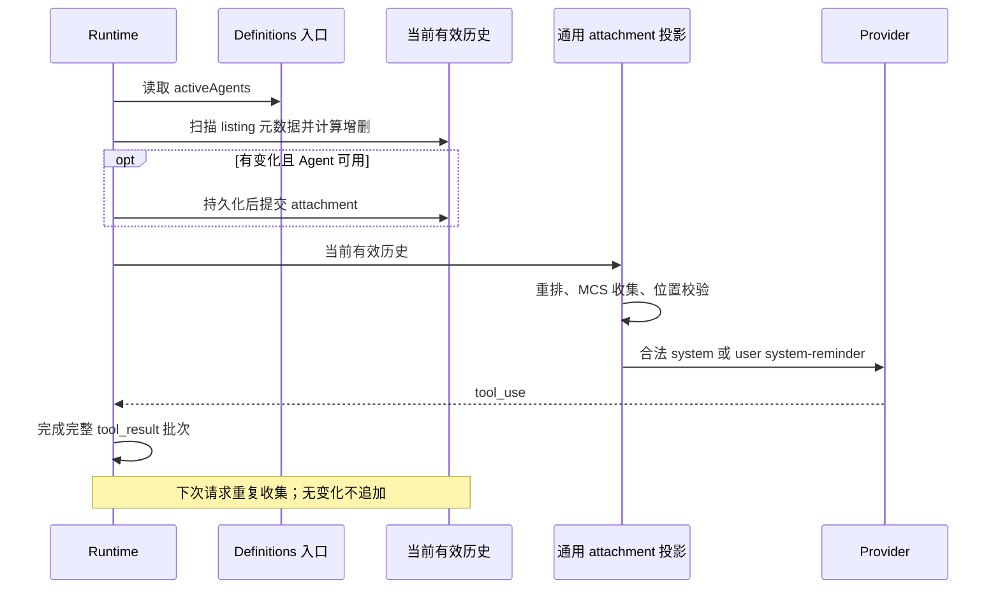

# Agent listing attachment

## 行为与边界

Agent 工具 description 仅指向会话中的 `<system-reminder>`。完整目录通过
`agent_listing_delta` attachment 通知模型；不改变 profile
执行权限。配置刷新由 [父上下文刷新合同](./subagent-runtime-refresh.md) 规定；listing 只消费本轮有效目录，不另建配置加载或通知状态。

`AgentDefinitionsSnapshot.activeAgents` 是已归一化的有效目录。Runtime 通过依赖注入的
同步、无 I/O `getAgentDefinitions()` 读取；默认入口使用启动期 profiles 的归一化快照。
本地集成入口在新父 turn 开始时加载并固定快照，listing、runner 和 plugin-reference 共用该定义。
同轮后续请求及自动 compact 不重新加载；同名配置变化不追加目录提醒。
配置加载失败在父轮准备阶段结束本轮；listing 无需 available 降级开关，既有目录历史保持不变。
收集器不补齐内置类型、不缓存名单、不读文件；单条格式化保留现有名称、描述、工具语义。

Agent description 的文案固定为 first-party MCS 分支的 lean 版本。
续跑说明采用 `Use SendMessage with the agent's ID to continue a previously spawned agent with its context intact; a new Agent call starts fresh.`；
当前只支持 agent ID 寻址，不引入按名称寻址的 `or name`。
定义来源采用 ``Each agent type's model, reasoning effort, and tools come from its definition (`.zcode/agents/*.md` frontmatter).``；
沿用定义来源句式并替换为 ZCode 的 Markdown 目录，不加入未支持的 SDK `agents` 入口；不改变实际加载路径、覆盖优先级或执行行为。
并发提示只保留在首次 listing，description 删除重复句；后台默认行为与 isolation 保持现状。

本次 provider-visible 合同限定上述 first-party MCS 分支。关闭 MCS 的测试用于验证现有
ZCode 兼容路径：不额外引入把 reminder 合入末条 tool_result 的序列化行为，也不宣称
非 MCS 全请求逐字节相同。历史 continuity source 的排除策略保持现状，listing 和其他
普通 attachment 一起接受现有合法位置判断，不绕过这些边界。

## 唯一事实与时序

去重唯一事实是当前分支、compact 后仍有效的结构化 attachment 历史。
按顺序应用 `addedTypes`、`removedTypes` 后与当前 definitions 精确名称集合比较。
新增按名称 localeCompare 排序，移除按字符串排序；重命名等价删旧加新。
计算移除项时直接遍历已通知集合；确认有增删后才排序，不复制完整集合为临时数组。
同名描述/tools/model 变化不产生 delta；无变化或当前有效工具无 Agent 时不追加。
已通知集合为空时 `isInitial=true`，包括全部移除后再次新增；空目录无首次通知。

每次普通模型请求前，在 compact 与工具过滤之后收集。输出 token 续写保持既有私有
request 分支，不改变未完成的 tool_use/tool_result 配对。读取/持久化失败向上抛出，
不解释为空目录，不把失败写入已通知集合。无 SessionStore 时仍可提交 runtime 历史。

## 持久化、投影与 compact

元数据携带经运行时校验的 `addedTypes`、`addedLines`、`removedTypes`、`isInitial`、
`showConcurrencyNote`，持久化保留原文，恢复不从正文反推名称。初次目录带并发提示。
缺失/非法结构化数据不计入已通知集合，旧会话下次请求补首发目录。

校验与防御性复制保留在持久化恢复和 MessageHistory 写入/替换边界；请求内新生成的
delta 来自同一收集器。收集器只读有效历史的 `addedTypes` / `removedTypes`，不在每次
请求中重复解析 metadata、复制数组或创建校验用 Set。仍按有效历史重建集合，不增加游标缓存；
非法 metadata 的过滤、历史复制隔离和 provider-visible 内容保持不变。

listing 是普通 source-owned attachment，复用现有重排、MCS 收集、位置校验和 provider
序列化。启用 MCS 且位置合法时可与其他 reminder 合并为 system 正文；关闭 MCS 或位置
不合法时使用 user `<system-reminder>`。不加入非 MCS/禁止重排排除表，也不为 listing
扩大通用 anchor 范围。内部历史和 metadata 不因 provider 重排而改写。共享 projection 归为 provider context，
不生成用户气泡、turn starter、后台唤醒或新 UI 提示。Desktop continuous 和手机
replayable 继续使用现有 host/stream 边界，不增加 runtime、队列或消息交付路径。

compact 使用同一收集器，以实际保留消息为去重历史，将必要 listing 放入
postCompactReminderEntries，与摘要一起持久化后提交。完整压缩补全量；部分压缩
只补缺失项；下一次普通请求不重复。补发后的 token 计入 truePostCompactTokenCount。
microcompact 只清工具结果时无需补发。cold resume、fork、rewind 从有效分支恢复 metadata。
不新增数据库表或迁移，不回填/改写旧消息。

自动压缩通过惰性读取入口取得本轮 listing 工具集合，仅在通过压缩阈值与 rapid-refill 判断后读取；
跳过压缩时不额外构建工具合同。普通请求仍在 MCP 初始化后读取当前工具，保留本轮禁用规则，
不跨 MCP 初始化复用旧集合；工具读取失败仍向上抛出，不计为压缩失败。

## 验收

测试按责任边界分配，剪枝 profile × MCS × compact 的重复交叉；每项新增逻辑保留直接断言：

| 覆盖位置                                    | 负责的断言                                                                                                                                                                                                                                    |
| ------------------------------------------- | --------------------------------------------------------------------------------------------------------------------------------------------------------------------------------------------------------------------------------------------- |
| `agent-listing.test.ts`                     | 默认 definitions 快照；首次、空目录、重复、增删、精确名称/重命名、同名元信息、删光再新增；有效历史重建/部分保留/fork/rewind；metadata 校验与复制隔离；相邻 reminder、MCS 位置降级及无 listing 的 anchor 回归                                  |
| `agent-listing-runtime.test.ts`             | 同一 turn 工具批次后替换 definitions、后续用户轮去重、Agent 不可用；纯 synthetic/混合文本恢复；普通及 compact 后 live/cold 等价、提交前补齐/下轮不重复；definitions/持久化失败；reactive compact 隐藏 Agent。复用同一个 Runtime/store fixture |
| `agent-listing-wire.test.ts`                | 发布配置 first-party `claude-fable-5-1` 经真实 Anthropic adapter：首发/完整工具批次后的正文、role、wrapper、顺序及工具配对，覆盖 MCS 开关；Core 不重复这组序列化断言                                                                          |
| 现有 tool/source 测试、共享 projection 测试 | description 的 lean 文案、source 注册/校验、provider context 分类及无 turn trigger；工具过滤沿用 automation/闲时限制                                                                                                                          |
| 正式 Desktop I21/SA                         | 原四类 profile 的 non-MCS 轨迹，加一个 general-purpose MCS 场景；均检查父请求首发/工具后去重、child 无 Agent/listing、执行完成及 UI 无伪用户消息；剪枝另三类 profile 的 MCS 重复                                                              |

- 运行相关单测、正式 Electron E2E、architecture、typecheck、lint、E2E 类型检查和覆盖审计；记录实际结果与 artifact。

## 测试收窄复验

生产代码未改。核心新增 5 个文件的语句/分支/函数/行覆盖均为 100%；分层相关测试 558 项通过。
正式 Electron 2/2 首次通过：10 次父请求目录各一份，5 次 child 无 Agent/listing；artifact：
`packages/desktop/.e2e-artifacts/desktop-e2e-20260914124036720-p33068-abdaaec9eb6005b6/`。
另行扩大回归发现的 Explore 后台通知断言在 HEAD 复现；覆盖审计仍有下述既有引用/统计漂移，未修无关代码。

## 2026-09-14 通用 attachment 接入复验

- 撤回 listing 的非 MCS、禁止重排特例和通用 anchor 扩大；两份通用 provider 投影文件与
  原始 HEAD 完全一致。source 只增加生命周期注册和 descriptor。
- 先修改断言复现 7 个失败（source、role、首发重排、相邻 reminder、无 Agent reactive
  compact），再撤回特例。最终 14 个 focused 文件 385 项通过，另有共享 UI projection 1 项通过。
- `agent-listing-wire.test.ts` 的 4 项通过：使用发布配置解析 first-party `claude-fable-5-1`，
  走实际 Anthropic adapter，fetch 返回本地 fixture。MCS 默认开启；首发及两条完整工具结果后
  均得到与预期投影一致的独立 system string。显式关闭分支验证既有 user fallback。
- 正式 Electron I21/SA 2/2 首次通过，无重试；两种能力 × 四类 profile。实际抓包共有
  16 次父请求（8 次 system listing、8 次 user listing），每次目录仅一份；8 次 child
  请求均无 Agent 和 listing。断言包含目录正文保持、role/wrapper/顺序、完整工具配对、
  child 执行完成及 UI 无伪用户消息。MCS Electron 使用显式声明 MCS 能力的模型配置，发布配置的 first-party 模型
  由上面的 wire 测试覆盖；没有调用线上模型服务。
- Artifact：`packages/desktop/.e2e-artifacts/desktop-e2e-20260914120729653-p63978-8d35aec89b130289/`。
  `network-capture/upstream-provider.json` 为实际请求；`agent-listing-verification.json` 为逐请求
  核对结果；投影 fixture 为对照结果（不是进程抓包）。
- root `pnpm typecheck`、`pnpm lint`、Core/Adapters typecheck、Core lint、Desktop E2E
  typecheck 与 fixture check 通过。root lint 有 42 个已有 warning，Core lint 有 10 个；
  architecture 0 violation，CLI 仍是 unmanaged 模块，此结果不等价于完成 managed 边界覆盖。
- 扩大的 Core + Adapters 全量初跑为 4084 passed / 84 failed。其中 3 项是旧目录位置导致的
  cache 断言，已恢复原断言，所属两文件 176 项通过；6 项时序失败所在四文件隔离复跑
  147 passed / 3 skipped。其余同名失败在原始 HEAD 的独立副本复现，未改无关实现。
  基线副本补入 HEAD 的发布配置后，另行复核配置相关用例，避免把副本缺文件当作基线失败。
- Adapters 自带 lint 脚本因 ignore 未找到文件；显式 `--no-ignore` 揭示现存 max-lines
  错误，均位于本次未修改的 Adapters 生产文件。conversation 覆盖审计仍有已有 D19/I74/I75
  引用、统计及 generated 文档漂移。详细命令输出保存在 artifact 的 `validation/`，
  不把这些门禁报告为全部通过。Windows、Linux 与手机 GUI 未单独实机验证。

## 2026-09-14 旧合同验证记录

以下记录属于纠正前“listing 始终 user”的合同，只证明旧实现执行结果，不能作为当前
provider-visible 合同的证明。当前合同必须重新运行 focused/wire 与正式 Electron 验证。

- 新增 listing 收集、Runtime、持久化测试 20 项及共享 projection 测试 1 项全部通过。
- Core 全量：2397 passed、18 failed、36 skipped、2 todo。独立导出的原始 HEAD
  `ae7b0928a8` 使用同一依赖环境复现了完全相同的 18 个失败，没有新增失败。
  失败集中于 browser client/manifest 的迁移路径与文档、unbound resume 的错误断言，
  以及两条 background notification 包装断言；本次不修改这些基线问题。
- `pnpm architecture:check --changed`：0 violations；根目录 `pnpm typecheck`、
  `pnpm lint`、Core typecheck/lint、Desktop `typecheck:e2e` 与 case fixture check 均通过。
- 正式 Electron 命令：`pnpm --filter @zcode/desktop test:e2e -- --spec ./test/e2e/conversation-session/conversation-session-subagent-prompt-assembly.test.ts`。
  I21/SA 1/1 passed，包含 general-purpose、Explore、custom、isolated custom 四组场景。
  实际父请求共 8 次，每次仅含一份 user listing；4 次 child 请求均无 Agent 和 listing。
  响应使用 case-local provider replay fixture，未调用真实模型服务。
- E2E artifact：`packages/desktop/.e2e-artifacts/desktop-e2e-20260914094914319-p65512-58d2158db972bffc/`；
  `summary.md` 为结果，`network-capture/upstream-provider.json` 为实际请求抓包。
- `pnpm audit:conversation-session-coverage` 未通过；原始 HEAD 复现相同问题：
  D19/I74/I75 的自动化缩写引用、矩阵统计过期，以及三份 generated review 文档过期。
  I21 扩展未增加 case 数量，不刷新无关覆盖基线。
- 实机验证环境为 macOS Electron；Windows、Linux 和手机远控未单独实机运行。
  手机 provider-context 分类由共享 projection 单测覆盖，交付路径未改动。

同日 lean 文案增补复验：66 项相关 Core 测试通过，root/Core typecheck 与 lint、E2E
typecheck、fixture check、architecture 均通过。正式 Electron I21/SA 四组场景再次通过，
artifact 为 `desktop-e2e-20260914105041342-p8117-87dcf4e0620cd911`；抓包断言续跑及定义来源
文案存在、description 无并发提示、listing 中该提示仅一次。此次只修改文案，未重跑 Core 全量和覆盖审计。

## 实现注意

listing delta 在格式化阶段只生成中间 meta user 消息，最终 provider role 由后续重排、MCS 收集与
位置校验决定；不得把 formatter 中间态当作最终 provider role。旧版“description 默认承载目录”的结论
仅为历史基线，本 spec 替代其当前实现说明。
