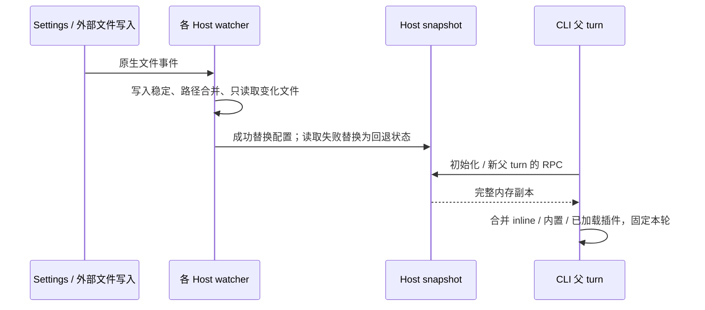
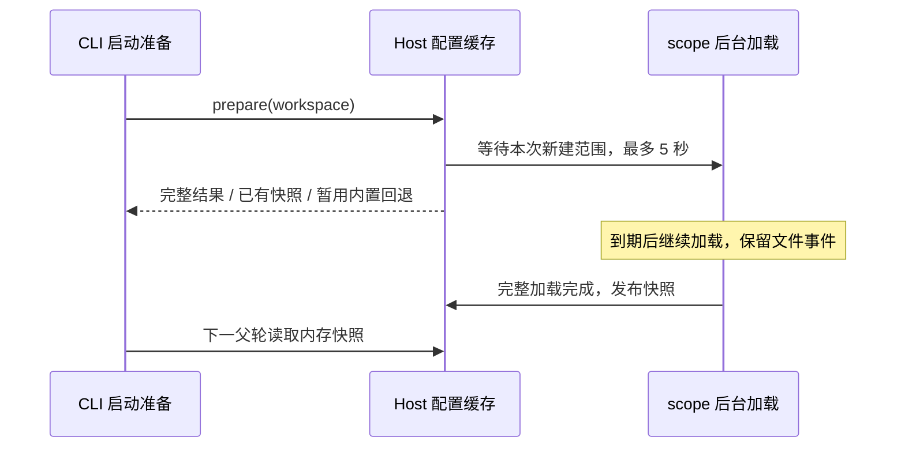

# Subagent 配置按父上下文刷新

## 合同与唯一数据源

Local Host 的 subagents service 持有文件解析缓存及各 workspace 的内存 snapshot。
用户文档/state 在 Host 内共享，项目按 `workspaceIdentity?.trim() || workspacePath` 隔离。
本地来源以 Host/Settings 为准；其他 storage.dir 用途、独立 CLI/远程 workspace 来源不变。

session 初始化和每个普通父 turn 开始时分别通过 `subagents/readRuntimeConfig` 读取一次。
该轮 listing、Agent、SendMessage、plugin-reference 共用固定 definitions；后续模型请求、
重试、compact、Guide 和 running child 不刷新。terminal resume 保留身份历史，查本轮原
agentType；缺 profile/历史明确失败，不新建空 session、不替代默认 profile。

IDE 内存编辑不触发更新；Settings、自动保存、外部写盘经同一原生 watcher 更新。
“发布”仅表示替换内存 snapshot：后台读取期间继续返回旧完整 snapshot；完成后新父轮
消费新 snapshot。不同 Host 独立观察磁盘，无广播、CLI 推送或全 Host 确认屏障。



## 监听、解析与 I/O

### 启动准备与后台刷新

启动准备只等待本次新建范围的首次加载；已加载的共享用户/state 范围正在后台刷新时，
新 workspace 可以用各范围最后一次完整加载的结果组合首份快照，不等待共享范围空闲。
已有 workspace 在后台刷新期间继续使用原已发布快照，不发布批次中的部分读取结果。
这里的已有完整快照指 `ready`。首次超时产生的内置回退不阻挡恢复：项目加载完成且共享
范围已有完整可用结果时即可发布，即使共享刷新仍在进行；任一范围仍失败则继续回退。

首次加载（含显式重载）的等待上限为 5000ms，完成即继续，不固定等待。到期保留已有
workspace 快照；仍没有完整结果时，仅为该 workspace 暂用 `built-in-fallback`，保留 inline。
提前读取尚未发布首份快照的已准备 workspace 也使用同一有界等待。此上限只约束缓存加载
等待，不是磁盘路径解析、迁移或整个进程启动的总时限。

等待到期不标记 scope 读取失败、不取消后台加载、不清除待处理路径。后台仍由 scope 管理，
稳定后完成加载并独立发布；不需要额外文件事件唤醒。首次加载完成晚于启动等待时也必须发布。
新父轮才消费新结果，已开始的父轮及 running child 不变。真正读取失败沿用下面的回退规则；
销毁/替换范围沿用取消及迟到结果隔离，不增加重试定时器或新的缓存。



### 文件监听与解析

使用 chokidar 4.0.3 原生事件（usePolling:false），有效范围为 agents 根目录直接文件
（相对于根目录的 depth:0），接受大小写不敏感的 .md/.markdown。目录存在时直接 watch
准备时的原配置路径，由文件系统处理目录大小写；不维护别名映射、不统一转小写。目录缺失时
临时监听最近已有父目录的直接目录变化，事件触发重新检查原配置路径并向目标切换。
所有监听固定 depth:0；不再从祖先递归枚举后做字符串前缀过滤。state 同样只接收目标文件
事件，支持原子替换。保留 followSymlinks:true、盘符/POSIX 根路径，无常驻轮询或后端回退。
每个 scope 串行切换一个活动 Chokidar watcher，旧实例迟到事件无效；监听 ready 后重新确认目录，
覆盖检查与绑定之间的变化。目录删除/替换强制重绑，即使原路径已经重建。无关目录变化只
做必要路径检查，监听位置不变时不重绑、不读配置。切换和销毁取消旧加载，禁止迟到发布。
无关父目录检查不重置已有批次的合并计时，避免其他文件活动持续推迟配置更新。
原生库可能先发子文件 unlink、迟发目录 unlinkDir；删除批次发布前只检查一次目录位置，
确保已删除目录先切回父监听。否则空快照发布后立即重建可能使目录删除通知消失，留下旧监听。
空目录整体移走在 macOS 可能只有 raw、在 Windows 连根监听的 raw 也没有。因此每个 scope
附带一个可取消的原生父目录结构订阅，与 Chokidar 同时切换/关闭；不枚举父目录内容，也不把
父目录并入 Chokidar 文件索引，避免实际 AGENTS 被误报为逻辑 agents 的删除。
检查只查询监听根的状态，并比较绑定时的目录身份以识别快速同路径替换，不查询文件身份、
不维护路径映射、不触发无关配置读取。配置路径被普通文件占用时保留读取失败语义，并监听
该路径以便删除/恢复后重新绑定。
写入稳定阈值 1000ms、检查间隔 500ms、事件合并 300ms，只检查变化中的文件。
Chokidar 的 ready 不保证首次枚举文件已稳定：目录首次出现/重建时，补扫枚举候选后进行
有限的异步状态检查，大小、修改时间及替换身份连续 1000ms 不变才读取。消失按删除处理，
其他错误沿用范围失败回退。扫描期间新增文件由 watcher 接管，不重新全量扫描寻找。
等待结束、取消、失败均释放临时检查；不新增同步 I/O。已有目录冷启动/显式重载保留原
加载语义，普通更新仍使用 Chokidar。稳定只表示观察到静默期，不提供多文件事务保证。
首次建立监听后加载，处理加载期间事件；缺失目录创建、目录删除重建均可恢复。监听异常
记录 warning，显式重载重建监听；销毁关闭监听并拒绝迟到发布。
用户／项目自定义 profile 的初始加载、显式重载、目录重建补扫和 Settings 列表均只处理
agents 根目录直接的 .md/.markdown 文件，与 depth:0 监听一致；独立 CLI 使用相同范围。
深层文件不参与自定义 agent 列表或运行时定义；已有深层 profile 需移到根目录才能使用，
不自动移动或删除文件。插件 agent 保留原有递归发现规则，不受此范围收敛影响。
回归覆盖用户／项目初始化、热更新、重扫、目录重建、运行时扫描不读取深层文件及插件递归发现；
Desktop 复用 SHR22，断言两个 Host 的初始化与后续父轮 provider 请求均不包含深层定义。

纯 Markdown parser、profile 类型/schema 置于 shared，Host 与独立 CLI 复用同一实现。
Host 不导入 Core；解析字段/诊断/项目权限限制不变，不用 Settings AgentSummary 代替完整
profile。诊断在文件加载时记录，不按父轮重复记录。CLI 只做内存组合，不再解析 Markdown。
state 更新使用准备时解析的固定路径，不重新读取 CLI config；变更 storage.dir 仍需显式重载。

| 变化                                       | 配置 I/O                                     |
| ------------------------------------------ | -------------------------------------------- |
| 新增/更新 A                                | 只读取和解析 A                               |
| 删除 A                                     | 删除缓存条目，不读其他 Markdown              |
| 更名 A→B                                   | 删除旧路径、读取新路径；state 实际变化才读取 |
| state                                      | 只读 state，内存计算启停/覆盖                |
| 初始化、显式重载、目录重建、范围失败恢复   | 扫描受影响范围                               |
| 父轮 RPC / spawn / resume / 无关 workspace | 无配置文件读取、无重复解析                   |

按文件路径缓存，保留同名文件和原排序/覆盖；state 变化无需重读文档。每范围合并待处理
路径，读取期间事件不丢失；内部代次阻止旧结果覆盖。完整批次完成后替换 snapshot，不
修改已返回快照。不做 hash、差量 RPC 或通用增量框架。原生事件仍有必要的文件状态查询。

## 失败、协议与保存

RPC 响应严格区分 `{ kind: "ready", profiles, builtInModelSelectionOverrides,
pluginAgentModelSelectionOverrides }` 和 `{ kind: "built-in-fallback" }`，不传原始 Markdown。
文件解析诊断沿用过滤规则；范围读取失败使依赖该范围的 workspace 回退内置 agents，
保留显式 inline，不混入旧自定义/插件/磁盘覆盖；下一文件事件或显式重载恢复，不在 RPC
读取时重试。用户/state 故障影响所有依赖 workspace，项目故障只影响该项目。
RPC 断连/取消/未准备/销毁仍抛错：输入保留，父轮不发模型请求；不能转为内置回退。

Settings 保存只做现有串行持久化，删除 changedPaths、专用事件和广播绑定，不等待 watcher。
多文件保存不是事务；部分落盘失败仍按磁盘事实生效，不承诺失败保存绝不生效。
插件模板不热更新，已有覆盖和规范名/别名规则保留；不重建插件/MCP。手机共享原 Host，
不改变 desktop continuous / mobile replayable 边界。

## 覆盖映射与验证

合并 staging 后，Desktop E2E 沿用正式 CLI resolver 与存储启动准备；配置故障代理改由测试侧
`NODE_OPTIONS --import` 预加载，仅包裹 app-server stdio，并向子 CLI 移除自身预加载以避免递归。
不通过自定义命令绕过 storagePreparationEntry / supportsStorageStartup，不修改生产启动契约。
隔离 profile 的职业引导通过现有 UI helper 跳过，之后再准备工作区和模型；不改生产引导状态。
双 Host 的插件模型覆盖使用 case-local 插件 fixture，避免绑定已更名、拆分或改变默认模型的内置插件。
Agent 描述保留上游动态工作流灰度提示，目录与并发提示仍由 listing attachment 提供。

2026-09-18 目录监听修复：沿用 SHR22 复现断言，新增监听位置切换、ready 前后目录变化、
连续写入/短暂文件、目录再次重建/销毁取消、迟到事件及 I/O 隔离验收。Desktop 复用跨 Host
场景补目录首次创建/重建，保留六组 pending 的 provider、历史、轨迹和缓存前缀断言。
最终修复验证：macOS 114 passed / 1 skipped；SSH Windows 112 passed / 3 skipped，
22 个同步源码/测试文件 SHA-256 一致；大小写敏感临时卷 35 passed / 8 skipped。跳过均为
文件系统能力或 POSIX 权限分支不适用。缓存资源/监听错误补充断言另行复测 17 passed。
六组 Desktop pending 为 11 passed / 0 failed / 0 skipped：SHR22 两个 Host/CLI 的既有
session 在大小写不同目录更新、项目目录首次创建/重建后都消费新配置，父子历史及缓存前缀
断言保留。Bootstrap/Core 相关回归共 30 passed。架构、typecheck、E2E typecheck、fixture
校验通过；lint 为 42 warnings / 0 errors。本轮代码/fixture/spec 格式通过，全仓库格式检查
仍受未改动的 Electron 文档 HTML 语法错误及存量格式差异阻断。Windows Desktop UI 未运行。
生产修改限定于 scope 与内部加载入口，没有新增测试入口或依赖；仍为 pending、未提交。
[完整修复验证记录](../packages/desktop/.e2e-artifacts/desktop-e2e-20260918124539197-p63724-d4568330d04f0b5d/directory-watch-validation/README.md)
保留 PID、实际 provider 请求、父子轨迹、文件摘要及红绿灯日志；回放缓存标记不代表线上命中率。
下面红灯记录保留，不代表修复后状态。

2026-09-18 路径边界复现（仅测试，不实施监听重构）：接受 SHR22。大小写不敏感的
文件系统中，配置路径 `agents` 与实际目录 `AGENTS` 指向同一目录时，两个 Host 均应
消费保存后的更新、删除和更名；用户范围、项目范围分别验证。Desktop 复用 cross-host
pending 用例，先让两个新 Host 加载旧 profile，再经 Settings 保存，以两端下一父轮的
真实 provider 请求验收新 prompt，并保留 PID、磁盘内容及父子轨迹。发布等待超时后仍
采集请求用于归因，最终断言仍要求新配置，不把旧配置或超时当成通过。

目录首次创建、删除重建、符号链接沿用原有合同，补大小写变化组合及文件名仅大小写更名。
大小写敏感文件系统中同时存在的 `agents`/`AGENTS` 必须隔离。测试按实际文件系统能力
选择场景，不仅按操作系统猜测；跳过的能力分支需在验证记录中明确说明。Chokidar 的
直接目录监听探针只用于方案分析，不替代生产 service 回归，也不固化 parent/映射实现。

SHR22 复现结果：macOS 为 8 failed / 24 passed / 1 skipped，SSH Windows 为
8 failed / 22 passed / 3 skipped；失败均为上述大小写不同目录的更新、删除、更名、首次
创建及重建。原有正常路径回归通过。临时 HFSX 大小写敏感卷为 25 passed / 8 skipped，
其中 `agents`/`AGENTS` 隔离通过；按文件系统能力跳过不适用组合，Windows 另跳过原有
两条 POSIX 权限测试。Desktop cross-host 最终运行 1 passing / 1 failing：原有
SHR16/SHR18-SHR21 通过，新增 SHR22 在两个独立 Host 的新 prompt 断言上失败，磁盘
已是新内容。两端父子轨迹、历史前缀及缓存标记断言通过，不代表线上缓存命中率。
生产代码保持不变，未提交。Windows Desktop 未运行。详细命令、PID、请求和校验日志见
[路径复现记录](../packages/desktop/.e2e-artifacts/desktop-e2e-20260918095507282-p34362-d7288e0c52e18805/path-repro-validation/README.md)。

保留六组 manual-review/pending E2E 和以下业务断言，不做 CI 准入：

| 场景               | 保留或迁移的证据                                                                                                                           |
| ------------------ | ------------------------------------------------------------------------------------------------------------------------------------------ |
| SHR01-SHR03        | runtime-refresh：新父轮、失败 child 恢复、同轮旧配置及 compact                                                                             |
| SHR04-SHR08        | catalog-refresh：增删更名启停、同名更新、user/MCS、父轨迹与缓存前缀                                                                        |
| SHR09              | profile-fields：reasoning/prompt/tools 单字段 spawn/resume                                                                                 |
| SHR10-SHR13、SHR15 | context-boundaries：running child、同轮 resume、RPC 故障、重试/取消、子轨迹                                                                |
| SHR14、SHR17       | multi-workspace：实际多 CLI、项目隔离、故障不阻断保存                                                                                      |
| SHR16、SHR18-SHR21 | cross-host：双向保存及外部编辑、各自下一轮、状态覆盖、I/O 失败回退/事件恢复、后台迟到结果、Host 关闭                                       |
| SHR22              | cross-host：大小写不同的用户目录更新、项目目录首次创建和重建后，两个已存在 session 下一轮消费新配置；真实 watcher 单测补增删改名及生命周期 |

广播发送失败/非法负载/回送不再是产品分支，删除对应测试和 fixture；延迟/重复/无关
事件改为文件事件和 I/O 边界验证。缓存单测补首次创建、原子替换、重建、并发读、读中更新、
销毁、每文件读取/解析次数和新父轮零文件 I/O。共享解析器保留原字段及诊断回归。
测试控制只在测试文件/临时文件系统/现有传输边界，不增加生产 hook、marker 或依赖。
启动等待回归覆盖共享刷新不阻塞新 workspace、首次加载/显式重载的 5 秒边界、并发首次
读取、到期后的无事件发布及销毁/替换隔离；真实 watcher 验证持续写入时串行准备和状态保存
可以完成，停止写入后已有及新 workspace 自动恢复，保留返回过的快照。
E2E 日志观察按 Host 的 JSON 序列化格式匹配路径，覆盖 POSIX、Windows 盘符及 UNC 路径；
日志等待与预加载观察器共用该转义约定，避免反斜杠使已完成更新被误报为超时。
Markdown 迁移回归检查操作系统实际设置的文件模式在迁移前后保持不变；POSIX 平台仍
精确校验指定权限，Windows 不套用其无法表达的 POSIX mode。

执行受影响单测、六组 Desktop、fixture 校验、architecture、typecheck、lint、fmt。
原生 watcher 需 Windows 验证，未执行不得宣称通过。保留 PID、provider capture、父子
model-io/trajectory/日志；回放前缀检查不代表线上缓存命中率。

2026-09-18 迁移验证：117 条受影响单测通过；六组 pending Desktop 共 10 个场景有通过记录。
统一批次通过 9/10，跨 Host 的测试等待误认旧读取完成；仅修正测试观察后单独重跑 1/1 通过，
保留首次失败报告。fixture、架构、typecheck、E2E typecheck 和修改文件格式检查通过；lint
为 0 errors、42 既有 warnings。全仓格式检查被四个未修改的 Electron 示例 HTML 语法错误
阻断。真实远程 workspace/手机 E2E 未运行。
完整日志、PID、provider 请求与轨迹见
[本次验证记录](../packages/desktop/.e2e-artifacts/desktop-e2e-20260917171528453-p97510-a3502ef3eb2643c7/verification/README.md)。

同日补充 Windows x64 / Node 24.14.0 验证：原生监听 10 条、增量缓存 9 条、服务层 30 条、
共享字段/迁移 33 条及 Core profile parser 21 条通过；两个旧迁移测试的 POSIX mode 精确断言
失败（`0o640/0o400` 在 Windows 为 `0o666/0o444`），两个既有 chmod 故障场景按平台跳过。
两份独立 service 共享真实目录的事件消费已验证；Windows Desktop 多 Host/CLI E2E 未运行，
完整依赖安装因包下载超时中断。使用隔离测试依赖执行当前源码，不将该结果视为完整 Desktop
依赖/构建验证；未修改生产逻辑或放宽断言。见
[Windows 验证记录](../packages/desktop/.e2e-artifacts/desktop-e2e-20260917171528453-p97510-a3502ef3eb2643c7/verification/windows/README.md)。

同日测试侧修复后复测：Windows 共 123 条相关单测通过、2 条原有 POSIX chmod 故障用例
跳过，另有 1 条盘符根目录首次创建集成验证通过。两处日志路径转义及迁移权限断言已修正，
生产代码未改动；本轮未运行完整 Desktop E2E。见
[测试修复验证记录](../packages/desktop/.e2e-artifacts/subagent-log-path-fix-20260918/README.md)。

### 动态目录及前缀验收补充

接受 SHR04-SHR08，使用真实 Settings 操作、同一已运行父 session、实际 provider 请求验收。
连续性场景使用足够大的上下文窗口，禁止 compact；SHR01-SHR03 原有 compact 场景单独保留。

| 场景            | 动作与必须断言                                                                                                                                                                                                                                        |
| --------------- | ----------------------------------------------------------------------------------------------------------------------------------------------------------------------------------------------------------------------------------------------------- |
| SHR04 动态新增  | 父 session 已完成一轮后创建 A；下一轮 listing 追加 A，Agent A 的 provider 请求使用所选 profile                                                                                                                                                        |
| SHR05 更名      | A 改名 B；下一轮 listing 删除 A、增加 B；旧名 spawn 与旧实例 SendMessage 明确失败且无新 child；B 可以执行                                                                                                                                             |
| SHR06 删除/启停 | 禁用 B 后 spawn/resume 失败；重新启用后恢复可用；删除 B 后再次验证 listing 删除及 spawn/resume 失败；失败路径不得创建 child/session                                                                                                                   |
| SHR07 同名更新  | 更新 B 的模型、reasoning、prompt、description、工具约束；下一轮 provider 使用新值和新工具集合；原历史 listing 保留旧正文，不追加同名通知                                                                                                              |
| SHR08 轨迹连续  | MCS 与 user reminder 两条投影分别贯穿上述操作；原始 model-io 在清理前保留并由 prompt-trajectory 导出；每个父 session 恰好一段、覆盖全部主请求；逐请求检查 system/tools 不变、历史仅追加、tool_use/result 配对、缓存 breakpoint 及其覆盖的前缀保持原样 |

```text
同一父 session：首轮 → 新增 A → 执行 A → A 改名 B → 旧名/旧实例失败
              → 执行 B → 同名配置更新 → 执行新配置 → 禁用/失败 → 启用/执行 → 删除/失败
provider 历史：原有前缀始终保留 ───────────────────────────────→ 仅尾部追加
```

轨迹工具忽略 cache_control 的连续性判定不能代替缓存检查；wire 请求另行断言缓存标记和
被保护的内容。synthetic replay 的 usage 只用于协议回放，不能宣称真实 provider 缓存命中。
child 修改 model/system prompt 是显式配置变化，身份/历史继续保留，不要求新配置完整前缀
等于旧配置。测试不引入业务状态，不改变 desktop-continuous / web-remote-replayable 边界。

SHR08 发现并纳入回归：Core 正确标记最后一个 tool message，但 AI SDK 合并连续 tool
messages 时仅保留首条的 message providerOptions，导致批次末尾的缓存标记丢失。
Adapter 将该标记映射到对应 tool-result part 的 providerOptions，保持原 breakpoint 位置；
不改变 Core 历史、工具结果正文或 provider 协议。Wire 单测覆盖单/多结果、错误结果、
批次中间/末尾缓存位置及 TTL，Desktop 两种投影继续强制逐请求断言。

### 单字段更新与 SendMessage 状态边界

接受 SHR09：model/provider 保持不变，分别只改变 reasoning、prompt、tools。每次保存后，
下一父轮的 spawn 与已完成 child 的 SendMessage resume 都使用新字段，其他字段保持原值。
resume 保留 agentId、childSessionId 和完整历史；仅 reasoning 变化复用模型变更记录，
只改 prompt/tools 不新增模型分隔线。Desktop 从真实 Settings 表单保存，经 provider 请求
和只读持久化断言验收；Core 用例对三个字段分别独立构造，避免多个变更相互掩盖。

接受 SHR10：SendMessage 的配置取决于目标状态，而非仅取决于调用名称。

```text
父 T1 快照 v1 → child A 运行(v1)
保存 v2 → 父 T2 快照 v2
  ├─ SendMessage → A 仍运行：只投递消息，后续 child 请求保持 v1
  ├─ spawn B：使用 v2
  └─ A 已结束 → SendMessage resume A：沿用身份/历史，使用父 T2 的 v2
父 T2 内再次保存 v3 → 该轮 terminal resume 仍用 v2，父 T3 才能用 v3
```

测试隔离：控制时序、模型响应和故障只能使用测试文件、provider fixture、现有端口注入。
禁止向生产 src 增加测试环境判断、marker 分支、等待钩子、测试 RPC 或测试专用公开接口。
测试侧控制不得引入生产测试入口或依赖。
