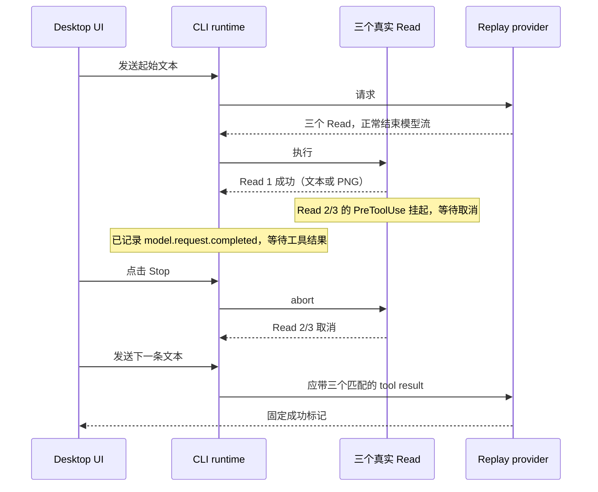
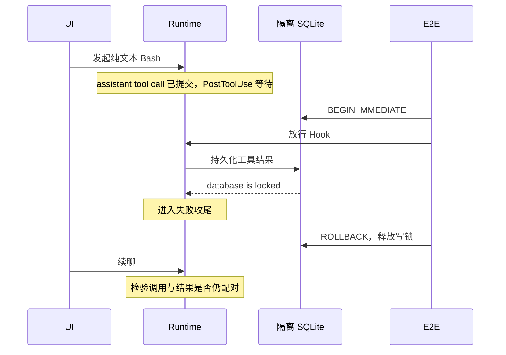
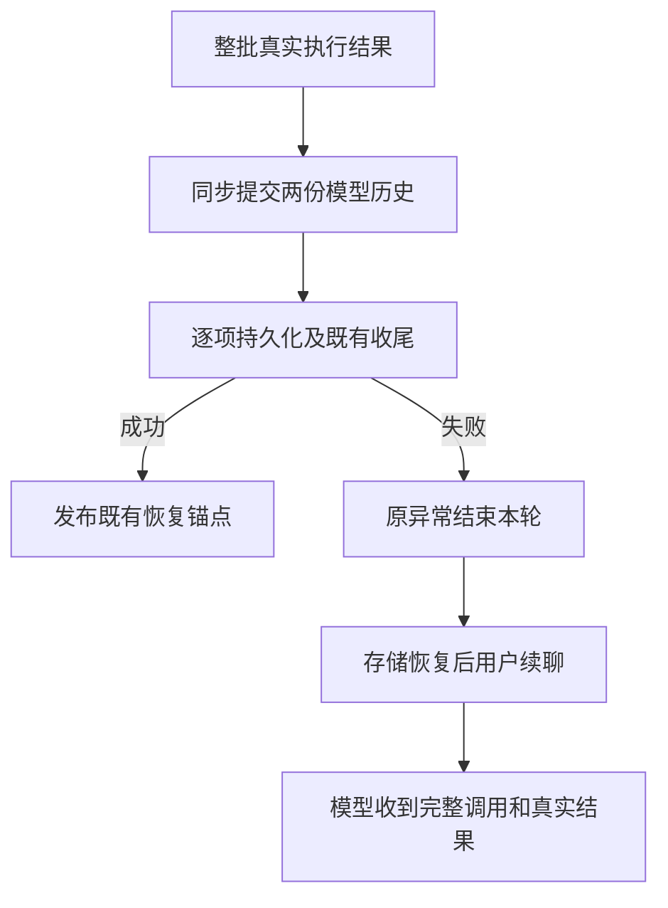

# 工具结果缺失的 Desktop E2E：Stop 与存储故障

状态：修复已实现；Desktop E2E 保持 manual-review/pending，等待人工 review。

目标：整批真实工具结果已取得后，Stop 或存储故障不得破坏当前进程中下一轮的模型历史；数据库锁来源和跨进程补写不在范围内。
反馈 `ZCT-2102451151499956224` 已确认一个 Read 成功、两个取消及随后缺三个结果，但日志未保留读取内容。
本实验对图片持久化假设做因果对照，不把图片输入作为该反馈的已知事实。



- 两组使用相同的三个 Read 声明顺序、Hook、Stop barrier 和后续请求，仅首个文件类型不同。
- 合成 provider 只决定合法的工具调用和成功回复；结果来自真实文件工具，取消来自 UI Stop。
- Hook 写在隔离 E2E HOME 的用户配置；仅挂起本例 `blocked-*.txt` 的 PreToolUse。测试读运行时日志确认首个工具成功、模型完成以及两项仍未结算，再操作 Stop，不用固定延时决定触发点。
- 正确行为断言保持绿色语义：下一轮真实网络请求包含唯一配对结果、取消结果标记失败，并完成回复。若 SDK 本地校验失败，测试保留日志/请求/UI 证据并报错，不把缺结果当作期望成功。
- 实机范围是本地 Desktop continuous；未涵盖手机 replayable、远程 workspace 或 Windows 实机。Hook 使用 Node process 参数数组和隔离工作区路径，避免 POSIX 专属阻塞手段。

运行：

```sh
ZCODE_E2E_MANUAL_REVIEW=1 ZCODE_E2E_DEEPSEEK_CONTEXT_WINDOW=128000 \
pnpm --filter @zcode/desktop test:e2e -- --spec \
'./test/e2e/conversation-session/manual-review/pending/conversation-session-stop-tool-results.test.ts'
```

## 非媒体路径：SQLite 写入失败

3.14.3 反馈 `ZCT-2102596858952212480` 描述先出现 `database locked`，随后模型无法使用并报 MissingToolResults；该条没有日志附件，因此只是独立候选原因，不能据此归因到三 Read 的反馈。

增加第三组：不读图片、不点击 Stop，执行只返回短文本的真实 Bash。隔离用户配置的 PostToolUse Hook 在工具执行后建立 barrier；测试确认模型已完成，再对隔离 CLI 数据库持有 `BEGIN IMMEDIATE` 写锁并放行 Hook。观察到 runtime 进入失败收尾后立即释放写锁，随后从 UI 续聊。



锁只用于制造真实存储故障，不直接修改会话行、模型历史、工具结果或 SDK。锁和 Hook 都在 finally 清理。验收仍要求恢复存储后下一轮正常发送、结果完整；出现 MissingToolResults 即红灯，保留日志和 provider capture。此实验验证候选机制，不能代替原反馈的现场证据。

## 修复前复现

2026-09-24 Desktop run `desktop-e2e-20260924064058170-p71167-286d64339dbaed74`：文本 Stop 对照通过，图片 Stop 组在下一轮报 `AI_MissingToolResultsError`，缺全部三个 Read 结果。后者只复现已知图片问题，不证明 `ZCT-2102451151499956224` 读取过图片。

补充完整 run：`desktop-e2e-20260924070659985-p94983-c3e14a5ec032c9c8`，macOS 本地 Electron，4 组中 2 通过、2 复现失败。复用此前正式构建的同一生产代码，设置 `ZCODE_E2E_SKIP_BUILD=1 ZCODE_E2E_SKIP_AGENT_BUILD=1`；不跳过实际 Electron 测试。

| 输入 / 故障                        | 结果                                                 | 下一轮实际网络请求           |
| ---------------------------------- | ---------------------------------------------------- | ---------------------------- |
| 三个文本 Read + Stop               | 通过                                                 | 包含 3 个调用和 3 个唯一结果 |
| 首个 Read PNG + Stop               | 失败：MissingToolResults，缺 3 个结果                | 无；SDK 在 HTTP 前拒绝       |
| 纯文本 Bash，不持锁、不 Stop       | 通过                                                 | Bash 结果配对，正常回复      |
| 同一 Bash，结果写库时持锁，不 Stop | 失败：先 database is locked，随后 MissingToolResults | 无；SDK 在 HTTP 前拒绝       |

数据库组实际时间（UTC）：

- `07:07:26.362` 测试拿到隔离数据库写锁。
- `07:07:31.488` `tool.call.completed`，说明 Bash 已执行完并产出短文本。
- `07:07:41.626` `turn.failed`，cause=`database is locked` / `ERR_SQLITE_ERROR`。
- `07:07:41.669` 测试释放写锁。
- `07:07:42.202` 续聊 `turn.failed`，cause=`AI_MissingToolResultsError`，缺 `toolu_stop_results_db_bash`。

对应 session：`sess_40468255-d05f-41ca-9550-deea4b93688f`。`database-locked-model-io.jsonl` 保存的失败请求尾部是 `user → assistant(tool-call Bash) → user`，中间确实没有对应 tool-result。该组 capture 只有首轮合法工具声明，未注入任何缺结果错误；无锁对照的三次请求全部命中工具 / 首轮完成 / 续聊 fixture。

证据目录：`packages/desktop/.e2e-artifacts/desktop-e2e-20260924070659985-p94983-c3e14a5ec032c9c8/`。`summary.md` 为正式运行报告，`conversation-session-stop-tool-results/` 内按组保存日志、请求、截图与 model-io。

## 根因边界

修复前已确认的非媒体机制：`turn-model-step.ts` 先通过 `commitAssistantToTurnRequest` 提交 assistant 调用；旧 `turn-tools.ts` 处理结果时，先 `persistPart`，后 `commitTurnRequestEntries` 添加结果。`message-persistence.ts` 的 `sessionStore.savePart` 抛 SQLite 写入异常后，本轮结束，但已提交的调用仍留在内存历史。恢复存储不会补齐该结果，因此下一轮在 SDK 转换请求时失败。该代码顺序在受影响版本 `ab4d5e6b` 的 `turn-tools.ts` 与修复前基线一致。

这与图片取消有共同缺口：调用先提交，结果提交前仍有可抛错的异步持久化，失败收尾没有保证调用/结果闭合。图片写入因 abort 失败、纯文本工具结果因 SQLite 失败，是两个已复现的触发条件；不能把所有 MissingToolResults 归为图片。

- `ZCT-2102596858952212480`（3.14.3/Linux）有“先 database locked，接着模型用不了”的用户描述，无日志附件。实验验证了与其描述一致的机制，尚不能证明现场就是本实验的 SQLite 竞争来源。
- `ZCT-2102451151499956224`（3.14.3/Windows）只确认显式 Stop、三个 Read 中一个成功两个取消及连续四次缺结果；没有 Read 参数、返回内容和 model-io。不能确认是否图片，也不能把本次数据库故障归给它。
- `ZCT-2102757550488236032`（3.14.3/Windows）日志中 Read 成功、Bash 取消，随后缺 Read 结果；同样缺 Read 内容，仍不足以区分媒体持久化与其他收尾失败。

## 修复实现与边界

`tool-result-settlement.ts` 接收执行层已收齐并按声明顺序排列的真实结果，通过一次同步
`commitTurnRequestEntries` 同时写入 canonical history 和本轮 request history，然后才执行
nested usage、媒体、ToolPart、checkpoint、恢复锚点和后续输入处理。删除逐项历史提交，
不新增结果缓存、补写队列或状态源。`turn-tools.ts` 保留调度与执行职责。



已完成结果的媒体保存不再接收 turn AbortSignal；未完成工具仍响应 Stop，不自动续跑模型。
真实写入错误继续抛出，不转成工具执行失败。失败项和未保存项不发布 committed/anchor，
已经成功保存的结果不回滚。checkpoint 取消仍延迟抛出，让 sibling 完成收尾。

进程退出后，未保存的原始结果仍可能丢失，冷恢复沿用 pending/running → interrupted result。
没有修改数据库锁、等待时间、重试策略、存储结构或协议；Desktop continuous 与手机 replayable
的事件交付边界保持原样。

## 修复后验收（2026-09-24）

本次验收基于 `0e40230d34` 上的工作区 diff。
正式 macOS Electron run `desktop-e2e-20260924081102510-p55865-08e6cb00c4a7ad50`，**4/4 通过**。
生产构建来自同工作区 run `desktop-e2e-20260924080555672-p50144-04be77cd4f3ebe33`，
最终 run 使用 `ZCODE_E2E_SKIP_BUILD=1 ZCODE_E2E_SKIP_AGENT_BUILD=1` 复用该构建；其间只修改测试配置和断言，
未修改生产代码。根 typecheck 与 Electron 构建/运行按顺序执行。

首轮修复后运行 3/4 通过：图片续聊成功，但新增图片 wire 断言失败，因为 replay 模型默认只支持文本，
按既有模型能力规则把图片降级成提示。最终仅为本 spec 的 replay 模型声明图片输入能力，直接验收
真实 provider 图片内容；不修改生产模型能力，也不放宽图片断言。

| 场景             | 最终 provider 输入与执行事实                                                                |
| ---------------- | ------------------------------------------------------------------------------------------- |
| 文本 Read + Stop | 3 个调用及 3 个唯一结果，首个真实文本，另两个取消；Stop 后没有自动模型续跑                  |
| 图片 Read + Stop | 3 对唯一调用/结果；首个 `is_error=false`，包含 67 bytes `image/png`，另两个 `is_error=true` |
| 无锁 Bash        | 初始轮和续聊成功，原始 `E2E_STOP_RESULTS_DB_OUTPUT`，执行一次                               |
| 实际 SQLite 写锁 | 首轮保留 `database is locked`；释放锁后续聊成功，原 Bash 输出和成功标记保留，执行一次       |

图片 session：`sess_7c4a78f6-0613-49c1-858c-afca02ac3e4b`；网络图片 SHA-256：
`f19fe636a57e6c5076413efab51d1c36e87686c79f461b7ad8913fe7de4c964e`。
数据库组 session：`sess_02fe91d4-b4a8-4834-9e8b-60ed497f4d2f`，UTC `08:11:24.543` 加锁，
`08:11:39.741` 原数据库异常导致 `turn.failed`，`08:11:39.750` 释放锁；
该组只有工具声明与用户续聊两次主请求，Bash `tool.call.started` 一次。四组均未出现 MissingToolResults。

Core 新增 4 条回归在旧实现上先失败，修复后通过；受影响 **12 个文件、278 条测试通过**：

- 三结果批次第二项 ToolPart 保存失败：当前进程续聊仍得到全部真实结果各一次；只保留第一项 committed/anchor。
- 媒体保存、nested usage 事件失败：保留原异常，当前轮不续跑模型；恢复后结果完整，不重跑工具，也不补发持久化锚点。
- 图片 Stop 冷恢复：成功媒体内容与两个取消结果恢复完整；保存失败冷恢复：已保存第一项保留原输出，未保存两项仍为 interrupted。
- 既有 streaming part identity、multimodal、provider request、output-token continuation、checkpoint 取消与 goal reminder 顺序回归通过。

后续上下游审查补跑 6 个 Core 套件、99 条全部通过：runtime persistence、command queue、
guide model selection / refresh、browser screenshot 和 stream recovery。
与上述 12 个套件合计 18 个套件、377 条通过；日志见 `verification/boundary-audit.log` 与
`verification/stream-audit.log`。架构检查当前只覆盖 managed 模块，CLI 尚未纳入其范围；
本次 CLI 内部边界依据实际调用链审查和回归测试确认。

其他检查：根目录 typecheck、CLI typecheck、根 lint（61 warnings / 0 errors）、
改动 Core 源码及新测试独立 lint、架构检查、Desktop E2E typecheck、本例 fixture check 均通过。
CLI 全量 lint 未通过：85 项 `max-lines` 错误，逐项确认报错文件均与 HEAD 相同；本次收尾拆分后的两个模块
分别为 289 / 283 行。全仓 conversation coverage audit 仍被既有 `conversation-session-highspeed-card`
两项 manifest / fixture `syntheticReason` 不一致阻断，相关文件未修改。

证据目录：`packages/desktop/.e2e-artifacts/desktop-e2e-20260924081102510-p55865-08e6cb00c4a7ad50/`。
`summary.md` 是正式运行报告；`conversation-session-stop-tool-results/` 保存四组运行时日志、真实请求、截图、
model-io；`verification/` 保存 Core 红绿回归、类型/lint/架构/fixture 检查记录及 lint 基线比对。

尚未验证手机 replayable 实机、远程 workspace、Windows / Linux 实机及原反馈完整现场。
用例通过只说明上述两条复现路径已修复，不把原 3.14.3 反馈的未知触发条件改为已确认归因。
E2E 不自动晋级；提交和推送分别按用户授权执行。无存储迁移，可回退本次 Core 改动。
