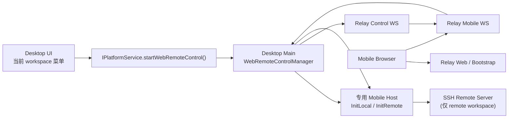

# Mobile Remote Access 最小跑通规划（历史方案）

> **已废弃：** 本文描述的是已经移除的仓库内 relay 和远控专用 Host 方案，仅作为历史记录保留。
> 当前实现按 endpoint 选择外部 relay：production 为 `wss://zcode.z.ai/ws`，标准 test 为
> `wss://zcode.z.ai/ws`。默认二维码入口按 App 版本选择 `/remote/v3` 或 `/remote/v4`；
> `3.4.0` 稳定版门槛及预发布版本规则见现行架构文档，显式 URL 覆盖优先。
> 手机通过 shared-host attachment 连接目标桌面窗口唯一 Window Host 中的 local/remote workspace scope；
> 不启动手机专用 Host/Agent。当前事实以 [Web Remote Control Architecture](./web-remote-control-architecture.md) 为准。

关联文档：

- `todo/web-remote-control.md`
- `docs/remote-workspace-session-in-current-window.md`

## 0. 结论先行

这期如果按“**最小跑通，先不管安全**”来做，建议**不要**沿用 `todo/web-remote-control.md` 里“host process 内再开一个本地 WebSocket server，再由 main 进程桥接到 relay”的方案，而是改成下面这条更贴近当前代码现状的路径：

1. Desktop main 在用户点击“开启Web 远程控制”后，**单独拉起一条 Web 远程控制 专用 host process**
2. 这条 host 不给 renderer 用，main 自己持有它的 `MessagePort`
3. main 与 relay 建立控制连接
4. relay 在手机接入后，再给 main 分配一条 session data WebSocket
5. main 直接桥接：`relay data ws <-> MessagePort <-> host ChannelServer`
6. 手机端复用 `packages/web`，只是把服务入口从本地 `/ws` 改成 relay 的 mobile ws

这样做的原因很直接：

1. **当前代码已经不是“一个 host = 一个 activeServices”模型了。**
   历史实现曾是“base host + remote workspace session host”；当前契约已统一为单 Host 内按 workspaceKey 暴露远端 workspace service scope。
2. **单独起 mobile host，local / remote 可以统一处理。**
   本地 workspace 起 `init-local`，远程 workspace 起 `init-remote`，都能得到完整 `IServiceAccessor`。
3. **不需要给现有 host 再加一个本地 ws server。**
   直接复用已经跑通的 `MessagePortProtocol + ChannelServer`，总体改动更小，风险更低。
4. **不会影响 desktop renderer 当前正在使用的链路。**
   Web 远程控制 是旁路能力，失败时也不容易把主窗口 RPC 链路带坏。

另外，仓库里虽然已经有 `packages/relay/dist/*`，但目前**没有对应 source/package 定义**，应视为历史产物，不作为这次实现基线。本期要把 relay 作为 monorepo 里的正式包重新建起来。

## 0.1 历史实现曾落地补充

围绕“会话生命周期和错误页”以及“SSH remote 收稳”，这个早期实现阶段额外补了这几件事：

1. relay 会为已结束的 mobile session 保留一段短时 tombstone，并记录关闭原因
2. mobile web 在以下场景会直接落明确错误页，而不是一直 loading：
   - 链接已失效
   - 会话已被其他页面占用
   - 桌面端已断开或停止共享
   - relay 不可用 / 连接异常
3. Desktop main 会在 Web 远程控制 发生异常关闭时保留 `error + failure reason`，不再直接回到 `idle`
4. SSH remote 模式下，mobile 专用 host 会先等待 remote host 真正 `Connected`，再开始桥接，避免手机端卡在初始化

该历史阶段曾经保持的产品边界：

1. Web 远程控制 只支持进入 Desktop **已经打开**的 workspace
2. 不支持在手机端新建 Docker / SSH / WSL workspace
3. 不支持断线重连和 session 恢复

当前实现已经演进为 shared-host attachment + 原地恢复：手机 `/remote` 连接目标桌面窗口
唯一 Window Host 中已有的 local/remote workspace scope，不创建专用 mobile host；手机消息流使用
`replayable` snapshot/replay 恢复，桌面继续使用 `continuous` direct stream。本文后续章节
仅保留为早期最小方案记录。

## 1. 范围与边界

### 本期目标

1. Desktop 当前 workspace 可以生成一个Web 远程控制二维码
2. 手机浏览器扫码后，打开复用 `packages/web` 的 UI
3. 手机端能访问和 Desktop 当前 workspace 一致的服务能力
4. 至少支持两类 workspace：
   - 本地 workspace
   - SSH remote workspace

### 明确不做

1. 不做 TLS / OAuth / token 校验闭环
2. 不做 Desktop 端确认弹窗
3. 不做多手机同时连接
4. 不做断线重连 / session 恢复
5. 不做和 Desktop 当前 tab / 当前 task 的实时同步
6. 不做只读权限控制
7. 不做跨设备广播一致性保证

### 这期的最小产品定义

“最小跑通”定义为：

1. Desktop 从当前 workspace 发起“开启Web 远程控制”
2. 手机扫码后能直接进入该 workspace
3. 手机端至少能完成文件浏览、基本聊天、基本终端连接
4. Desktop 关闭Web 远程控制后，手机端连接立即失效

## 2. 现状约束

## 2.1 Desktop 现状

当前 desktop 的服务结构是：

- App 只有 1 个主 workspace window 和 1 个 Host Process
- Host 内按 workspaceKey 维护每 workspace 1 个 CLI
- renderer 通过 `MessagePort` 收到 base services
- remote workspace tab 再把“base services + remote workspace services”组合成一份 `IServiceAccessor`

这意味着：

1. **Host 内的 remote workspace scope 只暴露该 workspace 相关服务**
   没有本地 `setting/credential/oauth/modelProvider` 这些全局能力
2. **base host 也不能代表当前 remote tab**
   因为当前 tab 真正使用的 file/system/terminal/zcode task/session 可能来自另一个 remote session host

所以 Web 远程控制 如果直接“借现有 host”，会很容易在 local / remote 场景下出现服务不完整的问题。

## 2.2 Web 现状

`packages/web/src/main.tsx` 目前只有两种入口：

1. `/ws`
2. `/ws/remote/:id`

并且 `Root` 已经支持 `initialWorkspaceAbsPath`，这对 Web 远程控制 很重要，因为我们可以让手机端**直接落到目标 workspace**，不需要再先进项目选择页。

## 2.3 Relay 现状

当前 `packages/relay/` 只有编译产物，没有：

- `src/`
- `package.json`
- `tsconfig.json`
- build/dev 脚本

所以本期 relay 应视为**重新落包**，而不是在现有源码上迭代。

## 3. 推荐方案

## 3.1 总体架构



## 3.2 关键设计决策

### 决策 A：每次开启Web 远程控制，都创建一条专用 mobile host

不复用 renderer 当前链路。

原因：

1. 生命周期最好管
2. local / remote 统一
3. 失败面更小
4. main 可以直接持有 `MessagePort` 做桥接

### 决策 B：relay 分控制面和数据面

建议拆成两类 ws：

1. **desktop control ws**
   - 用于 tunnel 注册
   - 用于通知“某个 mobile session 已经来连了”
2. **desktop session data ws**
   - 每个 mobile session 一条
   - 进入桥接后只传二进制 RPC 帧，不再混控制消息

这样可以避免：

1. 在同一条 ws 里做 JSON 控制消息和二进制流复用
2. base64 包装 RPC 帧
3. 在 relay / main 两端写一层额外的 session 多路复用协议

### 决策 C：Web 远程控制 面向“workspace”，不是面向“窗口”

UI 发起时必须把当前 workspace 上下文带给 main：

- 本地 workspace：`workspacePath`
- 远程 workspace：`workspacePath + remoteSessionId`

main 再根据 `remoteSessionId` 去解析当前 mobile host 应该起 `init-local` 还是 `init-remote`。

## 4. 分模块规划

## 4.1 `packages/shared`

新增 Web 远程控制 领域类型，建议独立文件，例如：

- `packages/shared/src/mobile-access.ts`

建议包含：

```ts
export interface WebRemoteControlContext {
  workspacePath: string;
  remoteSessionId?: string;
}

export interface WebRemoteControlStartResult {
  status: "running";
  sessionId: string;
  qrUrl: string;
  connectUrl: string;
  workspacePath: string;
}

export interface WebRemoteControlStatus {
  status: "idle" | "starting" | "running" | "error";
  sessionId?: string;
  qrUrl?: string;
  connectUrl?: string;
  workspacePath?: string;
  error?: string;
}
```

同时扩展：

- `packages/shared/src/channels.ts`
  - `PlatformChannels.StartWebRemoteControl`
  - `PlatformChannels.StopWebRemoteControl`
  - `PlatformChannels.GetWebRemoteControlStatus`
- `packages/shared/src/platform.ts`
  - `IPlatformService.startWebRemoteControl(context)`
  - `IPlatformService.stopWebRemoteControl()`
  - `IPlatformService.getWebRemoteControlStatus()`

如果 relay 控制消息要共享类型，再加：

- `DesktopControlMessage`
- `RelayControlMessage`

## 4.2 `packages/desktop/src/main`

这是本期主战场，建议新建专门模块，例如：

- `packages/desktop/src/main/webRemoteControlManager.ts`

职责：

1. 接收 UI 发起的 `start/stop/status`
2. 解析当前 workspace 是 local 还是 remote
3. 为 Web 远程控制 单独启动 host process
4. 保留这条 host 的 `MessagePort`
5. 建立 relay control ws
6. 在 mobile session 真正接入时，再建立 relay data ws
7. 负责 `MessagePort <-> relay data ws` 的二进制桥接
8. 负责会话结束后的统一清理

这里建议在 main 内部维护：

```ts
interface WebRemoteControlRuntime {
  windowId: number;
  workspacePath: string;
  remoteSessionId?: string;
  remoteTarget?: RemoteTarget;
  hostProcess: ElectronUtilityProcess;
  messagePort: MessagePortMain;
  controlSocket: WebSocket;
  dataSocket?: WebSocket;
  relayTunnelId: string;
  sessionId: string;
  qrUrl: string;
  status: "starting" | "running" | "stopped" | "error";
}
```

还需要顺手调整当前 remote session 跟踪结构：

- 现在 `remoteWorkspaceSessionProcessMap` 只记了 `process + webContentsId`
- 这期至少要补上 `target`
- 否则 main 无法根据 `remoteSessionId` 还原出 `init-remote` 需要的 `RemoteTarget`

### 为什么这里不改 host

因为 host 已经支持：

- `InitLocal`
- `InitRemote`
- `MessagePortProtocol`
- `ChannelServer`

main 只要把 spawn 逻辑稍微抽一下，允许“**不要把 port 发给 renderer，而是留在 main 手里**”，就够用了。

## 4.3 `packages/desktop/src/preload`

扩展 `window.zcode` bridge：

- `startWebRemoteControl(context)`
- `stopWebRemoteControl()`
- `getWebRemoteControlStatus()`

保持只做 main IPC 转发，不放业务逻辑。

## 4.4 `packages/desktop/src/renderer/src/main.tsx`

把新能力接进 `desktopPlatform`：

- `startWebRemoteControl`
- `stopWebRemoteControl`
- `getWebRemoteControlStatus`

## 4.5 `packages/ui`

UI 最小化处理，不新开复杂页面，只做一个轻量入口 + 状态面板。

建议入口位置：

1. 当前 workspace 的更多菜单
2. 或 workspace sidebar footer 的工具入口

最小交互：

1. 点击“Web 远程控制”
2. 弹出一个 dialog / popover
3. 内部展示：
   - QR code
   - 复制链接按钮
   - 当前状态
   - 关闭访问按钮

本期不做：

1. 已连接设备列表
2. 权限设置
3. 手机连接确认弹窗

注意点：

1. UI 日志统一走 `packages/ui/src/logger.ts`
2. 文案要补中英双语
3. 新 UI 要兼容 4 套主题
4. 按 `DESIGN.md` 复用现有 dialog/button/tooltip 体系，不要另起视觉风格

## 4.6 `packages/web`

Web 远程控制 模式复用现有 web UI，但新增一条 bootstrap 路径。

建议流程：

1. 手机打开 `https://relay-domain/r/<token>`
2. web 入口读取 `token`
3. 先请求 `GET /api/remote-control/bootstrap/<token>`
4. 拿到：
   - `workspacePath`
   - `wsUrl`
5. 再 `connectViaWebSocket(wsUrl)`
6. 把 `workspacePath` 作为 `Root.initialWorkspaceAbsPath`
7. 同时把 `restoreSession` 关掉，避免手机端把本地浏览器残留 tab 状态带进来

本期 mobile web 建议明确两点：

1. **直接落到 workspace**
2. **不恢复之前的本地浏览器 session**

## 4.7 `packages/relay`

这期把 relay 作为 monorepo 正式包重建，建议目录：

```text
packages/relay/
  package.json
  tsconfig.json
  src/
    index.ts
    entry.ts
    server.ts
    sessionManager.ts
    tunnelManager.ts
    bridge.ts
    types.ts
```

### 角色

1. 管 desktop tunnel
2. 生成Web 远程控制 session
3. 持有 token -> session 的映射
4. 提供 mobile bootstrap API
5. 连接 mobile ws 和 desktop data ws
6. 提供 health check

### 最小接口

```text
GET  /health
WS   /ws/desktop/control
POST /api/remote-control/sessions
GET  /api/remote-control/bootstrap/:token
WS   /ws/remote-control/:token
WS   /ws/desktop/session/:sessionId
GET  /r/:token
```

### 关键说明

`GET /r/:token` 可以有两种实现：

1. 生产态：直接返回 web build 产物入口
2. 开发态：转发/重定向到 web dev server

为了最小落地，建议 relay 支持一个环境变量：

- `WEB_REMOTE_CONTROL_ORIGIN`

有它时走 dev redirect / proxy，没有它时走本地静态资源。

## 5. 协议建议

## 5.1 Desktop 开启Web 远程控制

1. UI 调 `startWebRemoteControl({ workspacePath, remoteSessionId? })`
2. main 判断：
   - 没有 `remoteSessionId` -> 起 `InitLocal`
   - 有 `remoteSessionId` -> 找到对应 `RemoteTarget`，起 `InitRemote`
3. main 建立 relay control ws
4. relay 返回 `tunnelId`
5. main 调 `POST /api/remote-control/sessions`
6. relay 返回：
   - `sessionId`
   - `token`
   - `connectUrl`
   - `qrUrl`
7. main 把结果回给 renderer

## 5.2 手机接入

1. 手机打开 `/r/:token`
2. 页面拉 bootstrap
3. 页面连 `ws/mobile/:token`
4. relay 找到对应 session，并通知 desktop control ws：

```ts
{ type: "mobile-session-request", sessionId }
```

5. main 收到后立即建立 `ws/desktop/session/:sessionId`
6. relay 在 mobile ws 和 desktop session ws 都 ready 后，开始原样透传二进制数据
7. main 在本地桥接：

```text
desktop session ws <-> MessagePortMain <-> host ChannelServer
```

## 5.3 关闭

任一端关闭时：

1. relay 关闭另一侧 ws
2. main 销毁 mobile host
3. main 清理 runtime map
4. UI 状态回到 idle

## 6. 分阶段实施计划

## 阶段 0：落包与脚手架

目标：把 relay 从“只有 dist 的历史残留”变成正式包。

工作项：

1. 新建 `packages/relay/package.json`
2. 新建 `packages/relay/src/*`
3. 接入根脚本：
   - `pnpm --filter @zcode/relay dev`
   - `pnpm --filter @zcode/relay build`
4. 把 relay 加进根 `typecheck`
5. 把 relay 加进根 `lint`

退出标准：

1. `packages/relay` 能独立 dev/build
2. 根构建链路认识这个包

## 阶段 1：本地链路打通（先不做 UI）

目标：先证明“relay data ws <-> main MessagePort <-> host RPC”是通的。

工作项：

1. main 支持创建 mobile host 并保留 port
2. relay 支持 desktop control / session / mobile 三类连接
3. web 先用一个临时 URL 参数模式连上 relay
4. 手工输入 token 验证本地 workspace 能打开

退出标准：

1. 不依赖 QR，手工打开 URL 已经能从手机端看到本地 workspace
2. 文件服务和终端服务至少有一个操作成功

## 阶段 2：Desktop UI 闭环

目标：把“开启Web 远程控制 -> 显示二维码 -> 关闭访问”接到产品 UI 里。

工作项：

1. `IPlatformService` 补 start/stop/status
2. preload / renderer bridge 接好
3. UI 增加入口和二维码弹层
4. 加复制链接、错误提示、关闭按钮

退出标准：

1. 用户不需要手工拼 URL
2. 从 desktop UI 可以完整启动和关闭Web 远程控制

## 阶段 3：SSH Remote Workspace 支持

目标：把当前 remote workspace 也接进同样流程。

工作项：

1. main 为 `remoteWorkspaceSessionProcessMap` 补充 `target`
2. `startWebRemoteControl(context)` 支持 `remoteSessionId`
3. main 用 `InitRemote` 创建 mobile host
4. mobile web 直达远端 workspace path

退出标准：

1. 从 SSH remote tab 发起Web 远程控制
2. 手机端看到的是远端文件系统和远端终端

## 阶段 4：稳定性与收尾

目标：把这条链路做成可持续维护的能力，而不是一次性 demo。

工作项：

1. 日志补齐
2. 异常清理补齐
3. 增加最关键单测/集成测试
4. 更新开发文档和联调命令

退出标准：

1. 手机端中途断开不会残留 host / ws 僵尸会话
2. relay 重启、desktop 关闭等场景能完成清理

## 7. 最小日志方案

### main 日志

统一使用 `packages/desktop/src/main/logger.ts`，建议前缀：

- `[mobile-access] start`
- `[mobile-access] relay-control-connected`
- `[mobile-access] session-created`
- `[mobile-access] data-bridge-open`
- `[mobile-access] stop`
- `[mobile-access] cleanup`

### ui 日志

统一使用 `packages/ui/src/logger.ts`，只打低频日志，例如：

- 打开弹层
- 复制链接
- 用户点击关闭

### relay 日志

relay 自己维护结构化前缀，例如：

- `[relay] tunnel-registered`
- `[relay] session-created`
- `[relay] mobile-connected`
- `[relay] desktop-session-connected`
- `[relay] bridge-closed`

## 8. 测试建议

本期至少要补下面几类：

1. relay `SessionManager` 单测
2. relay desktop/mobile 匹配与超时清理单测
3. main `WebRemoteControlManager` 生命周期单测
4. web bootstrap 单测

手工回归用例至少包含：

1. 本地 workspace 扫码成功
2. SSH remote workspace 扫码成功
3. Desktop 关闭访问后，手机端立即失效
4. 手机主动断开后，Desktop 状态恢复 idle
5. Desktop 退出时无残留 relay session

## 9. 风险与取舍

### 风险 1：remote workspace 解析仍依赖现有 `remoteSessionId`

这是当前最小路径，但它说明 Web 远程控制 仍然依赖“renderer 知道当前 workspace 背后是哪条 remote session”。

本期接受这个耦合，后续如果仓库引入真正的 `workspaceId / workspaceDescriptor`，再一起升级。

### 风险 2：mobile host 会重复创建本地全局服务

例如 setting / credential / oauth / modelProvider 都会在新 host 里再起一份。

本期接受，因为：

1. 这样 local / remote 统一
2. 架构更干净
3. 跑通优先

后续如果要优化资源占用，再考虑把“全局本地服务”和“workspace 服务”拆成可组合的 host 装配方式。

### 风险 3：web UI 在手机上可能暴露桌面型交互问题

本期先接受桌面 UI 的移动端适配不完美，只保证能用。

后续再针对手机布局做专门优化。

## 10. 推荐落地顺序

建议实际开工顺序如下：

1. 重建 `packages/relay`
2. main 侧 mobile host + MessagePort bridge
3. web mobile bootstrap
4. local workspace 跑通
5. desktop UI 二维码入口
6. SSH remote workspace 跑通
7. 测试与文档收尾

## 11. 一句话版本

这期最稳的最小方案是：**把 Web 远程控制 做成“main 持有的专用 host 会话 + relay 控制/数据双通道 + web 复用现有 UI 的直达 workspace 模式”**，而不是继续假设 host 里存在一个能同时代表 local / remote 当前工作区的统一 `activeServices`。

## 12. 当前落地状态

截至当前 worktree，这条链路已经完成了最小骨架：

1. `packages/relay` 已正式落包，具备 desktop control、mobile bootstrap、desktop/mobile data ws 这些基础入口
2. desktop main 已接入 `WebRemoteControlManager`，能为当前 workspace 拉起专用 host，并通过 relay 建 session
3. web 已支持 `remoteControlToken + relayOrigin` 的 bootstrap 模式，手机端可以直达目标 workspace
4. desktop UI 已有 sidebar 入口和二维码弹层
5. local workspace 与 SSH remote workspace 都按同一套发起接口建模

另外，已经补了一轮最关键的稳定性修正：

1. relay 会缓存桥接建立前手机端抢先发出的 RPC 帧，避免扫码后首屏初始化请求被吞掉
2. desktop main 会保留 Web 远程控制 的错误状态，避免桥接失败后直接掉回 `idle`
3. 二维码弹层会轮询当前 Web 远程控制 状态，能看到 `running -> active / error` 的变化
4. SSH remote 模式下，main 会等待 mobile host 先完成远端建连，再开始桥接 RPC，避免手机端长期卡在初始化
5. mobile web 下的 Docker / WSL 探测已通过 relay control socket 代理回 desktop main，不再误用 web fallback 的固定 `false / []`

当前仍然保留一个明确边界：

1. Web 远程控制 页面里“新建 remote session”还没有补 `MessagePort` 注入链路
2. 因此手机页目前只支持访问**已经由 desktop 发起并打开的当前 workspace**
3. 如果后续要支持“在手机页里新建 SSH / Docker / WSL 连接”，需要单独设计 remote session 的移动端接管协议

## 13. 本地联调命令

当前最小联调建议按下面顺序启动：

1. 启动 relay
   - `pnpm dev:relay`
2. 启动 web
   - `pnpm dev:web`
3. 启动 desktop，并指向 relay
   - `ZCODE_WEB_REMOTE_CONTROL_RELAY_URL=http://localhost:8787 pnpm dev:desktop`

联调时还需要补一项环境约定：

1. relay 需要知道手机扫码后该跳去哪个 web 地址
2. 本地开发可设置 `WEB_REMOTE_CONTROL_ORIGIN=http://localhost:5173`

因此更完整的 relay 启动示例是：

```bash
WEB_REMOTE_CONTROL_ORIGIN=http://localhost:5173 pnpm dev:relay
```
