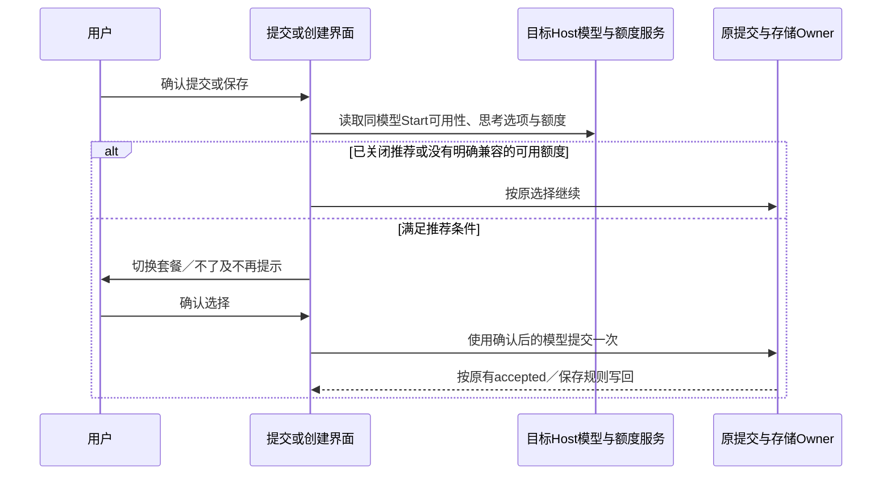

# Todo154：Start 独立 Provider 与提交时体验套餐推荐

> 状态：已实施并完成本轮 review。2026-09-16 按用户授权执行 Todo，Pro admin SSH E2E 与必要检查通过；验证范围和平台边界见 §8。
> 最终目标见 [Design V2 §4.5](../design-v2/design.md#45-start-独立-providertodo154)，历史裁定见 [C25](../design-v2/evidence-and-contradictions.md#c25-start-独立-provider-与现行单连接语义)。
> 代码事实与调查纠偏见 [专项调研](../research/todo154-start-plan-independence-impact.md)。
> 后续反馈：本条保留当轮交付记录；Air 反馈和补充审查的最终修复决策见 [Todo156](todo-156-start-plan-followup-final-decisions.md)，当前待统一实施；Todo155 保留初版调查，§8 不代表后续问题已修复。

## 1. 已确认目标

Start 使用当前 App 登录，取消单独连接步骤，与当前个人／团队套餐同时可用。此次只拆出 Start，不启动 Todo101 的个人／多个团队全面并存。

| 项目          | 最终裁决                                                                                       |
| ------------- | ---------------------------------------------------------------------------------------------- |
| Provider 身份 | 保留 `account:zai-start-plan` 和 `account:bigmodel-start-plan`，不合并 ID、不增加虚拟 Provider |
| 名称和 logo   | 两家 Start 使用统一显示名称，分别沿用 Z.ai／BigModel 的现有 logo；当前品牌过滤决定展示哪一家   |
| 设置位置      | 作为独立 Provider 条目放在现有“智谱”分组，复用现有展示和详情组件                               |
| 详情          | 只去掉 Start 的连接／断开，保留权益、额度、领取和模型管理；打开详情不修改付费连接              |
| 可用性        | 登录、Start 权益、模型启用和配置完整性仍需通过原有校验，不自动领取                             |
| 数据          | 不迁移模型选择，不新增迁移版本、升级连接快照或批量改写；保留现有格式和读取能力                 |
| 新增优化      | 用户提交／创建时，付费套餐的同模型在 Start 有额度且思考选项兼容，提示是否切换                  |
| 请求竞态      | 沿用现有账号保护，不新增身份读取到 token 读取窗口的校验、中断或重发机制                        |

统一展示不产生新的执行身份。跨品牌后，保存的旧 Start ID 不自动改成新品牌 Start；新品牌 Start 正常提供可选模型。保留原有两家模型配置，不合并启停、排序或用户覆盖。

## 2. Account 状态、模型解析与鉴权

### 2.1 current 与权益分开

保留 `current`，含义明确为“Provider 是否匹配当前账号访问上下文”，不是当前聊天模型，也不等于有权益。

- Start：匹配当前登录账号品牌，不依赖个人／团队 selection。
- 个人／团队：匹配当前账号品牌，并匹配当前付费连接选择。
- Start 与一个付费套餐可以同时 `current=true`；未选个人套餐即使有权益也不因本功能同时启用。
- Start 到期可以是 `current=true`、`entitled=false`、`availability=unavailable`。
- 真实登录身份、权益、模型启用与完整性仍由现有 Account／Registry 链路确认；不能只凭残留品牌设置假定已登录。
- Off-Peak 不定义 current 的原契约保持，不通过省略 Start.current 绕过账号限制。

Start 的 connectionKey 只依赖账号主体、品牌与 Start 类型，不包含付费连接；切团队不会改变 Start 身份，换账号仍会改变。沿用同身份 LKG、resetPrevious、revision 配对和发布前账号／设置核对，不增加新的同步状态或 token 副本。

| 状态                       | 预期                                                          |
| -------------------------- | ------------------------------------------------------------- |
| 未登录、无权益、待生效     | 展示真实状态，不提供不可执行的 Start 模型；不再提示连接 Start |
| 生效且有可用模型           | Start 与当前可用付费套餐同时提供模型                          |
| 生效且服务端明确返回空模型 | 清空本轮动态模型名单，不沿用旧白名单                          |
| 同身份查询暂时失败         | 沿用现有最近确定事实；首次没有成功事实时不伪造可用            |
| 明确到期／凭据不可用       | 保留用户选择并报告对应原因，不自动换套餐                      |

### 2.2 模型选择

Start 退出“寻找唯一当前账号套餐并映射”的集合，按保存的真实 Provider ID／modelId／options 解析。个人／团队继续沿用现有付费连接映射，普通 Provider 和 Off-Peak 保持原规则。

Host 与受管理 Worker 共用 node facade 分类。内部是否使用独立 `account-start` 分类由实现收敛，不在 UI、Worker 各建一套身份映射。

Start 不可用时不静默改用付费模型。用户明确接受推荐属于新的选择提交，可以把当前入口的模型改为 Start；它不是旧数据迁移，也不改变全局付费连接。

### 2.3 请求鉴权

Start 请求校验对应品牌和登录身份，读取现有 OAuth 凭据仓库的 `zcodeJwtToken`，不再要求 selection 存在或 kind 等于 Start。个人 Key、团队完整 scope 对应的 Key、Off-Peak Ticket 沿用原路径。缺少 Start JWT 不兜底到团队／个人 Key；复用现有刷新及错误分类。

用户明确接受沿用现有账号切换处理，不为本需求增加发送前身份核对屏障或中断／重发流程。

## 3. 启动与不迁移边界

- 登录或恢复后，Start 由账号与权益刷新自动可用，不再通过写入 `kind: start-plan` 启用。
- 新用户付费套餐继续原初始化顺序：个人、团队、原购买入口；已保存的付费连接在重启时保持。
- 旧 `kind: start-plan` 保持可读，但不再控制 Start 执行；不能把删除旧值造成的空态当成首次用户，偷偷选择一个付费连接。
- 模型选择保存什么就按新规则解释：Start 保持其 ID，个人／团队继续付费映射；空选择、继承和历史执行事实保留原语义。
- Start 恢复可用不抢占已保存模型；完全没有选择时沿用既有初始化规则。

普通 Session 在提交开始执行时持久化本次选择，草稿在 accepted 后写回，因此此前“所有旧会话长期保留原 Start，必须全量迁移”的推断撤回。自动任务长期配置、显式 Subagent 配置不一定回写；用户已接受保留它们的显式选择：若保存 Start、以前依赖付费映射，改后使用 Start；无 Start 权益时需要用户重选。不宣称所有用户升级前后的执行效果完全不变。

不新增数据库 migration、业务层一次性全库转换、逐存储语义版本或升级账号快照。既有历史格式 importer 不因本需求删除，任务、会话、自动化、Bot、Wiki、Subagent 文件不批量改写。

## 4. 提交时的同模型体验套餐推荐

### 4.1 公共判断

在目标 App／Host 的模型与额度事实下，同时满足以下条件才提示：

1. 本次有效选择来自个人／团队付费套餐。
2. 当前账号对应 Start 存在同一个模型，且在目标 Registry 可执行。
3. 当前模型的思考选项兼容；不能为推荐偷偷重置档位或改成其他模型。
4. 同模型有明确可用的剩余额度；只有 entitlement=true 不足以证明有余额。
5. 用户没有关闭这类推荐。

复用现有 UsageEntitlement 服务和同模型额度桶判断，不新建余额 owner。当前已选付费套餐时也需能够读取对应 Start 额度；不能直接复用只在已选 Start 时才启用的查询条件。额度未知或查询失败跳过推荐，继续原提交，不增加阻断发送的额度同步门禁。多个桶、过期桶和模型匹配沿用已有规则，未知不能当成正额度。

### 4.2 文案与按钮

- 标题：体验套餐有可用额度。
- 正文：你的体验套餐中，{模型名称} 仍有可用额度，是否切换使用？
- 按钮：切换套餐／不了。
- 复选框：不再提示。

“切换套餐”将当前入口的模型选择改为 Start 的同模型，保留兼容选项，然后继续这次提交／保存。“不了”继续原选择的提交／保存；关闭弹窗保留草稿，不执行这次操作。不因这个按钮修改个人／团队连接。

推荐确认在原命令发出前完成；原 Submission、accepted 写回、去重和失败保留草稿规则继续使用。不要先提交付费请求再补切换，也不要形成第二份 accepted queue。

### 4.3 入口范围

| 入口                        | 提示位置与副作用                                                                           |
| --------------------------- | ------------------------------------------------------------------------------------------ |
| 新对话首发、已有对话新消息  | 原发送链路提交前；按钮／快捷键／附件共用一次检查，确认后沿用 Session／草稿写回             |
| 新提交的排队／引导消息      | 首次提交前检查；已提交队列开始执行不再提示                                                 |
| 创建定时任务                | 表单校验通过、创建前；切换结果保存到该任务模型配置                                         |
| 编辑定时任务                | 保存涉及模型选择的改动时；只改标题、时间等不提示                                           |
| 保存并立即运行              | 仅保存阶段提示一次，运行阶段不再检查                                                       |
| Wiki 手动生成／完整重新生成 | 新生成请求提交前，结果固定为本轮选择                                                       |
| 自定义 Subagent 创建／编辑  | 新建显式模型或编辑修改模型时，在表单保存前；只改描述／工具等不提示                         |
| 内置／插件 Subagent         | 行内模型即改即存，在用户确认新模型、保存前提示；“不了”保存刚选的付费模型，关闭则保留旧配置 |

Subagent 的切换保存为长期模型配置，不是临时调用一次；内置／插件使用现有用户覆盖存储，不修改插件文件。继承／恢复默认、只调思考强度、启停不提示；执行时继承原有父模型或使用显式配置。Subagent 文案说明“是否将此子智能体的模型切换到体验套餐”。

明确排除：Bot 收发、定时任务列表“立即运行”、定时触发、Agent 工具创建任务、后台 Subagent 调用、Wiki 自动刷新、闲时任务、既有队列的立即发送、原请求重试、Wiki 失败页补齐。历史消息编辑／重试不增加新的模型选择参数或切模语义。用户最终撤回了“立即运行”纳入方案。

### 4.4 不再提示

使用当前 App／Host 的统一持久化偏好，各入口共用，重启仍有效；手机连接同一 Host 时遵守同一偏好。不额外引入跨设备账号云同步，不按会话分别保存。它只关闭推荐，不关闭额度耗尽、凭据失效等实际错误反馈。

下次仍按各入口已经保存的模型选择执行，不把“不再提示”解释成“以后自动选 Start”或“以后固定用付费套餐”。勾选后点“切换套餐”，本次按原提交／保存流程写入 Start，该入口下次沿用保存结果；勾选后点“不了”，保留原付费选择。其他会话、任务与 Subagent 的模型配置不被一起修改，只共享关闭推荐的偏好。

## 5. Start 失效与付费连接通知

保留 Start 现有额度低、模型／日额度耗尽、并发限制横幅和恢复逻辑；权益到期、凭据问题显示实际原因，不自动切到付费套餐。

全局连接失效观察器只观察当前个人／团队连接，不把 Start.current=true 当成需要手动连接的套餐。保留付费套餐之间的现有切换建议，去掉通过写 `kind: start-plan` 切到 Start 的动作。Start 由自己的额度反馈、模型不可用状态和设置详情表达，避免用户在用付费套餐时收到后台 Start 的全局连接失效通知。不扩展多 Start／付费通知队列。

## 6. 状态归属与链路

| 事实／意图                  | 原有或目标 owner                                   |
| --------------------------- | -------------------------------------------------- |
| 登录身份、JWT               | OAuth 服务与凭据仓库                               |
| 付费连接选择                | SettingService                                     |
| current、权益、动态模型成员 | Account Source，同 revision 发布 State 与 Overlay  |
| 可执行模型与有效选择        | 目标 Host／Worker Registry 和共用 Selection Facade |
| 额度                        | 现有 UsageEntitlement 服务；UI 只消费快照          |
| 推荐是否关闭                | 当前 App／Host 的统一设置偏好                      |
| 草稿、配置和提交            | 各入口原 owner；推荐返回选择后走原提交路径         |

关闭弹窗不进入原提交。桌面 continuous、手机 replayable 和目标 workspaceIdentity 隔离保持；模型可用性读取不使用错误 Host 的本地缓存代替目标事实。

## 7. 实施步骤与验收

| 阶段 | 工作                                                            |
| ---- | --------------------------------------------------------------- |
| P0   | 本文与 Design V2 收敛；实施授权前保持待实施                     |
| P1   | 先有预期测试，再一起修改 current、付费映射分类和 Start 请求鉴权 |
| P2   | 设置分组、统一名称与品牌图标、独立详情、移除 Start 连接动作     |
| P3   | 启动保留旧值可读、停止写 Start 连接；限定付费失效观察与建议     |
| P4   | 共用推荐判断与弹窗、Host 偏好、各提交入口接入                   |
| P5   | 受影响回归和桌面／手机交互验证，稳定后提炼正式 docs             |

以下为已确认验收场景；本次验证方式与未覆盖边界见 §8，不以单纯代码经过某状态代替断言。

| ID     | 场景与关键断言                                                                                                                                                   |
| ------ | ---------------------------------------------------------------------------------------------------------------------------------------------------------------- |
| SIP-01 | 两家品牌分别登录，有 Start 权益、无套餐选择时可执行 Start；请求走 JWT                                                                                            |
| SIP-02 | Start 与当前个人／团队同时 current，可分别执行同名模型，不混用凭据                                                                                               |
| SIP-03 | 切个人／团队／Team scope，不改变 Start 身份、模型意图及 connectionKey                                                                                            |
| SIP-04 | 智谱分组独立 Start，统一名称、对应品牌 logo；详情无连接／断开，保留权益和模型管理；浏览不写付费连接                                                              |
| SIP-05 | 未登录、无权益、pending、unknown、明确空模型、模型禁用按原契约展示和校验                                                                                         |
| SIP-06 | 保存 Start 后重启仍按该 ID；付费选择仍映射当前付费连接，Start 不可用不自动换套餐                                                                                 |
| SIP-07 | 旧 kind:start-plan 可读且 Start 自动可用；不迁移模型数据，不被新用户初始化误选付费套餐；唯一未 current 的个人套餐仍可由用户显式选择                              |
| SIP-08 | 沿用既有换账号、登出、LKG 与请求凭据保护；不新增身份读取窗口屏障                                                                                                 |
| SIP-09 | Start 额度／并发错误保留原横幅，恢复可用不抢占其他选择                                                                                                           |
| SIP-10 | Start 与付费均 current 时全局失效观察只识别付费连接；不再建议写 Start 连接                                                                                       |
| SIP-11 | 领取成功后刷新 Start，不覆盖原模型或付费连接；深链打开 Start 自身                                                                                                |
| SIP-12 | Automation／Bot／显式 Subagent／Wiki 的保存选择按新解析规则读取，无全量迁移；继承和冻结 run 不被重新解释                                                         |
| SIP-13 | 桌面、手机连接同 Host、远端工作区读取正确模型与额度；continuous／replayable 恢复契约保持                                                                         |
| SIP-14 | 付费同模型在 Start 可用且有额度，兼容档位时显示推荐；不同模型、档位不兼容、已选 Start 不提示                                                                     |
| SIP-15 | 额度未知、失败、过期桶或耗尽不误报可用；保留原提交，不阻断正常付费使用                                                                                           |
| SIP-16 | 对话首发、续发、附件、快捷键、队列／引导新提交：切换后实际请求为 Start，仅提交一次；不了保持原模型；关闭保留草稿                                                 |
| SIP-17 | 定时任务创建／修改模型、保存并运行：只在保存阶段提示并保存结果；立即运行和后台调度不提示                                                                         |
| SIP-18 | Wiki 新生成可提示，自动刷新与失败页补齐不提示，不重写既有生成事实                                                                                                |
| SIP-19 | Subagent 自定义保存及内置／插件即时保存均符合按钮语义；继承、恢复默认、仅思考强度／文本修改及执行不提示                                                          |
| SIP-20 | 不再提示跨入口、重启和同 Host 手机生效；分别验证勾选后切换／不了的下次选择仍来自该入口保存结果，其他入口模型不变；不同 Host 无新增账号同步，实际错误提示不被屏蔽 |
| SIP-21 | 普通 API Provider、Off-Peak、Bot、原请求重试无推荐弹窗或新增切模副作用                                                                                           |

实施门禁遵守根与子级 AGENTS：freshness／git status、受影响测试、typecheck、lint、architecture:check --changed；App 交互补桌面／手机 E2E 和主题／国际化验证，CLI 按其独立规则。E2E 新增与维护遵循 e2e-case-lifecycle，不把静态扫描当成端到端验证。

正式行为已同步 [Start 规格](../../../zai-start-plan-provider.md)，本条维护专项验证矩阵；I27/MP-R03 是 Recent 注入与默认模型恢复测试，不能把它改写成已证明普通 Session 必须迁移。具体漂移见 research。

## 8. 本轮交付与证据（2026-09-16）

已实现 P1～P4，并按最终方案更新正式 Start 规格。Start 保留两家真实 ID，复用 Account Source 与 Host／Worker facade；没有新增数据库 migration、Schema 版本或批量配置改写。静态 Built-in release revision 28→29 只标识显示名称更新，并通过原脚本派生测试配置，不是用户数据迁移。

### 8.1 测试与检查

| 检查               | 结果与证据                                                                                                                                                                           |
| ------------------ | ------------------------------------------------------------------------------------------------------------------------------------------------------------------------------------ |
| 核心及 UI 定向回归 | 16 文件 399 条通过：Account resolver/config source、共用 facade、推荐判断与确认、accepted 写回、Session、Automation、Subagent、导航、启动和失效观察；`/tmp/start154-final-units.log` |
| 边界复审回归       | 10 文件 276 条通过：Wiki 状态／store、请求鉴权、Automation 解析、Web remote lifecycle/failures 与相关 UI；`/tmp/start154-review-boundaries.log`                                      |
| Pro 原生依赖单测   | 11 文件 143 条通过；本地缺 Electron 原生运行环境的相关套件转 Pro 执行，`/tmp/start154-pro-native-unit.log`                                                                           |
| Review 补充回归    | 2 文件 188 条通过：唯一未连接个人套餐仍有可操作选择入口、推荐偏好读取失败跳过、写入失败仍遵守本次按钮并提示未保存；`/tmp/start154-review-fixes.log`                                  |
| 早期失败套件收口   | 非原生 UI 的 11 文件 186 条最终合跑通过，覆盖所有相关 mock／入口修正和 WorkflowArtifactSidePane；`/tmp/start154-related-closures.log`                                                |
| Built-in 配置      | 同步与一致性检查通过；生命周期、完整性、模型映射、消费及构建 8 文件 106 条通过，`/tmp/start154-builtin-review-final.log`；真实 node facade 另 1 条通过                               |
| Typecheck          | 根 `pnpm typecheck` 通过，包含 desktop E2E 与 Web；`/tmp/start154-typecheck-final2.log`                                                                                              |
| Lint／架构         | lint 0 error、54 条既有 warning；architecture:check --changed 为 0 violation、0 baseline；`/tmp/start154-lint-final3.log`、`/tmp/start154-architecture-final3.log`                   |
| Fixture            | pending case 的 fixture checker 通过；4 个 `_DONE` 响应断言标记没有请求 matcher 的提示为预期；`/tmp/start154-fixture-final2.log`                                                     |

上述测试组有重叠，不将条数相加当作独立用例总数。早期 related 广扫为 1150 文件，其中 24 文件失败：原生环境问题转 Pro 验证；新 hook 所需 mock、旧连接和导航断言已更新并定向通过；既有 WorkflowArtifactSidePane 时序失败单独重跑通过。该次广扫本身不是全绿证据，不宣称完整仓库全量测试全绿。

### 8.2 Pro admin SSH Electron 实跑

按用户要求，通过 `macbook-pro-admin` 在 `/Users/dev/zcode-start154-pro-e2e` 隔离工作树执行。未改动 Pro 的日常开发目录。模型／权益／安全校验外部依赖使用 case-local fixture，UI、Host／Worker Registry、提交、SDK 请求构造、持久化走真实代码，不调用真实付费模型服务。

| Spec                                                                                             | 已断言行为                                                                                                                                                                                                                                                                    | Pro run                                                                                                                                                     |
| ------------------------------------------------------------------------------------------------ | ----------------------------------------------------------------------------------------------------------------------------------------------------------------------------------------------------------------------------------------------------------------------------- | ----------------------------------------------------------------------------------------------------------------------------------------------------------- |
| `conversation-session/manual-review/pending/conversation-session-start-plan-independent.test.ts` | Start 独立导航、无连接按钮、付费选择不变；Subagent 关闭还原／确认保存／仅思考不提示；定时任务创建切 Start 并检查 SQLite，文本编辑不提示；聊天不了／关闭／切换、真实请求 Provider 与 high 档位、只发一次、accepted 写回；关闭推荐跨入口与重启保持；1280/390 宽度及深浅主题布局 | 最终 release 29：`desktop-e2e-20260916133532026-p27004-0077916f12a51fd1`，通过；前次扩展流程 `desktop-e2e-20260916131850282-p22060-1763fdf90a220931` 亦通过 |
| `repo-wiki/repo-wiki-model-plan-selection.test.ts`                                               | 付费与 Start 共存；默认付费、不了后生成落盘付费；完整重新生成切换后 wiki.json 保存 Start                                                                                                                                                                                      | `desktop-e2e-20260916132805627-p25424-cd18c54e0f1f4fc0`，通过                                                                                               |
| `ui-shell/marketing-touch-entitlement.test.ts`                                                   | 旧 kind:start-plan 重启保持；领取／刷新／浏览不改连接；唯一个人套餐可主动选中；保存的 Start Subagent 模型不被付费选择覆盖                                                                                                                                                     | `desktop-e2e-20260916133328079-p26502-2678ae04ad3d916c`，通过                                                                                               |

各 run 的 `summary.md` 位于 Pro 工作树 `packages/desktop/.e2e-artifacts/<run>/`。四种弹窗布局截图保存在本机 `/tmp/start154-visual-review/`，均已目视检查。新增用例保留 pending，未自行进行人工晋级或宣称 CI 准入。

### 8.3 Review 结论与修正

完成整份生产 diff、共享组件及入口副作用复审，发现的问题均已修正并补验证；本次审查未发现剩余阻断项。

- 检查了 Account current／连接身份、同 revision 状态发布、JWT 与付费 Key 分流、Start 精确解析和旧数据读取；没有新增 token 竞态屏障或静默付费 fallback。
- 实跑发现推荐额度读取必须显式传 Start accountAccess，否则已选付费时得到空快照；已修正并补 hook 契约测试，随后真实提交 E2E 通过。
- 推荐位于队列确认、命令和模型校验之后、原提交之前；切换结果沿原 accepted／保存路径记住。关闭保留原草稿，既有重试／已提交队列／Bot 不进入新推荐路径。
- 复审修正 Start 深链误命中 family 容器，以及旧 Start 用户只有一个付费候选时选择器隐藏的问题；后一项先红后绿并由 Pro 旧配置领取流程验证，不靠迁移修复。
- 检查了弹窗关闭与“不了”的区别、复选框跨弹窗重置、按钮焦点的 Enter 语义、偏好读写失败及 Wiki 接纳后记住模型，避免不经确认或失败时改写模型。
- Wiki 旧 fixture 默认 GLM-5.2 已不属于当前付费名单，会正常回落 GLM-5.3；现改用付费与 Start 共有的 GLM-5.3-Flash／high 验证，不扩大生产模型名单。
- Built-in 内容变化按既有 release 规则递增 revision 并同步测试配置，避免同 revision 不同内容冲突；用户持久化 Schema 不变。

### 8.4 验收覆盖与边界

| SIP            | 本轮证据                                                                                                                                                   |
| -------------- | ---------------------------------------------------------------------------------------------------------------------------------------------------------- |
| 01～03、05～08 | resolver 双品牌、无／付费／legacy selection、稳定 connectionKey、LKG／登出；真实 node facade 精确 Start／付费映射；Pro 重启与旧 Start 选择保留及显式切个人 |
| 04、10～11     | 导航／状态卡／observer／loss suggestion 单测；Pro 独立导航和领取刷新                                                                                       |
| 09、12、21     | 复用原额度／鉴权与各存储 owner，解析和受影响边界回归；未新增后台提示链路或全量改写                                                                         |
| 13             | 桌面真实 Host／Worker E2E；桌面／compactForRemoteControl Session 提交测试及 Web lifecycle/failures 回归；额度和偏好仍取 base Host 服务                     |
| 14～15         | 同模型、品牌、思考、不可执行、未知／失败／过期／多桶判断测试；Pro 实际确认请求                                                                             |
| 16             | Pro 首发／续发及单次请求、关闭草稿、accepted 写回；Session 桌面／手机提交分支、附件／命令等既有受影响测试                                                  |
| 17～19         | Pro 创建任务与文本编辑、Wiki 生成／再生成、内置 Subagent 即时保存；Automation／自定义 Subagent 原表单回归与共享推荐判断                                    |
| 20             | Hook 两种按钮＋抑制偏好、跨实例和错误处理；Pro 勾选不了后重启仍执行付费，其他入口模型不被改写                                                              |

未实跑实体手机 Safari／完整 Web shared-host 联合链路、Windows／Linux Electron，也未访问真实账号付费 API。390px 是同一真实弹窗的窄屏检查，不能替代以上平台端到端结论；自定义和插件 Subagent 的每个表单组合未逐项单独 E2E，复用共同保存入口与回归证据。此处列明证据边界，不把 SIP 每一维组合都标成实机全覆盖。

### 基线更新记录

本轮先按要求拉取并快进到 `origin/staging` 的 `2772217134`（原基线 `c9f959050b`，增加 672 个提交）。上游已占用 Todo153，本条及全部索引顺延为 Todo154，保留上游 Todo153。实施在 `start-plan-independent-provider` 分支进行；freshness／git status 检查后先补预期测试再实现。讨论阶段的 17 项测试与旧行号只作历史调查，不作为最终完成证据。
