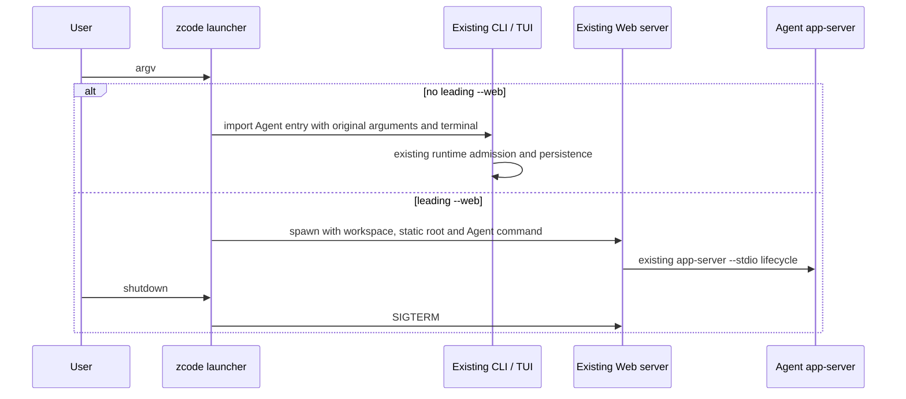

# ZCode unified Node distribution

## Product rules

- The Node distribution is named `zcode`, with executable `bin/zcode.mjs` and installed command `zcode`.
- `zcode` starts the existing terminal UI. All arguments except a leading `--web` are forwarded unchanged to the existing CLI (including `tui`, prompt, login, resume and internal protocol commands).
- `zcode --web` starts the existing local HTTP/WebSocket server with bundled Web assets and Agent. Existing Web flags remain available: `--workspace`, `--host`, `--port`, `--open`, `--no-open`, `--token`, `--no-token`.
- Only a leading `--web` selects Web mode; a prompt value containing `--web` must remain CLI input. CLI parsing, locale, permissions and sessions keep their existing owner.
- `zcode --help` includes the Web invocation plus existing CLI help; `zcode --web --help` describes Web flags. `zcode --version` reports the distribution version.
- Web keeps localhost binding, automatic port selection and non-loopback token defaults. TUI inherits the real terminal in the same process; the launcher must not consume its stdin or print Web status.

## Ownership and boundaries

The release scripts own archive assembly and installation. They reuse the CLI's existing `collectSeaTuiAssets` build API for the TUI dependency closure, workspace export rewriting, dependency-version placement, native libraries and workers. This build API is not a new runtime service dependency. Root release scripts are outside the runtime module roots in `architecture-policy.yaml`; the referenced CLI module is legacy and has no module contract.

TUI assets are placed under `agent/node_modules`, preserving package-relative paths and keeping their dependency versions separate from server dependencies. The CLI's built `provider/` config and third-party notices accompany `agent/zcode.cjs`; its external Playwright runtime is also included. Assets for the existing six SEA targets are combined; duplicate paths must have identical hashes or packaging fails. Required missing assets fail the build, including with `--skip-build`.

The launcher imports the existing Agent CLI entry in the same process, setting `process.argv[1]` to that entry so self-spawned CLI workers continue to use the canonical Agent. It introduces no session state, persistence, queue, replay or lease owner. The existing Web server owns its Agent process; the launcher forwards shutdown and observes child exit/error.

## Packaging and migration

- Build with `pnpm build:zcode`; output is `dist/zcode/releases/<version>/zcode-<version>.tar.gz`, plus checksum, `latest.json` and `install.sh`.
- Node remains required, at the version pinned in `mise.toml`. The archive includes TUI assets for macOS, Linux and Windows (arm64/x64); native functionality must be verified per platform rather than inferred from asset presence.
- Build download URL: `--base-url` overrides `ZCODE_DIST_BASE_URL`; environment overrides `.env.local`, which overrides `.env`. Missing URL fails before building. Installer `ZCODE_DIST_BASE_URL` overrides its embedded default.
- Installer `ZCODE_DIST_HOME` overrides `~/.zcode/runtime`; `ZCODE_DIST_BIN_DIR` overrides `~/.local/bin`. These release-only variables do not change CLI/session data directories. Installation writes the `zcode` launcher and preserves existing user data.
- `pnpm build:zcode` coexists with the existing `pnpm build:lite` (`scripts/build-zcode-lite.mjs`), which internal CI and release flows may still use; the two commands produce separate outputs (`dist/zcode` and `dist/zcode-lite`) and neither changes the other. Do not automatically delete old Lite installations. Retiring Lite requires confirming that no internal pipeline still depends on it.

## Acceptance and validation

1. Launcher process tests prove default CLI routing, unchanged CLI arguments, help/version, exit-code propagation and no Web startup in TUI mode.
2. Web process tests prove leading flag routing, workspace/static-root/Agent configuration, invalid arguments, help and shutdown behavior without requiring a model or network service.
3. Installer test uses a local fixture archive to prove the installed command is `zcode` and defaults to CLI while forwarding `--web`.
4. Build a real release, extract outside the repository, unset workspace module fallbacks, import its TUI/native runtime and interact with it through a pseudo-terminal. Verify first render and clean keyboard exit without sending a model prompt.
5. Start the same extracted release with `--web`; verify HTML, `/api/server-info`, workspace and WebSocket connection, then stop it.
6. Run root typecheck, lint and architecture checks. Report actual platform and any unexecuted cross-platform or model-call paths.

## Recorded validation (2026-09-20, open-source branch)

- `node --test scripts/zcode-distribution.test.mjs`: 5 process/installer tests passed.
- `pnpm build:zcode --base-url https://downloads.example.com/zcode/`: complete CLI, server and Web build passed. Final assembly was repeated with `--skip-build` after adding the CLI sidecar config.
- `node scripts/zcode-distribution-smoke.mjs dist/zcode/releases/3.14.0/zcode-3.14.0.tar.gz`: passed on macOS arm64, Node 24.14.0, outside the repository with an isolated data directory. Covers native TUI import, initialized screen, keyboard exit, Web HTML, server-info, workspace, WebSocket and shutdown. Exit code 0; no model prompt sent.
- Root `pnpm typecheck`, `pnpm lint` and `pnpm architecture:check --changed` passed; lint retains existing repository warnings.
- Cross-platform assets were collected, but Linux, Windows and macOS x64 execution were not tested. WebSocket connectivity is checked; an authenticated model conversation and browser GUI E2E are outside this packaging smoke test.
- Third-party notice freshness check passed after regenerating the root package manifest hash; the repository still reports 14 pre-existing material-review items, so this is not a strict release-compliance approval.

## Recorded validation (2026-09-24, closed repository `closed/infra-absorb`)

- `node --test scripts/zcode-distribution.test.mjs`: 5 process/installer tests passed.
- `pnpm build:zcode --base-url http://downloads.example.invalid/zcode/`: CLI, server and Web builds passed; assembly first failed because `@zcode/shared` has no build script and its `dist/` only exists after root `pnpm typecheck` (`tsc -b` emit). After `pnpm typecheck`, assembly with `--skip-build` passed. Running `pnpm typecheck` after the server build overwrites `packages/server/dist/entry-http.js` with the unbundled `tsc` output, so rebuild the server before assembling.
- The server HTTP bundle inlined `yauzl` and crashed on load (`Dynamic require of "fs" is not supported`); `yauzl` is now external and declared by `@zcode/server`, and both this distribution and `build:lite` copy it.
- `node scripts/zcode-distribution-smoke.mjs dist/zcode/releases/3.14.3/zcode-3.14.3.tar.gz`: passed on macOS arm64, Node 24.14.0 (native TUI import, initialized render, keyboard exit, Web HTML, server-info, workspace, WebSocket, shutdown). The TUI readiness check now strips terminal control sequences because the renderer interleaves them between characters.
- Linux, Windows and macOS x64 execution were not tested.
