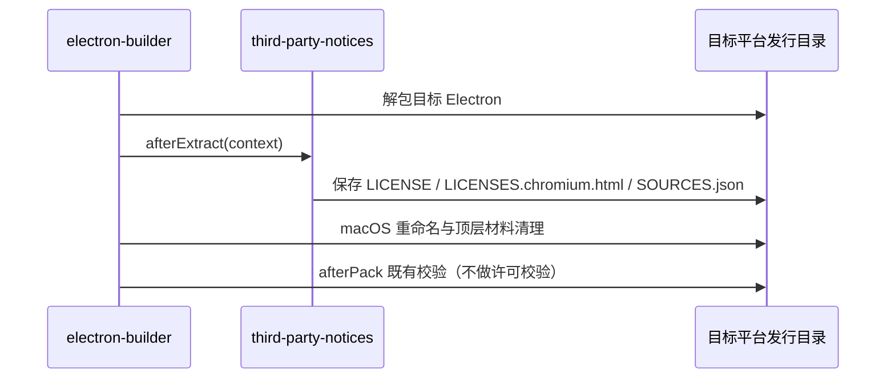

# 第三方许可材料与发行交付

## 产品规则与所有者

第三方复制内容保留各自许可、版权及适用的文件内修改声明。包元数据不能单独替代上游原始材料。没有取得证据的事项保持阻断，不能通过更新哈希、删除记录或编造权利人关闭。第一方代码的对外许可由开源导出覆盖层提供，不在本目录声明。

| 所有者 | 职责 |
| --- | --- |
| `third-party/*.json`、`third-party/upstream/`、`third-party/native-search/`、`third-party/runtime/` | 材料与待核验事项的唯一登记入口和原文快照 |
| `scripts/third-party-npm.mjs` | 解析锁文件生产图与实际安装图、读取包内原文 |
| `scripts/generate-third-party-notices.mjs`（`licenses.mjs notices`） | 生成 `THIRD-PARTY-NOTICES.md` 与 `inventory.json` |
| `scripts/licenses.mjs check [--strict]` | 显式许可标识、新鲜度与材料完整性检查 |
| `scripts/third-party-notices.mjs` | 构建期读取与分发声明；各构建入口只调用这一模块，不另建许可数据库 |

## npm 生产图的范围

- 生产图取所有工作区项目的生产依赖，包括不发布的内部应用；内部应用的构建工具（如 Vite 插件）必须放在 `devDependencies`，否则会把构建工具误算为生产依赖。
- 只登记 pnpm 在当前宿主上会安装的包：锁文件 `packages` 段的 `os`/`cpu`/`libc` 约束与 `pnpm-workspace.yaml` 的 `supportedArchitectures`（`current` 取宿主值）按 pnpm 的可安装规则比对。不可安装的平台包及只经由它们引入的依赖不安装、不分发，不进生产图，也不作为缺失安装报错；不再维护按包名的例外名单。
- pnpm 只在 Linux 宿主上检查 `libc`，因此在 macOS / Windows 上生成的声明包含 glibc 与 musl 两类 Linux 平台包，是最全的集合；正式生成声明在 macOS 上执行。
- 非宽松许可的生产依赖只按包名逐项登记人工复核结论，登记同时绑定许可类别，许可变化后重新阻断：
  - LGPL：只允许以独立、可替换的动态库形式分发的 libvips（sharp 的 `@img/sharp-libvips-*` 与内含 libvips DLL 的 `@img/sharp-win32-*`，只由真实 Computer Use 包引入），声明中附原文。
  - 内部应用独有且不随产品分发的依赖（当前为 `apps/dev-docs` 的 `elkjs`，按 EPL-2.0 使用）。
  - 其余 LGPL/GPL/EPL 等仍按类别阻断。
- 开源导出树的工作区与锁文件不同于闭源，其声明与 inventory 由导出流程在开源依赖树上重新生成，不沿用闭源声明。

## 开发、构建与校验边界

```text
开发 / bootstrap / build → readThirdPartyNotices 等读取已有材料 → 复制或嵌入产物
显式 notices / check     → 核验输入与原文 → 更新清单或报告失败
```

- 构建不更新清单，也不隐式运行许可校验；inventory 过期、待核验项或原生登记不匹配都不阻断开发和打包。
- 声明文件和所需材料仍是打包输入；缺失、无法读取或无法解析时保留原始错误，不生成空声明。
- 原生材料只在显式生成时 `{ verify: true }` 核验输入和原文。
- `readVerifiedNotices(root, { requireComplete: true })` 目前只由显式检查使用；接入 SEA 发布与 SMB 上传前，必须先按本仓库依赖树重新生成声明并关闭已登记缺口，否则两条发布路径会立即失败。

## 交付入口（本仓库已接入）

| 产物 | 位置 | 接入点 |
| --- | --- | --- |
| Desktop | `Resources/THIRD-PARTY-NOTICES.md`、`Resources/licenses/electron/` | `electron-builder.config.js` 的 `extraResources` 与 `afterExtract` |
| Web | 部署根目录 `THIRD-PARTY-NOTICES.md`，HTML `rel="license"` | `packages/web/vite.config.ts` 的 `thirdPartyNoticesVitePlugin` |
| Server HTTP / remote bundle | `packages/server/dist/`、`dist/remote/` | `tsup.config.ts` 的 `onSuccess`、`build-remote.ts` |
| CLI | `apps/zcode-cli/packages/cli/dist/THIRD-PARTY-NOTICES.md` | `scripts/build.mjs` |
| 搜索工具 | 每个工具目录的 `THIRD-PARTY-NOTICES.txt`、`SOURCES.json`；SEA 内嵌同名资产 | `prepare-native-search-tools.mjs`、`sea-runtime-tool-assets.mjs` |
| 远端组件 | `server/`、`node-pty/<platform>/`、`glm/<platform>/` 的声明，`node/<platform>/LICENSE.node.txt` | `prepare-prebuilds.mjs`，在组件哈希计算前复制 |
| 独立 Server 发行包 | `runtime/THIRD-PARTY-NOTICES.md`、`LICENSE.node.txt`、`NODE-SOURCES.json`、`licenses/{agent,official-plugins}/`、工具目录声明 | `stageCli.ts` 读取后显式传入 `stage.ts` |
| 统一分发包 | `agent/THIRD-PARTY-NOTICES.md` | `scripts/build-zcode.mjs` |

未接入：`zcode --licenses` 入口与 SEA 内嵌 Node 许可（SEA 基底 Node 版本随构建机浮动，`runtime/sources.json` 只登记固定版本）；producer 归档内嵌声明（会改变已固定 SHA-256 的归档字节）。

## Electron 事件顺序



材料从实际目标归档读取，不从宿主 Electron 替代。重复 staging 覆盖同一目标目录；不同目标使用各自 appOutDir。Windows 重命名后的 `LICENSE.electron.txt` 也可读取。

## 验收

1. `node --test scripts/third-party-notices.test.mjs`：缺少 inventory 或哈希过期时构建复制仍成功，显式校验失败；严格校验拒绝待核验项；缺少声明时保留 ENOENT。
2. 独立 Server staging 的组件归档分别包含 npm、Node 与搜索工具声明，工具声明缺失时 staging 失败。
3. 执行 `node scripts/licenses.mjs check`，如实记录在当前依赖树上的结果；不以更新哈希代替重新生成与审核。
4. 最终安装包未实际构建时，不声称完成全平台安装包审计。
